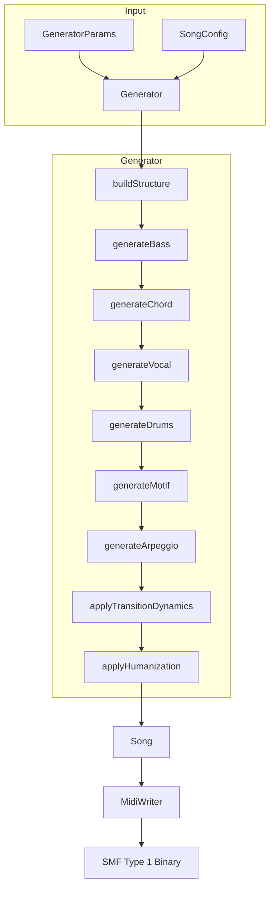

# Architecture Overview

This document explains the internal architecture of [MIDI Sketch](https://github.com/libraz/midi-sketch).

## Project Structure

```
midi-sketch/
├── src/
│   ├── core/              # Core generation engine
│   │   ├── pitch_utils.h/cpp      # Pitch operations (tessitura, intervals)
│   │   ├── chord_utils.h/cpp      # Chord operations (chord tones)
│   │   ├── melody_templates.h/cpp # 7 melody template definitions
│   │   ├── harmony_context.h/cpp  # Inter-track collision detection
│   │   ├── generator.h/cpp        # Central orchestrator
│   │   └── types.h                # Type definitions (~780 lines)
│   ├── midi/              # MIDI output (SMF Type 1)
│   ├── track/             # Track generators
│   │   ├── vocal.cpp              # Vocal coordination (~470 lines)
│   │   ├── melody_designer.cpp    # Template-driven melody (~520 lines)
│   │   ├── aux_track.cpp          # Aux sub-melody (~440 lines)
│   │   └── ...                    # Other track generators
│   ├── analysis/          # Dissonance analysis
│   ├── preset/            # Preset definitions
│   ├── midisketch.h       # Public C++ API
│   └── midisketch_c.h     # C API (WASM interface, ~360 lines)
├── tests/                 # Google Test suite (619+ tests)
├── dist/                  # WASM distribution
└── demo/                  # Browser demo
```

## Core Components

### MidiSketch Class

The main entry point providing a high-level API:

```cpp
class MidiSketch {
  void generate(const GeneratorParams& params);
  void generateFromConfig(const SongConfig& config);
  void regenerateMelody(uint32_t new_seed = 0);

  std::vector<uint8_t> getMidi() const;
  std::string getEventsJson() const;
  const Song& getSong() const;
};
```

### Generator

The central orchestrator (`src/core/generator.h`) that coordinates all track generation:

```cpp
class Generator {
  Song generate(const GeneratorParams& params);
private:
  void buildStructure();
  void generateBass();
  void generateChord();
  void generateVocal();
  void generateAux();         // NEW: Aux sub-melody generation
  void generateDrums();
  void generateMotif();
  void generateArpeggio();
  void applyTransitionDynamics();
  void applyHumanization();
};
```

### Song Container

Holds all generated data (8 tracks):

```cpp
struct Song {
  Arrangement arrangement;     // Section layout
  MidiTrack vocal;            // Channel 0 - Main melody
  MidiTrack aux;              // Channel 5 - Sub-melody (NEW)
  MidiTrack chord;            // Channel 2 - Harmony
  MidiTrack bass;             // Channel 3 - Foundation
  MidiTrack motif;            // Channel 4 - BackgroundMotif style
  MidiTrack arpeggio;         // Channel 5 - SynthDriven style
  MidiTrack drums;            // Channel 9 - Rhythm
  MidiTrack se;               // Channel 15 (markers)
};
```

## Data Flow



## Time Representation

MIDI Sketch uses tick-based timing throughout:

```cpp
using Tick = uint32_t;
constexpr Tick TICKS_PER_BEAT = 480;    // Standard MIDI resolution
constexpr Tick TICKS_PER_BAR = 1920;    // 4/4 time signature
constexpr uint8_t BEATS_PER_BAR = 4;
```

## Note Representation

Two-layer note representation:

```cpp
// Intermediate musical representation (internal)
struct NoteEvent {
  Tick startTick;      // Absolute start time
  Tick duration;       // Duration in ticks
  uint8_t note;        // MIDI note (0-127)
  uint8_t velocity;    // MIDI velocity (0-127)
};

// Low-level MIDI bytes (output only)
struct MidiEvent {
  Tick tick;           // Absolute time
  uint8_t status;      // MIDI status byte
  uint8_t data1;       // First data byte
  uint8_t data2;       // Second data byte
};
```

## Section Definition

Songs are divided into sections:

```cpp
struct Section {
  SectionType type;              // Intro, A, B, Chorus, Bridge, Interlude, Outro
  std::string name;              // Display name
  uint8_t bars;                  // Bar count
  Tick startBar;                 // Start position (bars)
  Tick start_tick;               // Start position (ticks)
  VocalDensity vocal_density;    // Full, Sparse, None
  BackingDensity backing_density; // Normal, Thin, Thick
};
```

## Composition Styles

Three composition styles affect the generation approach:

| Style | Description |
|-------|-------------|
| **MelodyLead** | Traditional arrangement with prominent vocal melody |
| **BackgroundMotif** | Repeated motif as primary focus, subdued vocals |
| **SynthDriven** | Synth/arpeggio-forward electronic style |

## Random Number Generation

Deterministic generation using Mersenne Twister:

```cpp
std::mt19937 rng(seed);  // Same seed = same output
```

When seed is 0, current clock time is used for randomization.

## WASM Compilation

The library compiles to WebAssembly via Emscripten:

- **Output**: ~155KB WASM + ~37KB JS (wrapper + glue)
- **No external dependencies**: Pure C++17
- **ES6 module**: Modular JavaScript wrapper

```bash
# Build flags
-sWASM=1 -sMODULARIZE=1 -sEXPORT_ES6=1
-sALLOW_MEMORY_GROWTH=1 -sSTACK_SIZE=1048576
```

## C API Layer

For WASM interop, a C API wraps the C++ classes:

```c
// Lifecycle
MidiSketchHandle handle = midisketch_create();
midisketch_generate(handle, params);
MidiSketchMidiData* midi = midisketch_get_midi(handle);
midisketch_free_midi(midi);
midisketch_destroy(handle);
```

Key functions:
- `midisketch_generate()` - Core generation
- `midisketch_regenerate_melody()` - Melody variation
- `midisketch_get_midi()` - MIDI binary output
- `midisketch_get_events()` - JSON event data
- `midisketch_get_info()` - Metadata (bars, ticks, BPM)
