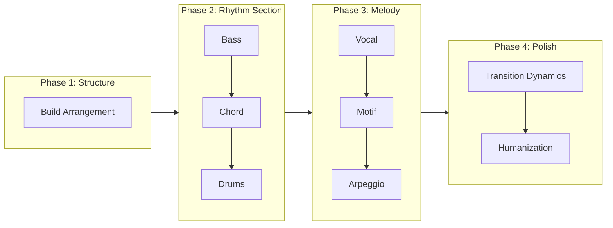
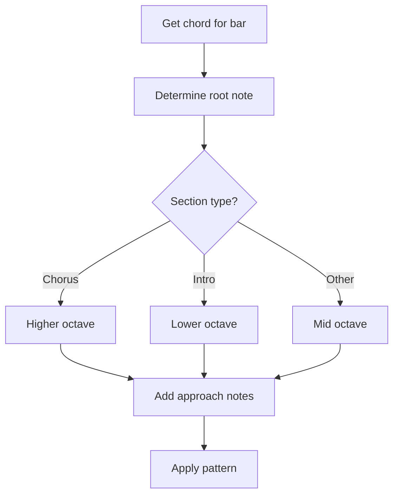
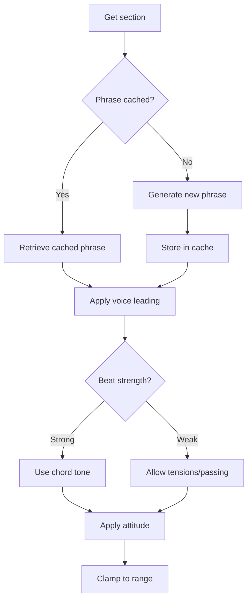
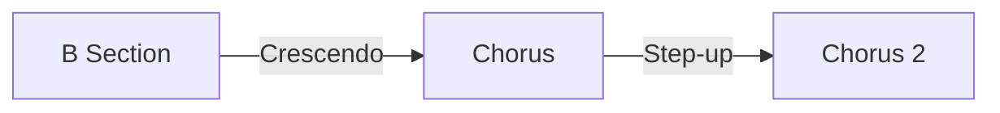
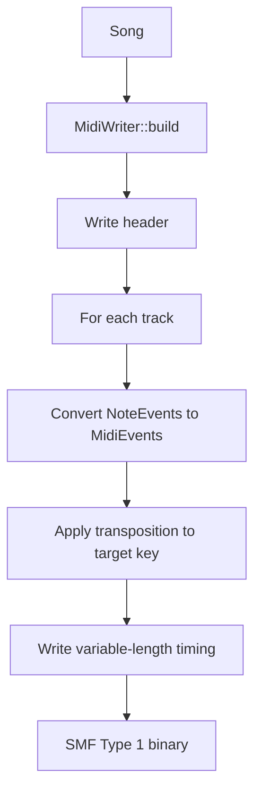

# Generation Pipeline

This document explains the step-by-step music generation process in [MIDI Sketch](https://github.com/libraz/midi-sketch).

## Pipeline Overview



## Phase 1: Structure Building

The generator first creates the song structure based on `StructurePattern`:

```cpp
void Generator::buildStructure() {
    arrangement_ = StructureBuilder::build(params_.structure);
}
```

### Structure Patterns

| Pattern | Bars | Sections |
|---------|------|----------|
| StandardPop | 24 | A(8)-B(8)-Chorus(8) |
| BuildUp | 28 | Intro(4)-A(8)-B(8)-Chorus(8) |
| DirectChorus | 16 | A(8)-Chorus(8) |
| RepeatChorus | 32 | A(8)-B(8)-Chorus(8)-Chorus(8) |
| FullPop | 56 | Intro-A-B-Chorus-A-B-Chorus-Outro |
| FullWithBridge | 52 | Intro-A-B-Chorus-Bridge-Chorus-Outro |
| Ballad | 56 | Intro(8)-A-B-Chorus-Interlude-B-Chorus-Outro |
| ExtendedFull | 90 | Full form with bridge and extended sections |

### Section Types

Each section has properties that affect generation:

```cpp
struct Section {
    SectionType type;         // Intro, A, B, Chorus, Bridge, Interlude, Outro
    uint8_t bars;             // Length in bars
    VocalDensity vocal_density;    // Full, Sparse, None
    BackingDensity backing_density; // Normal, Thin, Thick
};
```

## Phase 2: Rhythm Section

### Bass Generation

Bass is generated first as the harmonic foundation:



**Bass Patterns:**
- **Sparse**: Quarter notes on beats 1 and 3 (ballad, chill)
- **Standard**: Quarter note rhythm with occasional eighths
- **Driving**: Eighth note patterns with approach notes

### Chord Generation

Chord voicing uses bass analysis for coordination:

```cpp
void Generator::generateChord() {
    BassAnalysis bassAnalysis = analyzeBass(song_.bass);
    // Use rootless voicing when bass has root
    if (bassAnalysis.hasRootOnBeat1) {
        useRootlessVoicing();
    }
}
```

**Voice Leading Algorithm:**
1. Calculate distance between consecutive voicings
2. Minimize movement (sum of semitone distances)
3. Maximize common tone retention
4. Apply inversions to optimize transitions

### Drums Generation

Drum patterns are selected based on mood:

| Style | Characteristics | Used By |
|-------|-----------------|---------|
| Sparse | Half-time feel, minimal | Ballad, Chill |
| Standard | 8th hi-hat, 2&4 snare | StraightPop |
| FourOnFloor | 4-on-floor kick | ElectroPop, IdolPop |
| Upbeat | Syncopated, 16th hi-hat | BrightUpbeat |
| Rock | Ride cymbal, crash accents | LightRock |
| Synth | Tight 16th hi-hat | Yoasobi, Synthwave |

**Fill Generation:**
- Tom descend/ascend patterns
- Snare rolls
- Combination fills at section transitions

## Phase 3: Melody Generation

### Vocal Track

The most complex generator with phrase caching:



**Vocal Attitudes:**

| Attitude | Characteristics |
|----------|-----------------|
| Clean | Chord tones only, on-beat rhythms |
| Expressive | Tensions with delayed resolution, slight timing deviation |
| Raw | Non-chord tones, phrase boundary breaking |

**Non-Chord Tones:**
- 4-3 suspensions
- Anticipations
- Passing tones
- Neighbor tones

### Motif Track (BackgroundMotif style)

Generates repeating patterns:

```cpp
MotifParams params {
    .length = MotifLength::TwoBars,    // 2 or 4 bars
    .rhythm_density = RhythmDensity::Medium,
    .motion = MotifMotion::Stepwise,
    .repeat_scope = RepeatScope::FullSong
};
```

### Arpeggio Track (SynthDriven style)

Generates arpeggiated patterns:

```cpp
ArpeggioParams params {
    .pattern = ArpeggioPattern::UpDown,
    .speed = ArpeggioSpeed::Sixteenth,
    .octave_range = 2,
    .gate = 0.5f  // Note length ratio
};
```

## Phase 4: Polish

### Transition Dynamics

Automatically applies energy transitions:



**Section Energy Multipliers:**

| Section | Multiplier |
|---------|-----------|
| Intro | 0.75 |
| A | 0.85 |
| B | 1.00 |
| Chorus | 1.20 |
| Bridge | 0.90 |
| Outro | 0.80 |

### Humanization

Adds natural variation to timing and velocity:

```cpp
void applyHumanization(Song& song, float intensity) {
    // Timing: random offset ±ms
    // Velocity: random ±value
    // Not applied to drums
}
```

## MIDI Output

Finally, the Song is converted to SMF Type 1:



**Track Mapping:**

| Track | Channel | Program |
|-------|---------|---------|
| Vocal | 0 | 0 (Piano) |
| Chord | 1 | 4 (E.Piano) |
| Bass | 2 | 33 (E.Bass) |
| Motif | 3 | 81 (Synth Lead) |
| Arpeggio | 4 | 81 (Saw Lead) |
| Drums | 9 | GM Drums |
| SE | 15 | Text events |

## Key Transposition

All generation happens in C major. Final transposition is applied at output:

```cpp
uint8_t MidiWriter::transposePitch(uint8_t pitch, Key key) {
    return pitch + static_cast<uint8_t>(key);
}
```
