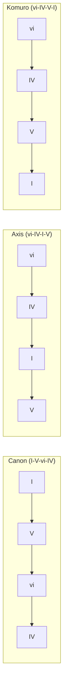
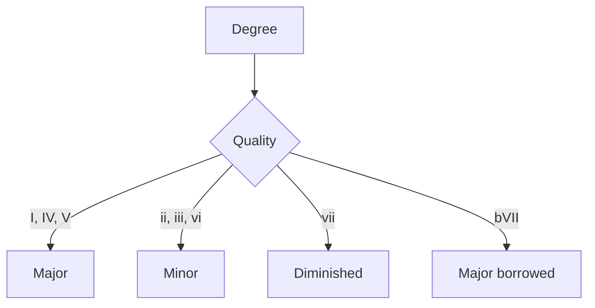
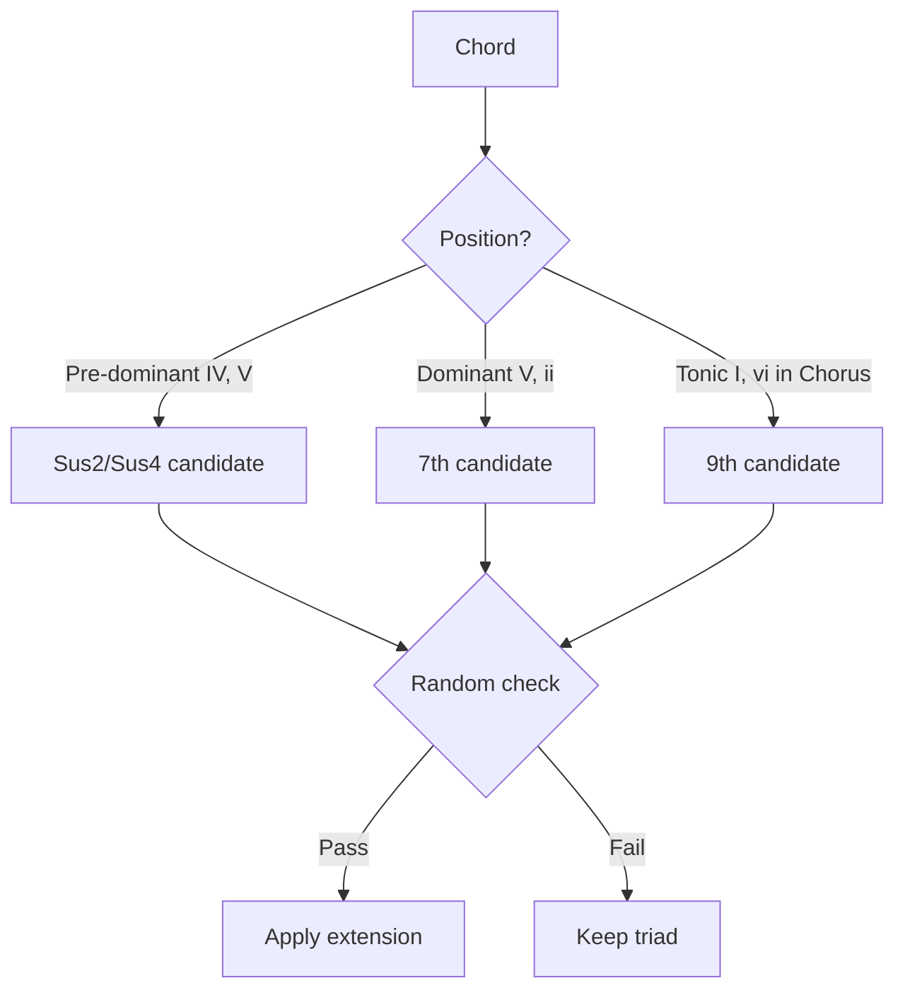
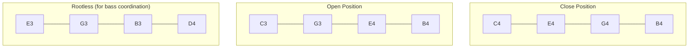

# Harmony & Chord Progressions

This document explains the harmonic system in [MIDI Sketch](https://github.com/libraz/midi-sketch).

## Chord Progressions

MIDI Sketch includes 22 built-in chord progressions, covering common pop music patterns.

### 4-Chord Progressions



| ID | Name | Degrees | Character |
|----|------|---------|-----------|
| 0 | Pop4 | I-V-vi-IV | Ubiquitous pop |
| 1 | Axis | vi-IV-I-V | Melancholic |
| 2 | Komuro | vi-IV-V-I | Bright J-pop |
| 3 | Canon | I-V-vi-iii-IV | Classic |
| 4 | Emotional4 | vi-V-IV-V | Emotional build |
| 5 | Minimal | I-IV | Simple two-chord |
| 6 | AltMinimal | I-V | Power pop |
| 7 | Progression3 | I-vi-IV | Three-chord |
| 8 | Rock4 | I-bVII-IV-I | Rock feel |

### 5-Chord Progressions

| ID | Name | Degrees | Character |
|----|------|---------|-----------|
| 9 | Extended5 | I-V-vi-iii-IV | Extended canon |
| 10 | Emotional5 | vi-IV-I-V-ii | Complex emotional |

### Full Progression List

Total of 22 progressions including:
- Pop variants (bright, dark)
- Emotional variants
- Minimal (2-3 chord) patterns
- Rock-influenced
- Jazz-influenced with ii-V

## Degree System

Chord degrees are represented as integers:

```cpp
enum Degree {
    I   = 0,   // Tonic
    ii  = 1,   // Supertonic
    iii = 2,   // Mediant
    IV  = 3,   // Subdominant
    V   = 4,   // Dominant
    vi  = 5,   // Submediant
    vii = 6,   // Leading tone
    bVII = 10  // Flat seven (borrowed)
};
```

## Chord Quality

Quality is determined by degree in major key:



```cpp
ChordQuality getQuality(Degree degree) {
    switch (degree) {
        case I: case IV: case V: case bVII:
            return Major;
        case ii: case iii: case vi:
            return Minor;
        case vii:
            return Diminished;
    }
}
```

## Chord Extensions

Extensions add color to basic triads:

### Extension Types

| Type | Notes Added | Example (C) |
|------|-------------|-------------|
| Triad | Root, 3rd, 5th | C-E-G |
| Sus2 | Root, 2nd, 5th | C-D-G |
| Sus4 | Root, 4th, 5th | C-F-G |
| 7th | + 7th | C-E-G-B/Bb |
| 9th | + 7th + 9th | C-E-G-B-D |

### Extension Application Rules



### Configuration

```cpp
struct ChordExtensionParams {
    bool enabled = true;
    float sus_probability = 0.3f;     // 30% chance
    float seventh_probability = 0.4f;  // 40% chance
    float ninth_probability = 0.2f;    // 20% chance
};
```

## Voice Leading

### Principles

1. **Minimize movement**: Each voice moves by smallest interval
2. **Common tones**: Retain shared notes between chords
3. **Avoid parallel fifths/octaves**: Classical constraint
4. **Smooth bass**: Stepwise or small leaps preferred

### Algorithm

```cpp
Voicing optimizeVoicing(Voicing prev, Chord next) {
    vector<Voicing> candidates = generateAllVoicings(next);

    return min_element(candidates, [&](auto& a, auto& b) {
        int distA = totalVoiceDistance(prev, a);
        int distB = totalVoiceDistance(prev, b);

        // Also penalize large leaps
        int leapA = maxSingleVoiceDistance(prev, a);
        int leapB = maxSingleVoiceDistance(prev, b);

        return (distA + leapA * 2) < (distB + leapB * 2);
    });
}
```

### Voicing Types



## Bass-Chord Coordination

The chord track uses bass analysis to avoid doubling:

```cpp
struct BassAnalysis {
    bool hasRootOnBeat1;   // Root on downbeat
    bool hasRootOnBeat3;   // Root on beat 3
    bool hasFifth;         // Fifth present
    Tick accentTicks[];    // Strong beat positions
};

// When bass has root, chord uses rootless voicing
if (bassAnalysis.hasRootOnBeat1) {
    voicing = generateRootlessVoicing(chord);
}
```

## Key Modulation

### Modulation Points

| Structure | Modulation Point | Amount |
|-----------|------------------|--------|
| StandardPop | B → Chorus | +1 semitone |
| RepeatChorus | Chorus 1 → 2 | +1 semitone |
| Ballad | B → Chorus | +2 semitones |
| Full patterns | Varies | +1 to +2 |

### Implementation

```cpp
struct Modulation {
    Tick tick;           // When to modulate
    int8_t semitones;    // How much (+1, +2)
};

// Applied during MIDI output
void MidiWriter::writeTrack(MidiTrack& track, Modulation mod) {
    for (auto& note : track.notes) {
        if (note.tick >= mod.tick) {
            note.pitch += mod.semitones;
        }
    }
}
```

## Chord Tone Analysis

Used for melody generation to determine note consonance:

```cpp
bool isChordTone(uint8_t pitch, Chord chord) {
    uint8_t pitchClass = pitch % 12;

    // Check against chord pitch classes
    for (auto& chordPitch : chord.pitchClasses()) {
        if (pitchClass == chordPitch) return true;
    }
    return false;
}

uint8_t nearestChordTone(uint8_t pitch, Chord chord) {
    // Find closest chord tone by semitone distance
    int minDist = 12;
    uint8_t nearest = pitch;

    for (auto& target : chord.pitches()) {
        int dist = abs(pitch - target);
        if (dist < minDist) {
            minDist = dist;
            nearest = target;
        }
    }
    return nearest;
}
```

## Tension Notes

Non-chord tones used for melodic interest:

| Tension | Interval | Resolution |
|---------|----------|------------|
| 9th | Major 2nd | Down to root |
| 11th | Perfect 4th | Down to 3rd |
| 13th | Major 6th | Down to 5th |
| b9 | Minor 2nd | Down to root |
| #11 | Aug 4th | To 5th |

### Usage by Vocal Attitude

| Attitude | Tensions Allowed |
|----------|------------------|
| Clean | None (chord tones only) |
| Expressive | 9th, 13th on weak beats |
| Raw | All tensions, any beat |
