# Option Relationships

This document describes the relationships between `SongConfig` options in MIDI Sketch.

## Relationship Types

Options have the following relationships:

- **Dependency**: Child options are ignored unless parent option is enabled
- **Priority**: Special values (like 0) override other settings
- **Conflict**: Certain combinations cause validation errors
- **Implicit**: Setting one option automatically configures internal parameters

---

## 1. Dependency Relationships

### 1.1 Call System

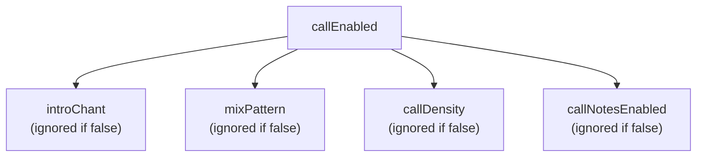

| Parent | Child | Description |
|--------|-------|-------------|
| `callEnabled=true` | `introChant` | Type of intro chant section |
| `callEnabled=true` | `mixPattern` | Type of MIX section |
| `callEnabled=true` | `callDensity` | Call density in chorus |
| `callEnabled=true` | `callNotesEnabled` | Output calls as MIDI notes |

### 1.2 Arpeggio

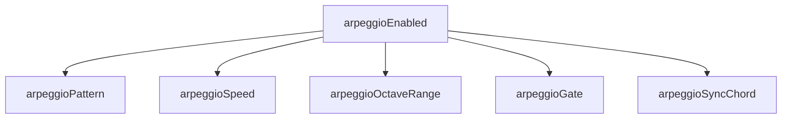

| Parent | Child | Description |
|--------|-------|-------------|
| `arpeggioEnabled=true` | `arpeggioPattern` | Up/Down/UpDown/Random |
| `arpeggioEnabled=true` | `arpeggioSpeed` | Eighth/Sixteenth/Triplet |
| `arpeggioEnabled=true` | `arpeggioOctaveRange` | 1-3 octaves |
| `arpeggioEnabled=true` | `arpeggioGate` | Gate length (0-100) |
| `arpeggioEnabled=true` | `arpeggioSyncChord` | Sync with chord changes |

### 1.3 Humanization

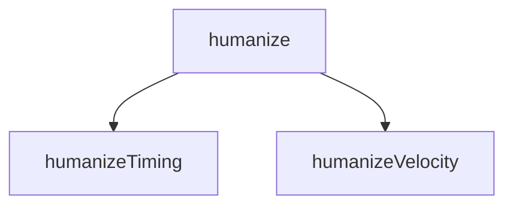

| Parent | Child | Description |
|--------|-------|-------------|
| `humanize=true` | `humanizeTiming` | Timing variation (0-100) |
| `humanize=true` | `humanizeVelocity` | Velocity variation (0-100) |

### 1.4 Chord Extensions

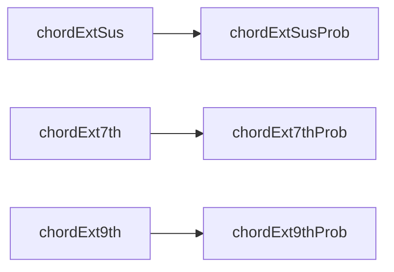

| Parent | Child | Description |
|--------|-------|-------------|
| `chordExtSus=true` | `chordExtSusProb` | Sus probability (0-100) |
| `chordExt7th=true` | `chordExt7thProb` | 7th probability (0-100) |
| `chordExt9th=true` | `chordExt9thProb` | 9th probability (0-100) |

### 1.5 Modulation

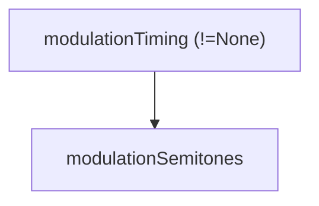

| Parent | Child | Description |
|--------|-------|-------------|
| `modulationTiming != None` | `modulationSemitones` | Modulation amount (1-4) |

**Note**: When `modulationTiming=None`, `modulationSemitones` is not validated.

### 1.6 Vocal (skipVocal exclusion)

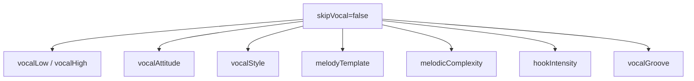

| Condition | Effective Options |
|-----------|-------------------|
| `skipVocal=false` | All vocal-related options |
| `skipVocal=true` | All vocal options are ignored |

### 1.7 MelodyTemplate Selection

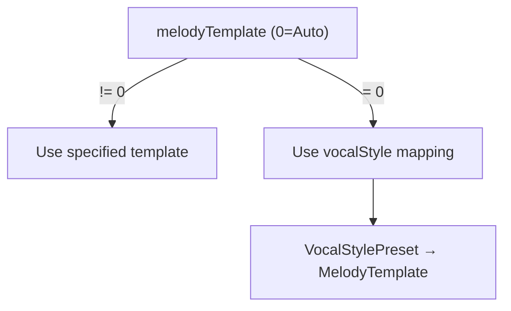

| vocalStyle | Default Template |
|------------|-----------------|
| Standard (1) | PlateauTalk (1) |
| Vocaloid (2) | RunUpTarget (2) |
| Idol (4) | PlateauTalk (1) |
| Ballad (5) | SparseAnchor (5) |
| Rock (6) | RunUpTarget (2) |
| CityPop (7) | PlateauTalk (1) |
| Anime (8) | HookRepeat (4) |

---

## 2. CompositionStyle Branching

The value of `compositionStyle` determines which options are effective:

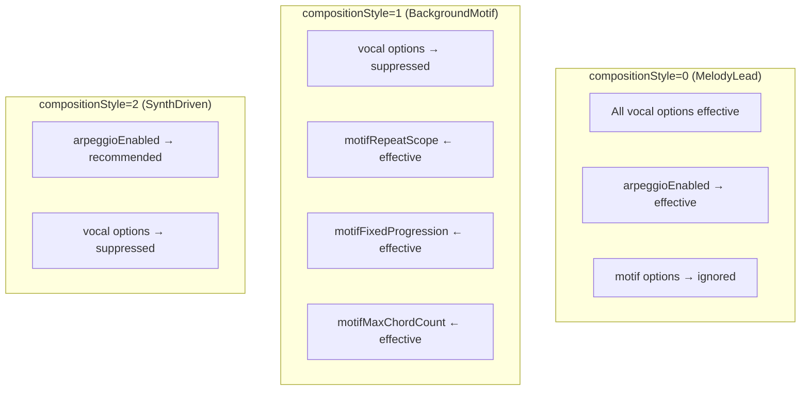

---

## 3. Priority (Special Value Overrides)

| Option | Special Value | Behavior |
|--------|---------------|----------|
| `bpm` | `0` | Use style preset's default BPM |
| `seed` | `0` | Auto-generate random seed |
| `melodyTemplate` | `0` | Use VocalStylePreset's default template |
| `targetDurationSeconds` | `0` | Use structure pattern from `formId` |

### Flowchart

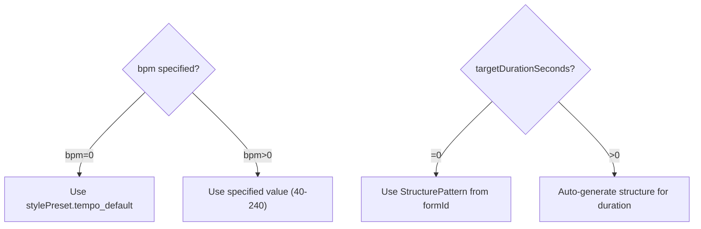

---

## 4. Validation Conflicts

### 4.1 Error Codes

| Error | Cause |
|-------|-------|
| `INVALID_STYLE` | `stylePresetId >= 17` |
| `INVALID_CHORD` | `chordProgressionId >= 22` |
| `INVALID_FORM` | `formId >= 11` |
| `INVALID_ATTITUDE` | `vocalAttitude` not allowed by style |
| `INVALID_VOCAL_RANGE` | `vocalLow > vocalHigh` or out of range (36-96) |
| `INVALID_BPM` | `bpm != 0` and `bpm < 40` or `bpm > 240` |
| `INVALID_MODULATION` | `modulationTiming != None` and `modulationSemitones` not 1-4 |
| `DURATION_TOO_SHORT` | `callEnabled=true` and `targetDurationSeconds` below minimum |

### 4.2 Style × Attitude Combinations

Each style preset has `allowedAttitudes` bit flags. Specifying a non-allowed attitude causes an error:

```typescript
// Example: Style allows only Clean and Expressive
allowedAttitudes = ATTITUDE_CLEAN | ATTITUDE_EXPRESSIVE  // 0b011 = 3

vocalAttitude = 2 (Raw) → INVALID_ATTITUDE error
```

### 4.3 Call × Duration Conflict

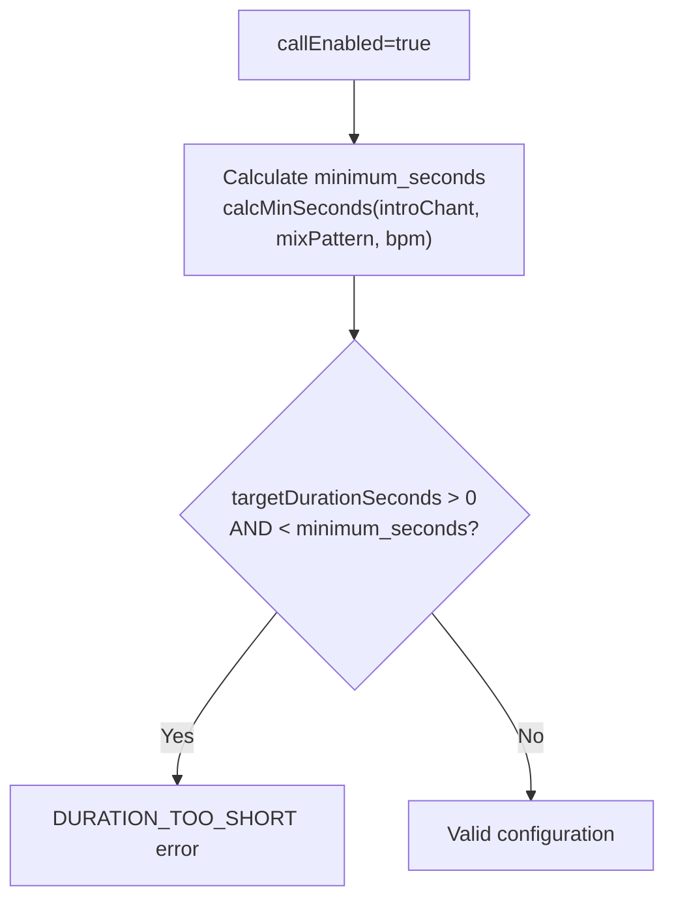

| introChant | mixPattern | Min seconds @120 BPM |
|------------|------------|----------------------|
| None | None | No limit |
| Gachikoi | None | ~24s |
| None | Tiger | ~20s |
| Gachikoi | Tiger | ~40s |

---

## 5. Recommended Combinations

### 5.1 Simple Pop (Default)

```javascript
{
  stylePresetId: 0,
  compositionStyle: 0,  // MelodyLead
  drumsEnabled: true,
  arpeggioEnabled: false,
  callEnabled: false
}
```

### 5.2 Vocaloid Style

```javascript
{
  stylePresetId: 16,  // vocaloid preset
  compositionStyle: 0,
  vocalStyle: 2,      // Vocaloid
  vocalNoteDensity: 150,
  vocalMinNoteDivision: 16,
  vocalAllowExtremLeap: true,
  arpeggioEnabled: true,
  arpeggioSpeed: 1  // Sixteenth
}
```

### 5.3 Idol Song (with Calls)

```javascript
{
  stylePresetId: 14,  // idol preset
  callEnabled: true,
  introChant: 1,      // Gachikoi
  mixPattern: 2,      // Tiger
  callDensity: 2,     // Standard
  callNotesEnabled: true,
  targetDurationSeconds: 180  // 3+ minutes required
}
```

### 5.4 BGM Mode (Motif-focused)

```javascript
{
  compositionStyle: 1,  // BackgroundMotif
  skipVocal: true,      // or false for subdued vocals
  motifFixedProgression: true,
  motifMaxChordCount: 4,
  arpeggioEnabled: true
}
```

---

## 6. Implicit Internal Settings

Certain parameters automatically configure internal values when set.

### 6.1 VocalStylePreset → MelodyTemplate

Setting `vocalStyle` automatically selects a `MelodyTemplate`:

| vocalStyle | MelodyTemplate | Key Characteristics |
|------------|----------------|---------------------|
| `Auto (0)` | Section-based | Verse=PlateauTalk, Chorus=RunUpTarget |
| `Standard (1)` | PlateauTalk (1) | plateau_ratio=0.40, balanced |
| `Vocaloid (2)` | RunUpTarget (2) | High density, wide leaps |
| `UltraVocaloid (3)` | RunUpTarget (2) | Extreme density (32nd notes) |
| `Idol (4)` | PlateauTalk (1) | High 16th ratio, hooks |
| `Ballad (5)` | SparseAnchor (5) | Long notes, sparse |
| `Rock (6)` | RunUpTarget (2) | Register shift |
| `CityPop (7)` | PlateauTalk (1) | Groovy, syncopated |
| `Anime (8)` | HookRepeat (4) | Hook-heavy |
| `BrightKira (9)` | HookRepeat (4) | High register |
| `CoolSynth (10)` | PlateauTalk (1) | Electronic |
| `CuteAffected (11)` | HookRepeat (4) | Playful |
| `PowerfulShout (12)` | RunUpTarget (2) | Intense |

**Important**: If you explicitly set `melodyTemplate` to a non-zero value, it overrides the VocalStylePreset default.

### 6.2 MelodicComplexity → Multiple Parameters

| melodicComplexity | Auto Settings |
|-------------------|---------------|
| `Simple (0)` | `note_density *= 0.7`, `max_leap_interval ≤ 5`, `hook_repetition=true`, `tension_usage *= 0.5`, `sixteenth_note_ratio *= 0.5`, `syncopation_prob *= 0.5` |
| `Standard (1)` | No changes (default) |
| `Complex (2)` | `note_density *= 1.3`, `max_leap_interval *= 1.5` (max 12), `tension_usage *= 1.5`, `sixteenth_note_ratio *= 1.5` (max 0.5), `syncopation_prob *= 1.5` (max 0.5) |

### 6.3 CompositionStyle → Implicit Behavior

| compositionStyle | Implicit Behavior |
|------------------|-------------------|
| `BackgroundMotif (1)` | **Auto-disable modulation**, vocal volume suppressed (velocity_scale applied), simple pitch constraints |
| `SynthDriven (2)` | **Auto-disable modulation**, **Auto-enable arpeggio** (even if arpeggioEnabled=false), vocal volume suppressed (velocity_scale=0.75) |

```javascript
// Example: Arpeggio is generated even if not explicitly enabled
{
  compositionStyle: 2,  // SynthDriven
  arpeggioEnabled: false  // ← Ignored! Arpeggio auto-enabled
}
```

### 6.4 VocalGrooveFeel → Internal Rhythm Parameters

| vocalGroove | Auto Settings |
|-------------|---------------|
| `Straight (0)` | No changes |
| `OffBeat (1)` | `offbeat_preference=0.4`, `syncopation_boost=0.2` |
| `Swing (2)` | `swing_amount=0.25`, `syncopation_boost=0.1` |
| `Syncopated (3)` | `syncopation_boost=0.4`, `offbeat_preference=0.3` |
| `Driving16th (4)` | `sixteenth_note_ratio=0.6`, `syncopation_prob=0.3` |
| `Bouncy8th (5)` | `swing_amount=0.15`, `syncopation_boost=0.15` |

### 6.5 BPM ≥ 140 → Vocal Density Boost

When BPM is 140 or higher, vocal density is automatically increased:

```
if (bpm >= 140) {
  note_density *= 1.1  // 10% increase
  sixteenth_note_ratio += 0.1  // 16th note ratio increase
}
```

### 6.6 drumsEnabled=false → Bass Rhythmic Drive

When drums are disabled, bass automatically switches to rhythmic patterns:

| drumsEnabled | Section | Bass Behavior |
|--------------|---------|---------------|
| `false` | Intro/Interlude/Outro | `RootFifth` pattern |
| `false` | A/B/Chorus/Bridge | `RhythmicDrive` pattern (emphasized 8th notes) |

---

## 7. Option Dependency Tree

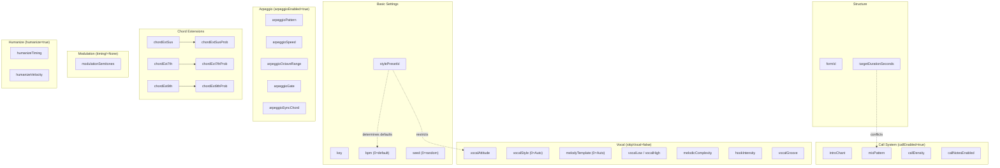
