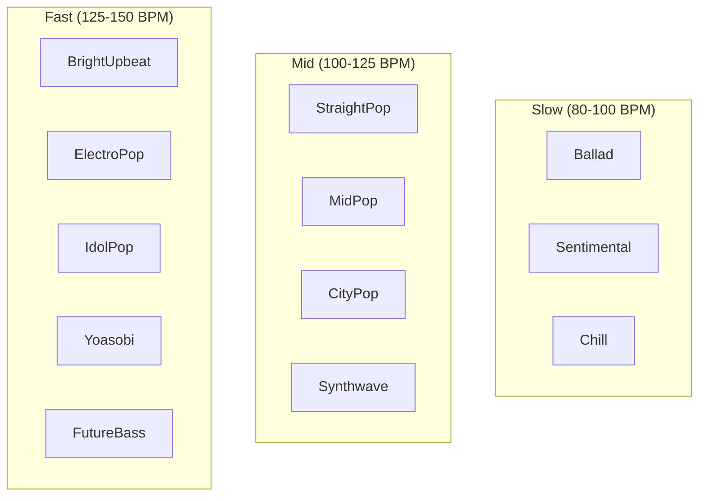
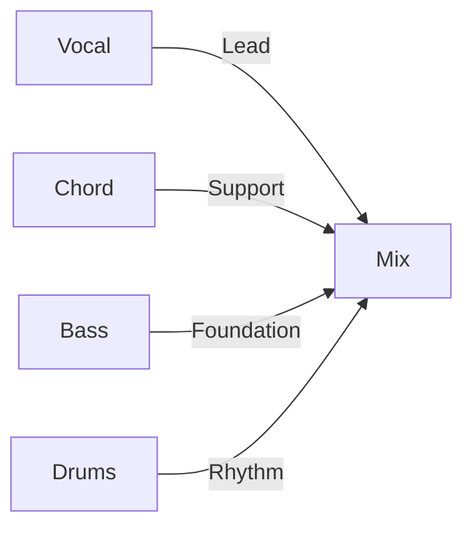
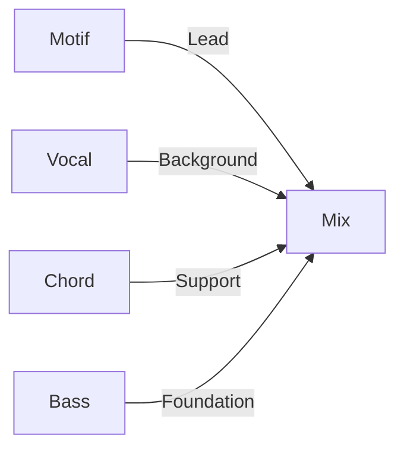
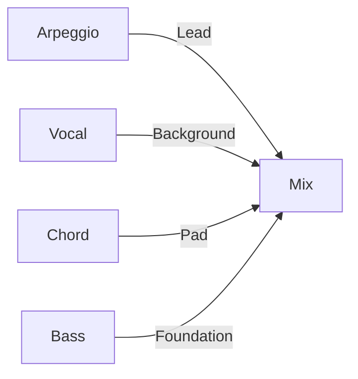

# Presets Reference

This document lists all available presets in [MIDI Sketch](https://github.com/libraz/midi-sketch).

## Structure Patterns

11 song structure patterns are available:

| ID | Name | Bars | Duration @120 BPM | Sections |
|----|------|------|-------------------|----------|
| 0 | StandardPop | 24 | 2:00 | A(8)-B(8)-Chorus(8) |
| 1 | BuildUp | 28 | 2:20 | Intro(4)-A(8)-B(8)-Chorus(8) |
| 2 | DirectChorus | 16 | 1:20 | A(8)-Chorus(8) |
| 3 | RepeatChorus | 32 | 2:40 | A(8)-B(8)-Chorus(8)-Chorus(8) |
| 4 | ShortForm | 12 | 1:00 | Intro(4)-Chorus(8) |
| 5 | FullPop | 56 | 4:40 | Intro-A-B-Chorus-A-B-Chorus-Outro |
| 6 | FullWithBridge | 52 | 4:20 | Intro-A-B-Chorus-Bridge-Chorus-Outro |
| 7 | DriveUpbeat | 52 | 4:20 | Intro-Chorus-A-B-Chorus-Chorus-Outro |
| 8 | Ballad | 56 | 4:40 | Intro(8)-A-B-Chorus-Interlude-B-Chorus-Outro |
| 9 | AnthemStyle | 52 | 4:20 | Intro-A-Chorus-A-B-Chorus-Chorus-Outro |
| 10 | ExtendedFull | 90 | 7:30 | Full form with extended sections |

### Section Types


| Type | Vocal Density | Energy | Purpose |
|------|---------------|--------|---------|
| Intro | None/Sparse | Low | Establish mood |
| A | Full | Medium-Low | Verse, storytelling |
| B | Full | Medium | Pre-chorus, tension |
| Chorus | Full | High | Hook, payoff |
| Bridge | Sparse | Medium | Contrast |
| Interlude | None | Medium-Low | Instrumental break |
| Outro | Sparse | Medium-Low | Resolution |

## Mood Presets

20 mood presets define the overall feel:

| ID | Name | BPM | Drum Style | Character |
|----|------|-----|------------|-----------|
| 0 | StraightPop | 120 | Standard | Classic pop groove |
| 1 | BrightUpbeat | 128 | Upbeat | Syncopated, energetic |
| 2 | EnergeticDance | 130 | FourOnFloor | Dance-oriented |
| 3 | LightRock | 125 | Rock | Guitar-oriented feel |
| 4 | MidPop | 115 | Standard | Balanced mid-tempo |
| 5 | EmotionalPop | 110 | Standard | Sentimental, softer |
| 6 | Sentimental | 95 | Sparse | Ballad-like |
| 7 | Chill | 100 | Sparse | Relaxed, minimal |
| 8 | Ballad | 80 | Sparse | Slow, sparse drums |
| 9 | DarkPop | 118 | Synth | Darker, dramatic |
| 10 | Dramatic | 115 | Standard | High expression |
| 11 | Nostalgic | 105 | Standard | Retro feel |
| 12 | ModernPop | 125 | Synth | Contemporary |
| 13 | ElectroPop | 135 | FourOnFloor | Electronic, dance |
| 14 | IdolPop | 138 | FourOnFloor | J-pop idol style |
| 15 | Anthem | 120 | Standard | Triumphant, grand |
| 16 | Yoasobi | 148 | Synth | Anime-style, high-energy |
| 17 | Synthwave | 118 | Synth | Retro synth, neon |
| 18 | FutureBass | 145 | Synth | Modern electronic |
| 19 | CityPop | 110 | Standard | 80s city pop vibe |

### Mood Categories



## Chord Progressions

22 chord progressions from simple to complex:

### Basic (2-3 Chords)

| ID | Name | Degrees | Use Case |
|----|------|---------|----------|
| 5 | Minimal | I-IV | Simple, folk |
| 6 | AltMinimal | I-V | Power pop |
| 7 | Progression3 | I-vi-IV | Three-chord pop |

### Standard (4 Chords)

| ID | Name | Degrees | Use Case |
|----|------|---------|----------|
| 0 | Pop4 | I-V-vi-IV | Universal pop |
| 1 | Axis | vi-IV-I-V | Melancholic |
| 2 | Komuro | vi-IV-V-I | Bright J-pop |
| 4 | Emotional4 | vi-V-IV-V | Building tension |
| 8 | Rock4 | I-bVII-IV-I | Rock feel |

### Extended (5+ Chords)

| ID | Name | Degrees | Use Case |
|----|------|---------|----------|
| 3 | Canon | I-V-vi-iii-IV | Classic |
| 9 | Extended5 | I-V-vi-iii-IV | Full progression |
| 10 | Emotional5 | vi-IV-I-V-ii | Complex emotional |

## Style Presets

13 style presets that combine mood and composition approach:

| ID | Name | Comp. Style | Base Mood | Character |
|----|------|-------------|-----------|-----------|
| 0 | MinimalGroovePop | MelodyLead | MidPop | Clean, simple |
| 1 | DancePopStandard | MelodyLead | EnergeticDance | Dance floor |
| 2 | IdolStandard | MelodyLead | IdolPop | J-pop idol |
| 3 | RockStandard | MelodyLead | LightRock | Rock band |
| 4 | BalladStandard | MelodyLead | Ballad | Slow ballad |
| 5 | YoasobiStyle | SynthDriven | Yoasobi | Anime-style |
| 6 | SynthwaveStyle | SynthDriven | Synthwave | Retro synth |
| 7 | FutureBassStyle | SynthDriven | FutureBass | Modern EDM |
| 8 | CityPopStyle | MelodyLead | CityPop | 80s vibe |
| 9 | MotifDriven | BackgroundMotif | MidPop | Pattern-based |
| 10 | ChillMotif | BackgroundMotif | Chill | Relaxed patterns |
| 11 | ElectroMotif | BackgroundMotif | ElectroPop | Electronic patterns |
| 12 | AnthemStyle | MelodyLead | Anthem | Triumphant |

## Composition Styles

3 composition approaches:

| Style | Focus | Vocal Role | Key Features |
|-------|-------|------------|--------------|
| MelodyLead | Vocal melody | Primary | Full melodic expression |
| BackgroundMotif | Repeating pattern | Secondary | Motif as main element |
| SynthDriven | Synth/Arpeggio | Secondary | Electronic, arpeggiated |

### MelodyLead



### BackgroundMotif



### SynthDriven



## Vocal Attitudes

3 melodic expression levels:

| Attitude | Characteristics | Best For |
|----------|-----------------|----------|
| Clean | Chord tones only, on-beat | Pop, ballad |
| Expressive | Tensions, timing variation | Emotional, dynamic |
| Raw | Non-chord tones, boundary breaking | Edgy, modern |

## Key Options

12 keys available (0-11):

| ID | Key | Notes |
|----|-----|-------|
| 0 | C | Natural, no sharps/flats |
| 1 | C# / Db | 5 sharps / 7 flats |
| 2 | D | 2 sharps |
| 3 | D# / Eb | 3 flats |
| 4 | E | 4 sharps |
| 5 | F | 1 flat |
| 6 | F# / Gb | 6 sharps / 6 flats |
| 7 | G | 1 sharp |
| 8 | G# / Ab | 4 flats |
| 9 | A | 3 sharps |
| 10 | A# / Bb | 2 flats |
| 11 | B | 5 sharps |

## BPM Range

Valid tempo range: 60-180 BPM

- Set to 0 to use mood's default BPM
- Each mood has an optimal BPM setting

## Configuration Examples

### Simple Pop Song

```javascript
import { createDefaultConfig } from 'midi-sketch'

// Use MinimalGroovePop preset
const config = createDefaultConfig(0)
config.key = 0                  // C major
config.chordProgressionId = 0   // Pop4 (I-V-vi-IV)
config.formId = 0               // StandardPop
config.bpm = 0                  // Use default (120)
config.drumsEnabled = true
```

### Emotional Ballad

```javascript
// Use BalladStandard preset
const config = createDefaultConfig(4)  // BalladStandard
config.key = 7                         // G major
config.chordProgressionId = 4          // Emotional4
config.formId = 8                      // Ballad structure
config.bpm = 75                        // Slower
config.drumsEnabled = true
```

### YOASOBI Style

```javascript
// Use YoasobiStyle preset
const config = createDefaultConfig(5)  // YoasobiStyle
config.key = 2                         // D major
config.chordProgressionId = 2          // Komuro
config.bpm = 0                         // Use default (148)
config.drumsEnabled = true
config.arpeggioEnabled = true
config.vocalNoteDensity = 150          // Vocaloid-style dense melody
config.vocalAllowExtremLeap = true     // Allow wide intervals
```

### Chill Background

```javascript
// Use ChillMotif preset
const config = createDefaultConfig(10)  // ChillMotif
config.key = 5                          // F major
config.chordProgressionId = 5           // Minimal
config.formId = 4                       // ShortForm
config.bpm = 95
config.drumsEnabled = false             // No drums for ambient
```

### Idol Pop with Calls

```javascript
// Use IdolStandard preset
const config = createDefaultConfig(2)  // IdolStandard
config.key = 0                         // C major
config.callEnabled = true              // Enable call track
config.introChant = 1                  // Gachikoi intro
config.mixPattern = 1                  // Standard mix
config.callDensity = 2                 // Standard density
config.modulationTiming = 1            // Modulate at last chorus
config.modulationSemitones = 2         // Up 2 semitones
```
