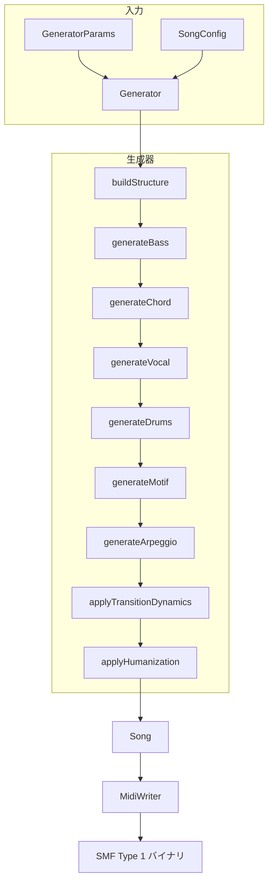

# アーキテクチャ概要

[MIDI Sketch](https://github.com/libraz/midi-sketch)の内部アーキテクチャを解説します。

## プロジェクト構造

```text
midi-sketch/
├── src/
│   ├── core/              # コア生成エンジン
│   ├── midi/              # MIDI出力（SMF Type 1）
│   ├── track/             # トラック生成器
│   ├── analysis/          # 不協和音分析
│   ├── preset/            # プリセット定義
│   ├── midisketch.h       # 公開C++ API
│   └── midisketch_c.h     # C API（WASMインターフェース）
├── tests/                 # Google Testスイート
├── dist/                  # WASM配布物
└── demo/                  # ブラウザデモ
```

## コアコンポーネント

### MidiSketchクラス

高レベルAPIを提供するメインエントリーポイント：

```cpp
class MidiSketch {
  void generate(const GeneratorParams& params);
  void generateFromConfig(const SongConfig& config);
  void regenerateMelody(uint32_t new_seed = 0);

  std::vector<uint8_t> getMidi() const;
  std::string getEventsJson() const;
  const Song& getSong() const;
};
```

### Generator

全トラック生成を統括する中央オーケストレーター（`src/core/generator.h`）：

```cpp
class Generator {
  Song generate(const GeneratorParams& params);
private:
  void buildStructure();
  void generateBass();
  void generateChord();
  void generateVocal();
  void generateDrums();
  void generateMotif();
  void generateArpeggio();
  void applyTransitionDynamics();
  void applyHumanization();
};
```

### Songコンテナ

生成された全データを保持：

```cpp
struct Song {
  Arrangement arrangement;     // セクション配置
  MidiTrack vocal;            // チャンネル 0
  MidiTrack chord;            // チャンネル 1
  MidiTrack bass;             // チャンネル 2
  MidiTrack motif;            // チャンネル 3
  MidiTrack arpeggio;         // チャンネル 4
  MidiTrack drums;            // チャンネル 9
  MidiTrack se;               // チャンネル 15（マーカー）
};
```

## データフロー



## 時間表現

MIDI Sketchは全体でティックベースのタイミングを使用：

```cpp
using Tick = uint32_t;
constexpr Tick TICKS_PER_BEAT = 480;    // 標準MIDI解像度
constexpr Tick TICKS_PER_BAR = 1920;    // 4/4拍子
constexpr uint8_t BEATS_PER_BAR = 4;
```

## ノート表現

2層のノート表現：

```cpp
// 中間的な音楽表現（内部用）
struct NoteEvent {
  Tick startTick;      // 絶対開始時間
  Tick duration;       // ティック単位の長さ
  uint8_t note;        // MIDIノート（0-127）
  uint8_t velocity;    // MIDIベロシティ（0-127）
};

// 低レベルMIDIバイト（出力専用）
struct MidiEvent {
  Tick tick;           // 絶対時間
  uint8_t status;      // MIDIステータスバイト
  uint8_t data1;       // 第1データバイト
  uint8_t data2;       // 第2データバイト
};
```

## セクション定義

楽曲はセクションに分割：

```cpp
struct Section {
  SectionType type;              // Intro, A, B, Chorus, Bridge, Interlude, Outro
  std::string name;              // 表示名
  uint8_t bars;                  // 小節数
  Tick startBar;                 // 開始位置（小節）
  Tick start_tick;               // 開始位置（ティック）
  VocalDensity vocal_density;    // Full, Sparse, None
  BackingDensity backing_density; // Normal, Thin, Thick
};
```

## コンポジションスタイル

3つのコンポジションスタイルが生成アプローチに影響：

| スタイル | 説明 |
|----------|------|
| **MelodyLead** | ボーカルメロディが主役の伝統的なアレンジ |
| **BackgroundMotif** | 繰り返しモチーフが主役、ボーカルは控えめ |
| **SynthDriven** | シンセ/アルペジオ主体のエレクトロニックスタイル |

## 乱数生成

メルセンヌ・ツイスターによる決定論的生成：

```cpp
std::mt19937 rng(seed);  // 同じシード = 同じ出力
```

シードが0の場合、現在時刻がランダム化に使用されます。

## WASMコンパイル

Emscripten経由でWebAssemblyにコンパイル：

- **出力**: 約80KB WASM + 約17KB JSグルー
- **外部依存なし**: 純粋なC++17
- **ES6モジュール**: モジュラーJavaScriptラッパー

```bash
# ビルドフラグ
-sWASM=1 -sMODULARIZE=1 -sEXPORT_ES6=1
-sALLOW_MEMORY_GROWTH=1 -sSTACK_SIZE=1048576
```

## C APIレイヤー

WASM相互運用のため、C APIがC++クラスをラップ：

```c
// ライフサイクル
MidiSketchHandle handle = midisketch_create();
midisketch_generate(handle, params);
MidiSketchMidiData* midi = midisketch_get_midi(handle);
midisketch_free_midi(midi);
midisketch_destroy(handle);
```

主要関数：

- `midisketch_generate()` - コア生成
- `midisketch_regenerate_melody()` - メロディバリエーション
- `midisketch_get_midi()` - MIDIバイナリ出力
- `midisketch_get_events()` - JSONイベントデータ
- `midisketch_get_info()` - メタデータ（小節数、ティック、BPM）
