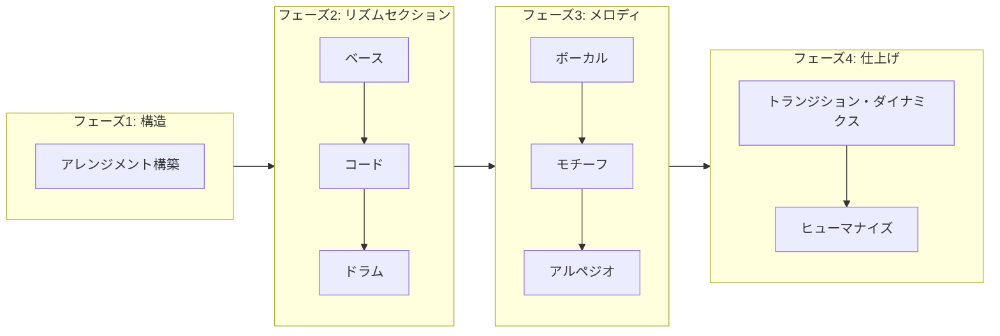
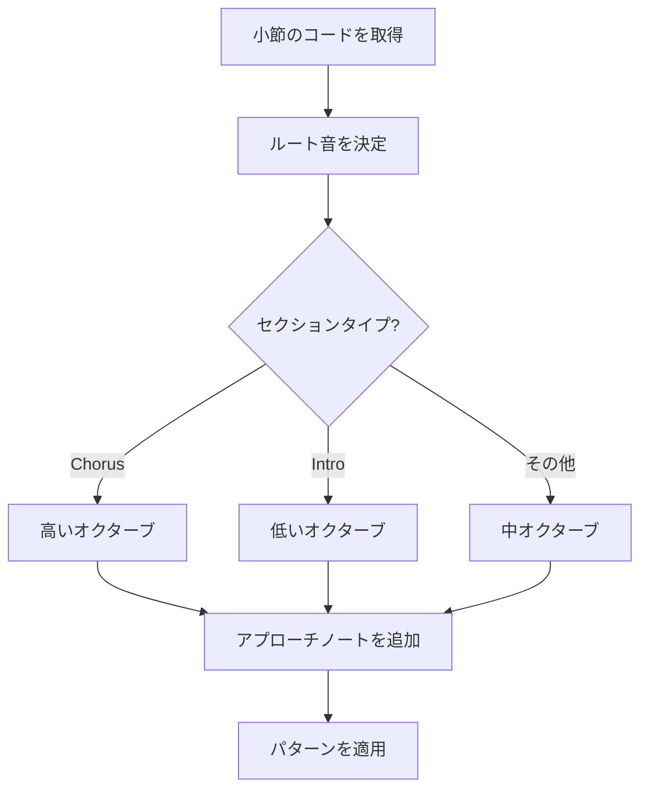
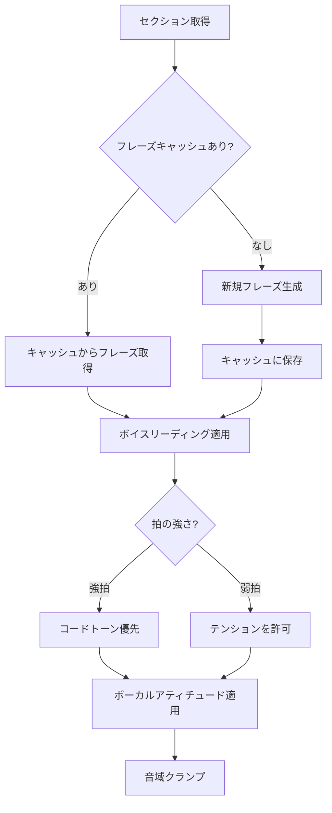
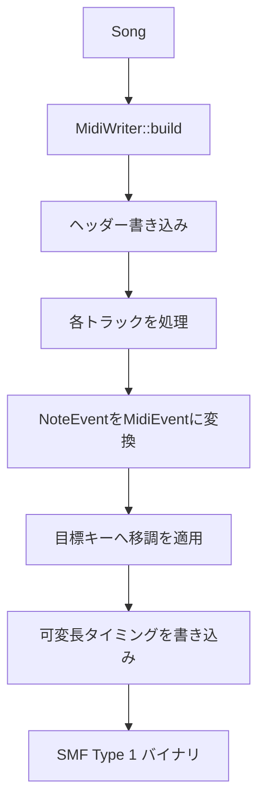

# 生成パイプライン

[MIDI Sketch](https://github.com/libraz/midi-sketch)のステップバイステップの音楽生成プロセスを解説します。

## パイプライン概要



## フェーズ1: 構造構築

`StructurePattern`に基づいて楽曲構造を作成：

```cpp
void Generator::buildStructure() {
    arrangement_ = StructureBuilder::build(params_.structure);
}
```

### 構造パターン

| パターン | 小節数 | セクション |
|----------|--------|------------|
| StandardPop | 24 | A(8)-B(8)-Chorus(8) |
| BuildUp | 28 | Intro(4)-A(8)-B(8)-Chorus(8) |
| DirectChorus | 16 | A(8)-Chorus(8) |
| RepeatChorus | 32 | A(8)-B(8)-Chorus(8)-Chorus(8) |
| FullPop | 56 | Intro-A-B-Chorus-A-B-Chorus-Outro |
| FullWithBridge | 52 | Intro-A-B-Chorus-Bridge-Chorus-Outro |
| Ballad | 56 | Intro(8)-A-B-Chorus-Interlude-B-Chorus-Outro |
| ExtendedFull | 90 | 拡張セクション付きフル形式 |

### セクションタイプ

各セクションは生成に影響するプロパティを持つ：

```cpp
struct Section {
    SectionType type;         // Intro, A, B, Chorus, Bridge, Interlude, Outro
    uint8_t bars;             // 小節数
    VocalDensity vocal_density;    // Full, Sparse, None
    BackingDensity backing_density; // Normal, Thin, Thick
};
```

## フェーズ2: リズムセクション

### ベース生成

ベースは和声の基礎として最初に生成：



**ベースパターン:**

- **Sparse**: 1拍目と3拍目に4分音符（バラード、チル）
- **Standard**: 時々8分音符を含む4分音符リズム
- **Driving**: アプローチノート付き8分音符パターン

### コード生成

コードボイシングはベース分析を使用して協調：

```cpp
void Generator::generateChord() {
    BassAnalysis bassAnalysis = analyzeBass(song_.bass);
    // ベースがルートを持つ場合はルートレスボイシング
    if (bassAnalysis.hasRootOnBeat1) {
        useRootlessVoicing();
    }
}
```

**ボイスリーディングアルゴリズム:**

1. 連続するボイシング間の距離を計算
2. 動きを最小化（半音距離の合計）
3. 共通音を最大限保持
4. 遷移を最適化するために転回形を適用

### ドラム生成

ドラムパターンはムードに基づいて選択：

| スタイル | 特徴 | 使用ムード |
|----------|------|-----------|
| Sparse | ハーフタイム、ミニマル | Ballad, Chill |
| Standard | 8分ハイハット、2&4スネア | StraightPop |
| FourOnFloor | 4つ打ちキック | ElectroPop, IdolPop |
| Upbeat | シンコペーション、16分ハイハット | BrightUpbeat |
| Rock | ライドシンバル、クラッシュアクセント | LightRock |
| Synth | タイトな16分ハイハット | Yoasobi, Synthwave |

**フィル生成:**

- タムの下降/上昇パターン
- スネアロール
- セクション遷移でのコンビネーションフィル

## フェーズ3: メロディ生成

### ボーカルトラック

フレーズキャッシュを持つ最も複雑な生成器：



**ボーカルアティチュード:**

| アティチュード | 特徴 |
|----------------|------|
| Clean | コードトーンのみ、オンビートリズム |
| Expressive | 遅延解決のテンション、微妙なタイミング変動 |
| Raw | 非コードトーン、フレーズ境界の破壊 |

**非コードトーン:**

- 4-3サスペンション
- アンティシペーション
- パッシングトーン
- ネイバートーン

### モチーフトラック（BackgroundMotifスタイル）

繰り返しパターンを生成：

```cpp
MotifParams params {
    .length = MotifLength::TwoBars,    // 2または4小節
    .rhythm_density = RhythmDensity::Medium,
    .motion = MotifMotion::Stepwise,
    .repeat_scope = RepeatScope::FullSong
};
```

### アルペジオトラック（SynthDrivenスタイル）

アルペジオパターンを生成：

```cpp
ArpeggioParams params {
    .pattern = ArpeggioPattern::UpDown,
    .speed = ArpeggioSpeed::Sixteenth,
    .octave_range = 2,
    .gate = 0.5f  // ノート長比率
};
```

## フェーズ4: 仕上げ

### トランジション・ダイナミクス

エネルギー遷移を自動適用：


**セクションエネルギー倍率:**

| セクション | 倍率 |
|------------|------|
| Intro | 0.75 |
| A | 0.85 |
| B | 1.00 |
| Chorus | 1.20 |
| Bridge | 0.90 |
| Outro | 0.80 |

### ヒューマナイズ

タイミングとベロシティに自然な揺らぎを追加：

```cpp
void applyHumanization(Song& song, float intensity) {
    // タイミング: ランダムオフセット ±ms
    // ベロシティ: ランダム ±値
    // ドラムには適用しない
}
```

## MIDI出力

最後に、SongをSMF Type 1に変換：



**トラックマッピング:**

| トラック | チャンネル | プログラム |
|----------|------------|------------|
| Vocal | 0 | 0（ピアノ） |
| Chord | 1 | 4（エレピ） |
| Bass | 2 | 33（エレベ） |
| Motif | 3 | 81（シンセリード） |
| Arpeggio | 4 | 81（ソウリード） |
| Drums | 9 | GMドラム |
| SE | 15 | テキストイベント |

## キー移調

全ての生成はCメジャーで行われ、出力時に移調が適用：

```cpp
uint8_t MidiWriter::transposePitch(uint8_t pitch, Key key) {
    return pitch + static_cast<uint8_t>(key);
}
```
