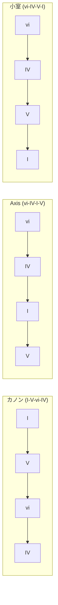
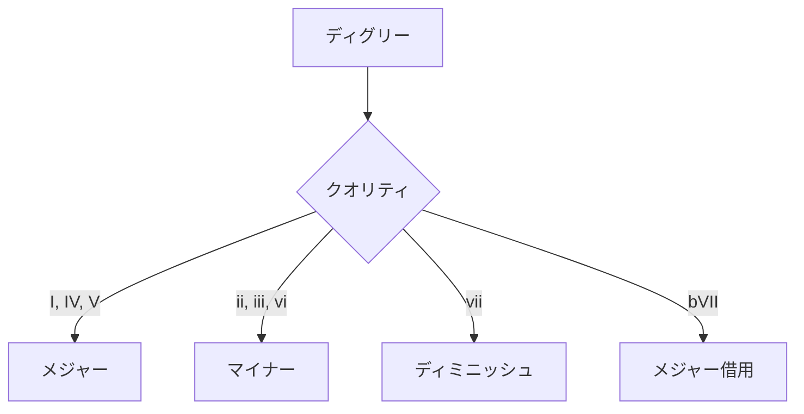
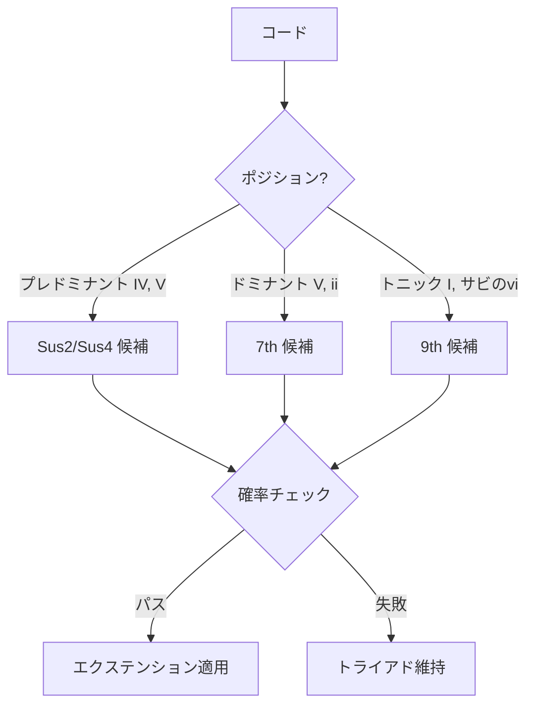
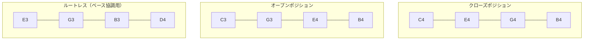

# ハーモニーとコード進行

[MIDI Sketch](https://github.com/libraz/midi-sketch)の和声システムを解説します。

## コード進行

MIDI Sketchには一般的なポップミュージックパターンをカバーする22の内蔵コード進行があります。

### 4コード進行



| ID | 名前 | ディグリー | 特徴 |
|----|------|------------|------|
| 0 | Pop4 | I-V-vi-IV | 定番ポップ |
| 1 | Axis | vi-IV-I-V | メランコリック |
| 2 | Komuro | vi-IV-V-I | 明るいJ-pop |
| 3 | Canon | I-V-vi-iii-IV | クラシック |
| 4 | Emotional4 | vi-V-IV-V | エモーショナルビルド |
| 5 | Minimal | I-IV | シンプルな2コード |
| 6 | AltMinimal | I-V | パワーポップ |
| 7 | Progression3 | I-vi-IV | 3コード |
| 8 | Rock4 | I-bVII-IV-I | ロック感 |

### 5コード進行

| ID | 名前 | ディグリー | 特徴 |
|----|------|------------|------|
| 9 | Extended5 | I-V-vi-iii-IV | 拡張カノン |
| 10 | Emotional5 | vi-IV-I-V-ii | 複雑なエモーショナル |

### 全進行リスト

合計22の進行：

- ポップバリアント（ブライト、ダーク）
- エモーショナルバリアント
- ミニマル（2-3コード）パターン
- ロック影響
- ii-Vを含むジャズ影響

## ディグリーシステム

コードディグリーは整数で表現：

```cpp
enum Degree {
    I   = 0,   // トニック
    ii  = 1,   // サブドミナント
    iii = 2,   // メディアント
    IV  = 3,   // サブドミナント
    V   = 4,   // ドミナント
    vi  = 5,   // サブメディアント
    vii = 6,   // リーディングトーン
    bVII = 10  // フラットセブン（借用）
};
```

## コードクオリティ

メジャーキーのディグリーによってクオリティが決定：



```cpp
ChordQuality getQuality(Degree degree) {
    switch (degree) {
        case I: case IV: case V: case bVII:
            return Major;
        case ii: case iii: case vi:
            return Minor;
        case vii:
            return Diminished;
    }
}
```

## コードエクステンション

エクステンションは基本トライアドに彩りを加える：

### エクステンションタイプ

| タイプ | 追加音 | 例（C） |
|--------|--------|---------|
| Triad | ルート、3度、5度 | C-E-G |
| Sus2 | ルート、2度、5度 | C-D-G |
| Sus4 | ルート、4度、5度 | C-F-G |
| 7th | + 7度 | C-E-G-B/Bb |
| 9th | + 7度 + 9度 | C-E-G-B-D |

### エクステンション適用ルール



### 設定

```cpp
struct ChordExtensionParams {
    bool enabled = true;
    float sus_probability = 0.3f;     // 30%確率
    float seventh_probability = 0.4f;  // 40%確率
    float ninth_probability = 0.2f;    // 20%確率
};
```

## ボイスリーディング

### 原則

1. **動きを最小化**: 各声部は最小の音程で移動
2. **共通音**: コード間で共有される音を保持
3. **平行5度/8度を避ける**: クラシック的制約
4. **滑らかなベース**: 順次進行または小さな跳躍を優先

### アルゴリズム

```cpp
Voicing optimizeVoicing(Voicing prev, Chord next) {
    vector<Voicing> candidates = generateAllVoicings(next);

    return min_element(candidates, [&](auto& a, auto& b) {
        int distA = totalVoiceDistance(prev, a);
        int distB = totalVoiceDistance(prev, b);

        // 大きな跳躍にもペナルティ
        int leapA = maxSingleVoiceDistance(prev, a);
        int leapB = maxSingleVoiceDistance(prev, b);

        return (distA + leapA * 2) < (distB + leapB * 2);
    });
}
```

### ボイシングタイプ



## ベース-コード協調

コードトラックはベース分析を使用して重複を回避：

```cpp
struct BassAnalysis {
    bool hasRootOnBeat1;   // ダウンビートでルート
    bool hasRootOnBeat3;   // 3拍目でルート
    bool hasFifth;         // 5度あり
    Tick accentTicks[];    // 強拍位置
};

// ベースがルートを持つ場合、コードはルートレスボイシングを使用
if (bassAnalysis.hasRootOnBeat1) {
    voicing = generateRootlessVoicing(chord);
}
```

## キー転調

### 転調ポイント

| 構造 | 転調ポイント | 量 |
|------|-------------|-----|
| StandardPop | B → Chorus | +1半音 |
| RepeatChorus | Chorus 1 → 2 | +1半音 |
| Ballad | B → Chorus | +2半音 |
| Full patterns | 様々 | +1 ～ +2 |

### 実装

```cpp
struct Modulation {
    Tick tick;           // 転調タイミング
    int8_t semitones;    // 量（+1, +2）
};

// MIDI出力時に適用
void MidiWriter::writeTrack(MidiTrack& track, Modulation mod) {
    for (auto& note : track.notes) {
        if (note.tick >= mod.tick) {
            note.pitch += mod.semitones;
        }
    }
}
```

## コードトーン分析

メロディ生成で音の協和度を判定するために使用：

```cpp
bool isChordTone(uint8_t pitch, Chord chord) {
    uint8_t pitchClass = pitch % 12;

    // コードのピッチクラスと照合
    for (auto& chordPitch : chord.pitchClasses()) {
        if (pitchClass == chordPitch) return true;
    }
    return false;
}

uint8_t nearestChordTone(uint8_t pitch, Chord chord) {
    // 半音距離で最寄りのコードトーンを検索
    int minDist = 12;
    uint8_t nearest = pitch;

    for (auto& target : chord.pitches()) {
        int dist = abs(pitch - target);
        if (dist < minDist) {
            minDist = dist;
            nearest = target;
        }
    }
    return nearest;
}
```

## テンションノート

メロディに興味を加える非コードトーン：

| テンション | 音程 | 解決 |
|------------|------|------|
| 9th | 長2度 | ルートへ下降 |
| 11th | 完全4度 | 3度へ下降 |
| 13th | 長6度 | 5度へ下降 |
| b9 | 短2度 | ルートへ下降 |
| #11 | 増4度 | 5度へ |

### ボーカルアティチュードによる使用

| アティチュード | 許可されるテンション |
|----------------|---------------------|
| Clean | なし（コードトーンのみ） |
| Expressive | 弱拍で9th、13th |
| Raw | 全テンション、任意の拍 |
