# WASM/JS オプション間の関係性

## 概要

`SongConfig`のオプションには以下の関係性があります:
- **排他**: 同時に有効にしても片方のみ機能
- **依存**: 親オプションが有効でないと子オプションは無視される
- **優先**: 特殊な値(0など)が他の設定をオーバーライド
- **干渉**: 特定の組み合わせでバリデーションエラー

---

## 1. 依存関係 (親→子)

### 1.1 Call System

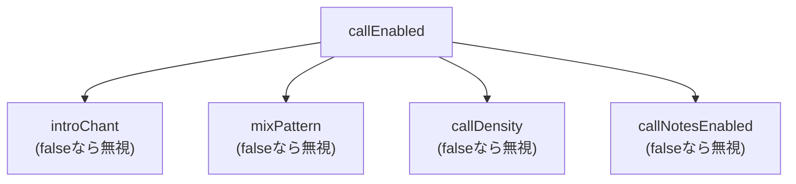

| 親オプション | 子オプション | 説明 |
|--------------|--------------|------|
| `callEnabled=true` | `introChant` | Chantセクションの種類 |
| `callEnabled=true` | `mixPattern` | MIXセクションの種類 |
| `callEnabled=true` | `callDensity` | コーラスでのコール密度 |
| `callEnabled=true` | `callNotesEnabled` | コールをMIDIノートとして出力 |

### 1.2 Arpeggio

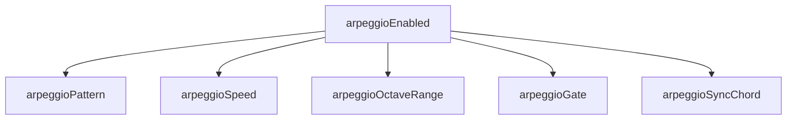

| 親オプション | 子オプション | 説明 |
|--------------|--------------|------|
| `arpeggioEnabled=true` | `arpeggioPattern` | Up/Down/UpDown/Random |
| `arpeggioEnabled=true` | `arpeggioSpeed` | Eighth/Sixteenth/Triplet |
| `arpeggioEnabled=true` | `arpeggioOctaveRange` | 1-3オクターブ |
| `arpeggioEnabled=true` | `arpeggioGate` | ゲート長(0-100) |
| `arpeggioEnabled=true` | `arpeggioSyncChord` | コード変更と同期 |

### 1.3 Humanization

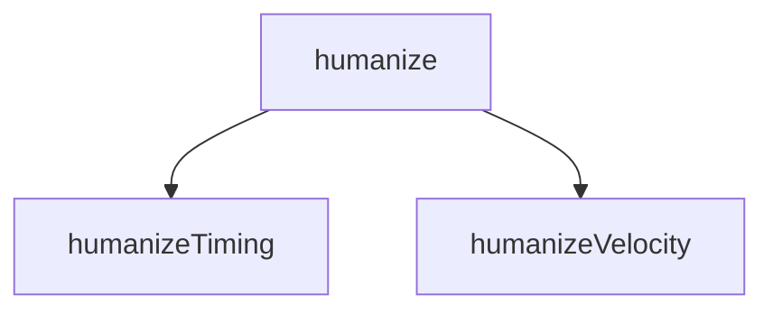

| 親オプション | 子オプション | 説明 |
|--------------|--------------|------|
| `humanize=true` | `humanizeTiming` | タイミング揺れ(0-100) |
| `humanize=true` | `humanizeVelocity` | ベロシティ揺れ(0-100) |

### 1.4 Chord Extensions

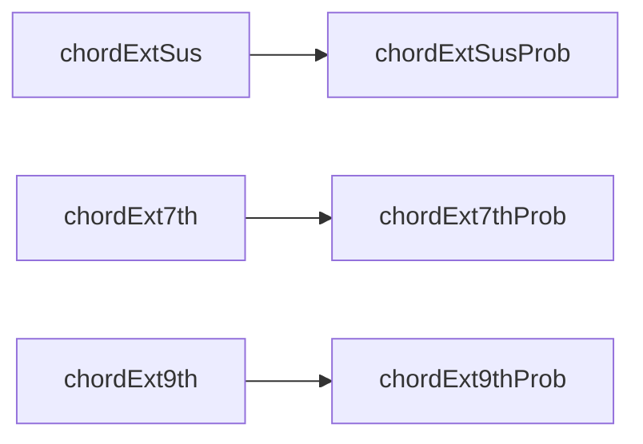

| 親オプション | 子オプション | 説明 |
|--------------|--------------|------|
| `chordExtSus=true` | `chordExtSusProb` | Sus確率(0-100) |
| `chordExt7th=true` | `chordExt7thProb` | 7th確率(0-100) |
| `chordExt9th=true` | `chordExt9thProb` | 9th確率(0-100) |

### 1.5 Modulation

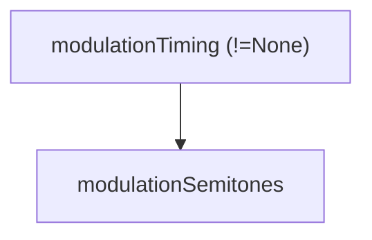

| 親オプション | 子オプション | 説明 |
|--------------|--------------|------|
| `modulationTiming != None` | `modulationSemitones` | 転調量(1-4) |

**注意**: `modulationTiming=None`の場合、`modulationSemitones`はバリデーションされない。

### 1.6 Vocal (skipVocalによる排他)

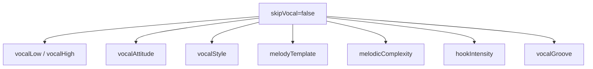

| 条件 | 有効なオプション |
|------|------------------|
| `skipVocal=false` | すべてのvocal関連オプション |
| `skipVocal=true` | vocal関連オプションは全て無視 |

### 1.7 MelodyTemplate選択

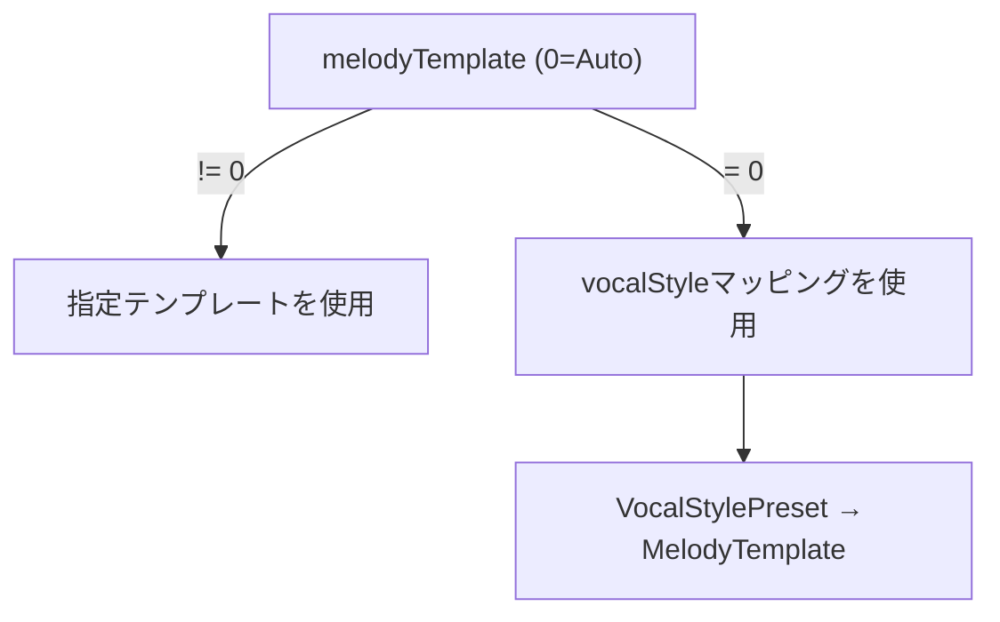

| vocalStyle | デフォルトテンプレート |
|------------|-----------------|
| Standard (1) | PlateauTalk (1) |
| Vocaloid (2) | RunUpTarget (2) |
| Idol (4) | PlateauTalk (1) |
| Ballad (5) | SparseAnchor (5) |
| Rock (6) | RunUpTarget (2) |
| CityPop (7) | PlateauTalk (1) |
| Anime (8) | HookRepeat (4) |

---

## 2. CompositionStyle による分岐

`compositionStyle`の値によって有効なオプションが変わります:

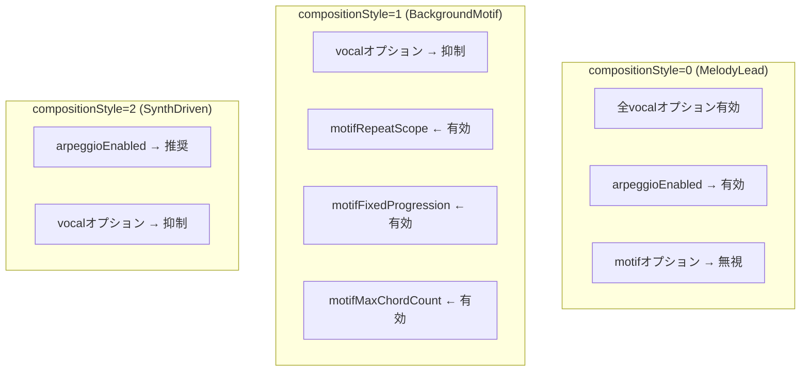

---

## 3. 優先順位 (特殊値によるオーバーライド)

| オプション | 特殊値 | 動作 |
|------------|--------|------|
| `bpm` | `0` | スタイルプリセットのデフォルトBPMを使用 |
| `seed` | `0` | ランダムシードを自動生成 |
| `melodyTemplate` | `0` | VocalStylePresetのデフォルトテンプレートを使用 |
| `targetDurationSeconds` | `0` | `formId`で指定した構造パターンを使用 |

### フローチャート

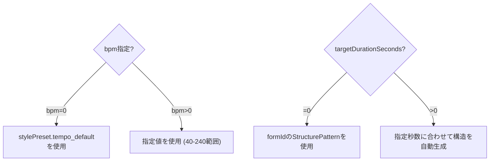

---

## 4. 相互干渉 (バリデーションエラー)

### 4.1 エラーコード一覧

| エラー | 原因 |
|--------|------|
| `INVALID_STYLE` | `stylePresetId >= 17` |
| `INVALID_CHORD` | `chordProgressionId >= 22` |
| `INVALID_FORM` | `formId >= 11` |
| `INVALID_ATTITUDE` | スタイルで許可されていない`vocalAttitude` |
| `INVALID_VOCAL_RANGE` | `vocalLow > vocalHigh` または範囲外(36-96) |
| `INVALID_BPM` | `bpm != 0` かつ `bpm < 40` または `bpm > 240` |
| `INVALID_MODULATION` | `modulationTiming != None` かつ `modulationSemitones` が1-4範囲外 |
| `DURATION_TOO_SHORT` | `callEnabled=true` かつ `targetDurationSeconds` が最小秒数未満 |

### 4.2 スタイル × Attitude の組み合わせ

各スタイルプリセットには`allowedAttitudes`ビットフラグがあり、許可されていないAttitudeを指定するとエラー:

```typescript
// 例: スタイルがCleanとExpressiveのみ許可している場合
allowedAttitudes = ATTITUDE_CLEAN | ATTITUDE_EXPRESSIVE  // 0b011 = 3

vocalAttitude = 2 (Raw) → INVALID_ATTITUDE エラー
```

### 4.3 Call × Duration の干渉

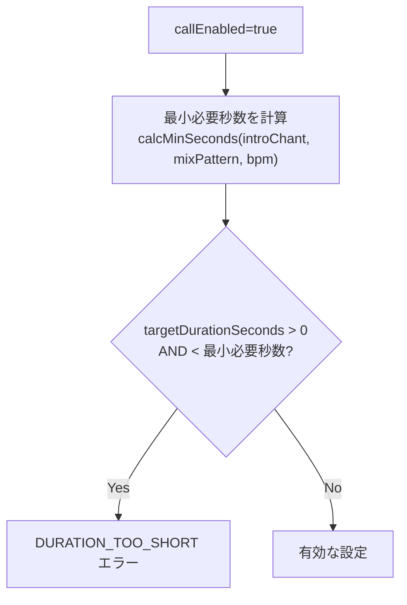

| introChant | mixPattern | BPM=120での最小秒数目安 |
|------------|------------|-------------------------|
| None | None | 制限なし |
| Gachikoi | None | ~24秒 |
| None | Tiger | ~20秒 |
| Gachikoi | Tiger | ~40秒 |

---

## 5. 推奨組み合わせパターン

### 5.1 シンプルなポップ (デフォルト)

```javascript
{
  stylePresetId: 0,
  compositionStyle: 0,  // MelodyLead
  drumsEnabled: true,
  arpeggioEnabled: false,
  callEnabled: false
}
```

### 5.2 ボーカロイド風

```javascript
{
  stylePresetId: 16,  // vocaloid preset
  compositionStyle: 0,
  vocalStyle: 2,      // Vocaloid
  melodyTemplate: 2,  // RunUpTarget (YOASOBI風)
  arpeggioEnabled: true,
  arpeggioSpeed: 1    // Sixteenth
}
```

### 5.3 アイドル曲 (コールあり)

```javascript
{
  stylePresetId: 14,  // idol preset
  callEnabled: true,
  introChant: 1,      // Gachikoi
  mixPattern: 2,      // Tiger
  callDensity: 2,     // Standard
  callNotesEnabled: true,
  targetDurationSeconds: 180  // 3分以上必要
}
```

### 5.4 BGMモード (Motif重視)

```javascript
{
  compositionStyle: 1,  // BackgroundMotif
  skipVocal: true,      // または false で控えめボーカル
  motifFixedProgression: true,
  motifMaxChordCount: 4,
  arpeggioEnabled: true
}
```

---

## 6. JS API オプション対応表

| JS名 | C API名 | 型 | デフォルト |
|------|---------|-----|----------|
| `stylePresetId` | `style_preset_id` | uint8 | 0 |
| `key` | `key` | uint8 | 0 (C) |
| `bpm` | `bpm` | uint16 | 0 |
| `seed` | `seed` | uint32 | 0 |
| `chordProgressionId` | `chord_progression_id` | uint8 | 0 |
| `formId` | `form_id` | uint8 | 0 |
| `vocalAttitude` | `vocal_attitude` | uint8 | 0 |
| `drumsEnabled` | `drums_enabled` | bool | true |
| `arpeggioEnabled` | `arpeggio_enabled` | bool | false |
| `arpeggioPattern` | `arpeggio_pattern` | uint8 | 0 |
| `arpeggioSpeed` | `arpeggio_speed` | uint8 | 1 |
| `arpeggioOctaveRange` | `arpeggio_octave_range` | uint8 | 2 |
| `arpeggioGate` | `arpeggio_gate` | uint8 | 80 |
| `arpeggioSyncChord` | `arpeggio_sync_chord` | bool | true |
| `vocalLow` | `vocal_low` | uint8 | 55 |
| `vocalHigh` | `vocal_high` | uint8 | 74 |
| `skipVocal` | `skip_vocal` | bool | false |
| `humanize` | `humanize` | bool | false |
| `humanizeTiming` | `humanize_timing` | uint8 | 50 |
| `humanizeVelocity` | `humanize_velocity` | uint8 | 50 |
| `chordExtSus` | `chord_ext_sus` | bool | false |
| `chordExt7th` | `chord_ext_7th` | bool | false |
| `chordExt9th` | `chord_ext_9th` | bool | false |
| `chordExtSusProb` | `chord_ext_sus_prob` | uint8 | 20 |
| `chordExt7thProb` | `chord_ext_7th_prob` | uint8 | 30 |
| `chordExt9thProb` | `chord_ext_9th_prob` | uint8 | 25 |
| `compositionStyle` | `composition_style` | uint8 | 0 |
| `targetDurationSeconds` | `target_duration_seconds` | uint16 | 0 |
| `modulationTiming` | `modulation_timing` | uint8 | 0 |
| `modulationSemitones` | `modulation_semitones` | int8 | 2 |
| `seEnabled` | `se_enabled` | bool | true |
| `callEnabled` | `call_enabled` | bool | false |
| `callNotesEnabled` | `call_notes_enabled` | bool | true |
| `introChant` | `intro_chant` | uint8 | 0 |
| `mixPattern` | `mix_pattern` | uint8 | 0 |
| `callDensity` | `call_density` | uint8 | 2 |
| `vocalStyle` | `vocal_style` | uint8 | 0 |
| `melodyTemplate` | `melody_template` | uint8 | 0 |
| `arrangementGrowth` | `arrangement_growth` | uint8 | 0 |
| `motifRepeatScope` | `motif_repeat_scope` | uint8 | 0 |
| `motifFixedProgression` | `motif_fixed_progression` | bool | true |
| `motifMaxChordCount` | `motif_max_chord_count` | uint8 | 4 |
| `melodicComplexity` | `melodic_complexity` | uint8 | 1 |
| `hookIntensity` | `hook_intensity` | uint8 | 2 |
| `vocalGroove` | `vocal_groove` | uint8 | 0 |

---

## 7. 図解: オプション依存関係ツリー

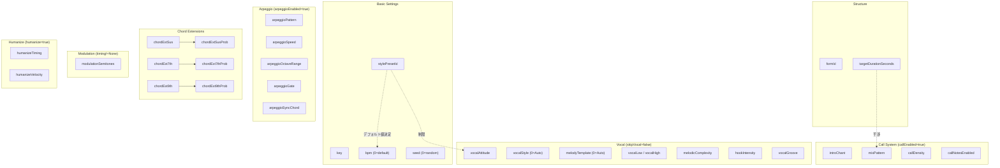

---

## 8. 暗黙的な内部設定 (Auto-Settings)

特定のパラメータを設定すると、内部で他のパラメータが自動的に設定/変更される関係です。

### 8.1 VocalStylePreset → MelodyTemplate

`vocalStyle`を設定すると、`MelodyTemplate`が自動選択されます：

| vocalStyle | MelodyTemplate | 主な特性 |
|------------|----------------|----------|
| `Auto (0)` | セクション依存 | Verse=PlateauTalk、Chorus=RunUpTarget |
| `Standard (1)` | PlateauTalk (1) | plateau_ratio=0.40、バランス型 |
| `Vocaloid (2)` | RunUpTarget (2) | 高密度、広い跳躍 |
| `UltraVocaloid (3)` | RunUpTarget (2) | 超高密度（32分音符） |
| `Idol (4)` | PlateauTalk (1) | 高16分率、フック |
| `Ballad (5)` | SparseAnchor (5) | ロングノート、スパース |
| `Rock (6)` | RunUpTarget (2) | 音域シフト |
| `CityPop (7)` | PlateauTalk (1) | グルービー、シンコペ |
| `Anime (8)` | HookRepeat (4) | フック重視 |
| `BrightKira (9)` | HookRepeat (4) | 高音域 |
| `CoolSynth (10)` | PlateauTalk (1) | エレクトロニック |
| `CuteAffected (11)` | HookRepeat (4) | プレイフル |
| `PowerfulShout (12)` | RunUpTarget (2) | 激しい |

**重要**: `melodyTemplate`を非0の値で明示的に設定すると、VocalStylePresetのデフォルトを上書きします。

### 8.2 MelodicComplexity → 複数パラメータ

| melodicComplexity | 自動設定 |
|-------------------|----------|
| `Simple (0)` | `note_density *= 0.7`, `max_leap_interval ≤ 5`, `hook_repetition=true`, `tension_usage *= 0.5`, `sixteenth_note_ratio *= 0.5`, `syncopation_prob *= 0.5` |
| `Standard (1)` | 変更なし（デフォルト） |
| `Complex (2)` | `note_density *= 1.3`, `max_leap_interval *= 1.5` (max 12), `tension_usage *= 1.5`, `sixteenth_note_ratio *= 1.5` (max 0.5), `syncopation_prob *= 1.5` (max 0.5) |

### 8.3 CompositionStyle → 暗黙的動作

| compositionStyle | 暗黙的に発生する動作 |
|------------------|---------------------|
| `BackgroundMotif (1)` | **modulation自動無効化**, vocal音量抑制 (velocity_scale適用), シンプルな音程制限 |
| `SynthDriven (2)` | **modulation自動無効化**, **arpeggio自動有効化** (arpeggioEnabled=falseでも有効), vocal音量抑制 (velocity_scale=0.75) |

```javascript
// 例: arpeggioEnabledを設定していなくてもアルペジオが生成される
{
  compositionStyle: 2,  // SynthDriven
  arpeggioEnabled: false  // ← 無視される！アルペジオは自動で有効
}
```

### 8.4 VocalGrooveFeel → 内部リズムパラメータ

| vocalGroove | 自動設定 |
|-------------|----------|
| `Straight (0)` | 変更なし |
| `Swing (1)` | `swing_amount=0.25`, `syncopation_boost=0.1` |
| `HipHop (2)` | `offbeat_preference=0.4`, `syncopation_boost=0.2` |
| `Latin (3)` | `syncopation_boost=0.4`, `offbeat_preference=0.3` |
| `RnB (4)` | `swing_amount=0.15`, `syncopation_boost=0.15` |

### 8.5 BPM ≥ 140 → Vocal密度ブースト

BPMが140以上の場合、自動的にボーカル密度が上昇します:

```
if (bpm >= 140) {
  note_density *= 1.1  // 10%増加
  sixteenth_note_ratio += 0.1  // 16分音符比率増加
}
```

### 8.6 drumsEnabled=false → Bass Rhythmic Drive

ドラムが無効の場合、ベースが自動的にリズム担当に切り替わります:

| drumsEnabled | セクション | Bass動作 |
|--------------|-----------|----------|
| `false` | Intro/Interlude/Outro | `RootFifth`パターン |
| `false` | A/B/Chorus/Bridge | `RhythmicDrive`パターン (強調8分音符) |

### 8.7 vocalNoteDensity=0 → Mood密度適用

`vocalNoteDensity`が0（デフォルト）の場合、`stylePresetId`から派生するMood値に基づいて密度が自動計算されます:

```
if (vocal_note_density == 0) {
  note_density = preset.melody.note_density * (mood_density + 0.5)
}
```

### 8.8 hookIntensity → フレーズ生成変更

| hookIntensity | 効果 |
|---------------|------|
| `Low (0)` | フックなし、変化重視 |
| `Medium (1)` | 適度なフック（デフォルト） |
| `High (2)` | 強いフック反復、キャッチーなメロディ |

---

## 9. 内部パラメータ影響図

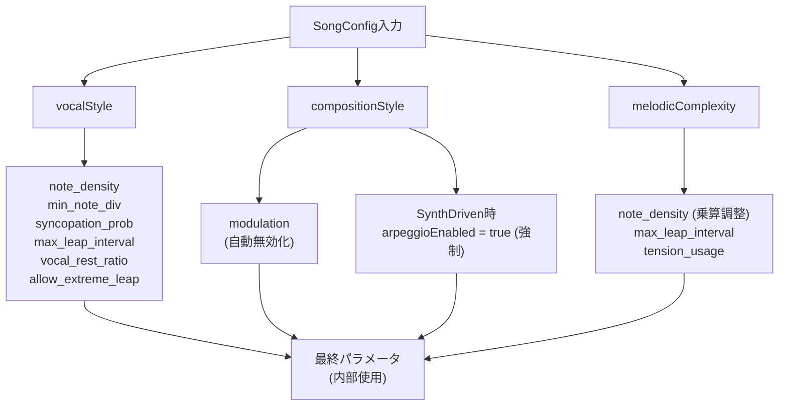
