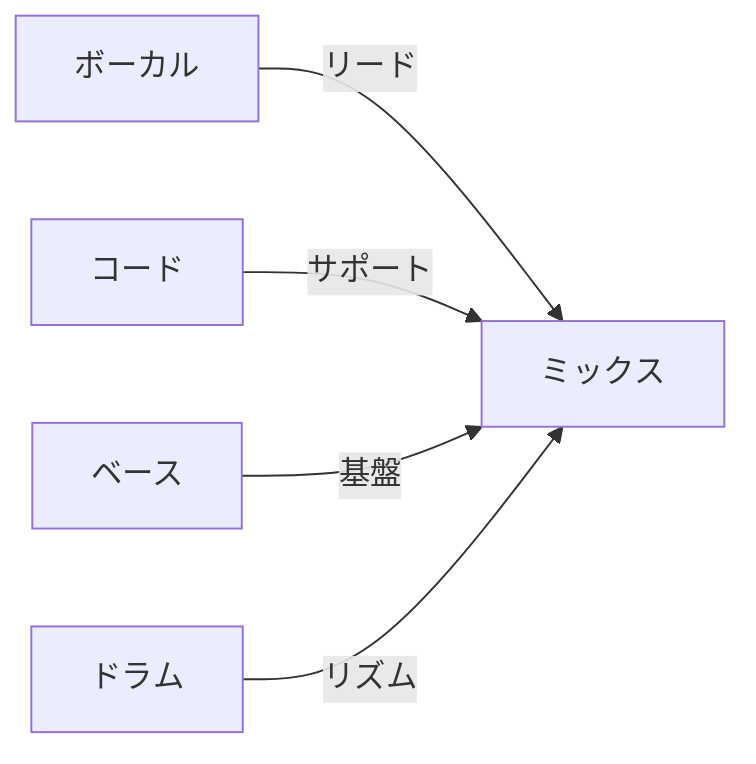
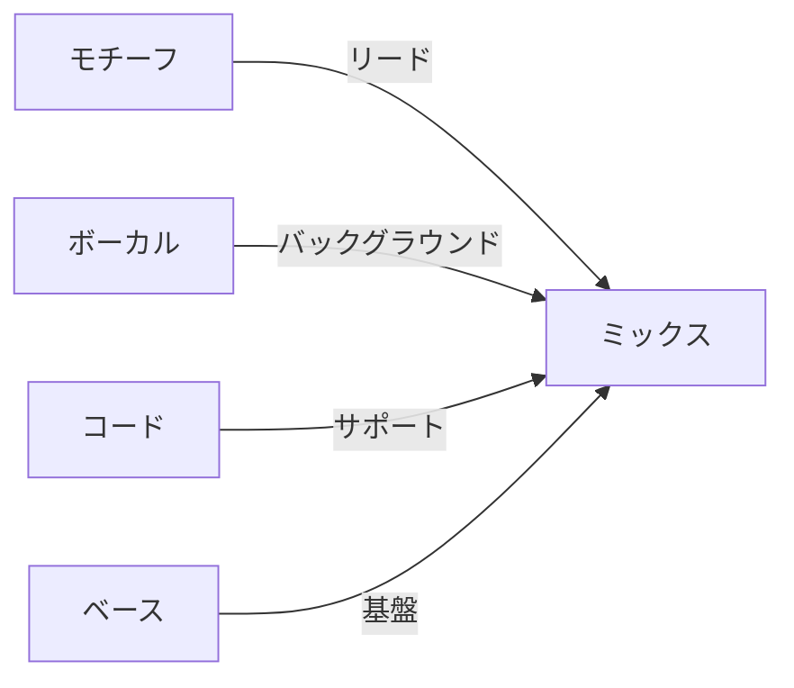
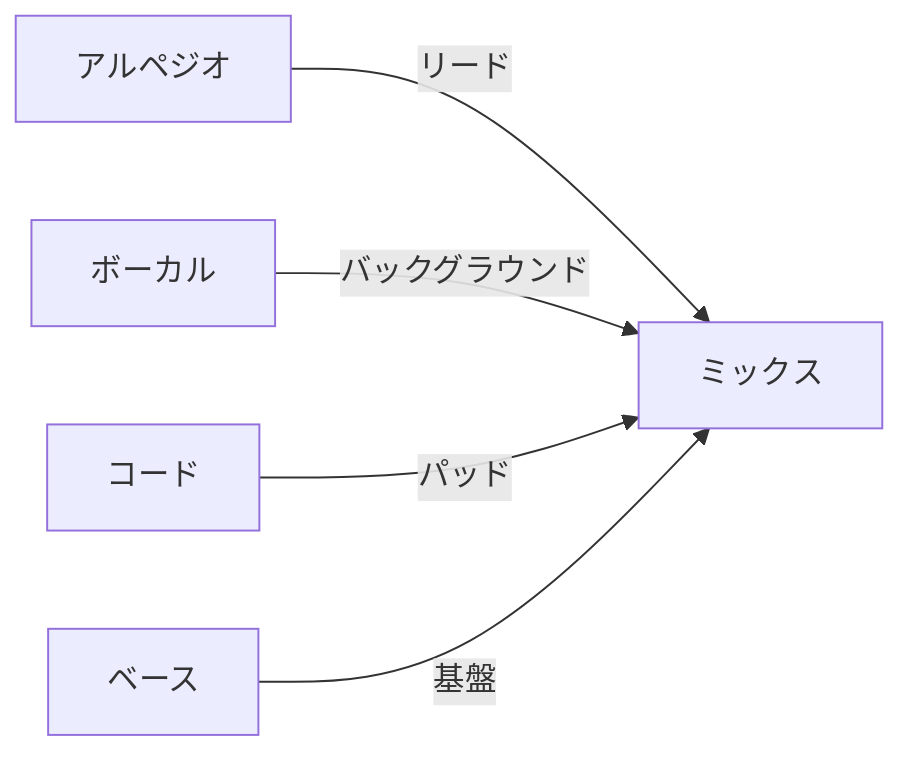

# プリセットリファレンス

[MIDI Sketch](https://github.com/libraz/midi-sketch)で利用可能な全プリセットを紹介します。

## 構造パターン

11の楽曲構造パターン：

| ID | 名前 | 小節 | 再生時間 @120 BPM | セクション |
|----|------|------|-------------------|------------|
| 0 | StandardPop | 24 | 2:00 | A(8)-B(8)-Chorus(8) |
| 1 | BuildUp | 28 | 2:20 | Intro(4)-A(8)-B(8)-Chorus(8) |
| 2 | DirectChorus | 16 | 1:20 | A(8)-Chorus(8) |
| 3 | RepeatChorus | 32 | 2:40 | A(8)-B(8)-Chorus(8)-Chorus(8) |
| 4 | ShortForm | 12 | 1:00 | Intro(4)-Chorus(8) |
| 5 | FullPop | 56 | 4:40 | Intro-A-B-Chorus-A-B-Chorus-Outro |
| 6 | FullWithBridge | 52 | 4:20 | Intro-A-B-Chorus-Bridge-Chorus-Outro |
| 7 | DriveUpbeat | 52 | 4:20 | Intro-Chorus-A-B-Chorus-Chorus-Outro |
| 8 | Ballad | 56 | 4:40 | Intro(8)-A-B-Chorus-Interlude-B-Chorus-Outro |
| 9 | AnthemStyle | 52 | 4:20 | Intro-A-Chorus-A-B-Chorus-Chorus-Outro |
| 10 | ExtendedFull | 90 | 7:30 | 拡張セクション付きフル形式 |

### セクションタイプ


| タイプ | ボーカル密度 | エネルギー | 目的 |
|--------|-------------|----------|------|
| Intro | None/Sparse | 低 | ムード確立 |
| A | Full | 中低 | バース、物語 |
| B | Full | 中 | プリコーラス、テンション |
| Chorus | Full | 高 | フック、クライマックス |
| Bridge | Sparse | 中 | コントラスト |
| Interlude | None | 中低 | インスト休憩 |
| Outro | Sparse | 中低 | 解決 |

## ムードプリセット

20のムードプリセットが全体の雰囲気を定義：

| ID | 名前 | BPM | ドラムスタイル | 特徴 |
|----|------|-----|---------------|------|
| 0 | StraightPop | 120 | Standard | クラシックポップグルーヴ |
| 1 | BrightUpbeat | 128 | Upbeat | シンコペーション、エネルギッシュ |
| 2 | EnergeticDance | 130 | FourOnFloor | ダンス向け |
| 3 | LightRock | 125 | Rock | ギター志向 |
| 4 | MidPop | 115 | Standard | バランスの取れたミッドテンポ |
| 5 | EmotionalPop | 110 | Standard | センチメンタル、ソフト |
| 6 | Sentimental | 95 | Sparse | バラード風 |
| 7 | Chill | 100 | Sparse | リラックス、ミニマル |
| 8 | Ballad | 80 | Sparse | スロー、スパースドラム |
| 9 | DarkPop | 118 | Synth | ダーク、ドラマチック |
| 10 | Dramatic | 115 | Standard | 高表現 |
| 11 | Nostalgic | 105 | Standard | レトロ感 |
| 12 | ModernPop | 125 | Synth | コンテンポラリー |
| 13 | ElectroPop | 135 | FourOnFloor | エレクトロニック、ダンス |
| 14 | IdolPop | 138 | FourOnFloor | J-popアイドルスタイル |
| 15 | Anthem | 120 | Standard | 勝利感、壮大 |
| 16 | Yoasobi | 148 | Synth | アニメスタイル、ハイエナジー |
| 17 | Synthwave | 118 | Synth | レトロシンセ、ネオン |
| 18 | FutureBass | 145 | Synth | モダンエレクトロニック |
| 19 | CityPop | 110 | Standard | 80年代シティポップ |

### ムードカテゴリ

```mermaid
flowchart TD
    subgraph Slow [スロー (80-100 BPM)]
        S1[Ballad]
        S2[Sentimental]
        S3[Chill]
    end

    subgraph Mid [ミッド (100-125 BPM)]
        M1[StraightPop]
        M2[MidPop]
        M3[CityPop]
        M4[Synthwave]
    end

    subgraph Fast [ファスト (125-150 BPM)]
        F1[BrightUpbeat]
        F2[ElectroPop]
        F3[IdolPop]
        F4[Yoasobi]
        F5[FutureBass]
    end
```

## コード進行

シンプルから複雑まで22のコード進行：

### ベーシック（2-3コード）

| ID | 名前 | ディグリー | 用途 |
|----|------|------------|------|
| 5 | Minimal | I-IV | シンプル、フォーク |
| 6 | AltMinimal | I-V | パワーポップ |
| 7 | Progression3 | I-vi-IV | 3コードポップ |

### スタンダード（4コード）

| ID | 名前 | ディグリー | 用途 |
|----|------|------------|------|
| 0 | Pop4 | I-V-vi-IV | 万能ポップ |
| 1 | Axis | vi-IV-I-V | メランコリック |
| 2 | Komuro | vi-IV-V-I | ブライトJ-pop |
| 4 | Emotional4 | vi-V-IV-V | テンションビルド |
| 8 | Rock4 | I-bVII-IV-I | ロック感 |

### 拡張（5コード以上）

| ID | 名前 | ディグリー | 用途 |
|----|------|------------|------|
| 3 | Canon | I-V-vi-iii-IV | クラシック |
| 9 | Extended5 | I-V-vi-iii-IV | フル進行 |
| 10 | Emotional5 | vi-IV-I-V-ii | 複雑エモーショナル |

## スタイルプリセット

ムードとコンポジションアプローチを組み合わせた13のスタイルプリセット：

| ID | 名前 | スタイル | ベースムード | 特徴 |
|----|------|----------|-------------|------|
| 0 | MinimalGroovePop | MelodyLead | MidPop | クリーン、シンプル |
| 1 | DancePopStandard | MelodyLead | EnergeticDance | ダンスフロア |
| 2 | IdolStandard | MelodyLead | IdolPop | J-popアイドル |
| 3 | RockStandard | MelodyLead | LightRock | ロックバンド |
| 4 | BalladStandard | MelodyLead | Ballad | スローバラード |
| 5 | YoasobiStyle | SynthDriven | Yoasobi | アニメスタイル |
| 6 | SynthwaveStyle | SynthDriven | Synthwave | レトロシンセ |
| 7 | FutureBassStyle | SynthDriven | FutureBass | モダンEDM |
| 8 | CityPopStyle | MelodyLead | CityPop | 80年代 |
| 9 | MotifDriven | BackgroundMotif | MidPop | パターンベース |
| 10 | ChillMotif | BackgroundMotif | Chill | リラックスパターン |
| 11 | ElectroMotif | BackgroundMotif | ElectroPop | エレクトロパターン |
| 12 | AnthemStyle | MelodyLead | Anthem | 勝利感 |

## コンポジションスタイル

3つのコンポジションアプローチ：

| スタイル | フォーカス | ボーカルの役割 | 主な特徴 |
|----------|-----------|---------------|----------|
| MelodyLead | ボーカルメロディ | プライマリ | フルメロディ表現 |
| BackgroundMotif | 繰り返しパターン | セカンダリ | モチーフがメイン要素 |
| SynthDriven | シンセ/アルペジオ | セカンダリ | エレクトロニック、アルペジオ |

### MelodyLead



### BackgroundMotif



### SynthDriven



## ボーカルアティチュード

3つのメロディ表現レベル：

| アティチュード | 特徴 | 最適な用途 |
|----------------|------|-----------|
| Clean | コードトーンのみ、オンビート | ポップ、バラード |
| Expressive | テンション、タイミング変動 | エモーショナル、ダイナミック |
| Raw | 非コードトーン、境界破壊 | エッジー、モダン |

## キーオプション

12のキー（0-11）：

| ID | キー | 備考 |
|----|------|------|
| 0 | C | ナチュラル、#♭なし |
| 1 | C# / Db | 5# / 7♭ |
| 2 | D | 2# |
| 3 | D# / Eb | 3♭ |
| 4 | E | 4# |
| 5 | F | 1♭ |
| 6 | F# / Gb | 6# / 6♭ |
| 7 | G | 1# |
| 8 | G# / Ab | 4♭ |
| 9 | A | 3# |
| 10 | A# / Bb | 2♭ |
| 11 | B | 5# |

## BPMレンジ

有効テンポ範囲: 60-180 BPM

- 0に設定するとムードのデフォルトBPMを使用
- 各ムードには最適なBPM設定あり

## 設定例

### シンプルなポップソング

```javascript
{
    structureId: 0,      // StandardPop
    moodId: 0,           // StraightPop
    chordId: 0,          // Pop4 (I-V-vi-IV)
    key: 0,              // Cメジャー
    bpm: 0,              // デフォルト使用 (120)
    drumsEnabled: true
}
```

### エモーショナルバラード

```javascript
{
    structureId: 8,      // Ballad
    moodId: 8,           // Ballad
    chordId: 4,          // Emotional4
    key: 7,              // Gメジャー
    bpm: 75,             // より遅く
    drumsEnabled: true
}
```

### YOASOBIスタイル

```javascript
{
    stylePresetId: 5,    // YoasobiStyle
    key: 2,              // Dメジャー
    bpm: 0,              // デフォルト使用 (148)
    chordId: 2,          // Komuro
    drumsEnabled: true,
    arpeggioEnabled: true
}
```

### チルバックグラウンド

```javascript
{
    structureId: 4,      // ShortForm
    moodId: 7,           // Chill
    chordId: 5,          // Minimal
    key: 5,              // Fメジャー
    bpm: 95,
    drumsEnabled: false  // アンビエント用ドラムなし
}
```
