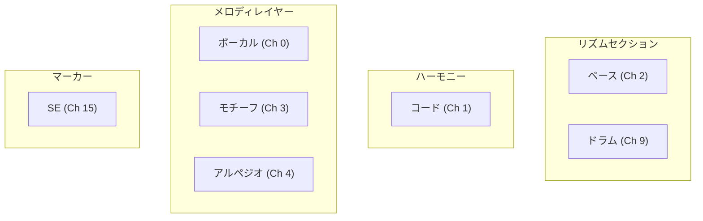
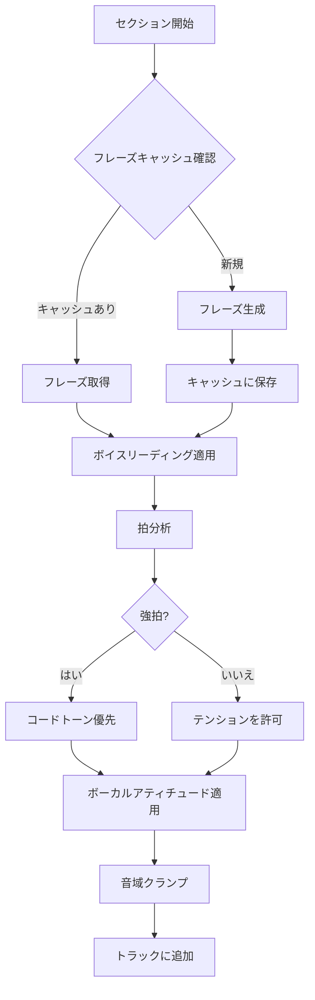
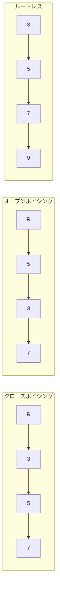
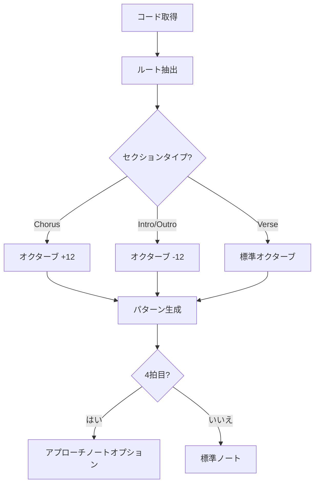
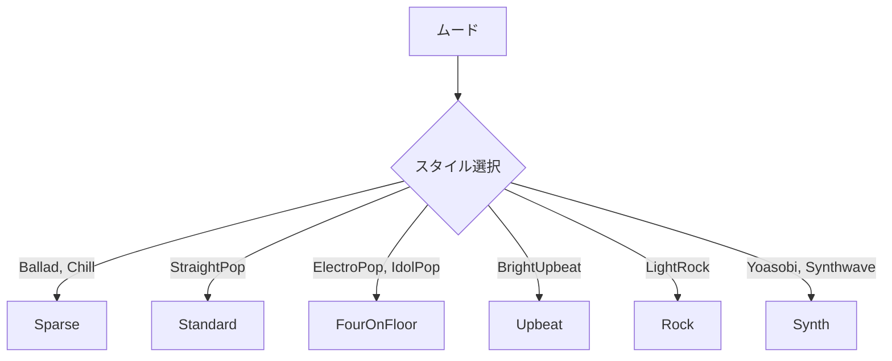
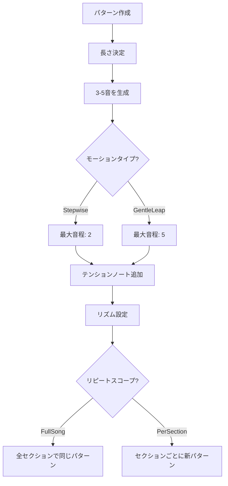
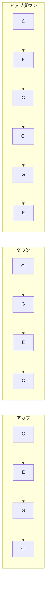

# トラック生成

[MIDI Sketch](https://github.com/libraz/midi-sketch)の各トラック生成器を詳しく解説します。

## トラック概要



## ボーカルトラック

**ソース:** `src/track/vocal.cpp`（約900行）

音楽理論的制約を持つメロディ生成を担当する最も複雑な生成器。

### 生成フロー



### ピッチ選択アルゴリズム

```cpp
// 強拍（1、3拍目）の優先順位
1. ルート音（最高優先度）
2. 5度
3. 3度
4. 7度（コードに含まれる場合）
5. 9度（コードに含まれる場合）

// 弱拍では許可
- パッシングトーン（順次進行）
- ネイバートーン（元の音に戻る）
- サスペンション（2度下降で解決）
- アンティシペーション（早めの到着）
```

### ボーカルアティチュード

| アティチュード | 説明 | 実装 |
|----------------|------|------|
| **Clean** | 保守的、歌いやすい | コードトーンのみ、オンビート |
| **Expressive** | 感情的、ダイナミック | テンション許可、タイミング変動 |
| **Raw** | エッジー、型破り | 非コードトーン、境界破壊 |

### フレーズキャッシュ

音楽的な一貫性のためセクションタイプ別にフレーズをキャッシュ：

```cpp
std::map<SectionType, std::vector<Phrase>> phraseCache_;

// Aセクションは繰り返し時に同じ/類似フレーズを使用
// サビはメロディのアイデンティティを維持
```

### 音域制約

```cpp
struct VocalRange {
    uint8_t low = 60;   // C4
    uint8_t high = 79;  // G5
};
```

---

## コードトラック

**ソース:** `src/track/chord_track.cpp`（約820行）

ボイスリーディング最適化を伴う和声ボイシングを生成。

### ボイシングタイプ



### ボイスリーディングアルゴリズム

```cpp
int voiceLeadingDistance(Voicing& prev, Voicing& next) {
    int distance = 0;
    for (int i = 0; i < 4; i++) {
        distance += abs(prev.notes[i] - next.notes[i]);
    }
    return distance;
}

// 距離を最小化するボイシングを選択
Voicing selectBestVoicing(Voicing& prev, vector<Voicing>& candidates) {
    return min_element(candidates, [&](auto& a, auto& b) {
        return voiceLeadingDistance(prev, a) < voiceLeadingDistance(prev, b);
    });
}
```

### ベースとの協調

`BassAnalysis`を使用して音の重複を回避：

```cpp
if (bassAnalysis.hasRootOnBeat1) {
    // ルートレスボイシングを使用 - ベースがルートを担当
    voicing = generateRootlessVoicing(chord);
} else {
    // コードボイシングにルートを含める
    voicing = generateFullVoicing(chord);
}
```

### 音域制約

```cpp
constexpr uint8_t CHORD_LOW = 48;   // C3
constexpr uint8_t CHORD_HIGH = 84;  // C6
```

---

## ベーストラック

**ソース:** `src/track/bass.cpp`（約450行）

ルート重視のパターンで和声的基盤を生成。

### パターンタイプ

| パターン | 説明 | リズム |
|----------|------|--------|
| Sparse | ミニマル、バラードスタイル | 1拍目のみ |
| Standard | ポップ/ロックベースライン | 1、3拍目にフィル |
| Driving | エネルギッシュ、前進的 | 全体で8分音符 |

### 生成ロジック



### アプローチノート

4拍目は次のルートへの半音アプローチを使用可能：

```cpp
// 次のコードルートがCの場合
// 4拍目はB（半音下）またはDb（半音上）
uint8_t approachNote = nextRoot - 1; // 半音アプローチ
```

---

## ドラムトラック

**ソース:** `src/track/drums.cpp`（約680行）

フィルとダイナミクスを含むドラムパターンを生成。

### GMドラムマップ

```cpp
constexpr uint8_t KICK = 36;
constexpr uint8_t SNARE = 38;
constexpr uint8_t SIDE_STICK = 37;
constexpr uint8_t CLOSED_HH = 42;
constexpr uint8_t OPEN_HH = 46;
constexpr uint8_t RIDE = 51;
constexpr uint8_t CRASH = 49;
constexpr uint8_t TOM_HIGH = 50;
constexpr uint8_t TOM_MID = 47;
constexpr uint8_t TOM_LOW = 45;
```

### パターンスタイル



### フィルタイプ

```cpp
enum class FillType {
    TomDescend,    // ハイ → ミッド → ロータム
    TomAscend,     // ロー → ミッド → ハイタム
    SnareRoll,     // 連続スネアヒット
    Combo          // 混合要素
};
```

フィルの挿入位置：

- セクション遷移
- 4または8小節ごと
- サビ前

### ゴーストノート

グルーブのためのベロシティ軽減スネアアーティキュレーション：

```cpp
// メインスネア: ベロシティ 100
// ゴーストノート: ベロシティ 40-60
```

---

## モチーフトラック

**ソース:** `src/track/motif.cpp`（約470行）

`BackgroundMotif`コンポジションスタイル用。繰り返しパターンを生成。

### パラメータ

```cpp
struct MotifParams {
    MotifLength length;           // TwoBars, FourBars
    RhythmDensity rhythm_density; // Sparse, Medium, Driving
    MotifMotion motion;           // Stepwise, GentleLeap
    RepeatScope repeat_scope;     // FullSong, PerSection
    MotifRegister register_;      // Mid, High
};
```

### パターン生成



### 音域レンジ

| レジスター | 範囲 |
|------------|------|
| Mid | C3 (48) - C5 (72) |
| High | C4 (60) - C6 (84) |

---

## アルペジオトラック

**ソース:** `src/track/arpeggio.cpp`（約200行）

`SynthDriven`コンポジションスタイル用。アルペジオパターンを生成。

### パラメータ

```cpp
struct ArpeggioParams {
    ArpeggioPattern pattern;  // Up, Down, UpDown, Random
    ArpeggioSpeed speed;      // Eighth, Sixteenth, Triplet
    uint8_t octave_range;     // 1-3オクターブ
    float gate;               // ノート長比率 (0.0-1.0)
    bool sync_chord;          // コードチェンジに追従
};
```

### パターンタイプ



### スピード変換

```cpp
Tick getNoteDuration(ArpeggioSpeed speed) {
    switch (speed) {
        case Eighth:    return TICKS_PER_BEAT / 2;    // 240
        case Sixteenth: return TICKS_PER_BEAT / 4;    // 120
        case Triplet:   return TICKS_PER_BEAT / 3;    // 160
    }
}
```

---

## SEトラック

**ソース:** `src/track/se.cpp`（約15行）

セクションマーカー用の最小トラック（テキストイベントのみ）。

```cpp
void generateSE(Song& song) {
    for (auto& section : song.arrangement.sections) {
        MidiEvent marker;
        marker.tick = section.start_tick;
        marker.type = MidiEventType::Text;
        marker.text = section.name;
        song.se.addEvent(marker);
    }
}
```

---

## ベロシティ計算

全トラック共通のベロシティ計算式：

```cpp
uint8_t calculateVelocity(
    uint8_t baseVelocity,
    int beat,
    SectionType section,
    float trackBalance
) {
    float beatAdjust = getBeatAccent(beat);      // 強拍: +10
    float sectionMult = getSectionEnergy(section); // Chorus: 1.2

    return clamp(
        baseVelocity * beatAdjust * sectionMult * trackBalance,
        1, 127
    );
}
```

### トラックバランス

| トラック | バランス | 備考 |
|----------|----------|------|
| Vocal | 1.00 | リード楽器 |
| Chord | 0.75 | サポート |
| Bass | 0.85 | 基盤 |
| Drums | 0.90 | タイミングドライバー |
| Motif | 0.70 | バックグラウンド |
| Arpeggio | 0.85 | 中レベル |
