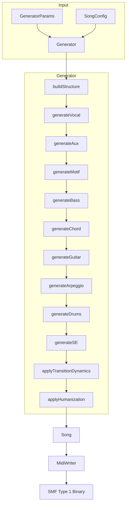
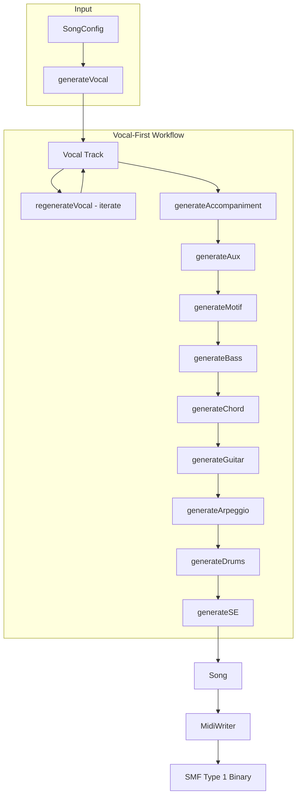

# Architecture Overview

This document explains the internal architecture of [MIDI Sketch](https://github.com/libraz/midi-sketch).

## Project Structure

```
midi-sketch/
├── src/
│   ├── core/              # Core engine (~16000 lines, 46 headers)
│   │   ├── generator.h/cpp        # Central orchestrator
│   │   ├── harmony_context.h      # Inter-track collision detection facade
│   │   ├── chord_progression_tracker.h/cpp
│   │   ├── track_collision_detector.h/cpp
│   │   ├── safe_pitch_resolver.h/cpp
│   │   ├── melody_evaluator.h/cpp # Candidate scoring system
│   │   ├── melody_templates.h/cpp # 7 melody template definitions
│   │   ├── melody_embellishment.h/cpp # NCT insertion system
│   │   ├── pitch_utils.h/cpp      # Pitch operations
│   │   ├── chord_utils.h/cpp      # Chord operations
│   │   ├── piano_roll_safety.h/cpp
│   │   ├── modulation_calculator.h/cpp
│   │   ├── preset_data.h/cpp      # Style presets
│   │   └── ...                    # Types, utilities, etc.
│   ├── track/             # Track generators (~13000 lines, 14 headers)
│   │   ├── melody_designer.h/cpp  # Template-driven melody
│   │   ├── vocal.h/cpp            # Vocal coordination
│   │   ├── aux_track.h/cpp        # Aux sub-melody
│   │   ├── chord_track.h/cpp      # Chord voicing
│   │   ├── bass.h/cpp             # Bass patterns
│   │   ├── drums.h/cpp            # Drum patterns
│   │   ├── motif.h/cpp            # Background motif
│   │   ├── guitar.h/cpp           # Accompaniment guitar
│   │   ├── arpeggio.h/cpp         # Arpeggio patterns
│   │   └── se.h/cpp               # Section markers
│   ├── midi/              # MIDI output (8 headers)
│   ├── analysis/          # Dissonance analysis
│   ├── midisketch.h       # Public C++ API
│   └── midisketch_c.h     # C API (WASM interface)
├── tests/                 # Google Test suite (127 test files)
├── dist/                  # WASM distribution
└── demo/                  # Browser demo
```

## Core Components

### MidiSketch Class

The main entry point providing a high-level API:

::: tip Two Generation Workflows
- **Vocal-First**: Use `generateVocal()` → iterate with `regenerateVocal()` → finalize with `generateAccompaniment()`
- **Standard**: Use `generate()` or `generateFromConfig()` for one-shot generation

Configurations can be constructed using the **SongConfigBuilder**, a fluent API with cascade change detection that automatically recalculates dependent parameters when upstream values change.
:::

```cpp
class MidiSketch {
  void generate(const GeneratorParams& params);
  void generateFromConfig(const SongConfig& config);
  void generateWithVocal(const SongConfig& config);   // Vocal-priority full generation
  void generateVocal(const SongConfig& config);
  void regenerateVocal(const VocalConfig& config);
  void generateAccompaniment(const AccompanimentConfig& config);
  void regenerateAccompaniment(uint32_t seed);
  void setVocalNotes(const SongConfig& config, const NoteInput* notes, size_t count);

  std::vector<uint8_t> getMidi() const;
  std::string getEventsJson() const;
  std::string getChordTimeline() const;               // Chord progression timeline
  const Song& getSong() const;
};
```

### Generator

The central orchestrator (`src/core/generator.h`) that coordinates all track generation:

```cpp
class Generator {
  Song generate(const GeneratorParams& params);
private:
  void buildStructure();
  void generateVocal();
  void generateAux();
  void generateMotif();
  void generateBass();
  void generateChord();
  void generateGuitar();      // Accompaniment guitar generation
  void generateArpeggio();
  void generateDrums();
  void generateSE();          // Section markers / sound effects
  void applyTransitionDynamics();
  void applyHumanization();
};
```

### Song Container

Holds all generated data (9 tracks):

```cpp
struct Song {
  Arrangement arrangement;     // Section layout
  MidiTrack vocal;            // Channel 0 - Main melody
  MidiTrack chord;            // Channel 1 - Harmony
  MidiTrack bass;             // Channel 2 - Foundation
  MidiTrack motif;            // Channel 3 - BackgroundMotif style
  MidiTrack arpeggio;         // Channel 4 - SynthDriven style
  MidiTrack aux;              // Channel 5 - Sub-melody
  MidiTrack guitar;           // Channel 6 - Accompaniment guitar
  MidiTrack drums;            // Channel 9 - Rhythm
  MidiTrack se;               // Channel 15 (markers)
};
```

::: info Dedicated Channels
Every track has its own MIDI channel (`src/midi/track_config.h`). Aux (Ch 5) and Arpeggio (Ch 4) are separate channels, so both can appear in the same song depending on the composition style and settings.
:::

## Data Flow

### Standard Generation (Traditional paradigm)



::: details Generation Order by Paradigm
The track generation order varies depending on the Blueprint paradigm:
- **Traditional / MelodyDriven**: Vocal -> Aux -> Motif -> Bass -> Chord -> Guitar -> Arpeggio -> Drums -> SE
- **RhythmSync**: Motif -> Vocal -> Aux -> Bass -> Chord -> Guitar -> Arpeggio -> Drums -> SE
:::

### Vocal-First Generation



## Time Representation

MIDI Sketch uses tick-based timing throughout:

```cpp
using Tick = uint32_t;
constexpr Tick TICKS_PER_BEAT = 480;    // Standard MIDI resolution
constexpr Tick TICKS_PER_BAR = 1920;    // 4/4 time signature
constexpr uint8_t BEATS_PER_BAR = 4;
```

::: tip Tick Calculation
- Quarter note = 480 ticks
- Eighth note = 240 ticks
- Sixteenth note = 120 ticks
- One bar (4/4) = 1920 ticks
:::

## Note Representation

Two-layer note representation:

```cpp
// Intermediate musical representation (internal)
struct NoteEvent {
  Tick startTick;      // Absolute start time
  Tick duration;       // Duration in ticks
  uint8_t note;        // MIDI note (0-127)
  uint8_t velocity;    // MIDI velocity (0-127)
};

// Low-level MIDI bytes (output only)
struct MidiEvent {
  Tick tick;           // Absolute time
  uint8_t status;      // MIDI status byte
  uint8_t data1;       // First data byte
  uint8_t data2;       // Second data byte
};
```

## Section Definition

Songs are divided into sections:

```cpp
struct Section {
  SectionType type;              // Intro, A, B, Chorus, Bridge, Interlude, Outro
  std::string name;              // Display name
  uint8_t bars;                  // Bar count
  Tick startBar;                 // Start position (bars)
  Tick start_tick;               // Start position (ticks)
  VocalDensity vocal_density;    // Full, Sparse, None
  BackingDensity backing_density; // Normal, Thin, Thick
};
```

## Composition Styles

Three composition styles affect the generation approach:

| Style | Vocal | Aux | Motif | Arpeggio | Description |
|-------|:-----:|:---:|:-----:|:--------:|-------------|
| **MelodyLead (0)** | Yes | Yes | Blueprint-dependent | Optional | Traditional arrangement with prominent vocal melody |
| **BackgroundMotif (1)** | No | Yes | Yes | Optional | Vocal disabled, Aux enabled, Motif as primary focus |
| **SynthDriven (2)** | No | No | Blueprint-dependent | Optional (manual enable) | Vocal/Aux disabled, synth/arpeggio-forward electronic style |

::: warning BGM-Only Modes
BackgroundMotif disables Vocal but keeps Aux enabled and forces Motif generation. SynthDriven disables both Vocal and Aux; Arpeggio must be manually enabled with `arpeggioEnabled=true`. Use MelodyLead for songs with vocals.
:::

## Production Blueprints

Blueprints are high-level production templates that control track generation order, motif behavior, and implicit overrides. There are 10 blueprints (ID 0-9), plus ID 255 for random selection.

| ID | Name | Paradigm | RiffPolicy | Drums Required | Weight |
|----|------|----------|------------|:--------------:|--------|
| 0 | Traditional | Traditional | Free | - | 42% |
| 1 | RhythmLock | RhythmSync | Locked | **Yes** | 14% |
| 2 | StoryPop | MelodyDriven | Evolving | - | 10% |
| 3 | Ballad | MelodyDriven | Free | - | 4% |
| 4 | IdolStandard | MelodyDriven | Evolving | - | 10% |
| 5 | IdolHyper | RhythmSync | Locked | **Yes** | 6% |
| 6 | IdolKawaii | MelodyDriven | Locked | **Yes** | 5% |
| 7 | IdolCoolPop | RhythmSync | Locked | **Yes** | 5% |
| 8 | IdolEmo | MelodyDriven | Locked | - | 4% |
| 9 | BehavioralLoop | Traditional | LockedPitch | - | 0%* |

\* BehavioralLoop (ID 9) has weight 0% and must be explicitly selected (never chosen randomly). It forces `addictive_mode=true`, `RiffPolicy::LockedPitch`, and `HookIntensity::Maximum`.

::: details Paradigms
- **Traditional**: Vocal -> Aux -> Motif -> Bass -> Chord -> Guitar -> Arpeggio -> Drums -> SE
- **RhythmSync**: Motif -> Vocal -> Aux -> Bass -> Chord -> Guitar -> Arpeggio -> Drums -> SE (Motif as coordinate axis)
- **MelodyDriven**: Vocal -> Aux -> Motif -> Bass -> Chord -> Guitar -> Arpeggio -> Drums -> SE (same order as Traditional but Motif follows melody)
:::

::: details RiffPolicy
The API exposes three RiffPolicy values:
- **Free (0)**: Motif varies per section (MotifRepeatScope controls cross-section behavior)
- **Locked (1)**: Pitch contour fixed, expression varies (internally LockedContour)
- **Evolving (2)**: 30% chance of change every 2 sections

Internally, Blueprints use a finer-grained set: Free(0), LockedContour(1), LockedPitch(2), LockedAll(3), Evolving(4).
:::

::: details Blueprint Overrides
Blueprints can override several SongConfig parameters:
- `section_flow` overrides `formId` (when present and `formExplicit=false`)
- `riff_policy` overrides `motifRepeatScope` (only when Free)
- `drums_required` forces `drums_enabled=true` (unless `drumsEnabledExplicit=true` and `drumsEnabled=false`)
- `drums_sync_vocal` overrides the SongConfig setting
- `mood_mask` restricts compatible moods (check with `isMoodCompatible()`)
:::

## Parameter Application Order

Parameters are applied in a specific cascade order, where later stages can override earlier ones:

```
StylePreset → VocalStylePreset → MelodicComplexity → SongConfig Overrides → Master Switch
```

1. **StylePreset**: Sets base parameters including melody configuration
2. **VocalStylePreset**: Adjusts max_leap, syncopation, density, and other vocal characteristics
3. **MelodicComplexity**: Applies density/leap multipliers (Simple reduces, Complex amplifies)
4. **SongConfig Overrides**: User-specified melody/motif override parameters take highest priority
5. **Master Switch**: `enableSyncopation=false` forces syncopation_prob=0.0 and allow_bar_crossing=false

## Random Number Generation

Deterministic generation using Mersenne Twister:

```cpp
std::mt19937 rng(seed);  // Same seed = same output
```

::: info Reproducibility
- **seed > 0**: Fully deterministic - same seed with same parameters always produces identical output
- **seed = 0**: Random - uses current clock time, different each run
:::

When seed is 0, current clock time is used for randomization.

## WASM Compilation

The library compiles to WebAssembly via Emscripten:

- **Output**: ~<WasmStat type="size" /> WASM (gzip: ~<WasmStat type="gzip" />) + ~<WasmStat type="js" /> JS (wrapper + glue)
- **No external dependencies**: Pure C++17
- **ES6 module**: Modular JavaScript wrapper

```bash
# Build flags
-sWASM=1 -sMODULARIZE=1 -sEXPORT_ES6=1
-sALLOW_MEMORY_GROWTH=1 -sSTACK_SIZE=1048576
```

## C API Layer

For WASM interop, a C API wraps the C++ classes:

```c
// Lifecycle
MidiSketchHandle handle = midisketch_create();
midisketch_generate(handle, params);
MidiSketchMidiData* midi = midisketch_get_midi(handle);
midisketch_free_midi(midi);
midisketch_destroy(handle);
```

Key functions:
- `midisketch_generate()` - Core generation
- `midisketch_generate_vocal_from_json()` - Vocal-only generation
- `midisketch_regenerate_vocal_from_json()` - Vocal regeneration
- `midisketch_generate_accompaniment_from_json()` - Accompaniment generation
- `midisketch_regenerate_accompaniment_from_json()` - Accompaniment regeneration
- `midisketch_generate_with_vocal_from_json()` - Vocal-priority full generation
- `midisketch_set_vocal_notes_from_json()` - Custom vocal injection
- `midisketch_get_piano_roll_safety()` - Piano roll safety analysis
- `midisketch_get_chord_timeline()` - Chord timeline retrieval
- `midisketch_get_midi()` - MIDI binary output
- `midisketch_get_events()` - JSON event data
- `midisketch_get_info()` - Metadata (bars, ticks, BPM)
- `midisketch_blueprint_count()` / `midisketch_blueprint_name()` - Blueprint information
