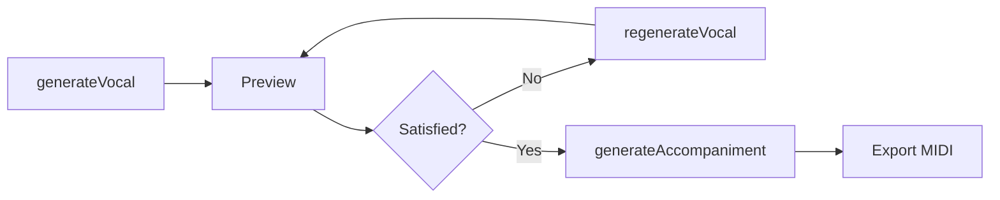

# Features

MIDI Sketch is a music theory-based MIDI generator that creates complete pop music arrangements.

## MIDI Output, Not Audio

Unlike AI audio generators (Suno, Udio, etc.), MIDI Sketch outputs **editable MIDI data**.

| | AI Audio Generators | MIDI Sketch |
|---|---|---|
| Output | Finished audio (MP3/WAV) | MIDI files |
| Editing | Limited or none | Full control in DAW |
| Sounds | Fixed | Your choice |
| Mixing | Baked in | You decide |
| Reproducibility | Often inconsistent | Deterministic (seed-based) |

::: tip What You Get
- 9 separate tracks (vocal, aux, chord, bass, motif, guitar, arpeggio, drums, SE)
- Each track on its own MIDI channel
- Import directly into any DAW
- Use your own instruments and effects
:::

## Music Theory Foundation

MIDI Sketch doesn't use machine learning or neural networks. It implements classical harmony principles combined with modern pop music analysis.

### Melody Generation

::: details Template-Driven Architecture
7 melody templates model specific vocal styles:
- **PlateauTalk**: NewJeans/Billie Eilish style - high plateau with talk-sing
- **RunUpTarget**: YOASOBI/Ado style - ascending runs to target notes
- **HookRepeat**: TikTok/K-POP style - short repeating hooks
- **SparseAnchor**: Official髭男dism style - sparse anchor notes
- And more (DownResolve, CallResponse, JumpAccent)
:::

::: details Singability Constraints
- **Direction inertia**: Accumulated momentum tracking prevents erratic direction changes
- **Tessitura enforcement**: Real-time pitch adjustments for comfortable singing range
- **Leap compensation**: Automatic stabilization steps after large intervals
- **Vowel constraints**: Pitch movement limited within vowel sections for natural phrasing
:::

### Voice Leading & Chord Voicing

::: details Three Voicing Types
- **Close voicing**: Notes within one octave (warm, suitable for verses)
- **Open voicing**: Drop2, Drop3, Spread variations (powerful, for choruses)
- **Rootless voicing**: Root omitted when bass provides it (jazz-influenced)
:::

::: details Voice Leading Optimization
- Weighted distance calculation (bass and soprano get 2x priority)
- Common tone maximization between successive chords
- Parallel 5ths/octaves detection with context-aware enforcement
- Avoid note detection (minor 2nd with chord tones, tritone with root)
:::

### Non-Chord Tone (NCT) Decoration

Based on Kostka & Payne's *Tonal Harmony* framework:

::: info Strong Beats and Weak Beats
In 4/4 time, **strong beats** (1 and 3) feel accented and stable, while **weak beats** (2 and 4) feel lighter. Melodies typically place chord tones on strong beats for harmonic clarity.
:::

::: details NCT Types
| Type | Placement | Description |
|------|-----------|-------------|
| Passing Tone | Weak beat | Stepwise connection between chord tones |
| Neighbor Tone | Weak beat | Step away from chord tone and return |
| Appoggiatura | Strong beat | Accented dissonance resolving by step |
| Anticipation | Before beat | Early arrival of next chord tone |
| Tension | Context-dependent | 9th, 11th, 13th extensions |
:::

::: details Mood-Dependent Configuration
- **Bright/Upbeat**: 75% chord tones, pentatonic focus
- **CityPop**: 50% chord tones, jazz tensions enabled
- **Ballad**: 65% chord tones, expressive appoggiaturas
- **Dark/Dramatic**: Chromatic approach notes enabled
:::

### Harmony Context & Collision Avoidance

::: details Multi-Track Coordination
- **Track collision detection**: Registers all notes from vocal, bass, chord, aux tracks
- **Low register strictness**: 3-semitone threshold below C4 to prevent muddiness
- **Safe pitch resolution**: Multi-strategy fallback (chord tones → consonant intervals → range search)
:::

### Emotion Curve System

::: details Song Emotional Arc
The Emotion Curve system plans the emotional journey of a song, assigning specific characteristics to each section:
- **Intro**: Anticipation (low tension, building energy)
- **Verse (A)**: Expectation (moderate tension)
- **Pre-chorus (B)**: Tension build (high tension, upward pitch tendency)
- **Chorus**: Release/resolution (peak energy, maximum density)
- **Bridge**: Reflection (lower energy, contrast)
- **Outro**: Closure (decreasing tension)

Each section receives emotion parameters (tension, energy, resolution need, pitch tendency, density) that guide generation across all tracks.
:::

### Euclidean Rhythms

::: details Mathematical Rhythm Patterns
Drum patterns use Bjorklund's algorithm to distribute hits evenly across steps, creating natural-sounding rhythms found in many musical traditions:

| Pattern | Hits/Steps | Traditional Name |
|---------|-----------|------------------|
| E(3,8) | [x..x..x.] | Cuban tresillo |
| E(5,8) | [x.xx.xx.] | Cuban cinquillo |
| E(5,16) | Bossa nova feel | - |
| E(4,16) | Four-on-the-floor | - |

These mathematically-spaced patterns feel more natural than probability-based random placement.
:::

### Secondary Dominants

::: details Harmonic Enrichment
Secondary dominants (V/V, V/vi, etc.) are automatically inserted to create stronger harmonic pull toward target chords. This enriches chord progressions without requiring manual configuration.
:::

### Guitar Track

::: details Accompaniment Guitar Generation
A dedicated guitar track generates accompaniment patterns influenced by Blueprint constraints such as guitar skill level and guitar-below-vocal positioning. Guitar appears on its own MIDI channel and can be enabled or disabled independently.
:::

### Energy Curve

::: details Song Energy Progression
The Energy Curve system controls how energy progresses through the song, providing high-level control over dynamics beyond per-section settings:
- **GradualBuild**: Energy increases steadily from start to finish
- **FrontLoaded**: High energy at the start, tapering toward the end
- **WavePattern**: Alternating high and low energy across sections
- **SteadyState**: Consistent energy level throughout
:::

### Melody & Motif Overrides

::: details Fine-Grained Parameter Control
**Melody Override** allows fine-grained control over melody generation parameters:
- Max leap, syncopation probability, phrase length
- Long note ratio, chorus register shift
- Hook repetition, leading tone behavior

**Motif Override** allows fine-grained control over motif generation parameters:
- Motif length, note count, motion (0-4)
- Register (high/mid), rhythm density
:::

### Expanded Arpeggio Patterns

::: details 8 Arpeggio Patterns
Beyond the basic Up, Down, UpDown, and Random patterns, MIDI Sketch now includes:
- **Pinwheel**: Alternating direction pattern
- **PedalRoot**: Returns to root between each note
- **Alberti**: Classical broken chord pattern (low-high-mid-high)
- **BrokenChord**: Irregular chord tone ordering
:::

### Performance Controls

::: details DriveFeel, Syncopation & Mora Rhythm
- **DriveFeel**: Controls performance intensity from laid-back (0) to aggressive (100), affecting timing tightness and velocity emphasis
- **Syncopation**: `enableSyncopation` toggle adds groove effects by shifting notes off the grid
- **MoraRhythmMode**: Support for Japanese mora-timed rhythm, aligning note durations to syllable timing patterns
:::

### Piano Roll Safety API

::: details Note Safety Analysis
The Piano Roll Safety API analyzes pitch safety at any point in the generated song. For each MIDI pitch (0-127), it reports:
- **Safety level**: Safe (chord tone), Warning (tension/low register/passing tone), or Dissonant (non-scale/collision)
- **Reason flags**: Detailed bit flags indicating why a pitch is rated at its level (e.g., ChordTone, Tension, LargeLeap, Minor2nd collision)
- **Collision detection**: Identifies which tracks would collide with a given pitch
- **Recommended pitches**: Up to 8 suggested pitches for the current harmonic context

Use after any generation call (`generateVocal`, `generateFromConfig`, etc.) for real-time pitch guidance in piano roll editors.
:::

### Custom Vocal API

::: details User-Defined Melody Input
The `setVocalNotes` API allows injecting a custom melody (as an array of note events) instead of using the built-in melody generator. The accompaniment is then generated around the user-provided vocal, with full harmony context coordination including chord recognition, collision avoidance, and Aux track generation.
:::

### Chord Timeline API

::: details Harmonic Context Retrieval
The `getChordTimeline` API returns the chord progression timeline for the generated song, including tick positions, chord degrees, and secondary dominant information. This is used for playback synchronization and harmonic analysis.
:::

### SongConfigBuilder

::: details Fluent Configuration API
The `SongConfigBuilder` provides a fluent API for constructing song configurations with cascade change detection. When a parameter changes, dependent parameters are automatically recalculated, ensuring consistent configurations without manual coordination.
:::

::: info Academic Foundation
The implementation references:
- [Kostka & Payne: *Tonal Harmony*](https://www.mheducation.com/highered/product/tonal-harmony-kostka.html) - NCT classification and voice leading
- [Huron: *Sweet Anticipation*](https://mitpress.mit.edu/9780262582780/sweet-anticipation/) - Psychology of musical expectation
- [de Clercq & Temperley: *A Corpus Analysis of Rock Harmony*](http://davidtemperley.com/wp-content/uploads/2015/11/declercq-temperley-pm11.pdf) - Pop/rock chord progression patterns
- J-POP pentatonic "yonanuki" analysis
:::

## Deterministic Generation

Same seed + same parameters = same output. Every time.

```bash
# These will always produce identical MIDI files
./midisketch_cli --seed 12345 --style jpop
./midisketch_cli --seed 12345 --style jpop
```

::: tip Reproducibility Benefits
- Reproducible results for iterative workflows
- Share seeds with collaborators
- Metadata embedded in MIDI files enables regeneration
:::

## Candidate Selection System

For melody generation, MIDI Sketch doesn't just output the first result. It generates **20-100 candidates** per section and selects the best one through evaluation:

1. **Culling**: Filter out melodies with issues (high register strain, monotony, scattered notes)
2. **Scoring**: Rank survivors on singability, chord tone alignment, contour shape
3. **Selection**: Choose the highest-scoring candidate

::: details Candidate Counts by Section
| Section | Candidates |
|---------|-----------|
| Chorus | 100 |
| Pre-chorus (B) | 50 |
| Bridge / Chant | 30 |
| Verse / Intro / Outro | 20 |

More candidates for important sections where melody quality matters most.
:::

## Style Presets

17 style presets (stylePresetId 0-16) determine the overall musical character, each mapped to one of 24 internal moods. Moods (0-23) can also be set explicitly via `moodExplicit`, covering:

- J-Pop / K-Pop / City Pop
- EDM / Electro Pop / Synthwave / Future Bass
- Ballad / R&B / R&B Neo Soul / Chill / Lofi
- Rock / Light Rock
- Anime / Vocaloid
- Latin Pop / Trap
- And more

::: details What Each Preset Configures
- BPM range
- Drum patterns
- Chord voicing style
- Melody template preferences
- Evaluation weights
- Mood-dependent chord extension probabilities
:::

14 vocal style presets are available (Auto, Standard, Vocaloid, UltraVocaloid, Idol, Ballad, Rock, CityPop, Anime, BrightKira, CoolSynth, CuteAffected, PowerfulShout, KPop) to fine-tune melody generation characteristics independently from mood.

## Multiple Composition Styles

Three composition paradigms:

| Style | Vocal | Aux | Motif | Arpeggio | Use Case |
|-------|:-----:|:---:|:-----:|:--------:|----------|
| **MelodyLead (0)** | Yes | Yes | Blueprint-dependent | Optional | Songs with vocals |
| **BackgroundMotif (1)** | No | Yes | Yes | Optional | BGM, lo-fi |
| **SynthDriven (2)** | No | No | Blueprint-dependent | Optional (manual enable) | Electronic, EDM |

::: warning BGM-Only Modes
BackgroundMotif disables Vocal but keeps Aux enabled and forces Motif generation. SynthDriven disables both Vocal and Aux; Arpeggio must be manually enabled with `arpeggioEnabled=true`.
:::

## Vocal-First Workflow

For MelodyLead style, iterate on the melody before generating accompaniment:



::: tip Iterate Until Satisfied
Use `generateVocal()` to create the initial melody, then call `regenerateVocal()` with a new seed or VocalConfig to try variations. Once satisfied, call `generateAccompaniment()` to add the backing tracks. Alternatively, use `generateWithVocal()` for vocal-priority one-shot generation.
:::

## Lightweight & Portable

- **~555KB WASM** (gzip: ~225KB) + ~80KB JS
- **No external dependencies** (pure C++17)
- Runs in browser, Node.js, or native CLI
- No API calls, no internet required

## Open Source

::: info License
Apache 2.0 licensed - use generated MIDI commercially, modify and redistribute freely.
:::

---

## Use Cases

::: details Demo Production
Generate quick song sketches to test ideas before investing time in full production.
:::

::: details Learning Tool
Study how chord progressions, voice leading, and arrangement work by examining the output.
:::

::: details DAW Templates
Generate starting points for tracks, then customize with your own sounds and mixing.
:::

::: details Game/Video BGM
Create reproducible background music with deterministic seeds.
:::

::: details Songwriting Aid
Get melody ideas and chord progressions to build upon.
:::

---

## What MIDI Sketch Is Not

::: warning Important Distinctions
- **Not an AI audio generator** - It outputs MIDI, not audio
- **Not a replacement for composers** - It's a tool to generate starting points
- **Not machine learning** - It uses explicit music theory rules
- **Not cloud-based** - Everything runs locally
:::

