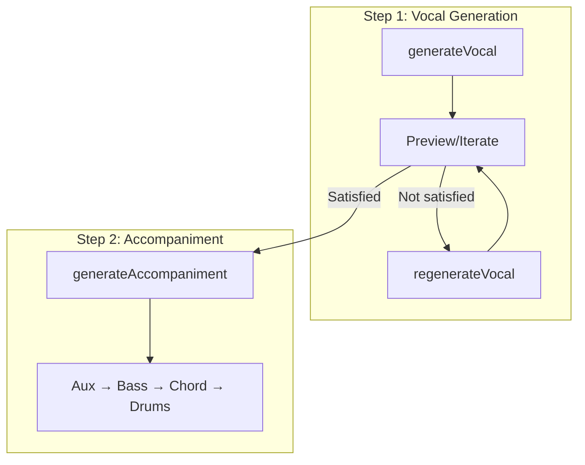
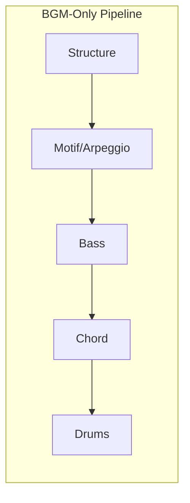
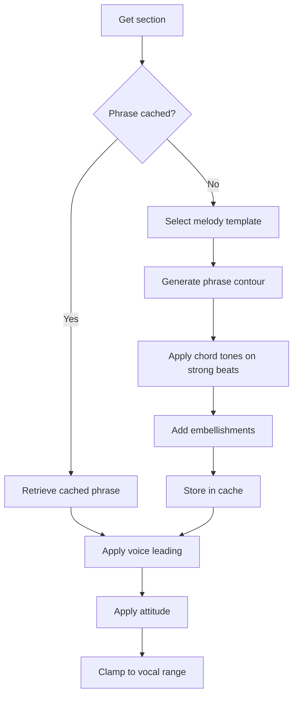
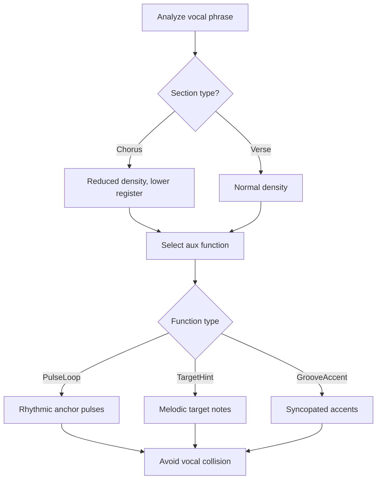
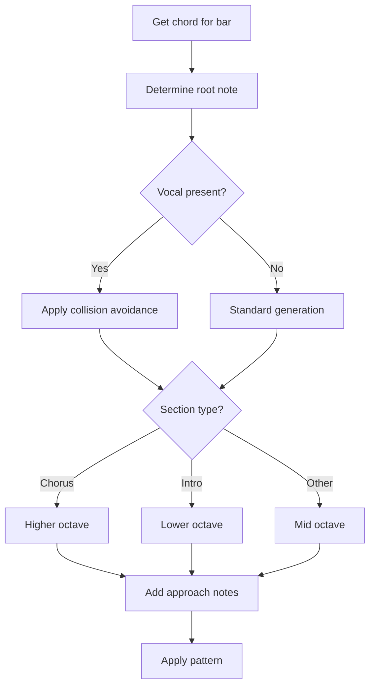
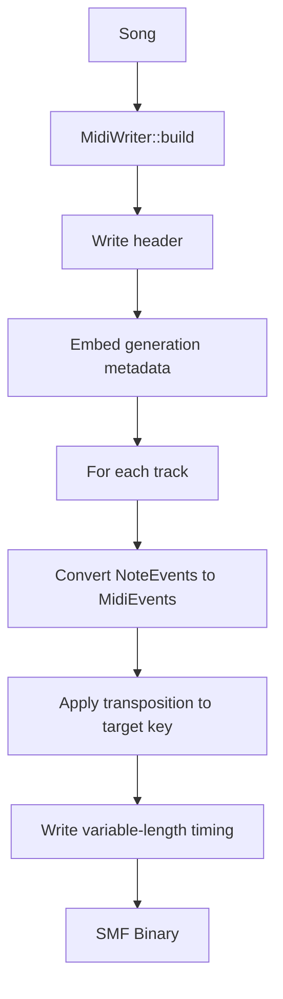

# Generation Pipeline

This document explains the step-by-step music generation process in [MIDI Sketch](https://github.com/libraz/midi-sketch).

## Pipeline Overview

MIDI Sketch supports multiple generation workflows depending on the composition style and use case.

### Vocal-First Workflow

For iterative vocal refinement:



### BGM-Only Modes

For `BackgroundMotif` and `SynthDriven` composition styles, vocal generation is skipped:



## CompositionStyle Branching

| Style | Primary Track | Vocal | Generation Order |
|-------|---------------|-------|------------------|
| **MelodyLead** | Vocal | Yes | Vocal → Aux → Bass → Chord → Drums |
| **BackgroundMotif** | Motif | No | Motif → Bass → Chord → Drums |
| **SynthDriven** | Arpeggio | No | Bass → Chord → Arpeggio → Drums |

## Phase 1: Structure Building

The generator first creates the song structure based on `StructurePattern`:

```cpp
void Generator::buildStructure() {
    arrangement_ = StructureBuilder::build(params_.structure);
}
```

### Structure Patterns

| Pattern | Bars | Sections |
|---------|------|----------|
| StandardPop | 24 | A(8)-B(8)-Chorus(8) |
| BuildUp | 28 | Intro(4)-A(8)-B(8)-Chorus(8) |
| DirectChorus | 16 | A(8)-Chorus(8) |
| RepeatChorus | 32 | A(8)-B(8)-Chorus(8)-Chorus(8) |
| FullPop | 56 | Intro-A-B-Chorus-A-B-Chorus-Outro |
| FullWithBridge | 52 | Intro-A-B-Chorus-Bridge-Chorus-Outro |
| Ballad | 56 | Intro(8)-A-B-Chorus-Interlude-B-Chorus-Outro |
| ExtendedFull | 90 | Full form with bridge and extended sections |

### Section Types

Each section has properties that affect generation:

```cpp
struct Section {
    SectionType type;         // Intro, A, B, Chorus, Bridge, Interlude, Outro
    uint8_t bars;             // Length in bars
    VocalDensity vocal_density;    // Full, Sparse, None
    BackingDensity backing_density; // Normal, Thin, Thick
};
```

## Phase 2: Track Generation

### Vocal Track (MelodyLead only)

The most complex generator with phrase caching and template-driven design:



**Melody Templates:**

| Template | Characteristics |
|----------|-----------------|
| ArchShape | Rises to peak, then descends |
| DescendingLine | Gradual descent through phrase |
| PhraseEcho | Repeats melodic motif |
| StepwiseFlow | Smooth stepwise motion |
| LeapAndStep | Leaps followed by stepwise fill |
| PentatonicFlow | Uses pentatonic scale |
| SyncopatedGroove | Off-beat emphasis |

**Vocal Attitudes:**

| Attitude | Characteristics |
|----------|-----------------|
| Clean | Chord tones only, on-beat rhythms |
| Expressive | Tensions with delayed resolution, slight timing deviation |
| Raw | Non-chord tones, phrase boundary breaking |

### Aux Track

Generates sub-melody support that adapts to the vocal:



**Aux Functions:**

| Function | Purpose | When Used |
|----------|---------|-----------|
| PulseLoop | Rhythmic anchor | Straight rhythms |
| TargetHint | Melodic target cues | Complex melodies |
| GrooveAccent | Rhythmic accents | Syncopated grooves |

### Bass Generation

Bass provides the harmonic foundation, adapting to vocal when present:



**Bass Patterns:**
- **Sparse**: Quarter notes on beats 1 and 3 (ballad, chill)
- **Standard**: Quarter note rhythm with occasional eighths
- **Driving**: Eighth note patterns with approach notes

### Chord Generation

Chord voicing coordinates with bass and vocal:

```cpp
void Generator::generateChord() {
    BassAnalysis bassAnalysis = analyzeBass(song_.bass);
    VocalAnalysis vocalAnalysis = analyzeVocal(song_.vocal);

    // Use rootless voicing when bass has root
    if (bassAnalysis.hasRootOnBeat1) {
        useRootlessVoicing();
    }

    // Avoid collision with vocal
    if (vocalAnalysis.hasNoteAt(tick)) {
        adjustVoicing(vocalAnalysis.pitchAt(tick));
    }
}
```

**Voice Leading Algorithm:**
1. Calculate distance between consecutive voicings
2. Minimize movement (sum of semitone distances)
3. Maximize common tone retention
4. Apply inversions to optimize transitions

### Drums Generation

Drum patterns are selected based on mood:

| Style | Characteristics | Used By |
|-------|-----------------|---------|
| Sparse | Half-time feel, minimal | Ballad, Chill |
| Standard | 8th hi-hat, 2&4 snare | StraightPop |
| FourOnFloor | 4-on-floor kick | ElectroPop, IdolPop |
| Upbeat | Syncopated, 16th hi-hat | BrightUpbeat |
| Rock | Ride cymbal, crash accents | LightRock |
| Synth | Tight 16th hi-hat | Yoasobi, Synthwave |

**Fill Generation:**
- Tom descend/ascend patterns
- Snare rolls
- Combination fills at section transitions

### Motif Track (BackgroundMotif style)

Generates repeating patterns as the primary melodic element:

```cpp
MotifParams params {
    .length = MotifLength::TwoBars,    // 2 or 4 bars
    .rhythm_density = RhythmDensity::Medium,
    .motion = MotifMotion::Stepwise,
    .repeat_scope = RepeatScope::FullSong
};
```

### Arpeggio Track (SynthDriven style)

Generates arpeggiated patterns as the primary harmonic element:

```cpp
ArpeggioParams params {
    .pattern = ArpeggioPattern::UpDown,
    .speed = ArpeggioSpeed::Sixteenth,
    .octave_range = 2,
    .gate = 0.5f  // Note length ratio
};
```

### SE Track

Generates section markers and sound effect cues:
- Section boundary markers (text events)
- Call timing hints (when callEnabled)
- Intro chant markers

## Phase 3: Polish

### Transition Dynamics

Automatically applies energy transitions:


**Section Energy Multipliers:**

| Section | Multiplier |
|---------|-----------|
| Intro | 0.75 |
| A | 0.85 |
| B | 1.00 |
| Chorus | 1.20 |
| Bridge | 0.90 |
| Outro | 0.80 |

### Humanization

Adds natural variation to timing and velocity:

```cpp
void applyHumanization(Song& song, float intensity) {
    // Timing: random offset ±ms
    // Velocity: random ±value
    // Not applied to drums
}
```

## MIDI Output

Finally, the Song is converted to SMF Type 1 or Type 2:



**Track Mapping:**

| Track | Channel | Program |
|-------|---------|---------|
| Vocal | 0 | 0 (Piano) |
| Aux | 1 | 4 (E.Piano) |
| Chord | 2 | 4 (E.Piano) |
| Bass | 3 | 33 (E.Bass) |
| Motif | 4 | 81 (Synth Lead) |
| Arpeggio | 5 | 81 (Saw Lead) |
| Drums | 9 | GM Drums |
| SE | 15 | Text events |

## Key Transposition

All generation happens in C major. Final transposition is applied at output:

```cpp
uint8_t MidiWriter::transposePitch(uint8_t pitch, Key key) {
    return pitch + static_cast<uint8_t>(key);
}
```

## Metadata Embedding

Generated MIDI files include metadata for regeneration:

```cpp
struct MidiMetadata {
    uint32_t seed;
    uint8_t style_preset_id;
    uint8_t chord_progression_id;
    uint8_t form_id;
    uint8_t composition_style;
    uint8_t vocal_attitude;
    uint8_t vocal_style;
    uint8_t melody_template;
    // ... additional parameters
};
```

This enables exact reproduction via CLI: `./midisketch_cli --regenerate song.mid`
