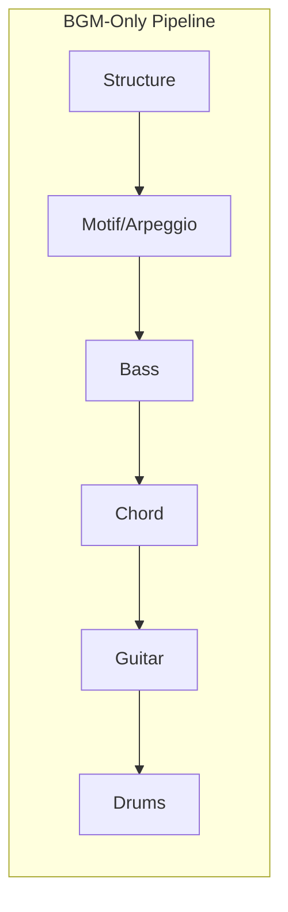
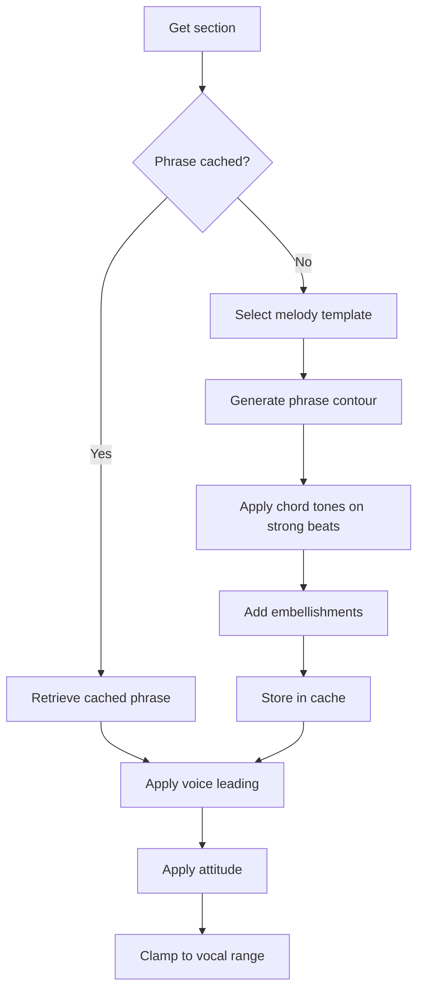
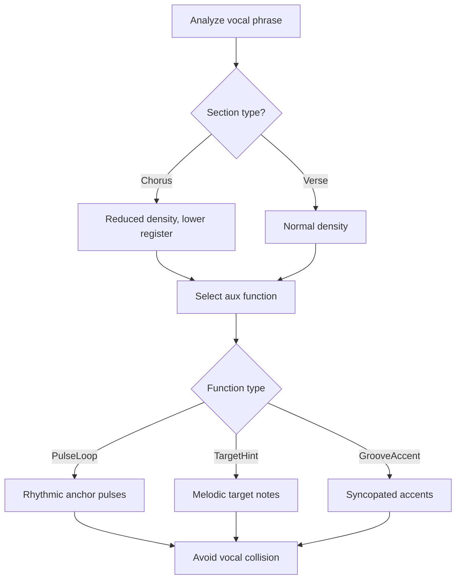
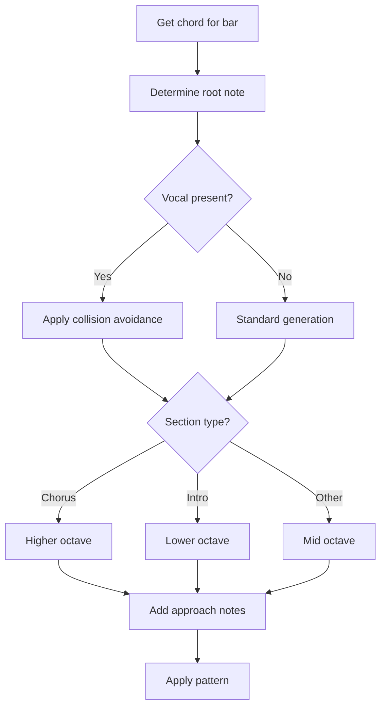
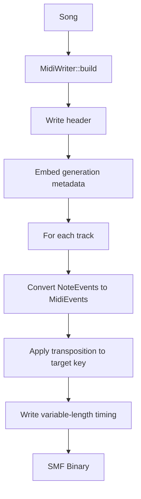

# Generation Pipeline

This document explains the step-by-step music generation process in [MIDI Sketch](https://github.com/libraz/midi-sketch).

## Pipeline Overview

MIDI Sketch supports multiple generation workflows depending on the composition style and use case.

### Vocal-First Workflow

For iterative vocal refinement:

::: tip When to Use Vocal-First
Use this workflow when melody quality is critical. You can iterate on the vocal endlessly with `regenerateVocal()` before committing to the full arrangement.
:::


### BGM-Only Modes

For `BackgroundMotif` and `SynthDriven` composition styles, vocal generation is skipped:



## CompositionStyle Branching

| Style | Primary Track | Vocal | Aux | Generation Order |
|-------|---------------|-------|-----|------------------|
| **MelodyLead** | Vocal | Yes | Yes | Vocal → Aux → Motif (Blueprint) → Bass → Chord → Guitar → Arpeggio → Drums → SE |
| **BackgroundMotif** | Motif | No | Yes | Aux → Motif → Bass → Chord → Guitar → Arpeggio → Drums → SE |
| **SynthDriven** | Arpeggio | No | No | Motif (Blueprint) → Bass → Chord → Guitar → Arpeggio (manual) → Drums → SE |

::: info Generation Paradigms
Three paradigms affect the precise ordering of track generation:
- **Traditional**: Vocal → Aux → Motif → Bass → Chord → Guitar → Arpeggio → Drums → SE
- **RhythmSync**: Motif → Vocal → Aux → Bass → Chord → Guitar → Arpeggio → Drums → SE
- **MelodyDriven**: Vocal → Aux → Motif → Bass → Chord → Guitar → Arpeggio → Drums → SE
:::

## Phase 1: Structure Building

The generator first creates the song structure based on `StructurePattern`. If an **Energy Curve** is specified (GradualBuild, FrontLoaded, WavePattern, or SteadyState), it adjusts section energy levels during structure building to shape the overall dynamic arc of the song.

```cpp
void Generator::buildStructure() {
    arrangement_ = StructureBuilder::build(params_.structure);
}
```

### Structure Patterns

| Pattern | Bars | Sections |
|---------|------|----------|
| StandardPop | 24 | A(8)-B(8)-Chorus(8) |
| BuildUp | 28 | Intro(4)-A(8)-B(8)-Chorus(8) |
| DirectChorus | 16 | A(8)-Chorus(8) |
| RepeatChorus | 32 | A(8)-B(8)-Chorus(8)-Chorus(8) |
| FullPop | 56 | Intro-A-B-Chorus-A-B-Chorus-Outro |
| FullWithBridge | 52 | Intro-A-B-Chorus-Bridge-Chorus-Outro |
| Ballad | 56 | Intro(8)-A-B-Chorus-Interlude-B-Chorus-Outro |
| ExtendedFull | 90 | Full form with bridge and extended sections |

### Section Types

Each section has properties that affect generation:

```cpp
struct Section {
    SectionType type;         // Intro, A, B, Chorus, Bridge, Interlude, Outro
    uint8_t bars;             // Length in bars
    VocalDensity vocal_density;    // Full, Sparse, None
    BackingDensity backing_density; // Normal, Thin, Thick
};
```

## Phase 2: Track Generation

### Vocal Track (MelodyLead only)

The most complex generator with phrase caching and template-driven design. When **melody overrides** are specified, parameters such as max leap, syncopation probability, phrase length, long note ratio, chorus register shift, hook repetition, and leading tone behavior take precedence over template defaults:



**Melody Templates:**

| Template | Characteristics |
|----------|-----------------|
| Auto | Auto-select based on style and section |
| PlateauTalk | NewJeans/Billie style: high plateau, talk-sing |
| RunUpTarget | Anime high-energy/dramatic pop style: run up to target note |
| DownResolve | B-melody: descending resolution |
| HookRepeat | TikTok/K-POP: short repeating hook |
| SparseAnchor | 髭男 style: sparse anchor notes |
| CallResponse | Duet style: call and response |
| JumpAccent | Emotional: jump accent |

::: info Auto Template Selection
When `melodyTemplate=Auto`, the system selects based on vocalStyle and section type. For example, Anime style in Chorus sections tends to use HookRepeat or JumpAccent.
:::

**Vocal Attitudes:**

| Attitude | Characteristics |
|----------|-----------------|
| Clean | Chord tones only, on-beat rhythms |
| Expressive | Tensions with delayed resolution, slight timing deviation |
| Raw | Non-chord tones, phrase boundary breaking |

::: warning Attitude Restrictions
Not all attitudes are available for every style preset. Use `midisketch_style_preset_allowed_attitudes()` to check which attitudes are permitted. Specifying an unsupported attitude results in a validation error.
:::

### Aux Track

Generates sub-melody support that adapts to the vocal:



**Aux Functions:**

| Function | Purpose | When Used |
|----------|---------|-----------|
| PulseLoop | Addictive repetition pattern | Straight rhythms |
| TargetHint | Hints at melody destination | Complex melodies |
| GrooveAccent | Physical groove accent | Syncopated grooves |
| PhraseTail | Phrase ending fill | Phrase transitions |
| EmotionalPad | Emotional pad/floor | Ballad, emotional sections |
| Unison | Vocal unison doubling | Chorus emphasis |
| MelodicHook | Melodic hook riff | Hook-focused sections |
| MotifCounter | Counter melody (contrary motion) | Polyphonic textures |
| SustainPad | Whole-note chord tone pad | Sustained harmonic support |

### Bass Generation

Bass provides the harmonic foundation, adapting to vocal when present:



**Bass Patterns:**

The bass system supports 17+ pattern types (BassPattern) including Sparse, Standard, Driving, and genre-specific variants. The active pattern is selected automatically based on mood and section, or can be influenced per-section via `bass_style_hint` in the Blueprint's SectionSlot configuration (0=auto, 1-17 maps to BassPattern+1).

Common pattern categories:
- **Sparse**: Quarter notes on beats 1 and 3 (ballad, chill)
- **Standard**: Quarter note rhythm with occasional eighths
- **Driving**: Eighth note patterns with approach notes

### Chord Generation

Chord voicing coordinates with bass and vocal:

```cpp
void Generator::generateChord() {
    BassAnalysis bassAnalysis = analyzeBass(song_.bass);
    VocalAnalysis vocalAnalysis = analyzeVocal(song_.vocal);

    // Use rootless voicing when bass has root
    if (bassAnalysis.hasRootOnBeat1) {
        useRootlessVoicing();
    }

    // Avoid collision with vocal
    if (vocalAnalysis.hasNoteAt(tick)) {
        adjustVoicing(vocalAnalysis.pitchAt(tick));
    }
}
```

**Voice Leading Algorithm:**
1. Calculate distance between consecutive voicings
2. Minimize movement (sum of semitone distances)
3. Maximize common tone retention
4. Apply inversions to optimize transitions

::: info Rootless Voicing
When bass plays the root on beat 1, chord voicing automatically omits the root to avoid muddiness. This creates cleaner, less cluttered arrangements.
:::

### Guitar Track

Generates accompaniment guitar patterns on a dedicated MIDI channel. Controlled by `guitarEnabled` (JS default: `false`, C++ default: `true`). The guitar track is influenced by Blueprint constraints including `guitar_skill` (skill level affecting pattern complexity) and `guitar_below_vocal` (keeps guitar voicings below the vocal register to avoid masking). Guitar generation occurs after chord generation, allowing it to complement the existing harmonic voicing.

Per-section guitar style can be influenced via `guitar_style_hint` (0-7) in the Blueprint's SectionSlot configuration, where 0 selects automatically based on mood and energy.

### Drums Generation

Drum patterns are selected based on mood:

| Style | Characteristics | Used By |
|-------|-----------------|---------|
| Sparse | Half-time feel, minimal | Ballad, Chill |
| Standard | 8th hi-hat, 2&4 snare | StraightPop |
| FourOnFloor | 4-on-floor kick | ElectroPop, IdolPop |
| Upbeat | Syncopated, 16th hi-hat | BrightUpbeat |
| Rock | Ride cymbal, crash accents | LightRock |
| Synth | Tight 16th hi-hat | Yoasobi, Synthwave |

Blueprints can specify `euclidean_drums_percent` to control the probability of using Euclidean rhythm patterns, and per-section `drum_role` (Full, Ambient, Minimal, FXOnly) to shape drum behavior across the arrangement.

**Fill Generation:**
- Tom descend/ascend patterns
- Snare rolls
- Combination fills at section transitions

### Motif Track (BackgroundMotif style)

Generates repeating patterns as the primary melodic element. When **motif overrides** are specified, parameters such as motif length (0=auto, 1/2/4 beats), note count (0=auto, 3-8), motion (0-4 via API, internal 5=Ostinato for Blueprints only), register (0=auto, 1=low, 2=high), and rhythm density (0=Sparse, 1=Medium, 2=Driving) take precedence over style defaults:

```cpp
MotifParams params {
    .length = MotifLength::TwoBars,    // 2 or 4 bars
    .rhythm_density = RhythmDensity::Medium,
    .motion = MotifMotion::Stepwise,   // 0=Stepwise, 1=GentleLeap, 2=WideLeap, 3=NarrowStep, 4=Disjunct
    .repeat_scope = RepeatScope::FullSong
};
```

### Arpeggio Track (SynthDriven style)

Generates arpeggiated patterns as the primary harmonic element:

```cpp
ArpeggioParams params {
    .pattern = ArpeggioPattern::UpDown,
    .speed = ArpeggioSpeed::Sixteenth,
    .octave_range = 2,
    .gate = 0.5f  // Note length ratio
};
```

### SE Track

Generates section markers and sound effect cues:
- Section boundary markers (text events)
- Call timing hints (when the call system is active via `callSetting`)
- Intro chant markers

## Phase 3: Polish

### Transition Dynamics

Automatically applies energy transitions:


**Section Energy Multipliers:**

| Section | Multiplier |
|---------|-----------|
| Intro | 0.75 |
| A | 0.85 |
| B | 1.00 |
| Chorus | 1.20 |
| Bridge | 0.90 |
| Outro | 0.80 |

### Humanization

Adds natural variation to timing and velocity:

```cpp
void applyHumanization(Song& song, float intensity) {
    // Timing: random offset ±ms
    // Velocity: random ±value
    // Not applied to drums
}
```

::: tip Drums Exception
Humanization is intentionally **not applied to drums** to maintain tight rhythmic feel. Melodic and harmonic tracks receive humanization while drums stay quantized.
:::

## MIDI Output

Finally, the Song is converted to SMF Type 1 or Type 2:



**Track Mapping:**

| Track | Channel | Program |
|-------|---------|---------|
| Vocal | 0 | 0 (Piano) |
| Aux | 1 | 4 (E.Piano) |
| Chord | 2 | 4 (E.Piano) |
| Bass | 3 | 33 (E.Bass) |
| Motif | 4 | 81 (Synth Lead) |
| Arpeggio | 5 | 81 (Saw Lead) |
| Guitar | 6 | 25 (Acoustic Guitar) |
| Drums | 9 | GM Drums |
| SE | 15 | Text events |

## Key Transposition

All generation happens in C major. Final transposition is applied at output:

```cpp
uint8_t MidiWriter::transposePitch(uint8_t pitch, Key key) {
    return pitch + static_cast<uint8_t>(key);
}
```

::: info Internal C Major
All melodic logic operates in C major for simplicity. The `key` parameter (0-11) determines the final transposition: 0=C, 1=C#, 2=D, etc. This means chord progression analysis and scale-degree logic don't need key-specific handling.
:::

## Metadata Embedding

Generated MIDI files include metadata for regeneration:

```cpp
struct MidiMetadata {
    uint32_t seed;
    uint8_t style_preset_id;
    uint8_t chord_progression_id;
    uint8_t form_id;
    uint8_t composition_style;
    uint8_t vocal_attitude;
    uint8_t vocal_style;
    uint8_t melody_template;
    // ... additional parameters
};
```

This enables exact reproduction via CLI: `./midisketch_cli --regenerate song.mid`

::: tip Regeneration from MIDI
Any MIDI file generated by MIDI Sketch can be used to reproduce the exact same output. The embedded metadata stores all parameters, making it easy to iterate on a song weeks or months later.
:::
