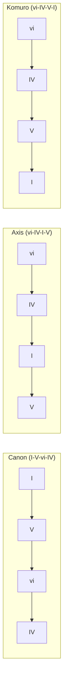
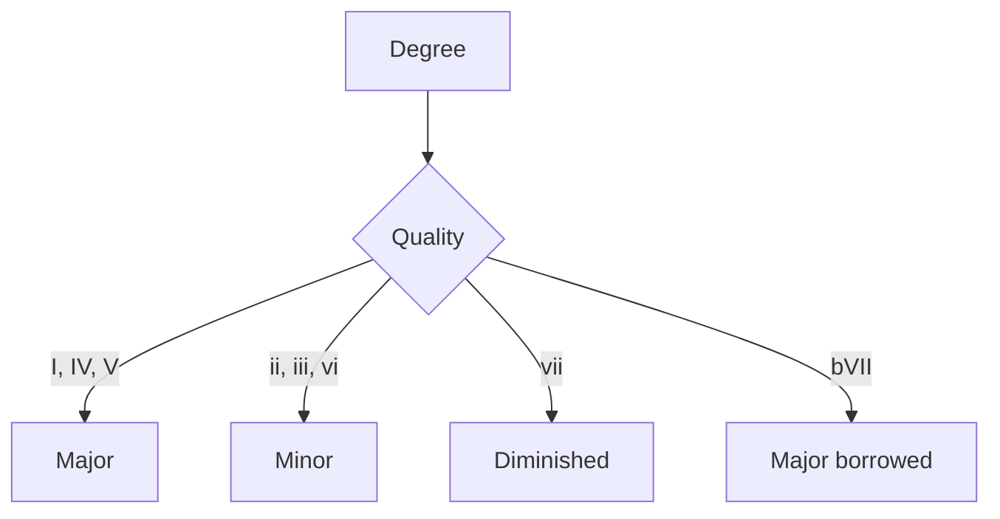
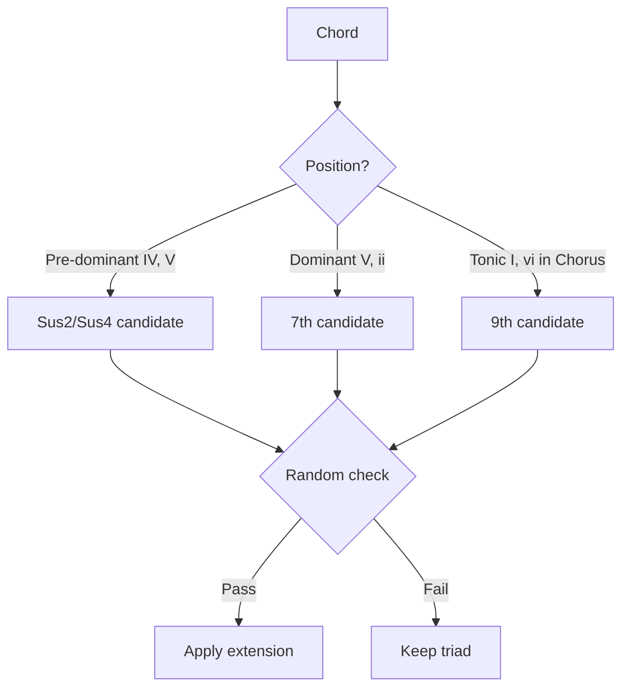
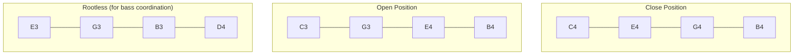
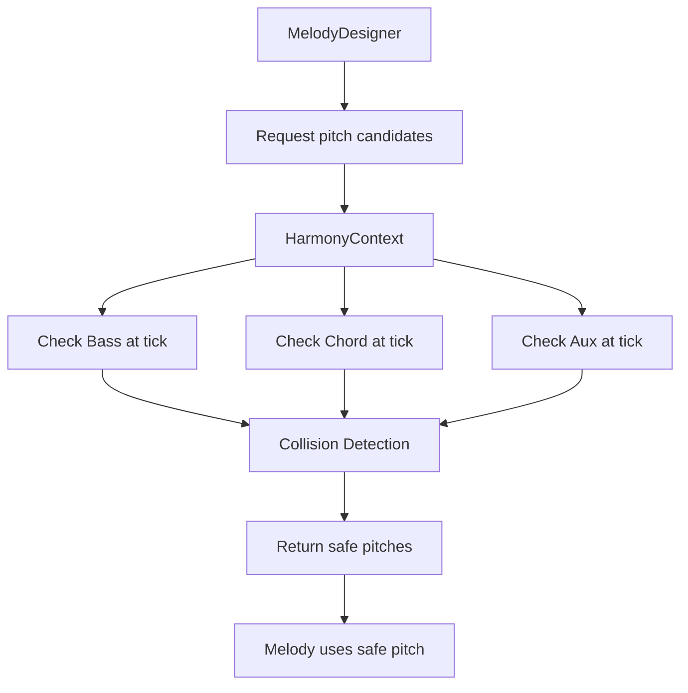
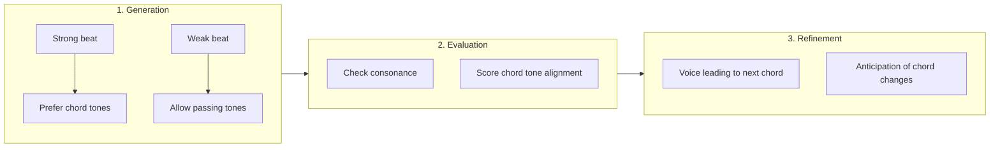

# Harmony & Chord Progressions

This document explains the harmonic system in [MIDI Sketch](https://github.com/libraz/midi-sketch).

::: info Note
This page uses music theory terminology. These concepts are handled automatically by the system, but understanding them allows for more precise parameter selection.
:::

## Chord Progressions

MIDI Sketch includes 22 built-in chord progressions, covering common pop music patterns.

::: tip What is a Chord Progression?
A chord progression is the sequence of chords that forms the harmonic backbone of a song. It's what gives music its sense of movement and emotion. The same melody can feel completely different over different chord progressions.
:::

### 4-Chord Progressions



| ID | Name | Degrees | Character |
|----|------|---------|-----------|
| 0 | Pop4 | I-V-vi-IV | Ubiquitous pop |
| 1 | Axis | vi-IV-I-V | Melancholic |
| 2 | Komuro | vi-IV-V-I | Bright J-pop |
| 3 | Canon | I-V-vi-iii-IV | Classic |
| 4 | Emotional4 | vi-V-IV-V | Emotional build |
| 5 | Minimal | I-IV | Simple two-chord |
| 6 | AltMinimal | I-V | Power pop |
| 7 | Progression3 | I-vi-IV | Three-chord |
| 8 | Rock4 | I-bVII-IV-I | Rock feel |

::: details Understanding These Progressions
- **Pop4 (I-V-vi-IV)**: The most popular progression in modern music. Used in thousands of hit songs. Creates a satisfying, familiar feel.
- **Axis (vi-IV-I-V)**: Starts on a minor chord, creating instant melancholy. Used in many emotional ballads.
- **Komuro (vi-IV-V-I)**: Named after Japanese producer Tetsuya Komuro. The V→I resolution at the end creates a bright, uplifting feeling.
- **Canon (I-V-vi-iii-IV)**: Based on Pachelbel's Canon. Timeless and elegant.
- **Rock4 (I-bVII-IV-I)**: The bVII (flat seven) chord adds a rock/blues flavor.
:::

### 5-Chord Progressions

| ID | Name | Degrees | Character |
|----|------|---------|-----------|
| 9 | Extended5 | I-V-vi-iii-IV | Extended canon |
| 10 | Emotional5 | vi-IV-I-V-ii | Complex emotional |

### Full Progression List

Total of 22 progressions including:
- Pop variants (bright, dark)
- Emotional variants
- Minimal (2-3 chord) patterns
- Rock-influenced
- Jazz-influenced with ii-V

## Degree System

::: info What are Chord Degrees?
Chord degrees (I, ii, iii, IV, V, vi, vii) indicate the position of a chord within a key. Uppercase = major chord, lowercase = minor chord. For example, in C major: I = C major, ii = D minor, V = G major.
:::

Chord degrees are represented as integers:

```cpp
enum Degree {
    I   = 0,   // Tonic
    ii  = 1,   // Supertonic
    iii = 2,   // Mediant
    IV  = 3,   // Subdominant
    V   = 4,   // Dominant
    vi  = 5,   // Submediant
    vii = 6,   // Leading tone
    bVII = 10  // Flat seven (borrowed)
};
```

## Chord Quality

::: info Major vs Minor
- **Major chords** sound bright, happy, and stable (C, F, G)
- **Minor chords** sound darker, sadder, and more emotional (Dm, Em, Am)
- **Diminished chords** sound tense and unstable (rarely used in pop)
:::

Quality is determined by degree in major key:



```cpp
ChordQuality getQuality(Degree degree) {
    switch (degree) {
        case I: case IV: case V: case bVII:
            return Major;
        case ii: case iii: case vi:
            return Minor;
        case vii:
            return Diminished;
    }
}
```

## Chord Extensions

Extensions add color to basic triads:

::: tip When to Use Extensions
- **Sus chords**: Create tension before resolution. Great for anticipation moments.
- **7th chords**: Add sophistication and jazz flavor. Common in city pop and R&B.
- **9th chords**: Rich, complex sound. Use sparingly for maximum impact.

Higher extension probabilities work well for city pop, jazz, and R&B styles. Keep them low for simple pop and rock.
:::

### Extension Types

| Type | Notes Added | Example (C) |
|------|-------------|-------------|
| Triad | Root, 3rd, 5th | C-E-G |
| Sus2 | Root, 2nd, 5th | C-D-G |
| Sus4 | Root, 4th, 5th | C-F-G |
| 7th | + 7th | C-E-G-B/Bb |
| 9th | + 7th + 9th | C-E-G-B-D |

### Extension Application Rules



### Configuration

```cpp
struct ChordExtensionParams {
    bool enable_sus = false;
    bool enable_7th = false;
    bool enable_9th = false;
    bool tritone_sub = false;          // AccompanimentConfig only
    float sus_probability = 0.2f;     // 20% chance
    float seventh_probability = 0.15f; // 15% chance
    float ninth_probability = 0.25f;   // 25% chance
    float tritone_sub_probability;     // AccompanimentConfig only
};
```

::: info Mood-Dependent Probability Auto-Adjustment
When `chordExtProbExplicit=false` (default), the mood automatically adjusts chord extension probabilities to match the style. Set `chordExtProbExplicit=true` to manually control all extension probabilities.
:::

## Voice Leading

::: info What is Voice Leading?
Voice leading is how individual notes move from one chord to the next. Good voice leading creates smooth, connected chord transitions. Poor voice leading sounds choppy and disconnected. MIDI Sketch automatically applies optimized voice leading to all generated chord progressions.
:::

### Principles

1. **Minimize movement**: Each voice moves by smallest interval
2. **Common tones**: Retain shared notes between chords
3. **Avoid parallel fifths/octaves**: Classical constraint
4. **Smooth bass**: Stepwise or small leaps preferred

### Algorithm

```cpp
Voicing optimizeVoicing(Voicing prev, Chord next) {
    vector<Voicing> candidates = generateAllVoicings(next);

    return min_element(candidates, [&](auto& a, auto& b) {
        int distA = totalVoiceDistance(prev, a);
        int distB = totalVoiceDistance(prev, b);

        // Also penalize large leaps
        int leapA = maxSingleVoiceDistance(prev, a);
        int leapB = maxSingleVoiceDistance(prev, b);

        return (distA + leapA * 2) < (distB + leapB * 2);
    });
}
```

### Voicing Types



::: details Voicing Explained
- **Close Position**: All notes within one octave. Sounds compact and direct. Common in pop.
- **Open Position**: Notes spread across multiple octaves. Sounds spacious and full. Great for ballads.
- **Rootless**: Omits the root note (bass plays it). Creates clarity and avoids muddiness. Common arranging technique.
:::

## Bass-Chord Coordination

The chord track uses bass analysis to avoid doubling:

```cpp
struct BassAnalysis {
    bool hasRootOnBeat1;   // Root on downbeat
    bool hasRootOnBeat3;   // Root on beat 3
    bool hasFifth;         // Fifth present
    Tick accentTicks[];    // Strong beat positions
};

// When bass has root, chord uses rootless voicing
if (bassAnalysis.hasRootOnBeat1) {
    voicing = generateRootlessVoicing(chord);
}
```

## Secondary Dominants

Secondary dominants are dominant chords (V7) that resolve to diatonic chords other than the tonic. They create stronger harmonic pull and add harmonic variety.

::: tip What are Secondary Dominants?
Instead of going directly from IV to V, inserting V/V (a dominant chord that resolves to V) creates a stronger sense of motion. For example, in C major: F → D7 → G is more compelling than F → G because D7 (V/V) "wants to" resolve to G.
:::

### Common Secondary Dominants

| Symbol | Resolves To | Example in C |
|--------|-------------|--------------|
| V/V | V (dominant) | D7 → G |
| V/vi | vi (relative minor) | E7 → Am |
| V/ii | ii (supertonic) | A7 → Dm |
| V/IV | IV (subdominant) | C7 → F |

### Automatic Insertion

MIDI Sketch automatically inserts secondary dominants based on:
- **Chord duration**: Longer chords are candidates for preparation
- **Section type**: Pre-chorus sections favor secondary dominants
- **Style**: Jazz and city pop use more secondary dominants

```cpp
// Example: V/V insertion before V
// Original: IV → V → I
// Enhanced: IV → V/V → V → I
```

### Tritone Substitution

Tritone substitution replaces a V7 chord with a bII7 chord (a dominant 7th built a tritone away). This creates chromatic bass motion and adds harmonic sophistication.

::: details Configuration
Tritone substitution is available via:
- **AccompanimentConfig**: `chordExtTritoneSub` (enable) and `chordExtTritoneSubProb` (probability 0.0-1.0)
- **C++ SongConfig JSON**: `chord_extension.tritone_sub` and `chord_extension.tritone_sub_probability` (via C++ readFrom)

Note: These parameters are not currently exposed in the JS `SongConfig` type (`types.ts`). Use `AccompanimentConfig` or the C++ JSON API for access.
:::

### Mood-Dependent Chord Extension Probabilities

When `chordExtProbExplicit=false`, the mood automatically adjusts chord extension probabilities to match the style:

| Mood | 7th Prob | 9th Prob | Sus Prob | Notes |
|------|---------|---------|---------|-------|
| CityPop | 40% | 25% | - | Jazz-influenced voicings |
| RnBNeoSoul | 50% | 35% | - | Rich extended harmonies |
| Ballad/Sentimental | 30% | - | 25% | Expressive sus resolutions |
| Nostalgic/Chill | 25% | - | - | Gentle extensions |
| Lofi | 40% | 30% | - | Warm, lo-fi character |

::: tip Explicit vs Automatic
Set `chordExtProbExplicit=true` to manually control all extension probabilities, or leave it `false` to let the mood system choose appropriate values automatically.
:::

### ChordEvent in EventData

The `EventData` JSON output now includes a `chords` array with detailed chord information per section, including secondary dominant annotations. This allows external tools to visualize and analyze the harmonic structure.

## Key Modulation

::: tip Why Modulate?
Key modulation (changing the key mid-song) is a powerful technique to add excitement and emotional lift. A modulation up by 1-2 semitones in the final chorus creates a feeling of "taking it to the next level" - a classic technique used in countless hit songs.
:::

### Modulation Parameters

| Parameter | Range | Description |
|-----------|-------|-------------|
| `modulationTiming` | 0-4 | When to modulate (0=disabled) |
| `modulationSemitones` | 1-4 | Amount to modulate (required when timing is not 0) |

::: warning
When `modulationTiming` is non-zero, `modulationSemitones` must be set to 1-4. The vocal high range is automatically adjusted to prevent the final sections from exceeding the vocal range after transposition.
:::

### Modulation Points

| Structure | Modulation Point | Amount |
|-----------|------------------|--------|
| StandardPop | B → Chorus | +1 semitone |
| RepeatChorus | Chorus 1 → 2 | +1 semitone |
| Ballad | B → Chorus | +2 semitones |
| Full patterns | Varies | +1 to +4 |

### Implementation

```cpp
struct Modulation {
    Tick tick;           // When to modulate
    int8_t semitones;    // How much (1-4 semitones)
};

// Applied during MIDI output
void MidiWriter::writeTrack(MidiTrack& track, Modulation mod) {
    for (auto& note : track.notes) {
        if (note.tick >= mod.tick) {
            note.pitch += mod.semitones;
        }
    }
}
```

## Chord Tone Analysis

Used for melody generation to determine note consonance:

```cpp
bool isChordTone(uint8_t pitch, Chord chord) {
    uint8_t pitchClass = pitch % 12;

    // Check against chord pitch classes
    for (auto& chordPitch : chord.pitchClasses()) {
        if (pitchClass == chordPitch) return true;
    }
    return false;
}

uint8_t nearestChordTone(uint8_t pitch, Chord chord) {
    // Find closest chord tone by semitone distance
    int minDist = 12;
    uint8_t nearest = pitch;

    for (auto& target : chord.pitches()) {
        int dist = abs(pitch - target);
        if (dist < minDist) {
            minDist = dist;
            nearest = target;
        }
    }
    return nearest;
}
```

## Tension Notes

::: info What are Tension Notes?
Tension notes are notes that don't belong to the current chord but are used intentionally to create musical interest. They create a sense of "wanting to resolve" - like a musical question waiting for an answer. Used skillfully, they make melodies more expressive and emotionally compelling.
:::

Non-chord tones used for melodic interest:

| Tension | Interval | Resolution |
|---------|----------|------------|
| 9th | Major 2nd | Down to root |
| 11th | Perfect 4th | Down to 3rd |
| 13th | Major 6th | Down to 5th |
| b9 | Minor 2nd | Down to root |
| #11 | Aug 4th | To 5th |

### Usage by Vocal Attitude

::: info Beat Placement
**Weak beats** (beats 2 and 4 in 4/4 time) are safer places for tension notes because they don't disrupt the harmonic foundation established on strong beats (1 and 3).
:::

| Attitude | Tensions Allowed | Musical Effect |
|----------|------------------|----------------|
| Clean | None (chord tones only) | Safe, consonant, easy to sing |
| Expressive | 9th, 13th on weak beats | Colorful, emotional, expressive |
| Raw | All tensions, any beat | Edgy, unpredictable, intense |

::: tip Choosing Vocal Attitude
- **Clean**: Best for simple pop, children's songs, and when singability is important
- **Expressive**: Best for ballads, R&B, city pop - adds emotional depth
- **Raw**: Best for rock, alternative, experimental - creates tension and edge
:::

---

## Harmony-Melody Integration

The vocal generation system uses harmony information extensively to create musically coherent melodies.

### HarmonyContext

The `HarmonyContext` system tracks all generated tracks and provides collision-free pitch suggestions:



::: info Why HarmonyContext Matters
Without HarmonyContext, melodies might clash with accompaniment. For example, if the bass plays E and the melody plays F simultaneously, the result is a harsh minor 2nd dissonance. HarmonyContext prevents this by checking all active notes before suggesting melody pitches.
:::

### Collision Types

| Interval | Collision Type | Result |
|----------|---------------|--------|
| Minor 2nd (1 semitone) | **Severe** | Always avoided |
| Major 7th (11 semitones) | **Severe** | Always avoided |
| Tritone (6 semitones) | **Mild** | Context-dependent |
| Perfect 5th, Octave | **None** | Harmonically stable |

### Chord-Aware Melody Generation

The MelodyDesigner uses chord information at multiple stages:



**Strong Beat Rule**: On beats 1 and 3, melodies strongly prefer chord tones. This creates a sense of harmonic grounding even when the melody moves freely between strong beats.

### VocalStyleProfile and Harmony

Each `VocalStyleProfile` configures how the melody interacts with harmony:

| Profile | Chord Tone Preference | Tension Usage | Approach |
|---------|----------------------|---------------|----------|
| **Standard** | High on strong beats | Occasional 9th | Safe, singable |
| **Idol** | Very high | Minimal | Catchy, simple |
| **CityPop** | Medium | Frequent 9th, 13th | Sophisticated |
| **Vocaloid** | Low | Aggressive | Surprising |
| **Ballad** | High | Expressive appoggiaturas | Emotional |

::: tip Style-Harmony Matching
For best results, match your chord extensions to your vocal style:
- **Idol/Standard**: Keep extensions low (sus, occasional 7th)
- **CityPop/Jazz**: Use high extension probabilities (7th, 9th)
- **Vocaloid**: Extensions don't matter much (melody is freer)
:::

### Melody Evaluation: Harmony Component

The melody evaluation system includes harmony scoring:

```cpp
float evaluateHarmonyFit(const MelodyCandidate& melody, const Chord& chord) {
    float score = 0.0f;

    for (auto& note : melody.notes) {
        if (isStrongBeat(note.tick)) {
            // Strong beat: chord tone = +1.0, tension = +0.3, other = -0.5
            if (isChordTone(note.pitch, chord)) score += 1.0f;
            else if (isTension(note.pitch, chord)) score += 0.3f;
            else score -= 0.5f;
        } else {
            // Weak beat: more lenient
            if (isChordTone(note.pitch, chord)) score += 0.5f;
            else if (isScaleTone(note.pitch)) score += 0.2f;
        }
    }

    return score / melody.notes.size();
}
```

### Hook System and Harmony

The hook system (used in Chorus sections) respects harmony while creating memorable patterns:

| Hook Skeleton | Harmonic Behavior |
|---------------|-------------------|
| **Repeat** | Stays on single chord tone |
| **Ascending** | Rises through chord arpeggio |
| **AscendDrop** | Arpeggio up, then resolves down |
| **LeapReturn** | Jumps to tension, returns to chord tone |

::: info Hook + Chord Sync
Hooks are most effective when they align with chord changes. The `hookIntensity` parameter controls how strongly hooks emphasize chord tones vs. create melodic interest through tensions.
:::

### Piano Roll Safety API

For external tools (like piano roll editors), the `PianoRollSafety` API provides harmony-aware pitch suggestions:

```cpp
// Get safe pitches at a specific tick
vector<SafePitch> getSafePitches(Tick tick) {
    Chord currentChord = getChordAt(tick);
    vector<uint8_t> activePitches = getActiveNotesAt(tick);

    vector<SafePitch> result;
    for (uint8_t pitch = vocalLow; pitch <= vocalHigh; pitch++) {
        CollisionType collision = checkCollision(pitch, activePitches);
        bool isChordTone = currentChord.contains(pitch % 12);

        result.push_back({
            pitch,
            collision,
            isChordTone ? PitchSafety::Recommended : PitchSafety::Acceptable
        });
    }
    return result;
}
```

This enables visual feedback showing:
- **Green**: Chord tones (recommended)
- **Yellow**: Scale tones (acceptable)
- **Red**: Collision pitches (avoid)

---

## Practical Guide

### Recommended Combinations

| Style | Progression | Extensions | Attitude |
|-------|-------------|------------|----------|
| Simple Pop | Pop4 (0) | Low (10-20%) | Clean |
| Emotional Ballad | Axis (1) | Medium (30%) | Expressive |
| J-Pop | Komuro (2) | Medium (30%) | Expressive |
| City Pop | Extended5 (9) | High (50%+) | Expressive |
| Rock | Rock4 (8) | Low (10%) | Raw |

### Quick Start Recommendations

::: tip For Beginners
Start with these safe defaults:
- **Progression**: Pop4 (ID 0) - works with almost anything
- **Extensions**: Keep all probabilities under 30%
- **Attitude**: Clean - easiest melodies to work with
- **Modulation**: None or LastChorus +1 semitone

Once you're comfortable, experiment with more complex progressions and higher extension probabilities.
:::
