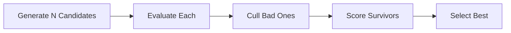
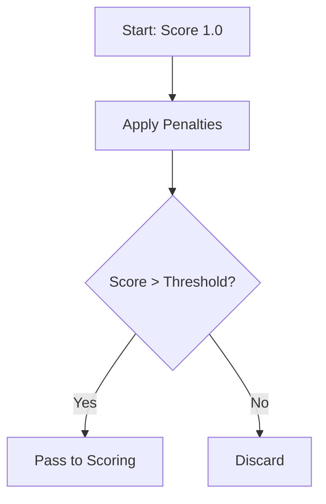
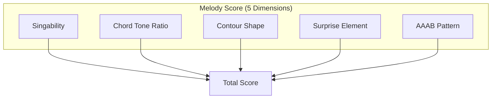
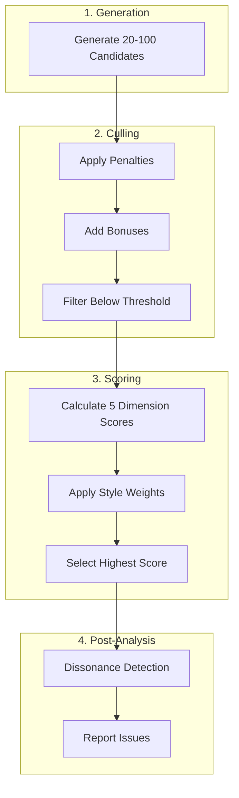

# Melody Evaluation System

This document explains the candidate selection and evaluation mechanism used in melody generation.

## Overview

MIDI Sketch generates multiple melody candidates and selects one through an evaluation system.



## Candidate Generation

### Section-Specific Candidate Counts

Different sections use different candidate counts:

| Section | Candidates | Notes |
|---------|-----------|-------|
| **Chorus** | 100 | Hook section |
| **B (Pre-chorus)** | 50 | Transition section |
| **Bridge / Chant** | 30 | Contrast section |
| **A (Verse) / Intro / Outro** | 20 | Stable sections |

### Generation Process

For each candidate:

1. **Rhythm Pattern** - Generate note positions and durations
2. **Pitch Selection** - Apply melody template (PlateauTalk, RunUpTarget, etc.)
3. **Constraint Application** - Apply singability and range limits
4. **Embellishment** - Add passing tones, neighbor tones

## Two-Stage Evaluation

Evaluation occurs in two stages: **Culling** (filter candidates) and **Scoring** (rank candidates).

### Stage 1: Culling

Candidates are filtered using penalty-based evaluation:



#### Penalties

| Penalty | Range | Detection Target |
|---------|-------|------------------|
| **High Register** | 0.0-1.0 | Consecutive high notes (above D5) |
| **Leap After High** | 0.0-1.0 | Large jump followed by high note |
| **Rapid Direction Change** | 0.0-1.0 | Zigzag patterns |
| **Monotony** | 0.0-1.0 | Repeated notes without variation |
| **Breathless** | 0.0-0.3 | Consecutive short notes without breaks |
| **Gap Ratio** | 0.0-1.0 | Scattered notes with silence between |

::: info Gap Ratio
The Gap Ratio penalty targets scattered, disconnected note patterns. Higher gap ratio indicates more silence between notes.
:::

#### Bonuses

| Bonus | Range | Detection Target |
|-------|-------|------------------|
| **Clear Peak** | 0.0-0.2 | Single high point in the phrase |
| **Motif Repeat** | 0.0-0.2 | AAAB repetition pattern |
| **Phrase Cohesion** | 0.0-1.0 | Notes forming coherent groups |

::: details Phrase Cohesion Criteria
- Stepwise motion runs (connected notes)
- Consistent rhythm patterns
- 3-gram cell repetition (interval + duration motifs)
:::

### Stage 2: Scoring

Candidates that pass culling are scored on 5 dimensions:



#### Singability Score

Measures interval distribution:

| Interval Type | Target Range |
|---------------|-------------|
| Step (1-2 semitones) | 40-50% |
| Same pitch | 20-30% |
| Small leap (3-4 semitones) | 15-25% |
| Large leap (5+ semitones) | 5-10% |

#### Chord Tone Ratio

Measures chord tone frequency on strong beats:

- **Strong beat**: Every 2 beats (tick % 960 == 0)
- Higher ratio indicates more consonant results

#### Contour Shape

Detects melodic shapes:
- **Arch**: Rise then fall
- **Wave**: Oscillating pattern
- **Descending**: Gradual descent

#### Surprise Element

Measures large leaps (5+ semitones) per phrase. Target: 1-2 leaps.

#### AAAB Pattern

Detects repetition with variation - same phrase repeats 3 times then varies.

## Style-Specific Weights

Different vocal styles use different evaluation weights:

| Style | Singability | Surprise | Plateau Bias | High Register |
|-------|-------------|----------|--------------|---------------|
| **Standard** | 0.25 | 0.15 | 1.0 | 1.0 |
| **Idol** | 0.30 | 0.12 | 1.2 | 1.0 |
| **Rock** | 0.20 | 0.20 | 0.8 | 1.2 |
| **Ballad** | 0.40 | 0.10 | 1.1 | 0.9 |
| **Anime** | 0.25 | 0.25 | 0.9 | 1.3 |
| **Vocaloid** | 0.10 | 0.25 | 0.6 | 1.1 |

::: details Parameter Definitions
- **Singability**: Weight for interval-based scoring
- **Surprise**: Weight for large leap detection
- **Plateau Bias**: Preference for same-pitch continuation
- **High Register**: Preference for higher pitches
:::

### Style-Specific Gap Thresholds

| Style | Gap Threshold | Notes |
|-------|--------------|-------|
| Ballad | Higher | More silence tolerated |
| Idol/Rock | Lower | Higher note density expected |

## Post-Generation Analysis

The Dissonance Analyzer checks harmonic issues after generation.

### Issue Types

| Type | Description | Example |
|------|-------------|---------|
| **Simultaneous Clash** | Two notes with dissonant interval | Bass E + Melody F = minor 2nd |
| **Non-Chord Tone** | Note not in current chord | D over C major chord |
| **Sustained Over Chord Change** | Note became non-chord after change | C sustained over F chord |
| **Non-Diatonic Note** | Note not in the key's scale | F# in C major |

### Severity Levels

| Severity | Intervals | Notes |
|----------|-----------|-------|
| **High** | Minor 2nd (1), Major 7th (11) | Strong dissonance |
| **Medium** | Tritone (6), Strong beat non-chord | Context-dependent |
| **Low** | Weak beat non-chord (passing tone) | Often acceptable |

### CLI Usage

```bash
# Generate and analyze
./midisketch_cli --seed 42 --analyze

# Analyze existing MIDI
./midisketch_cli --input song.mid --analyze
```

Output example:
```
=== Dissonance Analysis ===
Total issues: 3
  Simultaneous clashes: 1 (high: 1, medium: 0)
  Non-chord tones: 2 (medium: 1, low: 1)
```

## Pipeline Summary



## Summary

- Multiple candidates are generated per section (20-100)
- Two-stage evaluation: culling then scoring
- Style-specific weights adjust evaluation criteria
- Post-generation dissonance analysis available
