# Option Relationships

This document describes the relationships between `SongConfig` options in MIDI Sketch.

::: tip New to these settings?
The fields related here — `key`, `mood`, `formId`, the `chordExt*` family — are introduced one chapter at a time in the course. The capstone [Mapping Concepts to Config](/docs/course/config-mapping) collects them into a single lookup table.
:::

## Relationship Types

Options have the following relationships:

- **Dependency**: Child options are ignored unless parent option is enabled
- **Priority**: Special values (like 0) override other settings
- **Conflict**: Certain combinations cause validation errors
- **Implicit**: Setting one option automatically configures internal parameters

::: info Why This Matters
Understanding these relationships helps you avoid unexpected behavior. For example, setting `arpeggioPattern=2` has no effect if `arpeggioEnabled=false`.
:::

---

## 1. Dependency Relationships

### 1.1 Call System

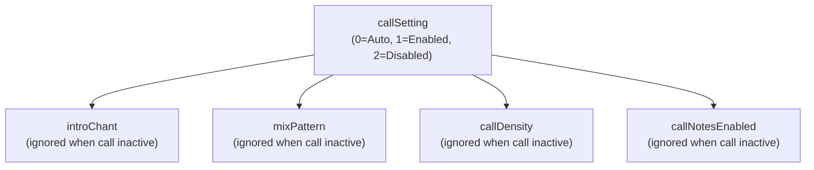

| Parent | Child | Description |
|--------|-------|-------------|
| call active (`callSetting=1`, or `0` resolved to on) | `introChant` | Type of intro chant section |
| call active | `mixPattern` | Type of MIX section |
| call active | `callDensity` | Call density in chorus |
| call active | `callNotesEnabled` | Output calls as MIDI notes |

::: warning callEnabled is Legacy
`callSetting` (0=Auto, 1=Enabled, 2=Disabled) replaced the boolean `callEnabled` in `SongConfig`. With `0` (Auto), the style/vocal-style decides whether calls are generated. `callEnabled` is still accepted for backward compatibility (`true`→1, `false`→2) but should not be used in new code. `AccompanimentConfig` still uses a plain `callEnabled` boolean.
:::

### 1.2 Arpeggio

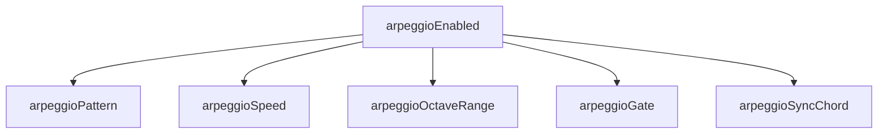

| Parent | Child | Description |
|--------|-------|-------------|
| `arpeggioEnabled=true` | `arpeggioPattern` | Up/Down/UpDown/Random/Pinwheel/PedalRoot/Alberti/BrokenChord (0-7) |
| `arpeggioEnabled=true` | `arpeggioSpeed` | Eighth/Sixteenth/Triplet |
| `arpeggioEnabled=true` | `arpeggioOctaveRange` | 1-3 octaves |
| `arpeggioEnabled=true` | `arpeggioGate` | Gate length (0.0-1.0, default 0.8; AccompanimentConfig uses 0-100) |
| `arpeggioEnabled=true` | `arpeggioSyncChord` | Sync with chord changes |
| `arpeggioEnabled=true` | `arpeggioBaseVelocity` | Base velocity for arpeggio notes (0-127, default 90) |

### 1.3 Humanization

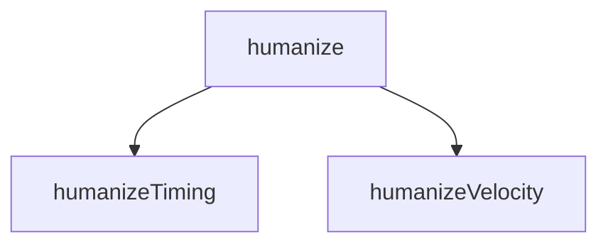

| Parent | Child | Description |
|--------|-------|-------------|
| `humanize=true` | `humanizeTiming` | Timing variation (0.0-1.0, default 0.4; AccompanimentConfig uses 0-100) |
| `humanize=true` | `humanizeVelocity` | Velocity variation (0.0-1.0, default 0.3; AccompanimentConfig uses 0-100) |

### 1.4 Chord Extensions

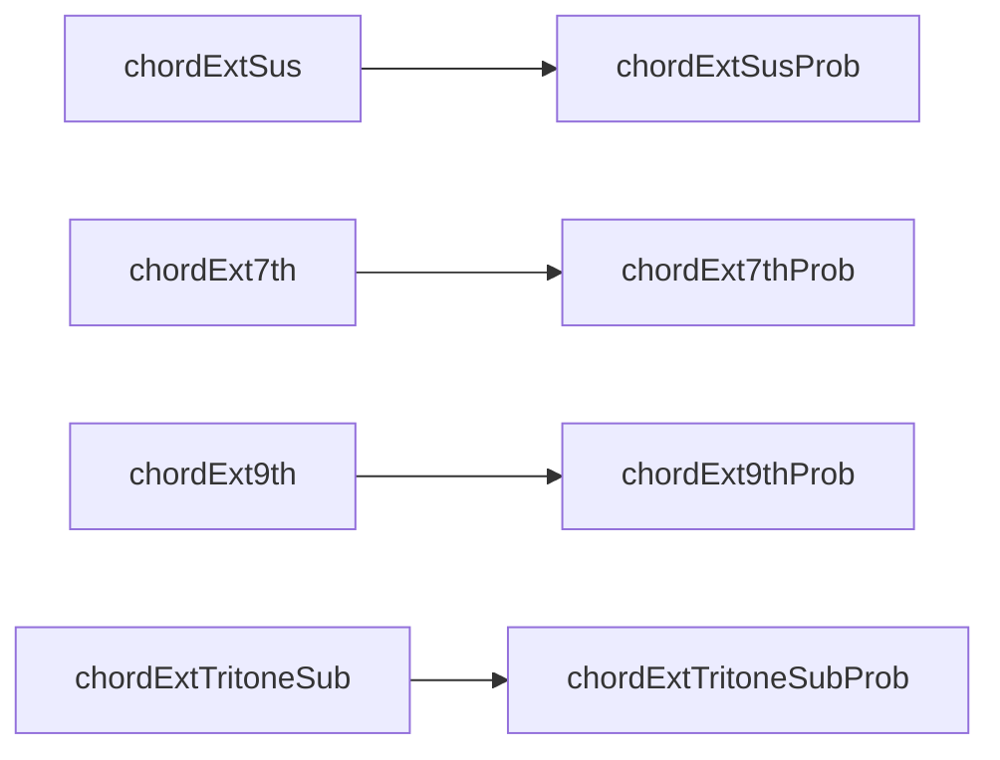

| Parent | Child | Description |
|--------|-------|-------------|
| `chordExtSus=true` | `chordExtSusProb` | Sus probability (0.0-1.0, default 0.2) |
| `chordExt7th=true` | `chordExt7thProb` | 7th probability (0.0-1.0, default 0.15) |
| `chordExt9th=true` | `chordExt9thProb` | 9th probability (0.0-1.0, default 0.25) |
| `chordExtTritoneSub=true` | `chordExtTritoneSubProb` | Tritone sub probability (0.0-1.0, default 0.5) |

::: info AccompanimentConfig Uses 0-100
The probabilities above are `SongConfig` values (0.0-1.0). The regeneration-oriented `AccompanimentConfig` keeps integer 0-100 ranges for the same fields (sus 20, 7th 30, 9th 25, tritone 50).
:::

### 1.5 Modulation

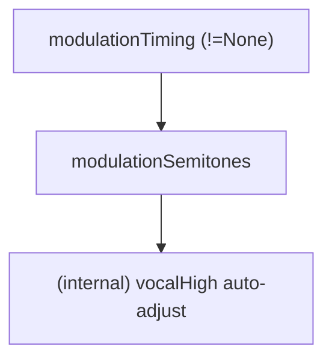

| Parent | Child | Description |
|--------|-------|-------------|
| `modulationTiming != None` | `modulationSemitones` | Modulation amount (1-4 semitones) |
| `modulationSemitones > 0` | (internal) `effective_vocal_high` | Auto-adjusted to fit post-modulation range |

**Notes**:
- When `modulationTiming=None`, `modulationSemitones` is not validated
- **Vocal range auto-adjustment**: When modulation is enabled, `effective_vocal_high = vocal_high - modulation_semitones` ensures vocal stays in range post-modulation
- **Works in all CompositionStyles**: Modulation is effective in BGM modes (BackgroundMotif, SynthDriven) as well

### 1.6 Vocal (skipVocal exclusion)

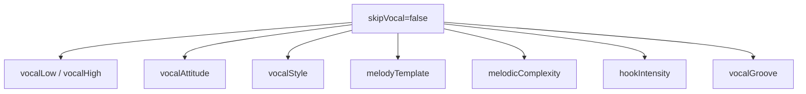

| Condition | Effective Options | Use Case |
|-----------|-------------------|----------|
| `skipVocal=false` | All vocal-related options | Normal song generation |
| `skipVocal=true` | All vocal options are ignored | **BGM-only generation (no vocal)** |

::: danger No Vocal Recovery
There is no API to add vocals after BGM-only generation. If you need vocals, use `compositionStyle=MelodyLead` or the **Vocal-First workflow** (see [JavaScript API](/docs/api-js)).
:::

### 1.7 Syncopation

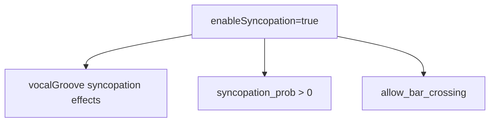

| Parent | Child | Description |
|--------|-------|-------------|
| `enableSyncopation=true` | `vocalGroove` syncopation effects | When false, syncopation weight=0.0 even with Syncopated groove |
| `enableSyncopation=false` | `syncopation_prob=0.0` | Syncopation probability forced to zero |
| `enableSyncopation=false` | `allow_bar_crossing=false` | Bar crossing forced off |

**Notes**: Timing offsets (e.g., +30 ticks for OffBeat) are applied regardless of `enableSyncopation`. Only the syncopation-specific weighting is affected.

### 1.8 Explicit Flags

| Parent | Child | Description |
|--------|-------|-------------|
| `moodExplicit=true` | `mood` (0-23) | Mood field is used directly; when false, mood is derived from `stylePresetId` |
| `formExplicit=true` | `formId` | Form is used exactly as specified; when false, Blueprint/randomization may override |
| `chordExtProbExplicit=true` | Chord extension probabilities | Mood-based chord extension probability auto-adjustment is suppressed |
| `drumsEnabledExplicit=true` | `drumsEnabled` | Explicit drum control; required to disable drums on drums_required blueprints |

### 1.9 Blueprint ID 9 (BehavioralLoop)

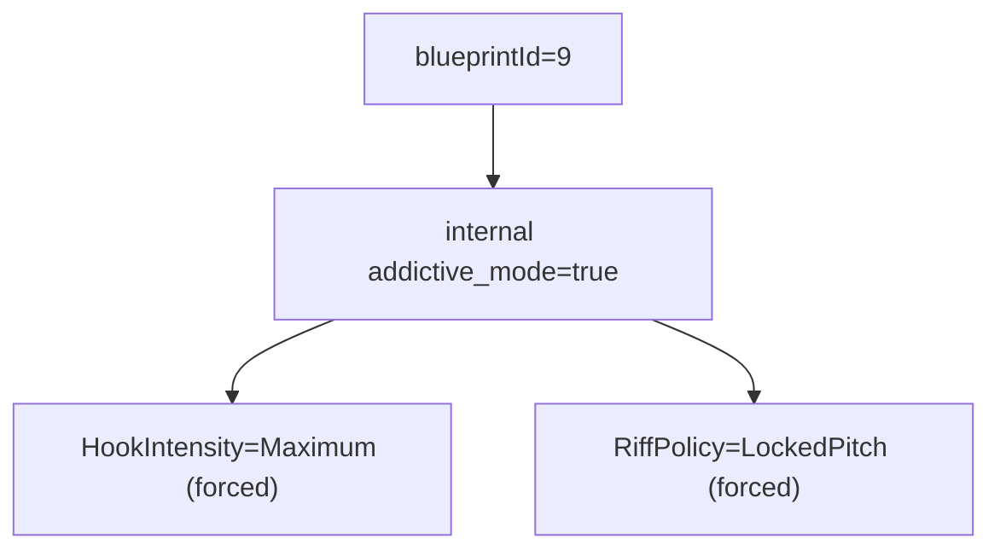

| Parent | Child | Description |
|--------|-------|-------------|
| `blueprintId=9` | `addictive_mode=true` | Internal addictive mode activated |
| `addictive_mode=true` | `HookIntensity=Maximum` | Hook intensity forced to maximum (internal level 4) |
| `addictive_mode=true` | `RiffPolicy=LockedPitch` | Riff policy forced to locked pitch |

---

## 2. CompositionStyle Branching

The value of `compositionStyle` determines which tracks are generated and which options are effective:

### 2.1 MelodyLead (0) - Default

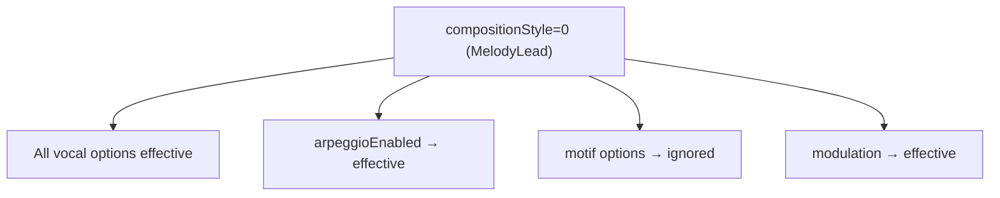

**Generated tracks**: Vocal → Aux → Motif (Blueprint-dependent) → Bass → Chord → Guitar → Arpeggio (if enabled) → Drums → SE

### 2.2 BackgroundMotif (1) - BGM-Only Mode

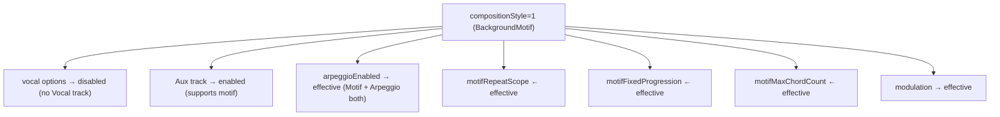

**Generated tracks**:
| arpeggioEnabled | Generated Tracks |
|-----------------|------------------|
| `false` | Aux + Motif + Bass + Chord + Guitar + Drums |
| `true` | Aux + Motif + Bass + Chord + Guitar + Drums + **Arpeggio** |

### 2.3 SynthDriven (2) - BGM-Only Mode

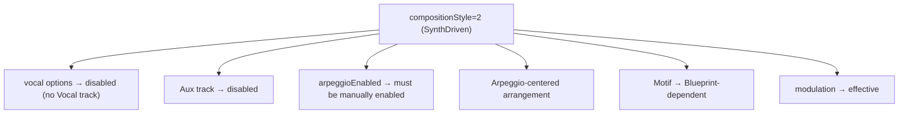

**Generated tracks**: Motif (Blueprint-dependent) + Bass + Chord + Guitar + Arpeggio (if enabled) + Drums

::: tip Choosing CompositionStyle
- **MelodyLead**: For songs with vocals (pop, rock, ballad)
- **BackgroundMotif**: For instrumental BGM with repeating melodic patterns (game music, ambient)
- **SynthDriven**: For electronic/synth-driven instrumental tracks
:::

---

## 3. Priority (Special Value Overrides)

| Option | Special Value | Behavior |
|--------|---------------|----------|
| `bpm` | `0` | Use style preset's default BPM |
| `seed` | `0` | Auto-generate random seed |
| `targetDurationSeconds` | `0` | Use structure pattern from `formId` |
| `vocalStyle` | `0` (Auto) | Random selection based on style |
| `melodyTemplate` | `0` (Auto) | Default selection based on style |
| `driveFeel` | `50` | Neutral (0=laid-back, 100=aggressive) |
| `moraRhythmMode` | `2` (Auto) | Auto-select from VocalStylePreset |

### driveFeel Details

| Value | Effect |
|-------|--------|
| `0` | Laid-back: timing delay, lower velocity |
| `50` | Neutral: standard timing (default) |
| `100` | Aggressive: timing push, higher velocity, syncopation boost (when `enableSyncopation=true`) |

### energyCurve Values

| Value | Name | Effect |
|-------|------|--------|
| `0` | GradualBuild | Gradual energy buildup (default) |
| `1` | FrontLoaded | High energy at start, calms down later |
| `2` | WavePattern | Wave-like energy progression |
| `3` | SteadyState | Maintains constant energy level |

::: info Using Zero Values
Zero often means "auto" or "use default". This is useful when you want style-appropriate defaults without specifying exact values.
:::

### Flowchart

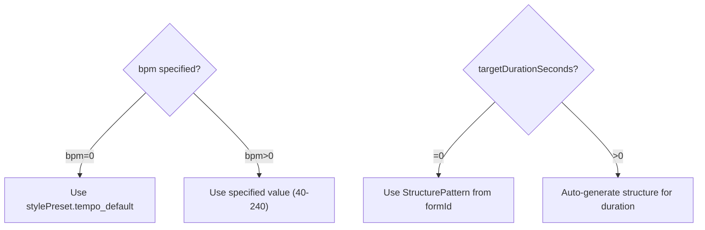

---

## 4. Melody Overrides

Melody overrides are applied **after** VocalStylePreset and MelodicComplexity processing. Sentinel values (0, 0xFF, or -128 depending on the parameter) mean "use preset default".

### 4.1 Melody Override Parameters

| Parameter | Range | Default | Description |
|-----------|-------|---------|-------------|
| `melodyMaxLeap` | 0=preset, 1-12 | 0 | Maximum interval leap (semitones) |
| `melodySyncopationProb` | 0-100, 0xFF=preset | 0xFF | Syncopation probability (%) |
| `melodyPhraseLength` | 0=preset, 1-8 | 0 | Phrase length (bars) |
| `melodyLongNoteRatio` | 0-100, 0xFF=preset | 0xFF | Long note ratio (%) |
| `melodyChorusRegisterShift` | -12 to +12, -128=preset | -128 | Chorus register shift (semitones) |
| `melodyHookRepetition` | 0=preset, 1=off, 2=on | 0 | Hook repetition pattern |
| `melodyUseLeadingTone` | 0=preset, 1=off, 2=on | 0 | Leading tone insertion at section boundaries |

### 4.2 Tri-State Parameters

`melodyHookRepetition` and `melodyUseLeadingTone` use a tri-state design:

| Value | Meaning |
|-------|---------|
| `0` | Use preset/VocalStylePreset value (default) |
| `1` | Explicitly OFF |
| `2` | Explicitly ON |

### 4.3 Preset-Only Parameters (No Override)

The following are controlled by VocalStylePreset only and have no SongConfig override:
- `chorus_long_tones`: Long notes in chorus (active for Idol/Rock/Anime etc.)
- `allow_bar_crossing`: Allow notes crossing bar lines (active for Vocaloid/Rock/Anime etc.)
- `allow_unison_repeat`: Allow consecutive same-pitch notes (default true)

---

## 5. Motif Overrides

Motif overrides control the melodic motif generation parameters in BackgroundMotif mode and Blueprint-based motif sections.

### 5.1 Motif Override Parameters

| Parameter | Range | Default | Description |
|-----------|-------|---------|-------------|
| `motifLength` | 0=auto, 1/2/4 | 0 | Motif length (beats) |
| `motifNoteCount` | 0=auto, 3-8 | 0 | Number of notes in motif |
| `motifMotion` | 0xFF=preset, 0-4 | 0xFF | Pitch motion type |
| `motifRegisterHigh` | 0=auto, 1=low, 2=high | 0 | Register (0=mid range) |
| `motifRhythmDensity` | 0xFF=preset, 0-2 | 0xFF | Rhythm density |

### 5.2 MotifMotion Values

| Value | Name | Description |
|-------|------|-------------|
| 0 | Stepwise | Scale steps only (2nds) |
| 1 | GentleLeap | Up to 3rds |
| 2 | WideLeap | Up to 5ths |
| 3 | NarrowStep | Narrow scale degrees (jazzy) |
| 4 | Disjunct | Irregular leaps (experimental) |
| 5 | Ostinato | Same pitch class repetition (**internal Blueprint only**, not available via API) |

::: warning Ostinato Motion
`motifMotion=5` (Ostinato) is reserved for internal Blueprint definitions. The API exposes values 0-4 only. Values above 4 are clamped to 4 via `min(val, 4)`.
:::

### 5.3 MotifRhythmDensity Values

| Value | Name | Description |
|-------|------|-------------|
| 0 | Sparse | Low density pattern |
| 1 | Medium | Standard density |
| 2 | Driving | High density pattern |

---

## 6. Validation Conflicts

### 6.1 Parameter Valid Ranges

| Parameter | Valid Range | Error Code |
|-----------|-------------|------------|
| `stylePresetId` | 0-16 | `INVALID_STYLE` |
| `key` | 0-11 | `INVALID_KEY` |
| `bpm` | 0, 40-240 | `INVALID_BPM` |
| `chordProgressionId` | 0-21 | `INVALID_CHORD` |
| `formId` | 0-17 | `INVALID_FORM` |
| `vocalAttitude` | Style-dependent (allowedAttitudes bitmask) | `INVALID_ATTITUDE` |
| `vocalLow`, `vocalHigh` | 36-96, low ≤ high | `INVALID_VOCAL_RANGE` |
| `compositionStyle` | 0-2 | `INVALID_COMPOSITION_STYLE` |
| `vocalStyle` | 0-13 | `INVALID_VOCAL_STYLE` |
| `melodyTemplate` | 0-7 | `INVALID_MELODY_TEMPLATE` |
| `melodicComplexity` | 0-2 | `INVALID_MELODIC_COMPLEXITY` |
| `hookIntensity` | 0-4 | `INVALID_HOOK_INTENSITY` |
| `vocalGroove` | 0-5 | `INVALID_VOCAL_GROOVE` |
| `modulationTiming` | 0-4 | `INVALID_MODULATION_TIMING` |
| `modulationSemitones` | 1-4 (when timing!=0) | `INVALID_MODULATION` |
| `arpeggioPattern` | 0-7 | `INVALID_ARPEGGIO_PATTERN` |
| `arpeggioSpeed` | 0-2 | `INVALID_ARPEGGIO_SPEED` |
| `callDensity` | 0-3 | `INVALID_CALL_DENSITY` |
| `introChant` | 0-2 | `INVALID_INTRO_CHANT` |
| `mixPattern` | 0-2 | `INVALID_MIX_PATTERN` |
| `motifRepeatScope` | 0-1 | `INVALID_MOTIF_REPEAT_SCOPE` |
| `arrangementGrowth` | 0-1 | `INVALID_ARRANGEMENT_GROWTH` |
| `blueprintId` | 0-9, 255 | (255=auto random) |

### 6.2 Parameters NOT Validated by validateSongConfig

The following parameters are **not** checked by `validateSongConfig()`. Invalid values are clamped or ignored internally by the config converter:

| Parameter | Effective Range | Notes |
|-----------|----------------|-------|
| `enableSyncopation` | boolean | No validation needed |
| `energyCurve` | 0-3 | Used within enum range |
| `driveFeel` | 0-100 | 0=laid-back, 50=neutral, 100=aggressive |
| `moraRhythmMode` | 0-2 | 0=Standard, 1=MoraTimed, 2=Auto |
| `melodyMaxLeap` | 0=preset, 1-12 | Passed through directly |
| `melodySyncopationProb` | 0-100, 0xFF=preset | Converted to 0-1.0f |
| `melodyPhraseLength` | 0=preset, 1-8 | Passed through directly |
| `melodyLongNoteRatio` | 0-100, 0xFF=preset | Converted to 0-1.0f |
| `melodyChorusRegisterShift` | -128=preset, -12 to +12 | Passed through directly |
| `melodyHookRepetition` | 0-2 | Tri-state |
| `melodyUseLeadingTone` | 0-2 | Tri-state |
| `motifLength` | 0=auto, 1/2/4 | Processed by switch statement; invalid values ignored |
| `motifNoteCount` | 0=auto, 3-8 | Clamped to 3-8 |
| `motifMotion` | 0xFF=preset, 0-4 | Clamped via min(val, 4); Ostinato(5) is internal only |
| `motifRegisterHigh` | 0=auto, 1=low, 2=high | Passed through directly |
| `motifRhythmDensity` | 0xFF=preset, 0-2 | Clamped via min(val, 2) |

### 6.3 Style x Attitude Combinations

Each style preset has `allowedAttitudes` bit flags. Specifying a non-allowed attitude causes an error:

```typescript
// Example: Style allows only Clean and Expressive
allowedAttitudes = ATTITUDE_CLEAN | ATTITUDE_EXPRESSIVE  // 0b011 = 3

vocalAttitude = 2 (Raw) → INVALID_ATTITUDE error
```

Check allowed attitudes with: `midisketch_style_preset_allowed_attitudes(styleId)`

### 6.4 Modulation x Semitones Dependency

| modulationTiming | modulationSemitones | Result |
|------------------|---------------------|--------|
| 0 (None) | any (ignored) | OK |
| 1-4 | 0 | `INVALID_MODULATION` |
| 1-4 | 1-4 | OK |
| 1-4 | 5+ | `INVALID_MODULATION` |

### 6.5 Call x Duration x BPM Conflict

```
IF call is active (callSetting=1, or 0 resolved to on) AND targetDurationSeconds > 0
THEN targetDurationSeconds >= getMinimumSecondsForCall(introChant, mixPattern, bpm)
```

Minimum time calculation:
```
min_bars = 24 + introChant_bars + mixPattern_bars
min_seconds = min_bars * 240 / bpm
```

| bpm | Base minimum (call enabled) | With introChant/mixPattern |
|-----|---------------------------|---------------------------|
| 40 | **144 seconds** | Even longer |
| 60 | **96 seconds** | Even longer |
| 120 | **48 seconds** | Even longer |
| 240 | **24 seconds** | Even longer |

**Solution**: Use `targetDurationSeconds=0` (auto) to let the system determine appropriate length.

### 6.6 Dangerous Combinations

::: danger Avoid These Combinations
The following combinations will cause validation errors or unexpected behavior. Check your parameters before generation.
:::

| Pattern | Cause | Fix |
|---------|-------|-----|
| `modulationTiming!=0` + `modulationSemitones=0` | Modulation enabled but amount invalid | Set `modulationSemitones=2` |
| `callSetting=1` + `targetDurationSeconds=30` + `bpm=40` | Duration too short | Set `targetDurationSeconds=0` |
| `vocalLow=80` + `vocalHigh=60` | Range inverted | Ensure low <= high |
| `vocalLow=30` or `vocalHigh=100` | Out of range | Use 36-96 |
| `bpm=300` | BPM out of range | Use 40-240 |
| `blueprintId=1,5,7` + `drumsEnabled=false` without `drumsEnabledExplicit=true` | drums_required Blueprint forces drums on | Set `drumsEnabledExplicit: true` to explicitly disable |
| `enableSyncopation=false` + high `vocalGroove` values | Syncopation effects silently disabled | Set `enableSyncopation: true` for syncopation effects |
| Blueprint `mood_mask` mismatch | Mood incompatible with selected Blueprint | Check compatibility with `isMoodCompatible(blueprintId, mood)` |

---

## 7. Guitar Track

`guitarEnabled` controls guitar track generation.

| Property | Value |
|----------|-------|
| Default (`SongConfig`, JS and C++) | `true` |
| Default (`AccompanimentConfig`) | `true` |

::: tip Guitar is On by Default
The guitar track is generated by default. Set `guitarEnabled: false` to disable it. Whether a blueprint keeps the guitar below the vocal register is controlled by the blueprint's `guitar_below_vocal` constraint.
:::

---

## 8. Tritone Substitution

`chordExtTritoneSub` and `chordExtTritoneSubProb` enable V7 to bII7 tritone substitution.

| Property | Description |
|----------|-------------|
| `chordExtTritoneSub` | Enable/disable tritone substitution (default `false`) |
| `chordExtTritoneSubProb` | Probability of tritone substitution (`SongConfig`: 0.0-1.0, default 0.5 / `AccompanimentConfig`: 0-100, default 50) |

::: info Availability
Tritone substitution is available in both the JS `SongConfig` (for full-song generation) and `AccompanimentConfig` (for accompaniment regeneration), as well as the C++ `chord_extension` struct. See [Harmony](/docs/harmony#tritone-substitution) for the musical background.
:::

---

## 9. Mood-Dependent Chord Extension Probabilities

When `chordExtProbExplicit=false` (default), mood automatically adjusts chord extension probabilities:

| Mood | 7th Probability | 9th Probability | sus Probability |
|------|----------------|-----------------|-----------------|
| CityPop | 0.40 | 0.25 | - |
| RnBNeoSoul | 0.50 | 0.35 | - |
| Ballad/Sentimental | 0.30 | - | 0.25 |
| Nostalgic/Chill | 0.25 | - | - |
| Lofi | 0.40 | 0.30 | - |

Setting `chordExtProbExplicit=true` suppresses this auto-adjustment, using your explicit probability values instead.

---

## 10. drumsEnabledExplicit Behavior

The `drumsEnabledExplicit` flag controls whether the engine respects your `drumsEnabled` setting for drums_required blueprints.

| drumsEnabledExplicit | drumsEnabled | Blueprint drums_required | Result |
|---------------------|-------------|------------------------|--------|
| `false` (default) | `false` | `true` (ID 1,5,7) | **Drums forced ON** |
| `false` (default) | `true` | any | Drums enabled |
| `true` | `false` | `true` (ID 1,5,7) | **Drums disabled** (explicit override respected) |
| `true` | `false` | `false` | Drums disabled |

::: warning Drums Required Blueprints
Without `drumsEnabledExplicit=true`, blueprints with `drums_required=true` (ID 1, 5, 7) will force drums on regardless of your `drumsEnabled` setting. Use `getBlueprintDrumsRequired(id)` to query this at runtime.
:::

---

## 11. Recommended Combinations

### 11.1 Simple Pop (Default)

```javascript
{
  stylePresetId: 0,
  compositionStyle: 0,  // MelodyLead
  drumsEnabled: true,
  arpeggioEnabled: false,
  callSetting: 2        // Disabled
}
```

### 11.2 Vocaloid Style

```javascript
{
  stylePresetId: 14,  // Anime Opening
  compositionStyle: 0,
  vocalStyle: 2,      // Vocaloid - high density, wide leaps
  arpeggioEnabled: true,
  arpeggioSpeed: 1    // Sixteenth
}
```

### 11.3 Idol Song (with Calls)

```javascript
{
  stylePresetId: 3,   // Idol Standard
  vocalStyle: 4,      // Idol
  callSetting: 1,     // Enabled
  introChant: 1,      // Gachikoi
  mixPattern: 2,      // Tiger
  callDensity: 2,     // Standard
  callNotesEnabled: true,
  targetDurationSeconds: 180  // 3+ minutes required
}
```

### 11.4 BGM Mode (Motif + Arpeggio)

```javascript
{
  compositionStyle: 1,  // BackgroundMotif (BGM-only)
  // No need to set skipVocal (auto-disabled in BackgroundMotif)

  // Motif settings
  motifFixedProgression: true,
  motifMaxChordCount: 4,

  // Arpeggio (also available in BackgroundMotif)
  arpeggioEnabled: true,      // → Motif + Arpeggio both generated
  arpeggioPattern: 2,         // UpDown
  arpeggioSpeed: 1,           // Sixteenth
  arpeggioOctaveRange: 2,
  arpeggioGate: 80,

  // Modulation (works in BGM mode too)
  modulationTiming: 1,        // LastChorus
  modulationSemitones: 2      // +2 semitones
}
// Output: Motif + Bass + Chord + Drums + Arpeggio (modulates +2 at last chorus)
```

### 11.5 BGM Mode (Arpeggio-Centered)

```javascript
{
  compositionStyle: 2,  // SynthDriven (BGM-only)
  arpeggioEnabled: true,      // Must be explicitly enabled (NOT auto-enabled)
  arpeggioPattern: 0,         // Up
  arpeggioSpeed: 2,           // Triplet
  arpeggioOctaveRange: 3,

  // Modulation (works in BGM mode too)
  modulationTiming: 2,        // AfterBridge
  modulationSemitones: 3      // +3 semitones
}
// Output: Bass + Chord + Drums + Arpeggio (no Motif, modulates +3 after bridge)
```

### 11.6 Syncopated Feel

```javascript
{
  enableSyncopation: true,
  vocalGroove: 3  // Syncopated
}
// vocalGroove=3 syncopation effects are active with enableSyncopation=true
```

### 11.7 Driving 16th

```javascript
{
  enableSyncopation: true,
  vocalGroove: 4,   // Driving16th
  driveFeel: 80     // Aggressive drive
}
// 16th note emphasis + high driveFeel for aggressive syncopation
```

### 11.8 Melody Control

```javascript
{
  melodyMaxLeap: 5,
  melodyPhraseLength: 4,
  melodyLongNoteRatio: 60,
  melodyHookRepetition: 2  // Explicitly ON
}
// Smaller leaps, 4-bar phrases, 60% long notes, hook repetition ON
```

### 11.9 R&B Style

```javascript
{
  moodExplicit: true,
  mood: 20,           // RnBNeoSoul
  chordExt7th: true,
  chordExt9th: true
}
// Strong swing, extended chords, 85-100 BPM
```

### 11.10 Guitar + Lo-fi

```javascript
{
  guitarEnabled: true,
  moodExplicit: true,
  mood: 23,            // Lofi
  compositionStyle: 1  // BackgroundMotif
}
// 80 BPM, strong swing, velocity cap 90, guitar track enabled
```

---

## 12. Implicit Internal Settings

Certain parameters automatically configure internal values when set.

### 12.1 VocalStylePreset → Melody Parameters

Setting `vocalStyle` automatically configures internal melody generation parameters:

| Parameter | Description |
|-----------|-------------|
| `max_leap_interval` | Maximum leap width (semitones) |
| `syncopation_prob` | Syncopation probability |
| `verse/chorus_density_modifier` | Section-specific density coefficient |
| `hook_repetition` | Whether to repeat hooks |
| `chorus_long_tones` | Long notes in chorus |
| `tension_usage` | Tension usage rate |

**VocalStylePreset List** (0-13):

| ID | Name | Characteristics |
|----|------|-----------------|
| 0 | Auto | Random selection based on style |
| 1 | Standard | Standard pop |
| 2 | Vocaloid | High density, wide leaps, syncopation (singable) |
| 3 | UltraVocaloid | Ultra-fast, extreme leaps (machine-oriented) |
| 4 | Idol | Catchy, hook-focused |
| 5 | Ballad | Relaxed, long notes |
| 6 | Rock | Powerful, chorus emphasis |
| 7 | CityPop | Stylish, uses tensions |
| 8 | Anime | Dramatic, strong hooks |
| 9 | BrightKira | Bright, sparkly |
| 10 | CoolSynth | Cool, many 16th notes |
| 11 | CuteAffected | Cute, moderate syncopation |
| 12 | PowerfulShout | Powerful, long notes + high density |
| 13 | KPop | K-Pop style, syncopation focus, hook-driven |

### 12.2 MelodicComplexity → Multiple Parameters

| melodicComplexity | Auto Settings |
|-------------------|---------------|
| `Simple (0)` | `note_density *= 0.7`, `max_leap_interval <= 5`, `hook_repetition=true`, `tension_usage *= 0.5`, `sixteenth_note_ratio *= 0.5`, `syncopation_prob *= 0.5` |
| `Standard (1)` | No changes (default) |
| `Complex (2)` | `note_density *= 1.3`, `max_leap_interval *= 1.5` (max 12), `tension_usage *= 1.5`, `sixteenth_note_ratio *= 1.5` (max 0.5), `syncopation_prob *= 1.5` (max 0.5) |

### 12.3 VocalAttitude → Pitch Selection

| vocalAttitude | Pitch Candidates | Musical Characteristics |
|---------------|-----------------|------------------------|
| `Clean (0)` | Chord tones only (1, 3, 5) | Safe, consonant, stable |
| `Expressive (1)` | Chord tones + tensions (7th, 9th) | Colorful, delayed resolution |
| `Raw (2)` | All scale tones | Edgy, non-chord tone landing |

### 12.4 CompositionStyle → Implicit Behavior

| compositionStyle | Implicit Behavior |
|------------------|-------------------|
| `BackgroundMotif (1)` | **Vocal disabled** (not generated), **Aux enabled** (supports motif), Motif track generated, **modulation works** |
| `SynthDriven (2)` | **Vocal/Aux completely disabled**, Motif Blueprint-dependent, **Arpeggio requires manual `arpeggioEnabled=true`**, **modulation works** |

### 12.5 Auto-Call Activation

When `callSetting=0` (Auto), certain vocal styles automatically enable calls:

| vocalStyle | Name | Auto-Call |
|------------|------|:---------:|
| 4 | Idol | Yes |
| 9 | BrightKira | Yes |
| 11 | CuteAffected | Yes |

Other vocal styles do not trigger auto-call activation.

```javascript
// Example: SynthDriven requires explicit arpeggio enabling
{
  compositionStyle: 2,  // SynthDriven (BGM-only)
  arpeggioEnabled: true,   // Must be explicitly set for arpeggio
  modulationTiming: 1,     // Works in BGM mode
  modulationSemitones: 2
  // Note: No Vocal/Aux tracks generated in this mode
}
```

### 12.6 VocalGrooveFeel → Timing Adjustment

| vocalGroove | Effect |
|-------------|--------|
| `Straight (0)` | No change |
| `OffBeat (1)` | Delay on-beat notes (+30 ticks) |
| `Swing (2)` | Delay 8th note 2nd beat |
| `Syncopated (3)` | Anticipate beats 2, 4 (-30 ticks) |
| `Driving16th (4)` | Emphasize 16th notes |
| `Bouncy8th (5)` | Bounce feel on 8th notes |

**Syncopation dependency**: When `enableSyncopation=false`, syncopation weight is 0.0 for all groove feels, and `syncopation_prob=0.0` / `allow_bar_crossing=false` are forced. Timing offsets (+30 ticks etc.) apply regardless of `enableSyncopation`.

### 12.7 hookIntensity → Phrase Generation Changes

| hookIntensity | Duration Multiplier | Velocity Addition | Target Sections |
|---------------|--------------------|--------------------|-----------------|
| `Off (0)` | - | - | None |
| `Light (1)` | x1.3 | +5 | Chorus, B |
| `Normal (2)` | x1.5 | +10 | Chorus, B |
| `Strong (3)` | x2.0 | +15 | **All sections** |

::: warning Maximum (4) is for Behavioral Loop
`hookIntensity=4` (Maximum) is intended for BehavioralLoop mode and is set automatically when `blueprintId=9` or `addictiveMode=true`. It passes validation if set explicitly, but it forces maximum repetition with simple patterns, so for normal songs use 0-3.
:::

---

## 13. Parameter Application Order

Parameters are applied in this specific order. Later stages override earlier ones:

```
1. StylePreset          → Base parameters (melody_params, mood, bpm default)
2. VocalStylePreset     → max_leap, syncopation, density preset adjustments
3. MelodicComplexity    → Density multiplier, leap multiplier, hook_repetition
4. SongConfig Overrides → Melody/motif override parameters (user values take priority)
5. Master Switch        → enableSyncopation=false forces syncopation_prob=0.0
```

### Structure Building Priority

Structure is determined by the first matching rule:

```
1. targetDurationSeconds > 0  → Time-based auto-build
2. formExplicit = true        → Use formId exactly (ignore Blueprint section_flow)
3. Blueprint section_flow     → Blueprint-defined section structure
4. Default                    → Build from StructurePattern
```

---

## 14. Option Dependency Tree

```
SongConfig
├── Basic Settings
│   ├── stylePresetId     ─────┐
│   ├── key                    │ Style determines defaults
│   ├── bpm (0=default)        │ for other options
│   └── seed (0=random)        │
│                              ▼
├── Structure ◄────────────────┤
│   ├── formId                 │
│   ├── formExplicit ──────────┴─▶ true=use formId exactly
│   └── targetDurationSeconds ───▶ Exclusive with formId (auto if >0)
│
├── Mood
│   ├── moodExplicit ─────────────▶ true=use mood field
│   └── mood (0-23) ─────────────▶ Ignored if moodExplicit=false
│
├── Vocal (only when skipVocal=false)
│   ├── vocalAttitude  ◄────────── Restricted by style
│   ├── vocalStyle     ◄────────── 0=Auto, 1-13=explicit preset
│   ├── vocalLow/High
│   ├── melodicComplexity
│   ├── hookIntensity
│   ├── vocalGroove    ◄────────── Syncopation effects require enableSyncopation=true
│   └── Melody Overrides
│       ├── melodyMaxLeap
│       ├── melodySyncopationProb
│       ├── melodyPhraseLength
│       ├── melodyLongNoteRatio
│       ├── melodyChorusRegisterShift
│       ├── melodyHookRepetition
│       └── melodyUseLeadingTone
│
├── Arpeggio (only when arpeggioEnabled=true)
│   ├── arpeggioPattern
│   ├── arpeggioSpeed
│   ├── arpeggioOctaveRange
│   ├── arpeggioGate
│   └── arpeggioSyncChord
│
├── Call System (only when call is active: callSetting=1, or 0 resolved to on)
│   ├── introChant
│   ├── mixPattern  ─────────────▶ Conflicts with targetDurationSeconds
│   ├── callDensity
│   └── callNotesEnabled
│
├── Chord Extensions (prob effective only when enabled=true)
│   ├── chordExtSus  → chordExtSusProb
│   ├── chordExt7th  → chordExt7thProb
│   ├── chordExt9th  → chordExt9thProb
│   └── chordExtProbExplicit ────▶ true=suppress mood-based auto-adjustment
│
├── Modulation (only when modulationTiming!=None)
│   └── modulationSemitones
│
├── Humanize (only when humanize=true)
│   ├── humanizeTiming
│   └── humanizeVelocity
│
├── Track Toggles
│   ├── drumsEnabled
│   ├── drumsEnabledExplicit ────▶ true=respect drumsEnabled for drums_required blueprints
│   └── guitarEnabled ───────────▶ default=true (set false to disable)
│
├── Master Switches
│   ├── enableSyncopation ───────▶ false=syncopation weight 0.0
│   ├── energyCurve ─────────────▶ 0-3 energy progression
│   └── driveFeel ───────────────▶ 0-100 timing/velocity feel
│
├── Motif Overrides (BackgroundMotif / Blueprint motif sections)
│   ├── motifLength
│   ├── motifNoteCount
│   ├── motifMotion
│   ├── motifRegisterHigh
│   └── motifRhythmDensity
│
└── CompositionStyle-dependent
    ├── compositionStyle=0 (MelodyLead): Vocal/Aux enabled, standard
    ├── compositionStyle=1 (BackgroundMotif): BGM-only (Vocal disabled, Aux enabled)
    │   ├── motifRepeatScope
    │   ├── motifFixedProgression
    │   └── motifMaxChordCount
    └── compositionStyle=2 (SynthDriven): BGM-only (Vocal/Aux disabled, arpeggio requires manual enabling)
```

---

## 15. Workflow-Specific Options

### 15.1 generateVocal(config) - Used Parameters

| Category | Parameter | Used | Description |
|----------|-----------|:----:|-------------|
| **Basic** | `stylePresetId` | Yes | Style determination |
| | `key` | Yes | Key (internal C major, transpose at output) |
| | `bpm` | Yes | Tempo (0=style default) |
| | `seed` | Yes | Random seed |
| | `chordProgressionId` | Yes | Chord progression (melody reference) |
| | `formId` | Yes | Structure pattern |
| **Vocal** | `vocalLow` | Yes | Range lower bound |
| | `vocalHigh` | Yes | Range upper bound |
| | `vocalAttitude` | Yes | Expression style |
| | `vocalStyle` | Yes | Vocal style preset |
| | `melodicComplexity` | Yes | Melody complexity |
| | `hookIntensity` | Yes | Hook strength |
| | `vocalGroove` | Yes | Groove feel |
| **Ignored** | `drumsEnabled` | No | Vocal only |
| | `arpeggioEnabled` | No | Vocal only |
| | `humanize` | No | Applied when accompaniment added |

### 15.2 generateAccompaniment(config?) - Used Parameters

| Category | Parameter | Used | Description |
|----------|-----------|:----:|-------------|
| **Tracks** | `drumsEnabled` | Yes | Generate drums |
| | `arpeggioEnabled` | Yes | Generate arpeggio |
| | `guitarEnabled` | Yes | Generate guitar |
| | `arpeggio.*` | Yes | Arpeggio settings |
| | `chordExt*` | Yes | Chord extension settings |
| | `chordExtTritoneSub` | Yes | Tritone substitution |
| **Post-processing** | `humanize` | Yes | Apply humanization |
| | `humanizeTiming` | Yes | Timing variation |
| | `humanizeVelocity` | Yes | Velocity variation |
| **SE/Call** | `seEnabled` | Yes | SE track generation |
| | `callEnabled` | Yes | Call feature (boolean in AccompanimentConfig) |
| | `callDensity` | Yes | Call density |

### 15.3 regenerateVocal(configOrSeed) - Used Parameters

**Seed only** (`regenerateVocal(12345)`):
- Only `seed` is changed; other parameters use previous `generateVocal` settings

**VocalConfig** (`regenerateVocal({...})`):
| Parameter | Used | Description |
|-----------|:----:|-------------|
| `seed` | Yes | New random seed |
| `vocalLow` | Yes | Change range lower bound |
| `vocalHigh` | Yes | Change range upper bound |
| `vocalAttitude` | Yes | Change expression style |
| `vocalStyle` | Yes | Change vocal style preset |
| `melodicComplexity` | Yes | Change complexity |
| `hookIntensity` | Yes | Change hook strength |
| `vocalGroove` | Yes | Change groove |
| `keepMotif` | Yes | RhythmSync only: keep the existing Motif as the rhythmic axis (default `false` = regenerate both) |

**Note**: Chord progression and structure are NOT changed (continues from generateVocal settings).

---

## 16. Parameter Application Flow

```
SongConfig
    │
    ├── stylePresetId ──→ mood, compositionStyle, bpm(default), melody_params
    │                           │
    │                           ▼ (can be overridden by explicit setting)
    ├── compositionStyle ──────────────→ Final compositionStyle
    ├── bpm ───────────────────────────→ Final BPM
    │
    ├── vocalStyle ─────────→ melody_params override ─────→ │
    │       │                                               │
    │       └── (Auto) ────→ Random selection               │
    │                                                       ▼
    ├── melodicComplexity ─→ melody_params multiplier ────→ │
    │                                                       ▼
    ├── Melody Overrides ──→ Individual param override ───→ Final melody_params
    │
    ├── hookIntensity ─────→ Chorus/B section note adjustment
    │
    ├── vocalGroove ───────→ All note timing adjustment
    │
    ├── enableSyncopation ─→ Master syncopation switch (false=weight 0.0)
    │
    └── callSetting ──────→ (if 0=Auto) determined by vocalStyle → call enabled
```

**Application order**: `StylePreset` → `VocalStylePreset` → `MelodicComplexity` → `SongConfig Overrides (melody/motif)` → `Master Switch (enableSyncopation)`

---

## 17. Production Blueprint Overrides

Production Blueprints control **how** the music is generated, independent of style/mood settings.

### 17.1 Blueprint List

| ID | Name | Paradigm | RiffPolicy | Requires Drums | Weight |
|----|------|----------|------------|:--------------:|:------:|
| 0 | Traditional | Traditional | Free | - | 42% |
| 1 | RhythmLock | RhythmSync | Locked | **Yes** | 14% |
| 2 | StoryPop | MelodyDriven | Evolving | - | 10% |
| 3 | Ballad | MelodyDriven | Free | - | 4% |
| 4 | IdolStandard | MelodyDriven | Evolving | - | 10% |
| 5 | IdolHyper | RhythmSync | Locked | **Yes** | 6% |
| 6 | IdolKawaii | MelodyDriven | Locked | **Yes** | 5% |
| 7 | IdolCoolPop | RhythmSync | Locked | **Yes** | 5% |
| 8 | IdolEmo | MelodyDriven | Locked | - | 4% |
| 9 | BehavioralLoop | Traditional | LockedPitch | - | 0%* |
| 255 | (Random) | - | - | - | - |

\* BehavioralLoop has 0% weight and is never randomly selected; it must be explicitly chosen. When selected, it forces `addictive_mode=true`, `HookIntensity=Maximum`, and `RiffPolicy=LockedPitch`.

### 17.2 Paradigm Types

| Paradigm | Description | Generation Order |
|----------|-------------|------------------|
| Traditional | Classic pop generation | Vocal → Aux → Motif → Bass → Chord → Guitar → Arpeggio → Drums → SE |
| RhythmSync | Rhythm-synchronized generation | Motif → Vocal → Aux → Bass → Chord → Guitar → Arpeggio → Drums → SE |
| MelodyDriven | Melody-centered arrangement | Vocal → Aux → Motif → Bass → Chord → Guitar → Arpeggio → Drums → SE |

### 17.3 RiffPolicy Types

| Policy | Description | Effect on motifRepeatScope |
|--------|-------------|---------------------------|
| Free | Each section varies | Uses `motifRepeatScope` setting |
| Locked | Pitch contour fixed, expression varies | **Ignores** `motifRepeatScope` |
| Evolving | 30% chance to change every 2 sections | **Ignores** `motifRepeatScope` |

### 17.4 Blueprint Override Rules

When a Blueprint is selected (not Traditional/ID 0), several settings are automatically overridden:

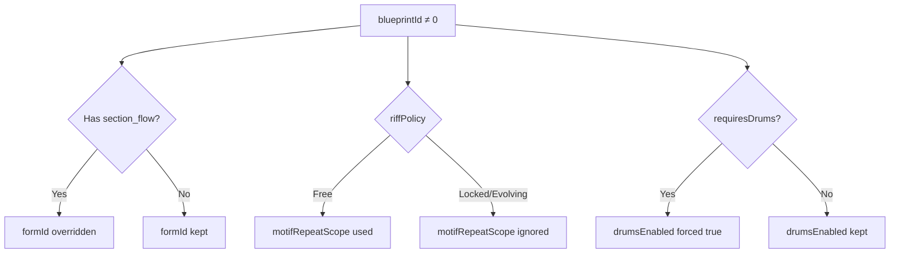

| Blueprint Setting | Override Target | Condition |
|-------------------|-----------------|-----------|
| `section_flow` | `formId` | When section_flow exists and `formExplicit=false`; `formExplicit=true` takes priority |
| `riff_policy` | `motifRepeatScope` | Free=use setting, Locked/Evolving=ignore |
| `drums_sync_vocal` | Internal sync | Blueprint definition takes priority |
| `drums_required` | `drumsEnabled` | When true, forces `drumsEnabled=true` (unless `drumsEnabledExplicit=true` + `drumsEnabled=false`) |
| `TrackMask::Motif` | Motif generation | Per-section control |

### 17.5 Motif Generation Flow

```
CompositionStyle == BackgroundMotif? → Yes: Motif generated
└─ No → MelodyLead?
        ├─ RhythmSync paradigm? → Yes: Motif generated (rhythm axis)
        └─ section_flow exists & TrackMask::Motif? → Yes: Motif generated
           └─ No: No motif
```

::: warning Drums Required
Blueprints with `requiresDrums=true` (ID: 1, 5, 7) automatically enable drums. Set `drumsEnabledExplicit: true` along with `drumsEnabled: false` to explicitly override this behavior.
:::

### 17.6 Example: Blueprint Override Behavior

```javascript
// Using RhythmLock blueprint
{
  blueprintId: 1,        // RhythmLock
  formId: 5,             // ← Ignored! Blueprint section_flow used
  motifRepeatScope: 1,   // ← Ignored! Locked policy forces same pattern
  drumsEnabled: false,   // ← Ignored! drums_required=true forces enabled
}
```

```javascript
// Using Traditional blueprint
{
  blueprintId: 0,        // Traditional
  formId: 5,             // ← Used as specified
  motifRepeatScope: 1,   // ← Used as specified
  drumsEnabled: false,   // ← Used as specified
}
```

```javascript
// Explicitly disabling drums on a drums_required blueprint
{
  blueprintId: 1,              // RhythmLock (drums_required)
  drumsEnabled: false,         // Want drums off
  drumsEnabledExplicit: true,  // Explicit flag → override respected
}
```
