# Option Relationships

This document describes the relationships between `SongConfig` options in MIDI Sketch.

## Relationship Types

Options have the following relationships:

- **Dependency**: Child options are ignored unless parent option is enabled
- **Priority**: Special values (like 0) override other settings
- **Conflict**: Certain combinations cause validation errors
- **Implicit**: Setting one option automatically configures internal parameters

::: info Why This Matters
Understanding these relationships helps you avoid unexpected behavior. For example, setting `arpeggioPattern=2` has no effect if `arpeggioEnabled=false`.
:::

---

## 1. Dependency Relationships

### 1.1 Call System

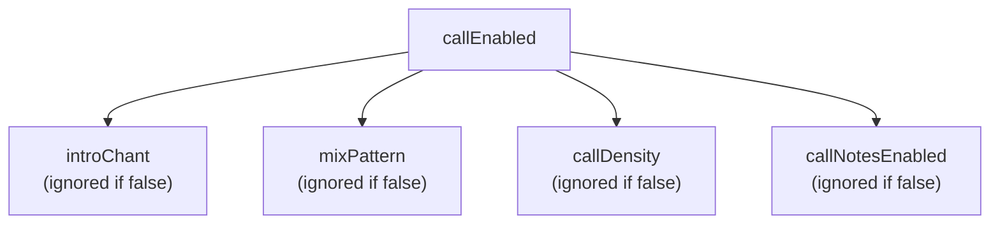

| Parent | Child | Description |
|--------|-------|-------------|
| `callEnabled=true` | `introChant` | Type of intro chant section |
| `callEnabled=true` | `mixPattern` | Type of MIX section |
| `callEnabled=true` | `callDensity` | Call density in chorus |
| `callEnabled=true` | `callNotesEnabled` | Output calls as MIDI notes |

### 1.2 Arpeggio

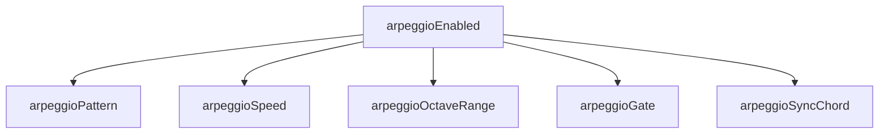

| Parent | Child | Description |
|--------|-------|-------------|
| `arpeggioEnabled=true` | `arpeggioPattern` | Up/Down/UpDown/Random |
| `arpeggioEnabled=true` | `arpeggioSpeed` | Eighth/Sixteenth/Triplet |
| `arpeggioEnabled=true` | `arpeggioOctaveRange` | 1-3 octaves |
| `arpeggioEnabled=true` | `arpeggioGate` | Gate length (0-100) |
| `arpeggioEnabled=true` | `arpeggioSyncChord` | Sync with chord changes |

### 1.3 Humanization

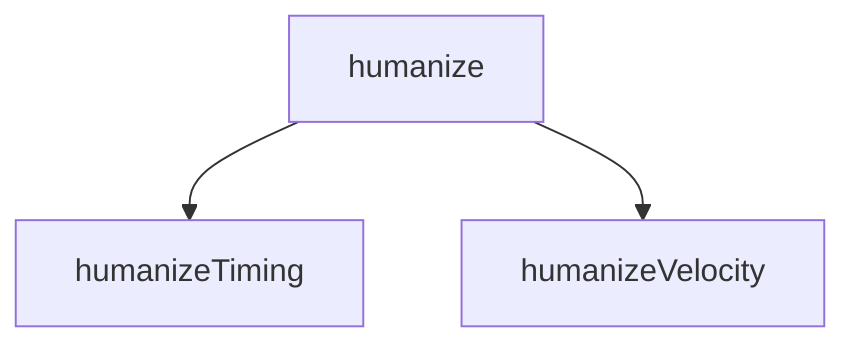

| Parent | Child | Description |
|--------|-------|-------------|
| `humanize=true` | `humanizeTiming` | Timing variation (0-100) |
| `humanize=true` | `humanizeVelocity` | Velocity variation (0-100) |

### 1.4 Chord Extensions

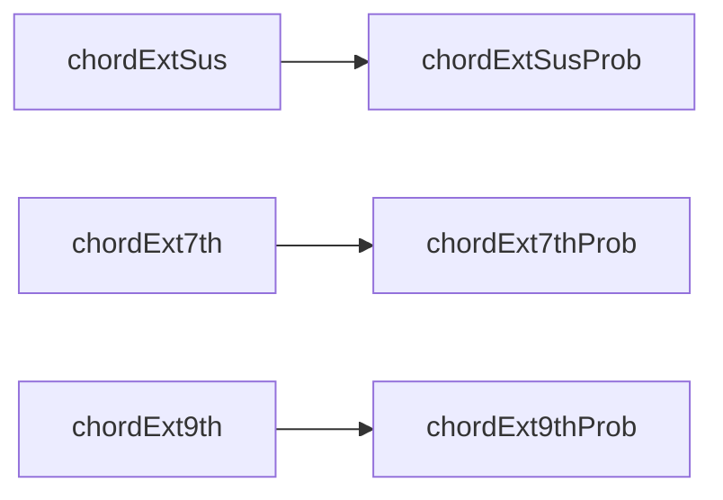

| Parent | Child | Description |
|--------|-------|-------------|
| `chordExtSus=true` | `chordExtSusProb` | Sus probability (0-100) |
| `chordExt7th=true` | `chordExt7thProb` | 7th probability (0-100) |
| `chordExt9th=true` | `chordExt9thProb` | 9th probability (0-100) |

### 1.5 Modulation

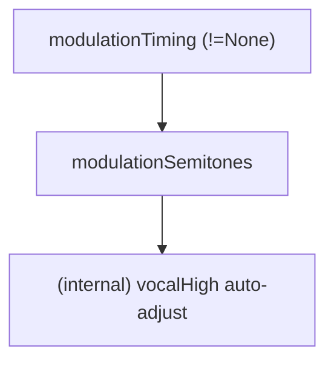

| Parent | Child | Description |
|--------|-------|-------------|
| `modulationTiming != None` | `modulationSemitones` | Modulation amount (1-4 semitones) |
| `modulationSemitones > 0` | (internal) `effective_vocal_high` | Auto-adjusted to fit post-modulation range |

**Notes**:
- When `modulationTiming=None`, `modulationSemitones` is not validated
- **Vocal range auto-adjustment**: When modulation is enabled, `effective_vocal_high = vocal_high - modulation_semitones` ensures vocal stays in range post-modulation
- **Works in all CompositionStyles**: Modulation is effective in BGM modes (BackgroundMotif, SynthDriven) as well

### 1.6 Vocal (skipVocal exclusion)

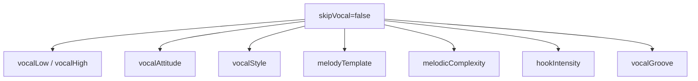

| Condition | Effective Options | Use Case |
|-----------|-------------------|----------|
| `skipVocal=false` | All vocal-related options | Normal song generation |
| `skipVocal=true` | All vocal options are ignored | **BGM-only generation (no vocal)** |

::: danger No Vocal Recovery
There is no API to add vocals after BGM-only generation. If you need vocals, use `compositionStyle=MelodyLead` or the **Vocal-First workflow** (see [JavaScript API](/docs/api-js)).
:::

---

## 2. CompositionStyle Branching

The value of `compositionStyle` determines which tracks are generated and which options are effective:

### 2.1 MelodyLead (0) - Default

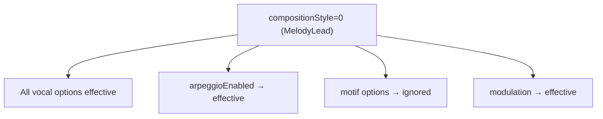

**Generated tracks**: Vocal → Aux → Bass → Chord → Drums (+ Arpeggio if enabled)

### 2.2 BackgroundMotif (1) - BGM-Only Mode

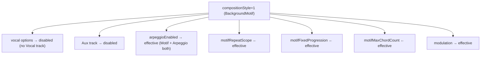

**Generated tracks**:
| arpeggioEnabled | Generated Tracks |
|-----------------|------------------|
| `false` | Motif + Bass + Chord + Drums |
| `true` | Motif + Bass + Chord + Drums + **Arpeggio** |

### 2.3 SynthDriven (2) - BGM-Only Mode

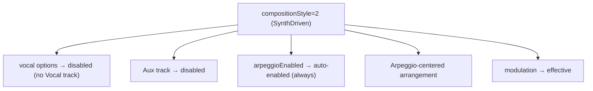

**Generated tracks**: Bass + Chord + Drums + Arpeggio (no Motif)

::: tip Choosing CompositionStyle
- **MelodyLead**: For songs with vocals (pop, rock, ballad)
- **BackgroundMotif**: For instrumental BGM with repeating melodic patterns (game music, ambient)
- **SynthDriven**: For electronic/synth-driven instrumental tracks
:::

---

## 3. Priority (Special Value Overrides)

| Option | Special Value | Behavior |
|--------|---------------|----------|
| `bpm` | `0` | Use style preset's default BPM |
| `seed` | `0` | Auto-generate random seed |
| `targetDurationSeconds` | `0` | Use structure pattern from `formId` |
| `vocalStyle` | `0` (Auto) | Random selection based on style |
| `melodyTemplate` | `0` (Auto) | Default selection based on style |

::: info Using Zero Values
Zero often means "auto" or "use default". This is useful when you want style-appropriate defaults without specifying exact values.
:::

### Flowchart

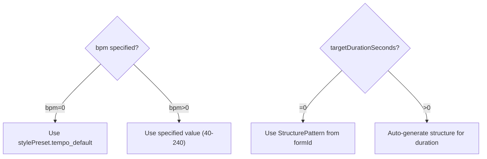

---

## 4. Validation Conflicts

### 4.1 Parameter Valid Ranges

| Parameter | Valid Range | Error Code |
|-----------|-------------|------------|
| `stylePresetId` | 0-16 | `INVALID_STYLE` |
| `key` | 0-11 | `INVALID_KEY` |
| `bpm` | 0, 40-240 | `INVALID_BPM` |
| `chordProgressionId` | 0-21 | `INVALID_CHORD` |
| `formId` | 0-17 | `INVALID_FORM` |
| `vocalLow`, `vocalHigh` | 36-96, low ≤ high | `INVALID_VOCAL_RANGE` |
| `compositionStyle` | 0-2 | `INVALID_COMPOSITION_STYLE` |
| `vocalStyle` | 0-12 | `INVALID_VOCAL_STYLE` |
| `melodyTemplate` | 0-7 | `INVALID_MELODY_TEMPLATE` |
| `melodicComplexity` | 0-2 | `INVALID_MELODIC_COMPLEXITY` |
| `hookIntensity` | 0-3 | `INVALID_HOOK_INTENSITY` |
| `vocalGroove` | 0-5 | `INVALID_VOCAL_GROOVE` |
| `modulationTiming` | 0-4 | `INVALID_MODULATION_TIMING` |
| `modulationSemitones` | 1-4 (when timing≠0) | `INVALID_MODULATION` |
| `arpeggioPattern` | 0-3 | `INVALID_ARPEGGIO_PATTERN` |
| `arpeggioSpeed` | 0-2 | `INVALID_ARPEGGIO_SPEED` |
| `callDensity` | 0-3 | `INVALID_CALL_DENSITY` |
| `introChant` | 0-2 | `INVALID_INTRO_CHANT` |
| `mixPattern` | 0-2 | `INVALID_MIX_PATTERN` |
| `blueprintId` | 0-8, 255 | (255=auto random) |

### 4.2 Style × Attitude Combinations

Each style preset has `allowedAttitudes` bit flags. Specifying a non-allowed attitude causes an error:

```typescript
// Example: Style allows only Clean and Expressive
allowedAttitudes = ATTITUDE_CLEAN | ATTITUDE_EXPRESSIVE  // 0b011 = 3

vocalAttitude = 2 (Raw) → INVALID_ATTITUDE error
```

Check allowed attitudes with: `midisketch_style_preset_allowed_attitudes(styleId)`

### 4.3 Modulation × Semitones Dependency

| modulationTiming | modulationSemitones | Result |
|------------------|---------------------|--------|
| 0 (None) | any (ignored) | OK |
| 1-4 | 0 | `INVALID_MODULATION` |
| 1-4 | 1-4 | OK |
| 1-4 | 5+ | `INVALID_MODULATION` |

### 4.4 Call × Duration × BPM Conflict

```
IF callEnabled == true AND targetDurationSeconds > 0
THEN targetDurationSeconds >= getMinimumSecondsForCall(introChant, mixPattern, bpm)
```

Minimum time calculation:
```
min_bars = 24 + introChant_bars + mixPattern_bars
min_seconds = min_bars * 240 / bpm
```

| bpm | Base minimum (call enabled) | With introChant/mixPattern |
|-----|---------------------------|---------------------------|
| 40 | **144 seconds** | Even longer |
| 60 | **96 seconds** | Even longer |
| 120 | **48 seconds** | Even longer |
| 240 | **24 seconds** | Even longer |

**Solution**: Use `targetDurationSeconds=0` (auto) to let the system determine appropriate length.

### 4.5 Crash-Prone Combinations

::: danger Avoid These Combinations
The following combinations will cause validation errors. Check your parameters before generation.
:::

| Pattern | Cause | Fix |
|---------|-------|-----|
| `modulationTiming≠0` + `modulationSemitones=0` | Modulation enabled but amount invalid | Set `modulationSemitones=2` |
| `callEnabled=true` + `targetDurationSeconds=30` + `bpm=40` | Duration too short | Set `targetDurationSeconds=0` |
| `vocalLow=80` + `vocalHigh=60` | Range inverted | Ensure low ≤ high |
| `vocalLow=30` or `vocalHigh=100` | Out of range | Use 36-96 |
| `bpm=300` | BPM out of range | Use 40-240 |

---

## 5. Recommended Combinations

### 5.1 Simple Pop (Default)

```javascript
{
  stylePresetId: 0,
  compositionStyle: 0,  // MelodyLead
  drumsEnabled: true,
  arpeggioEnabled: false,
  callEnabled: false
}
```

### 5.2 Vocaloid Style

```javascript
{
  stylePresetId: 14,  // Anime Opening
  compositionStyle: 0,
  vocalStyle: 2,      // Vocaloid - high density, wide leaps
  arpeggioEnabled: true,
  arpeggioSpeed: 1    // Sixteenth
}
```

### 5.3 Idol Song (with Calls)

```javascript
{
  stylePresetId: 3,   // Idol Standard
  vocalStyle: 4,      // Idol
  callEnabled: true,
  introChant: 1,      // Gachikoi
  mixPattern: 2,      // Tiger
  callDensity: 2,     // Standard
  callNotesEnabled: true,
  targetDurationSeconds: 180  // 3+ minutes required
}
```

### 5.4 BGM Mode (Motif + Arpeggio)

```javascript
{
  compositionStyle: 1,  // BackgroundMotif (BGM-only)
  // No need to set skipVocal (auto-disabled in BackgroundMotif)

  // Motif settings
  motifFixedProgression: true,
  motifMaxChordCount: 4,

  // Arpeggio (also available in BackgroundMotif)
  arpeggioEnabled: true,      // → Motif + Arpeggio both generated
  arpeggioPattern: 2,         // UpDown
  arpeggioSpeed: 1,           // Sixteenth
  arpeggioOctaveRange: 2,
  arpeggioGate: 80,

  // Modulation (works in BGM mode too)
  modulationTiming: 1,        // LastChorus
  modulationSemitones: 2      // +2 semitones
}
// Output: Motif + Bass + Chord + Drums + Arpeggio (modulates +2 at last chorus)
```

### 5.5 BGM Mode (Arpeggio-Centered)

```javascript
{
  compositionStyle: 2,  // SynthDriven (BGM-only)
  // arpeggioEnabled is auto-enabled in SynthDriven
  arpeggioPattern: 0,         // Up
  arpeggioSpeed: 2,           // Triplet
  arpeggioOctaveRange: 3,

  // Modulation (works in BGM mode too)
  modulationTiming: 2,        // AfterBridge
  modulationSemitones: 3      // +3 semitones
}
// Output: Bass + Chord + Drums + Arpeggio (no Motif, modulates +3 after bridge)
```

---

## 6. Implicit Internal Settings

Certain parameters automatically configure internal values when set.

### 6.1 VocalStylePreset → Melody Parameters

Setting `vocalStyle` automatically configures internal melody generation parameters:

| Parameter | Description |
|-----------|-------------|
| `max_leap_interval` | Maximum leap width (semitones) |
| `syncopation_prob` | Syncopation probability |
| `verse/chorus_density_modifier` | Section-specific density coefficient |
| `hook_repetition` | Whether to repeat hooks |
| `chorus_long_tones` | Long notes in chorus |
| `tension_usage` | Tension usage rate |

**VocalStylePreset List** (0-12):

| ID | Name | Characteristics |
|----|------|-----------------|
| 0 | Auto | Random selection based on style |
| 1 | Standard | Standard pop |
| 2 | Vocaloid | High density, wide leaps, syncopation (singable) |
| 3 | UltraVocaloid | Ultra-fast, extreme leaps (machine-oriented) |
| 4 | Idol | Catchy, hook-focused |
| 5 | Ballad | Relaxed, long notes |
| 6 | Rock | Powerful, chorus emphasis |
| 7 | CityPop | Stylish, uses tensions |
| 8 | Anime | Dramatic, strong hooks |
| 9 | BrightKira | Bright, sparkly |
| 10 | CoolSynth | Cool, many 16th notes |
| 11 | CuteAffected | Cute, moderate syncopation |
| 12 | PowerfulShout | Powerful, long notes + high density |

### 6.2 MelodicComplexity → Multiple Parameters

| melodicComplexity | Auto Settings |
|-------------------|---------------|
| `Simple (0)` | `note_density *= 0.7`, `max_leap_interval ≤ 5`, `hook_repetition=true`, `tension_usage *= 0.5`, `sixteenth_note_ratio *= 0.5`, `syncopation_prob *= 0.5` |
| `Standard (1)` | No changes (default) |
| `Complex (2)` | `note_density *= 1.3`, `max_leap_interval *= 1.5` (max 12), `tension_usage *= 1.5`, `sixteenth_note_ratio *= 1.5` (max 0.5), `syncopation_prob *= 1.5` (max 0.5) |

### 6.3 VocalAttitude → Pitch Selection

| vocalAttitude | Pitch Candidates | Musical Characteristics |
|---------------|-----------------|------------------------|
| `Clean (0)` | Chord tones only (1, 3, 5) | Safe, consonant, stable |
| `Expressive (1)` | Chord tones + tensions (7th, 9th) | Colorful, delayed resolution |
| `Raw (2)` | All scale tones | Edgy, non-chord tone landing |

### 6.4 CompositionStyle → Implicit Behavior

| compositionStyle | Implicit Behavior |
|------------------|-------------------|
| `BackgroundMotif (1)` | **Vocal/Aux completely disabled** (not generated), Motif track generated, **modulation works** |
| `SynthDriven (2)` | **Arpeggio auto-enabled** (even if arpeggioEnabled=false), **Vocal/Aux completely disabled**, **modulation works** |

```javascript
// Example: Arpeggio is generated even if not explicitly enabled
{
  compositionStyle: 2,  // SynthDriven (BGM-only)
  arpeggioEnabled: false,  // ← Ignored! Arpeggio auto-enabled
  modulationTiming: 1,     // Works in BGM mode
  modulationSemitones: 2
  // Note: No Vocal track is generated in this mode
}
```

### 6.5 VocalGrooveFeel → Timing Adjustment

| vocalGroove | Effect |
|-------------|--------|
| `Straight (0)` | No change |
| `OffBeat (1)` | Delay on-beat notes (+30 ticks) |
| `Swing (2)` | Delay 8th note 2nd beat |
| `Syncopated (3)` | Anticipate beats 2, 4 (-30 ticks) |
| `Driving16th (4)` | Emphasize 16th notes |
| `Bouncy8th (5)` | Bounce feel on 8th notes |

### 6.6 hookIntensity → Phrase Generation Changes

| hookIntensity | Duration Multiplier | Velocity Addition | Target Sections |
|---------------|--------------------|--------------------|-----------------|
| `Off (0)` | - | - | None |
| `Light (1)` | ×1.3 | +5 | Chorus, B |
| `Normal (2)` | ×1.5 | +10 | Chorus, B |
| `Strong (3)` | ×2.0 | +15 | **All sections** |

---

## 7. Option Dependency Tree

```
SongConfig
├── Basic Settings
│   ├── stylePresetId     ─────┐
│   ├── key                    │ Style determines defaults
│   ├── bpm (0=default)        │ for other options
│   └── seed (0=random)        │
│                              ▼
├── Structure ◄────────────────┤
│   ├── formId                 │
│   └── targetDurationSeconds ─┴─▶ Exclusive with formId (auto if >0)
│
├── Vocal (only when skipVocal=false)
│   ├── vocalAttitude  ◄────────── Restricted by style
│   ├── vocalStyle     ◄────────── 0=Auto, 1-12=explicit preset
│   ├── vocalLow/High
│   ├── melodicComplexity
│   ├── hookIntensity
│   └── vocalGroove
│
├── Arpeggio (only when arpeggioEnabled=true)
│   ├── arpeggioPattern
│   ├── arpeggioSpeed
│   ├── arpeggioOctaveRange
│   ├── arpeggioGate
│   └── arpeggioSyncChord
│
├── Call System (only when callEnabled=true)
│   ├── introChant
│   ├── mixPattern  ─────────────▶ Conflicts with targetDurationSeconds
│   ├── callDensity
│   └── callNotesEnabled
│
├── Chord Extensions (prob effective only when enabled=true)
│   ├── chordExtSus  → chordExtSusProb
│   ├── chordExt7th  → chordExt7thProb
│   └── chordExt9th  → chordExt9thProb
│
├── Modulation (only when modulationTiming!=None)
│   └── modulationSemitones
│
├── Humanize (only when humanize=true)
│   ├── humanizeTiming
│   └── humanizeVelocity
│
└── CompositionStyle-dependent
    ├── compositionStyle=0 (MelodyLead): Vocal/Aux enabled, standard
    ├── compositionStyle=1 (BackgroundMotif): BGM-only (Vocal/Aux disabled)
    │   ├── motifRepeatScope
    │   ├── motifFixedProgression
    │   └── motifMaxChordCount
    └── compositionStyle=2 (SynthDriven): BGM-only, arpeggio auto-enabled
```

---

## 8. Workflow-Specific Options

### 8.1 generateVocal(config) - Used Parameters

| Category | Parameter | Used | Description |
|----------|-----------|:----:|-------------|
| **Basic** | `stylePresetId` | ✅ | Style determination |
| | `key` | ✅ | Key (internal C major, transpose at output) |
| | `bpm` | ✅ | Tempo (0=style default) |
| | `seed` | ✅ | Random seed |
| | `chordProgressionId` | ✅ | Chord progression (melody reference) |
| | `formId` | ✅ | Structure pattern |
| **Vocal** | `vocalLow` | ✅ | Range lower bound |
| | `vocalHigh` | ✅ | Range upper bound |
| | `vocalAttitude` | ✅ | Expression style |
| | `vocalStyle` | ✅ | Vocal style preset |
| | `melodicComplexity` | ✅ | Melody complexity |
| | `hookIntensity` | ✅ | Hook strength |
| | `vocalGroove` | ✅ | Groove feel |
| **Ignored** | `drumsEnabled` | ❌ | Vocal only |
| | `arpeggioEnabled` | ❌ | Vocal only |
| | `humanize` | ❌ | Applied when accompaniment added |

### 8.2 generateAccompaniment(config?) - Used Parameters

| Category | Parameter | Used | Description |
|----------|-----------|:----:|-------------|
| **Tracks** | `drumsEnabled` | ✅ | Generate drums |
| | `arpeggioEnabled` | ✅ | Generate arpeggio |
| | `arpeggio.*` | ✅ | Arpeggio settings |
| | `chordExt*` | ✅ | Chord extension settings |
| **Post-processing** | `humanize` | ✅ | Apply humanization |
| | `humanizeTiming` | ✅ | Timing variation |
| | `humanizeVelocity` | ✅ | Velocity variation |
| **SE/Call** | `seEnabled` | ✅ | SE track generation |
| | `callEnabled` | ✅ | Call feature |
| | `callDensity` | ✅ | Call density |

### 8.3 regenerateVocal(configOrSeed) - Used Parameters

**Seed only** (`regenerateVocal(12345)`):
- Only `seed` is changed; other parameters use previous `generateVocal` settings

**VocalConfig** (`regenerateVocal({...})`):
| Parameter | Used | Description |
|-----------|:----:|-------------|
| `seed` | ✅ | New random seed |
| `vocalLow` | ✅ | Change range lower bound |
| `vocalHigh` | ✅ | Change range upper bound |
| `vocalAttitude` | ✅ | Change expression style |
| `vocalStyle` | ✅ | Change vocal style preset |
| `melodicComplexity` | ✅ | Change complexity |
| `hookIntensity` | ✅ | Change hook strength |
| `vocalGroove` | ✅ | Change groove |

**Note**: Chord progression and structure are NOT changed (continues from generateVocal settings).

---

## 9. Parameter Application Flow

```
SongConfig
    │
    ├── stylePresetId ──→ mood, compositionStyle, bpm(default), melody_params
    │                           │
    │                           ▼ (can be overridden by explicit setting)
    ├── compositionStyle ──────────────→ Final compositionStyle
    ├── bpm ───────────────────────────→ Final BPM
    │
    ├── vocalStyle ─────────→ melody_params override ─────→ │
    │       │                                               │
    │       └── (Auto) ────→ Random selection               │
    │                                                       ▼
    ├── melodicComplexity ─→ melody_params multiplier ────→ Final melody_params
    │
    ├── hookIntensity ─────→ Chorus/B section note adjustment
    │
    ├── vocalGroove ───────→ All note timing adjustment
    │
    └── callEnabled ──────→ (if false=Auto) determined by vocalStyle → call_enabled
```

**Application order**: `StylePreset` → `VocalStylePreset` → `MelodicComplexity`

---

## 10. Production Blueprint Overrides

Production Blueprints control **how** the music is generated, independent of style/mood settings.

### 10.1 Blueprint List

| ID | Name | Paradigm | RiffPolicy | Requires Drums | Overrides Form |
|----|------|----------|------------|:--------------:|:--------------:|
| 0 | Standard Pop | Traditional | Free | - | - |
| 1 | Rhythm Lock | RhythmSync | Locked | **Yes** | **Yes** |
| 2 | Story Build | MelodyDriven | Evolving | - | **Yes** |
| 3 | Ballad | MelodyDriven | Free | - | **Yes** |
| 4 | Classic Idol | MelodyDriven | Evolving | - | **Yes** |
| 5 | High Energy | RhythmSync | Locked | **Yes** | **Yes** |
| 6 | Sweet Bounce | MelodyDriven | Locked | **Yes** | **Yes** |
| 7 | Groove Drive | RhythmSync | Locked | **Yes** | **Yes** |
| 8 | Emotional Arc | MelodyDriven | Locked | - | **Yes** |
| 255 | Auto | - | - | - | - |

### 10.2 Paradigm Types

| Paradigm | Description | Generation Order |
|----------|-------------|------------------|
| Traditional | Classic pop generation | Bass → Chord → Vocal (default) |
| RhythmSync | Drums & bass sync with melody | Drums first, vocals sync |
| MelodyDriven | Melody-centered arrangement | Melody first, accompaniment follows |

### 10.3 RiffPolicy Types

| Policy | Description | Effect on motifRepeatScope |
|--------|-------------|---------------------------|
| Free | Each section varies | Uses `motifRepeatScope` setting |
| Locked | Same pattern throughout | **Ignores** `motifRepeatScope` |
| Evolving | 30% chance to change every 2 sections | **Ignores** `motifRepeatScope` |

### 10.4 Blueprint Override Rules

When a Blueprint is selected (not Traditional/ID 0), several settings are automatically overridden:

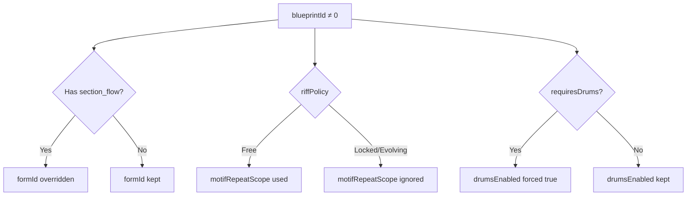

| Blueprint Setting | Override Target | Condition |
|-------------------|-----------------|-----------|
| `section_flow` | `formId` | All except Traditional (ID 0) |
| `riff_policy` | `motifRepeatScope` | Free=use setting, Locked/Evolving=ignore |
| `drums_sync_vocal` | Internal sync | Blueprint definition takes priority |
| `drums_required` | `drumsEnabled` | When true, forces `drumsEnabled=true` |
| `TrackMask::Motif` | Motif generation | Per-section control |

### 10.5 Motif Generation Flow

```
CompositionStyle == BackgroundMotif? → Yes: Motif generated
└─ No → Blueprint has section_flow? → No: No motif
        └─ Yes → TrackMask::Motif in section? → Yes: Motif generated
```

::: warning Drums Required
Blueprints with `requiresDrums=true` (ID: 1, 5, 6, 7) automatically enable drums. The drums toggle in UI is hidden for these blueprints.
:::

### 10.6 Example: Blueprint Override Behavior

```javascript
// Using Rhythm Lock blueprint
{
  blueprintId: 1,        // Rhythm Lock
  formId: 5,             // ← Ignored! Blueprint section_flow used
  motifRepeatScope: 1,   // ← Ignored! Locked policy forces same pattern
  drumsEnabled: false,   // ← Ignored! drums_required=true forces enabled
}
```

```javascript
// Using Standard Pop blueprint (Traditional)
{
  blueprintId: 0,        // Standard Pop
  formId: 5,             // ← Used as specified
  motifRepeatScope: 1,   // ← Used as specified
  drumsEnabled: false,   // ← Used as specified
}
```
