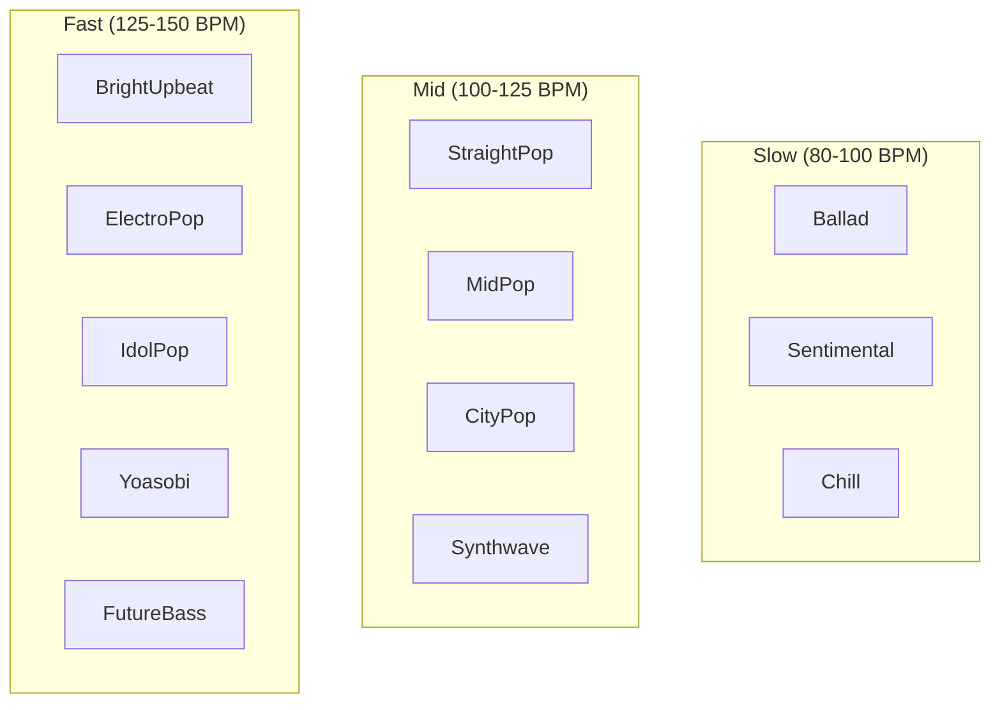
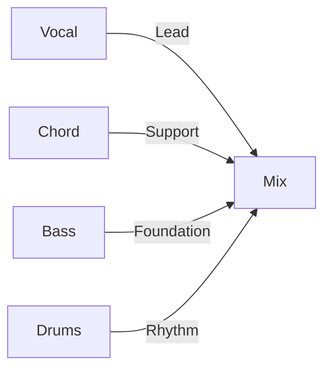
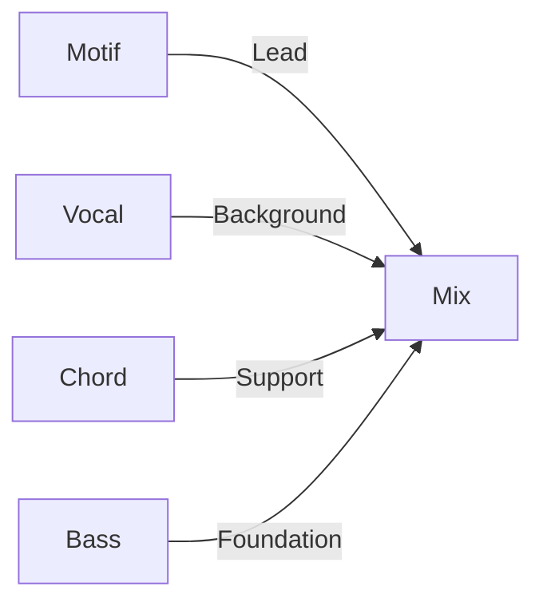
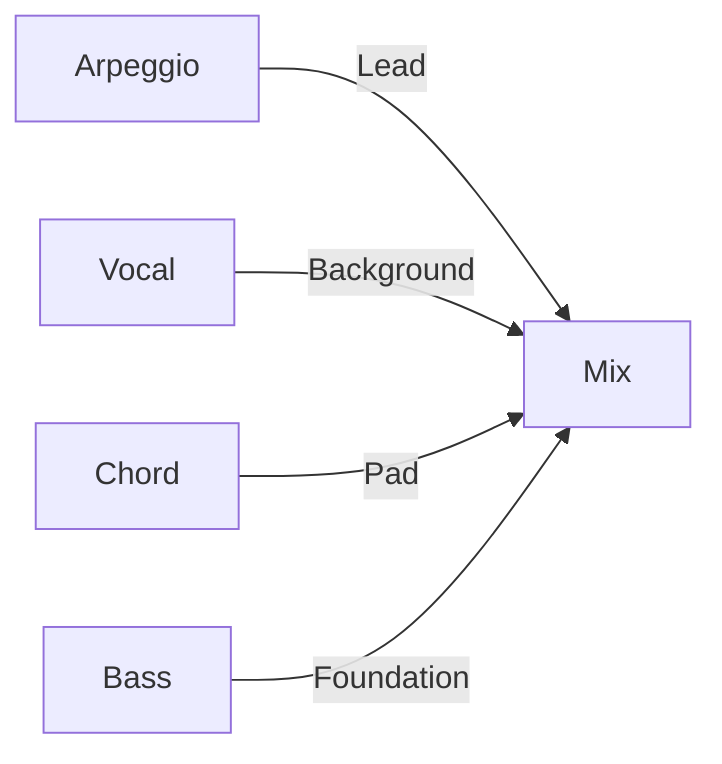
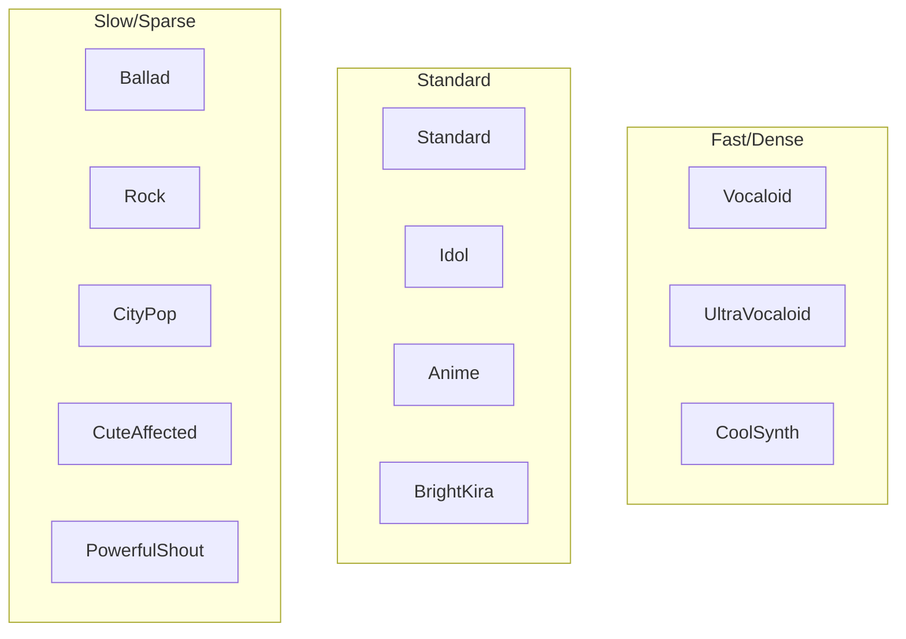

# Presets Reference

This document lists all available presets in [MIDI Sketch](https://github.com/libraz/midi-sketch).

## Structure Patterns

18 song structure patterns are available:

| ID | Name | Bars | Duration @120 BPM | Sections |
|----|------|------|-------------------|----------|
| 0 | StandardPop | 24 | 2:00 | A(8)-B(8)-Chorus(8) |
| 1 | BuildUp | 28 | 2:20 | Intro(4)-A(8)-B(8)-Chorus(8) |
| 2 | DirectChorus | 16 | 1:20 | A(8)-Chorus(8) |
| 3 | RepeatChorus | 32 | 2:40 | A(8)-B(8)-Chorus(8)-Chorus(8) |
| 4 | ShortForm | 12 | 1:00 | Intro(4)-Chorus(8) |
| 5 | FullPop | 56 | 4:40 | Intro-A-B-Chorus-A-B-Chorus-Outro |
| 6 | FullWithBridge | 52 | 4:20 | Intro-A-B-Chorus-Bridge-Chorus-Outro |
| 7 | DriveUpbeat | 52 | 4:20 | Intro-Chorus-A-B-Chorus-Chorus-Outro |
| 8 | Ballad | 56 | 4:40 | Intro(8)-A-B-Chorus-Interlude-B-Chorus-Outro |
| 9 | AnthemStyle | 52 | 4:20 | Intro-A-Chorus-A-B-Chorus-Chorus-Outro |
| 10 | ExtendedFull | 90 | 7:30 | Full form with extended sections |
| 11 | ChorusFirst | 32 | 2:40 | Chorus(8)-A(8)-B(8)-Chorus(8) |
| 12 | ChorusFirstShort | 24 | 2:00 | Chorus(8)-A(8)-Chorus(8) |
| 13 | ChorusFirstFull | 56 | 4:40 | Chorus-A-B-Chorus-A-B-Chorus |
| 14 | ImmediateVocal | 24 | 2:00 | A(8)-B(8)-Chorus(8) (no intro) |
| 15 | ImmediateVocalFull | 48 | 4:00 | A-B-Chorus-A-B-Chorus (no intro) |
| 16 | AChorusB | 32 | 2:40 | A(8)-Chorus(8)-B(8)-Chorus(8) |
| 17 | DoubleVerse | 32 | 2:40 | A(8)-A(8)-B(8)-Chorus(8) |

### Section Types


| Type | Vocal Density | Energy | Purpose |
|------|---------------|--------|---------|
| Intro | None/Sparse | Low | Establish mood |
| A | Full | Medium-Low | Verse, storytelling |
| B | Full | Medium | Pre-chorus, tension |
| Chorus | Full | High | Hook, payoff |
| Bridge | Sparse | Medium | Contrast |
| Interlude | None | Medium-Low | Instrumental break |
| Outro | Sparse | Medium-Low | Resolution |

::: tip Duration Calculation
At 120 BPM: 1 bar ≈ 2 seconds. Use `targetDurationSeconds=0` to use the exact pattern duration, or specify a target duration for auto-generated structures.
:::

## Mood Presets

20 mood presets define the overall feel:

| ID | Name | BPM | Drum Style | Character |
|----|------|-----|------------|-----------|
| 0 | StraightPop | 120 | Standard | Classic pop groove |
| 1 | BrightUpbeat | 128 | Upbeat | Syncopated, energetic |
| 2 | EnergeticDance | 130 | FourOnFloor | Dance-oriented |
| 3 | LightRock | 125 | Rock | Guitar-oriented feel |
| 4 | MidPop | 115 | Standard | Balanced mid-tempo |
| 5 | EmotionalPop | 110 | Standard | Sentimental, softer |
| 6 | Sentimental | 95 | Sparse | Ballad-like |
| 7 | Chill | 100 | Sparse | Relaxed, minimal |
| 8 | Ballad | 80 | Sparse | Slow, sparse drums |
| 9 | DarkPop | 118 | Synth | Darker, dramatic |
| 10 | Dramatic | 115 | Standard | High expression |
| 11 | Nostalgic | 105 | Standard | Retro feel |
| 12 | ModernPop | 125 | Synth | Contemporary |
| 13 | ElectroPop | 135 | FourOnFloor | Electronic, dance |
| 14 | IdolPop | 138 | FourOnFloor | J-pop idol style |
| 15 | Anthem | 120 | Standard | Triumphant, grand |
| 16 | Yoasobi | 148 | Synth | Anime-style, high-energy |
| 17 | Synthwave | 118 | Synth | Retro synth, neon |
| 18 | FutureBass | 145 | Synth | Modern electronic |
| 19 | CityPop | 110 | Standard | 80s city pop vibe |

### Mood Categories



## Chord Progressions

22 chord progressions from simple to complex:

### Basic (2-3 Chords)

| ID | Name | Degrees | Use Case |
|----|------|---------|----------|
| 5 | Minimal | I-IV | Simple, folk |
| 6 | AltMinimal | I-V | Power pop |
| 7 | Progression3 | I-vi-IV | Three-chord pop |

### Standard (4 Chords)

| ID | Name | Degrees | Use Case |
|----|------|---------|----------|
| 0 | Pop4 | I-V-vi-IV | Universal pop |
| 1 | Axis | vi-IV-I-V | Melancholic |
| 2 | Komuro | vi-IV-V-I | Bright J-pop |
| 4 | Emotional4 | vi-V-IV-V | Building tension |
| 8 | Rock4 | I-bVII-IV-I | Rock feel |

### Extended (5+ Chords)

| ID | Name | Degrees | Use Case |
|----|------|---------|----------|
| 3 | Canon | I-V-vi-iii-IV | Classic |
| 9 | Extended5 | I-V-vi-iii-IV | Full progression |
| 10 | Emotional5 | vi-IV-I-V-ii | Complex emotional |

## Style Presets

17 style presets that combine mood, structure, and composition approach:

::: tip Choosing a Style Preset
Style presets provide sensible defaults for BPM, structure, vocal attitude, and recommended chord progressions. You can override any of these settings after calling `createDefaultConfig()`.
:::

| ID | Name | Description | Default BPM |
|----|------|-------------|-------------|
| 0 | Minimal Groove Pop | Repetitive 2-4 chord loops, simple melody | 122 |
| 1 | Dance Pop Emotion | Classic structure, emotional chorus release | 128 |
| 2 | Bright Pop | Upbeat, memorable melodies with simple structure | 135 |
| 3 | Idol Standard | Unison-friendly, memorable melodies | 140 |
| 4 | Idol Emotion | Emotional idol songs with building pre-chorus | 130 |
| 5 | Idol Energy | High-energy idol songs for live performances | 150 |
| 6 | Idol Minimal | Minimal idol songs for short-form content | 135 |
| 7 | Rock Shout | Aggressive vocals with raw expression | 125 |
| 8 | Pop Emotion | Word-driven emotional pop with lyrical focus | 108 |
| 9 | Raw Emotional | Intense emotional expression with boundary-breaking phrases | 102 |
| 10 | Acoustic Pop | Clear harmony, rhythm-light, vocal-centered | 95 |
| 11 | Live Call & Response | Concert-ready with call-response structure | 140 |
| 12 | Background Motif | Motif-driven with subdued vocals, ambient feel | 120 |
| 13 | City Pop | Groovy 80s Japanese city pop with jazzy chords | 105 |
| 14 | Anime Opening | Epic, dramatic anime OP style with building energy | 142 |
| 15 | EDM Synth Pop | Modern electronic dance music with synth leads | 138 |
| 16 | Emotional Ballad | Slow emotional ballad with expressive vocals | 78 |

### Style Categories

| Category | IDs | Description |
|----------|-----|-------------|
| Pop/Dance | 0-2 | General pop and dance styles |
| Idol | 3-6 | Japanese idol music styles |
| Rock/Emo | 7-9 | Rock and emotional styles with raw expression |
| Special/Derived | 10-12 | Acoustic, live, and ambient styles |
| Genre-Specific | 13-16 | City pop, anime, EDM, and ballad styles |

## Composition Styles

3 composition approaches:

| Style | Focus | Vocal Role | Key Features |
|-------|-------|------------|--------------|
| MelodyLead | Vocal melody | Primary | Full melodic expression |
| BackgroundMotif | Repeating pattern | Secondary | Motif as main element |
| SynthDriven | Synth/Arpeggio | Secondary | Electronic, arpeggiated |

::: warning BGM-Only Modes
BackgroundMotif and SynthDriven do not generate vocal tracks. Use MelodyLead for songs with vocals.
:::

## Production Blueprints

9 production blueprints control **how** the music is generated (arrangement style), independent of style/mood:

| ID | Name | Paradigm | RiffPolicy | Drums Required | Weight |
|----|------|----------|------------|:--------------:|:------:|
| 0 | Traditional | Traditional | Free | - | 42 |
| 1 | RhythmLock | RhythmSync | Locked | **Yes** | 14 |
| 2 | StoryPop | MelodyDriven | Evolving | - | 10 |
| 3 | Ballad | MelodyDriven | Free | - | 4 |
| 4 | IdolStandard | MelodyDriven | Evolving | - | 10 |
| 5 | IdolHyper | RhythmSync | Locked | **Yes** | 6 |
| 6 | IdolKawaii | MelodyDriven | Locked | **Yes** | 5 |
| 7 | IdolCoolPop | RhythmSync | Locked | **Yes** | 5 |
| 8 | IdolEmo | MelodyDriven | Locked | - | 4 |

Use `blueprintId: 255` for auto-selection based on weights.

### Generation Paradigms

| Paradigm | Description |
|----------|-------------|
| Traditional | Classic pop generation (Bass → Chord → Vocal) |
| RhythmSync | Drums & bass sync with vocal melody |
| MelodyDriven | Melody-centered, accompaniment follows |

### RiffPolicy

| Policy | Value | Description |
|--------|:-----:|-------------|
| Free | 0 | Each section varies independently |
| LockedContour | 1 | Contour locked, rhythm varies |
| LockedPitch | 2 | Pitch locked, contour varies |
| LockedAll | 3 | All aspects locked |
| Evolving | 4 | Gradual changes (30% chance every 2 sections) |

Note: `Locked` is an alias for `LockedContour` (1).

::: tip Blueprint Override
When using a non-Traditional blueprint (ID 1-8), the `formId` setting is overridden by the blueprint's section flow. Use ID 0 (Traditional) to keep full control of form structure.
:::

### MelodyLead



### BackgroundMotif



### SynthDriven



## Vocal Attitudes

3 melodic expression levels:

| Attitude | Characteristics | Best For |
|----------|-----------------|----------|
| Clean | Chord tones only, on-beat | Pop, ballad |
| Expressive | Tensions, timing variation | Emotional, dynamic |
| Raw | Non-chord tones, boundary breaking | Edgy, modern |

## Melody Templates

7 melody templates define the core melodic behavior using a **template-driven** approach:

| ID | Name | Plateau | Max Step | Use Case |
|----|------|---------|----------|----------|
| 0 | Auto | - | - | VocalStylePreset-based selection |
| 1 | PlateauTalk | 0.65 | 2 | NewJeans, Billie Eilish (talk-sing) |
| 2 | RunUpTarget | 0.20 | 4 | YOASOBI, Ado (ascending runs) |
| 3 | DownResolve | 0.30 | 3 | B-section, pre-chorus |
| 4 | HookRepeat | 0.40 | 3 | TikTok, K-POP hooks |
| 5 | SparseAnchor | 0.50 | 2 | Ballad, Official髭男dism |
| 6 | CallResponse | - | - | Duet patterns |
| 7 | JumpAccent | - | - | Emotional peaks |

- **Plateau ratio**: Probability of staying on the same pitch (0.0-1.0)
- **Max step**: Maximum melodic interval in semitones

## Vocal Style Presets

13 vocal style presets that automatically select melody templates:

| ID | Name | Template | Character |
|----|------|----------|-----------|
| 0 | Auto | Section-based | Verse=PlateauTalk, Chorus=RunUpTarget |
| 1 | Standard | PlateauTalk | Balanced pop vocal |
| 2 | Vocaloid | RunUpTarget | Fast, wide leaps |
| 3 | UltraVocaloid | RunUpTarget | Extreme speed (32nd notes) |
| 4 | Idol | PlateauTalk | Catchy hooks, high 16th |
| 5 | Ballad | SparseAnchor | Slow, sustained |
| 6 | Rock | RunUpTarget | Powerful, register shift |
| 7 | CityPop | PlateauTalk | Jazzy, groovy |
| 8 | Anime | HookRepeat | Dynamic hooks |
| 9 | BrightKira | HookRepeat | High register |
| 10 | CoolSynth | PlateauTalk | Electronic, precise |
| 11 | CuteAffected | HookRepeat | Playful, cute |
| 12 | PowerfulShout | RunUpTarget | Intense, shout-y |

### Vocal Style Categories



## Melodic Complexity

3 complexity levels affecting melody generation:

| Level | Effect | Use Case |
|-------|--------|----------|
| Simple (0) | Reduced density, smaller leaps, more hooks | Catchy, memorable |
| Standard (1) | Default behavior | General use |
| Complex (2) | Increased density, larger leaps, more variation | Sophisticated |

## Hook Intensity

4 hook repetition levels:

| Level | Effect | Use Case |
|-------|--------|----------|
| Off (0) | No hook repetition | Progressive, varied |
| Light (1) | Light hook presence | Subtle callbacks |
| Normal (2) | Standard repetition | Balanced pop (default) |
| Strong (3) | Strong hook emphasis | Catchy, commercial |

## Vocal Groove Feel

6 rhythm feel options:

| Groove | Effect | Best For |
|--------|--------|----------|
| Straight (0) | On-beat, no swing | Pop, rock |
| OffBeat (1) | Off-beat emphasis | Reggae-influenced |
| Swing (2) | Swing timing | Jazz, R&B |
| Syncopated (3) | Syncopated rhythm | Latin, funk |
| Driving16th (4) | 16th note drive | Electronic, fast pop |
| Bouncy8th (5) | Bouncy 8th notes | Upbeat pop |

## Key Options

12 keys available (0-11):

| ID | Key | Notes |
|----|-----|-------|
| 0 | C | Natural, no sharps/flats |
| 1 | C# / Db | 5 sharps / 7 flats |
| 2 | D | 2 sharps |
| 3 | D# / Eb | 3 flats |
| 4 | E | 4 sharps |
| 5 | F | 1 flat |
| 6 | F# / Gb | 6 sharps / 6 flats |
| 7 | G | 1 sharp |
| 8 | G# / Ab | 4 flats |
| 9 | A | 3 sharps |
| 10 | A# / Bb | 2 flats |
| 11 | B | 5 sharps |

## BPM Range

Valid tempo range: **40-240 BPM**

::: info BPM Setting
- Set to `0` to use the style preset's default BPM
- Each style preset has an optimal default BPM setting
- BPM outside the 40-240 range will cause validation errors
:::

## Configuration Examples

### Simple Pop Song

```javascript
import { createDefaultConfig } from 'midi-sketch'

// Use MinimalGroovePop preset
const config = createDefaultConfig(0)
config.key = 0                  // C major
config.chordProgressionId = 0   // Pop4 (I-V-vi-IV)
config.formId = 0               // StandardPop
config.bpm = 0                  // Use default (120)
config.drumsEnabled = true
```

### Emotional Ballad

```javascript
// Use Emotional Ballad preset
const config = createDefaultConfig(16) // Emotional Ballad
config.key = 7                         // G major
config.chordProgressionId = 4          // Emotional4
config.formId = 8                      // Ballad structure
config.bpm = 0                         // Use default (78)
config.drumsEnabled = true
```

::: warning Ballad Tempo
Ballad presets typically have slow default tempos (78-95 BPM). If you need a faster ballad, explicitly set `config.bpm`.
:::

### Anime Opening Style

```javascript
// Use Anime Opening preset
const config = createDefaultConfig(14) // Anime Opening
config.key = 2                         // D major
config.chordProgressionId = 2          // Komuro
config.bpm = 0                         // Use default (142)
config.drumsEnabled = true
config.vocalStyle = 2                  // Vocaloid style
config.melodicComplexity = 2           // Complex melodies
config.hookIntensity = 3               // Strong hooks
```

::: tip Vocaloid-style Melodies
For YOASOBI/Ado-style dense melodies with wide intervals, use:
- `vocalStyle: 2` (Vocaloid) or `vocalStyle: 3` (UltraVocaloid)
- `melodicComplexity: 2` (Complex)
- `melodyTemplate: 2` (RunUpTarget)
:::

### Chill Background

```javascript
// Use Background Motif preset
const config = createDefaultConfig(12)  // Background Motif
config.key = 5                          // F major
config.chordProgressionId = 5           // Minimal
config.formId = 4                       // ShortForm
config.bpm = 95
config.drumsEnabled = false             // No drums for ambient
```

::: info Background Motif Style
The Background Motif preset (ID 12) is ideal for ambient and BGM-style tracks with subdued vocals and repeating patterns.
:::

### Idol Pop with Calls

```javascript
// Use Idol Standard preset
const config = createDefaultConfig(3)  // Idol Standard
config.key = 0                         // C major
config.callEnabled = true              // Enable call track
config.introChant = 1                  // Gachikoi intro
config.mixPattern = 1                  // Standard mix
config.callDensity = 2                 // Standard density
config.modulationTiming = 1            // Modulate at last chorus
config.modulationSemitones = 2         // Up 2 semitones
```
