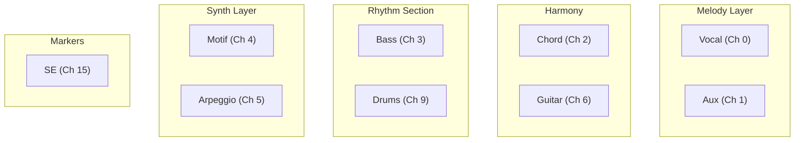
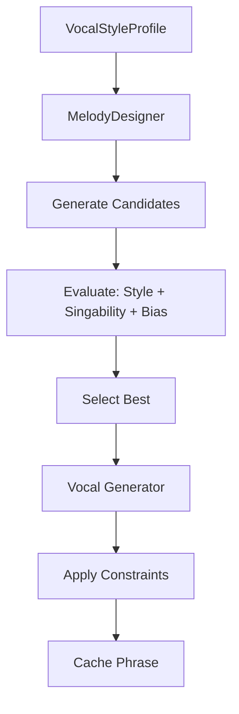
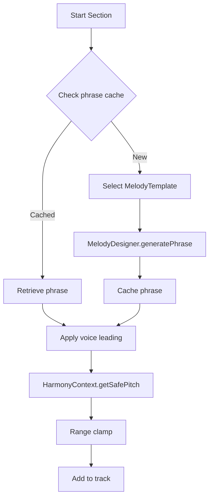
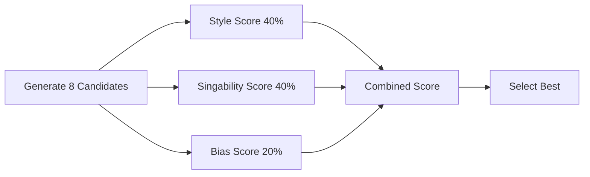
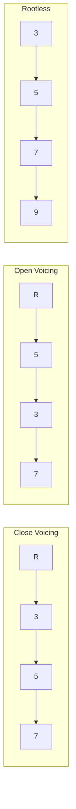
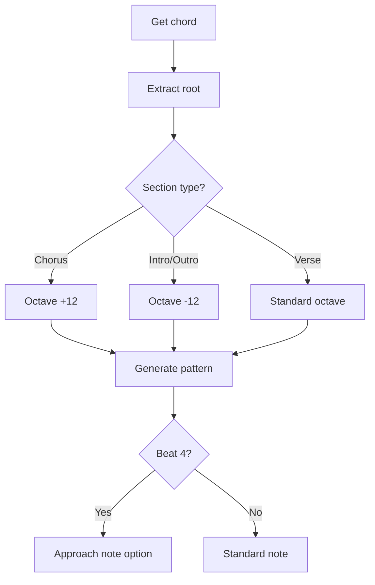
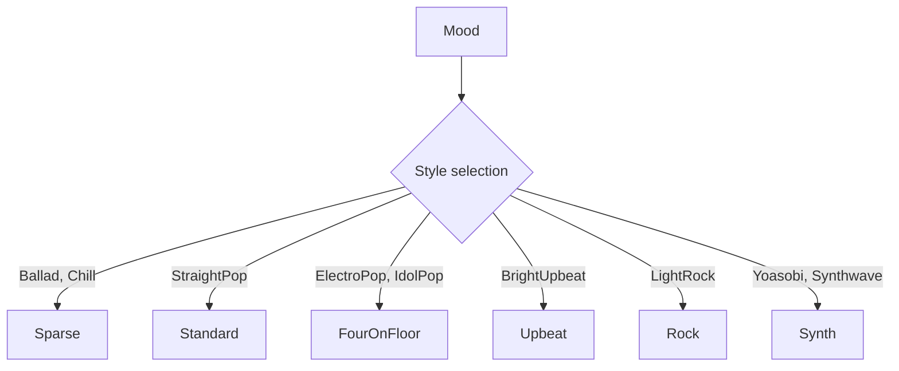
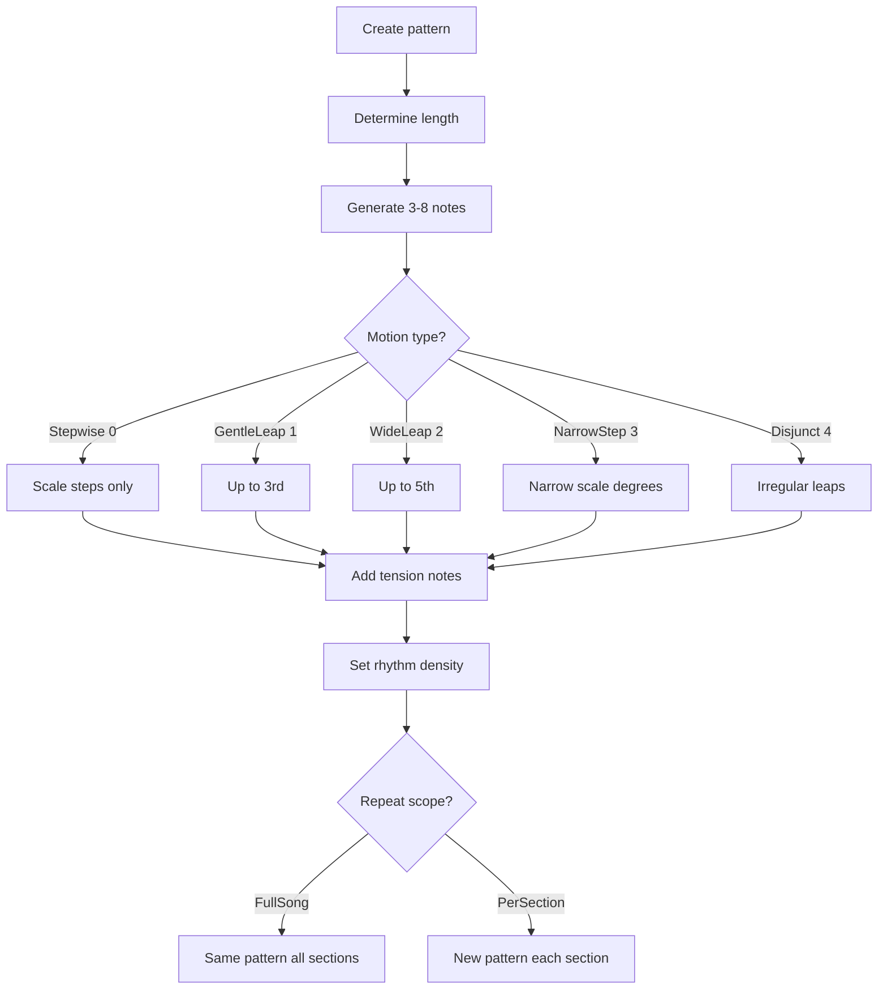
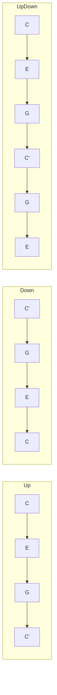

# Track Generators

This document details each track generator in [MIDI Sketch](https://github.com/libraz/midi-sketch).

## Track Overview

MIDI Sketch generates 9 tracks across different MIDI channels:



### Channel Assignment

| Track | Channel | Program | Role |
|-------|---------|---------|------|
| Vocal | 0 | Piano (0) | Main melody |
| Aux | 1 | E.Piano (4) | Sub-melody support |
| Chord | 2 | E.Piano (4) | Harmonic backing |
| Bass | 3 | E.Bass (33) | Harmonic foundation |
| Motif | 4 | Synth (81) | BackgroundMotif style |
| Arpeggio | 5 | Synth (81) | SynthDriven style |
| Guitar | 6 | Acoustic Guitar (25) | Accompaniment guitar |
| Drums | 9 | GM Drums | Rhythm |
| SE | 15 | - | Section markers |

## Vocal Track

**Source:** `src/track/vocal.cpp` (~314 lines), `src/track/melody_designer.cpp` (~2048 lines)

The vocal system uses a **template-driven melody designer** with **style-aware evaluation** for predictable, stylistically-accurate melody generation.

::: tip Why "Vocal" Track?
The Vocal track generates the main melody line. It's called "Vocal" because it's designed to be sung or played as the lead part. Use MIDI channel 0 (piano) in your DAW to preview it, or assign any instrument you prefer.
:::

### Architecture

The vocal generation consists of three major components:

1. **MelodyDesigner** (`melody_designer.cpp`) - Template-driven pitch selection with evaluation
2. **Vocal Generator** (`vocal.cpp`) - Section structure, caching, and coordination
3. **VocalStyleProfile** - Unified bias and evaluation configuration per style



### Melody Templates

7 melody templates define melodic characteristics:

| ID | Name | Plateau | Max Step | Use Case |
|----|------|---------|----------|----------|
| 0 | Auto | - | - | VocalStyle-based selection |
| 1 | PlateauTalk | 0.65 | 2 | NewJeans, Billie Eilish style |
| 2 | RunUpTarget | 0.20 | 4 | YOASOBI, Ado style |
| 3 | DownResolve | 0.30 | 3 | B-section, pre-chorus |
| 4 | HookRepeat | 0.40 | 3 | TikTok, K-POP hooks |
| 5 | SparseAnchor | 0.50 | 2 | Official髭男dism, ballad |
| 6 | CallResponse | - | - | Duet patterns |
| 7 | JumpAccent | - | - | Emotional peaks |

- **Plateau ratio**: Probability of staying on the same pitch (higher = more repetitive)
- **Max step**: Maximum interval in semitones (lower = smoother)

### Generation Flow



### Pitch Selection (4 Choices Only)

The MelodyDesigner limits pitch selection to 4 options:

```cpp
enum class PitchChoice {
    Same,       // Stay on current pitch (plateau_ratio)
    StepUp,     // +1 semitone
    StepDown,   // -1 semitone
    TargetStep  // ±2 toward target (if template has target)
};
```

This constrained approach produces more natural, singable melodies.

### Vocal Attitudes

| Attitude | Description | Implementation |
|----------|-------------|----------------|
| **Clean** | Conservative, singable | Chord tones only, on-beat |
| **Expressive** | Emotional, dynamic | Tensions allowed, timing variance |
| **Raw** | Edgy, unconventional | Non-chord tones, boundary breaking |

### Phrase Caching

Phrases are cached using a composite key (V2 cache) to ensure musical coherence:

```cpp
struct PhraseCacheKey {
    SectionType type;      // Verse, Chorus, etc.
    uint8_t bars;          // Section length
    uint8_t chord_degree;  // Starting chord degree
};

// Cache behavior:
// - 80% exact reuse: Same phrase reproduced
// - 20% variation: Applied transformations (octave shift, rhythm variation)
```

::: info Phrase Variation
When reusing cached phrases, the system may apply variations:
- **Octave shift**: Move phrase up/down an octave
- **Rhythm variation**: Slight timing adjustments
- **Contour inversion**: Flip ascending/descending patterns
:::

### Range Constraints

```cpp
struct VocalRange {
    uint8_t low = 60;   // C4
    uint8_t high = 79;  // G5
};
```

### Non-Chord Tone Decoration

The vocal track uses non-chord tones (NCT) to add melodic interest beyond simple chord-tone melodies:

::: info Strong Beats and Weak Beats
In 4/4 time, **strong beats** are beats 1 and 3 (where you naturally tap your foot), while **weak beats** are beats 2 and 4. Chord tones on strong beats create stability; non-chord tones on weak beats add movement without disrupting the harmony.
:::

| NCT Type | Description | Placement |
|----------|-------------|-----------|
| **ChordTone** | Notes belonging to the current chord (baseline) | Strong beats |
| **PassingTone** | Stepwise connection between two chord tones | Weak beats |
| **NeighborTone** | Step away from a chord tone and return | Weak beats |
| **Appoggiatura** | Accented dissonance that resolves by step | Strong beats |
| **Anticipation** | Early arrival of the next chord's tone | Before chord change |
| **Tension** | Extended chord tones (9th, 11th, 13th) | Based on style |

Configuration varies by mood:
- **Bright**: More chord tones, less dissonance
- **Jazzy**: More tensions, syncopation
- **Ballad**: Balanced with expressive appoggiaturas
- **J-POP**: Prefers pentatonic scale (yonanuki) intervals

### VocalStyleProfile

Each vocal style has a unified profile that controls both **generation bias** and **evaluation weights**:

| Profile | Plateau Bias | High Register | Singability | Surprise |
|---------|-------------|---------------|-------------|----------|
| **Standard** | 1.0 | 1.0 | 0.25 | 0.15 |
| **Idol** | 1.2 | 1.0 | 0.30 | 0.12 |
| **Rock** | 0.8 | 1.2 | 0.20 | 0.20 |
| **Ballad** | 1.1 | 0.9 | 0.40 | 0.10 |
| **Anime** | 0.9 | 1.3 | 0.25 | 0.25 |
| **Vocaloid** | 0.6 | 1.1 | 0.10 | 0.25 |
| **KPop** (13) | 1.0 | 1.2 | 0.25 | 0.20 |

### UltraVocaloid Mode

Enhanced Vocaloid-style generation with:
- **Machine-gun rhythm**: Rapid-fire 16th note sequences characteristic of Vocaloid songs
- **Breathing points**: Automatic insertion of micro-pauses for phrasing even in dense passages
- **Per-section rhythm lock**: Each section maintains consistent rhythmic identity

::: details Profile Parameters
- **Plateau Bias**: Preference for staying on the same pitch (higher = more repetitive)
- **High Register**: Preference for high notes (higher = brighter)
- **Singability**: Weight for human-singable melodies (higher = easier to sing)
- **Surprise**: Weight for unexpected melodic turns (higher = more dynamic)
:::

### Melody Evaluation System

The MelodyDesigner generates multiple candidate melodies and evaluates them:



**Evaluation Components:**

| Component | Weight | Criteria |
|-----------|--------|----------|
| Style Score | 40% | Contour matching, pattern consistency, surprise balance |
| Singability Score | 40% | Stepwise motion, breath marks, monotony avoidance |
| Bias Score | 20% | Interval distribution matching style preferences |

### Hook System

Chorus sections use a dedicated hook generation system with **6 rhythm patterns**:

| Pattern | Rhythm | Character |
|---------|--------|-----------|
| **Buildup** | 8-8-4 | Classic step resolution |
| **Syncopated** | 4-8-8 | Syncopated start |
| **FourNote** | 8-8-8-4 | High energy |
| **Powerful** | 4-4 | Simple, strong |
| **Dotted** | 8-4-8 | Dotted rhythm feel |
| **CallResponse** | 4-8-8-8 | Call and response |

**Hook Skeletons:**

| Skeleton | Description |
|----------|-------------|
| Repeat | Same pitch repeated |
| Ascending | Rising contour |
| AscendDrop | Rise then fall |
| LeapReturn | Jump and return |
| RhythmRepeat | Pitch varies, rhythm constant |

**Hook Intensity** controls hook prominence:
- **Off (0)**: No hook repetition
- **Light (1)**: Subtle hook presence
- **Normal (2)**: Standard pop hooks
- **Strong (3)**: Heavy hook emphasis (TikTok-style)

### Global Motif System

The vocal track extracts a **global motif** from the first generated phrase and uses it to maintain musical coherence:

```cpp
struct GlobalMotif {
    vector<int8_t> interval_signature;  // Relative pitch changes (max 8)
    vector<float> rhythm_signature;     // Relative duration ratios
    ContourType contour_type;           // Ascending, Descending, Peak, Valley, Plateau
};
```

**Evaluation Bonus:**
- Matching contour type: +5% score
- Similar interval patterns: +5% score (3+ matches)
- This ensures later sections feel related to the opening

### Piano Roll Safety API

**Source:** `src/core/piano_roll_safety.cpp`

The Piano Roll Safety API helps external tools (like piano roll editors) determine safe pitch placements:

```cpp
enum class CollisionType : uint8_t {
    None,    // No collision - safe to place
    Mild,    // Tritone (context-dependent)
    Severe   // Minor 2nd / Major 7th (always dissonant)
};
```

**Collision Detection:**

| Interval | Type | Risk |
|----------|------|------|
| Minor 2nd (1 semitone) | Severe | Always avoid |
| Major 7th (11 semitones) | Severe | Always avoid |
| Tritone (6 semitones) | Mild | Context-dependent |
| Others | None | Generally safe |

::: warning Modulation Awareness
The API accounts for key modulation. When modulation is enabled, the `effective_vocal_high` is reduced to prevent the final chorus from exceeding the vocal range after transposition.
:::

---

## Aux Track

**Source:** `src/track/aux_track.cpp` (~1170 lines)

The Aux (auxiliary) track provides **sub-melody support** for the main vocal. It's not a counter-melody, but a "perceptual control layer" that enhances the main melody.

### Purpose

| Role | Description |
|------|-------------|
| Addictiveness | Pulse loops create repetitive, catchy patterns |
| Physicality | Groove accents add body movement feel |
| Stability | Phrase tails provide resolution |
| Structure | Helps listeners perceive section boundaries |

### Aux Functions

9 auxiliary functions are available:

| ID | Function | Description |
|----|----------|-------------|
| 0 | PulseLoop | Repetitive same-pitch or fixed-interval patterns |
| 1 | TargetHint | Hints at vocal target with chord tones |
| 2 | GrooveAccent | Rhythmic accents with staccato |
| 3 | PhraseTail | End-of-phrase descending resolution |
| 4 | EmotionalPad | Long sustained chord tones |
| 5 | Unison | Vocal unison doubling |
| 6 | MelodicHook | Melodic hook riff |
| 7 | MotifCounter | Counter melody (contrary motion) |
| 8 | SustainPad | Whole-note chord tone pad |

### Template → Aux Mapping

Each melody template automatically selects appropriate aux functions:

| Template | Aux Functions | Reason |
|----------|---------------|--------|
| PlateauTalk | A (PulseLoop) | Ice Cream / minimal style |
| RunUpTarget | B + D | YOASOBI ascending then resolving |
| HookRepeat | A + C | TikTok repetitive hooks |
| SparseAnchor | E + D | Ballad emotional support |

### Generation Constraints

- Always generated **after** vocal (to avoid collisions)
- Narrower range than vocal (50-70% of vocal range)
- Lower velocity (0.5-0.8× vocal velocity)
- Uses HarmonyContext to avoid dissonance with vocal

### Chorus Behavior

In chorus sections, Aux track adapts its behavior:

- **Reduced density**: Aux takes a backseat to let vocal shine
- **Lower register**: Moves to lower range to avoid vocal collision
- **Simplified patterns**: Uses more sustained notes, less busy patterns
- **Phrase endings**: Respects phrase boundaries with proper resolution

---

## Chord Track

**Source:** `src/track/chord_track.cpp` (~2000 lines)

Generates harmonic voicings with voice leading optimization.

### Voicing Types



### Voice Leading Algorithm

```cpp
int voiceLeadingDistance(Voicing& prev, Voicing& next) {
    int distance = 0;
    for (int i = 0; i < 4; i++) {
        distance += abs(prev.notes[i] - next.notes[i]);
    }
    return distance;
}

// Select voicing that minimizes distance
Voicing selectBestVoicing(Voicing& prev, vector<Voicing>& candidates) {
    return min_element(candidates, [&](auto& a, auto& b) {
        return voiceLeadingDistance(prev, a) < voiceLeadingDistance(prev, b);
    });
}
```

### Bass Coordination

Uses `BassAnalysis` to avoid doubling:

```cpp
if (bassAnalysis.hasRootOnBeat1) {
    // Use rootless voicing - bass provides root
    voicing = generateRootlessVoicing(chord);
} else {
    // Include root in chord voicing
    voicing = generateFullVoicing(chord);
}
```

### Register Constraints

```cpp
constexpr uint8_t CHORD_LOW = 48;   // C3
constexpr uint8_t CHORD_HIGH = 84;  // C6
```

---

## Guitar Track

**Source:** `src/track/guitar.cpp`

The Guitar track generates accompaniment guitar patterns on a dedicated MIDI channel (Ch 6). It provides rhythmic and harmonic support that complements the chord track.

### Parameters

| Parameter | Default (JS) | Default (C++) | Description |
|-----------|-------------|---------------|-------------|
| `guitarEnabled` | `false` | `true` | Enable/disable guitar track generation |

### Blueprint Constraints

Guitar generation is influenced by Blueprint constraints:

| Constraint | Description |
|------------|-------------|
| `guitar_skill` | Skill level (Beginner/Intermediate/Advanced/Virtuoso) affecting pattern complexity and voicing sophistication |
| `guitar_below_vocal` | When enabled, keeps guitar voicings below the vocal register (vocal_low - 2 semitones) to avoid masking the melody |
| `guitar_style_hint` | Per-section style hint (0-7) defined in the Blueprint's SectionSlot. 0 = auto-select based on mood and energy |

### Generation

- Guitar is generated **after** the chord track, allowing it to complement existing harmonic voicing
- Patterns adapt to section energy and mood
- Per-section `guitar_style_hint` (0-7) in the Blueprint's SectionSlot can influence the style of guitar accompaniment
- Guitar appears on MIDI channel 6 with Acoustic Guitar (program 25) by default

---

## Bass Track

**Source:** `src/track/bass.cpp` (~1170 lines)

Generates the harmonic foundation with root-focused patterns.

### Pattern Types

The bass system supports 17+ BassPattern types. The active pattern is selected automatically based on mood and section, or influenced per-section via `bass_style_hint` in the Blueprint's SectionSlot (0=auto, 1-17 maps to BassPattern+1). Common pattern categories:

| Pattern | Description | Rhythm |
|---------|-------------|--------|
| Sparse | Minimal, ballad-style | Beat 1 only |
| Standard | Pop/rock baseline | Beats 1, 3 with fills |
| Driving | Energetic, forward | Eighth notes throughout |

### Generation Logic



### Approach Notes

Beat 4 may use chromatic approach to next root:

```cpp
// If next chord root is C
// Beat 4 could be B (half step below) or Db (half step above)
uint8_t approachNote = nextRoot - 1; // chromatic approach
```

---

## Drums Track

**Source:** `src/track/drums.cpp` (~880 lines)

Generates drum patterns with fills and dynamics.

### GM Drum Map

```cpp
constexpr uint8_t KICK = 36;
constexpr uint8_t SNARE = 38;
constexpr uint8_t SIDE_STICK = 37;
constexpr uint8_t CLOSED_HH = 42;
constexpr uint8_t OPEN_HH = 46;
constexpr uint8_t RIDE = 51;
constexpr uint8_t CRASH = 49;
constexpr uint8_t TOM_HIGH = 50;
constexpr uint8_t TOM_MID = 47;
constexpr uint8_t TOM_LOW = 45;
```

### Pattern Styles



### Fill Types

```cpp
enum class FillType {
    TomDescend,    // High → Mid → Low tom
    TomAscend,     // Low → Mid → High tom
    SnareRoll,     // Rapid snare hits
    Combo          // Mixed elements
};
```

Fills are inserted at:
- Section transitions
- Every 4 or 8 bars
- Before chorus

### Euclidean Drums

Blueprints can specify `euclidean_drums_percent` to control the probability of using Euclidean rhythm patterns, which distribute hits as evenly as possible across a given number of steps.

### Drum Role

Per-section `drum_role` in the Blueprint's SectionSlot controls drum behavior:

| Role | Description |
|------|-------------|
| Full | Standard full drum kit |
| Ambient | Subdued, atmospheric |
| Minimal | Sparse, minimal patterns |
| FXOnly | Sound effects only, no standard kit |

### Ghost Notes

Velocity-reduced snare articulations for groove:

```cpp
// Main snare: velocity 100
// Ghost note: velocity 40-60
```

Ghost note density adapts to mood:
- **Energetic moods** (BrightUpbeat, IdolPop): Higher density for livelier feel
- **Calm moods** (Ballad, Chill): Sparse ghost notes

### Swing Timing

Continuous swing control varies by section type and progress:

```cpp
float calculateSwingAmount(SectionType section, int bar_in_section, int total_bars);
// Returns 0.0 (straight) to 0.7 (heavy swing)
```

| Section | Base Swing | Behavior |
|---------|-----------|----------|
| Verse | Low | Builds gradually |
| Chorus | Medium | Consistent groove |
| Bridge | Variable | Context-dependent |

Swing is applied to off-beat notes (8th and 16th subdivisions).

### Triplet Grids

Drum patterns support triplet subdivisions for shuffle and swing feels:
- **Straight**: Standard 8th/16th note grid
- **Triplet**: 12/24 subdivisions per beat
- **Hybrid**: Mix of straight and triplet patterns

### Humanization

Subtle timing and velocity variations make patterns feel less mechanical:
- **Timing jitter**: ±5-15 ticks from grid
- **Velocity variation**: ±5-10 from base velocity
- **Hi-hat accent patterns**: Natural emphasis on downbeats

### Vocal Synchronization

When `drums_sync_vocal` is enabled, kick drums align with vocal onset positions:

```cpp
void generateDrumsTrackWithVocal(
    MidiTrack& track,
    const Song& song,
    const GeneratorParams& params,
    std::mt19937& rng,
    const VocalAnalysis& vocal_analysis  // Pre-analyzed vocal data
);
```

This "rhythm lock" effect makes the groove follow the melody, common in modern pop production.

---

## Motif Track

**Source:** `src/track/motif.cpp` (~630 lines)

For `BackgroundMotif` composition style (BGM-only mode). Creates repeating patterns that serve as the primary melodic element, allowing the vocal to take a background role or be omitted entirely.

### Parameters

```cpp
struct MotifParams {
    MotifLength length;           // 0=auto(2 bars), 1, 2, or 4 beats
    RhythmDensity rhythm_density; // 0=Sparse, 1=Medium, 2=Driving
    MotifMotion motion;           // 0=Stepwise, 1=GentleLeap, 2=WideLeap, 3=NarrowStep, 4=Disjunct
    RepeatScope repeat_scope;     // FullSong, PerSection
    MotifRegister register_;      // 0=auto(mid), 1=low, 2=high
    uint8_t note_count;           // 0=auto(6), 3-8
};
```

### Override Parameters

When motif overrides are specified in the config, the following parameters take precedence over style defaults:

| Parameter | Type | Description |
|-----------|------|-------------|
| `motifLength` | int (0=auto, 1/2/4) | Override motif length in beats (0 defaults to 2 bars) |
| `motifNoteCount` | int (0=auto, 3-8) | Override number of notes in the motif (0 defaults to 6) |
| `motifMotion` | int (0xFF=preset, 0-4) | Override motion type (0=Stepwise, 1=GentleLeap, 2=WideLeap, 3=NarrowStep, 4=Disjunct; internal 5=Ostinato for Blueprints only) |
| `motifRegisterHigh` | int (0=auto, 1=low, 2=high) | Override register range |
| `motifRhythmDensity` | int (0xFF=preset, 0-2) | Override rhythm density (0=Sparse, 1=Medium, 2=Driving) |

### Pattern Generation



**MotifMotion values** (API: 0-4, internal: 0-5):

| Value | Name | Description |
|-------|------|-------------|
| 0 | Stepwise | Scale steps only (2nds) |
| 1 | GentleLeap | Up to 3rds |
| 2 | WideLeap | Up to 5ths |
| 3 | NarrowStep | Narrow scale degrees (jazzy) |
| 4 | Disjunct | Irregular leaps (experimental) |
| 5 | Ostinato | Same pitch class repeated (**internal Blueprint use only**) |

### Register Ranges

| Register | Range |
|----------|-------|
| Mid | C3 (48) - C5 (72) |
| High | C4 (60) - C6 (84) |

---

## Arpeggio Track

**Source:** `src/track/arpeggio.cpp` (~275 lines)

For `SynthDriven` composition style (BGM-only mode). Creates arpeggiated patterns that serve as the primary harmonic/melodic element in electronic-style tracks.

### Parameters

```cpp
struct ArpeggioParams {
    ArpeggioPattern pattern;  // Up, Down, UpDown, Random, Pinwheel, PedalRoot, Alberti, BrokenChord
    ArpeggioSpeed speed;      // Eighth, Sixteenth, Triplet
    uint8_t octave_range;     // 1-3 octaves
    float gate;               // Note length ratio (0.0-1.0)
    bool sync_chord;          // Follow chord changes
};
```

### Pattern Types (8 Total)



| ID | Pattern | Description |
|----|---------|-------------|
| 0 | Up | Ascending through chord tones |
| 1 | Down | Descending through chord tones |
| 2 | UpDown | Ascending then descending |
| 3 | Random | Random chord tone selection |
| 4 | Pinwheel | Alternating direction pattern |
| 5 | PedalRoot | Returns to root between each note |
| 6 | Alberti | Classical broken chord (low-high-mid-high) |
| 7 | BrokenChord | Irregular chord tone ordering |

### Speed Conversion

```cpp
Tick getNoteDuration(ArpeggioSpeed speed) {
    switch (speed) {
        case Eighth:    return TICKS_PER_BEAT / 2;    // 240
        case Sixteenth: return TICKS_PER_BEAT / 4;    // 120
        case Triplet:   return TICKS_PER_BEAT / 3;    // 160
    }
}
```

---

## SE Track

**Source:** `src/track/se.cpp` (~15 lines)

Minimal track for section markers (text events only).

```cpp
void generateSE(Song& song) {
    for (auto& section : song.arrangement.sections) {
        MidiEvent marker;
        marker.tick = section.start_tick;
        marker.type = MidiEventType::Text;
        marker.text = section.name;
        song.se.addEvent(marker);
    end
}
```

---

## Velocity Calculation

Common velocity formula across tracks:

```cpp
uint8_t calculateVelocity(
    uint8_t baseVelocity,
    int beat,
    SectionType section,
    float trackBalance
) {
    float beatAdjust = getBeatAccent(beat);      // Strong beats: +10
    float sectionMult = getSectionEnergy(section); // Chorus: 1.2

    return clamp(
        baseVelocity * beatAdjust * sectionMult * trackBalance,
        1, 127
    );
}
```

### Track Balance

| Track | Balance | Notes |
|-------|---------|-------|
| Vocal | 1.00 | Lead instrument |
| Aux | 0.50-0.80 | Sub-melody support |
| Chord | 0.75 | Supporting |
| Bass | 0.85 | Foundation |
| Guitar | 0.70 | Accompaniment |
| Drums | 0.90 | Timing driver |
| Motif | 0.70 | Background |
| Arpeggio | 0.85 | Mid-level |
