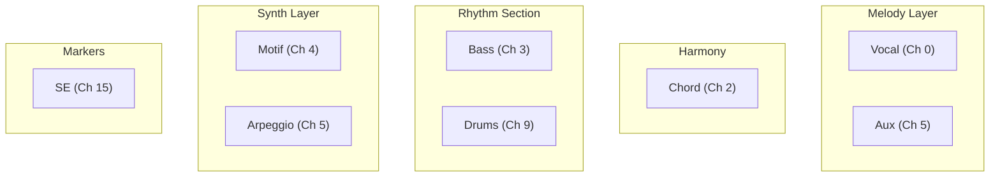
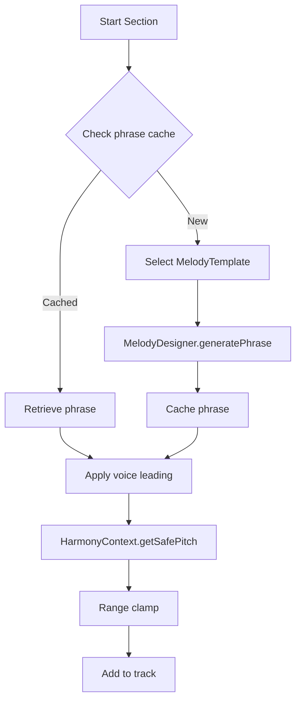
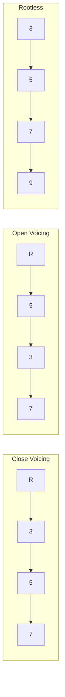
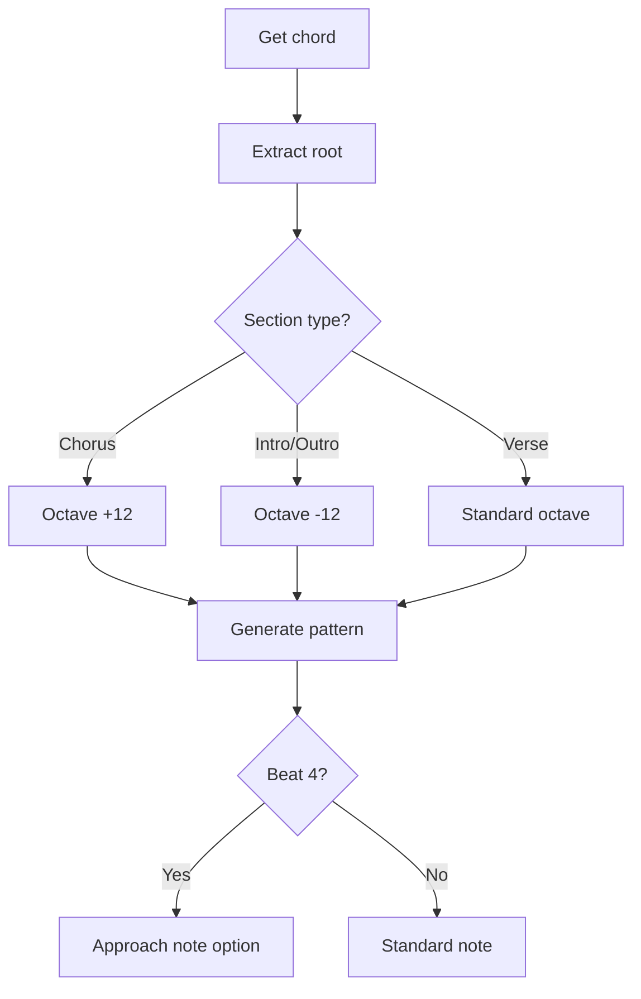
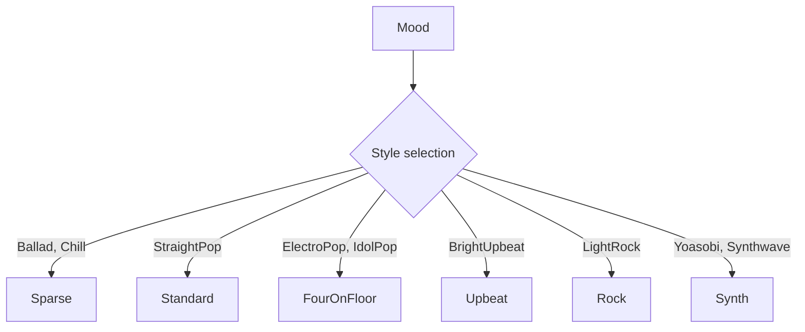
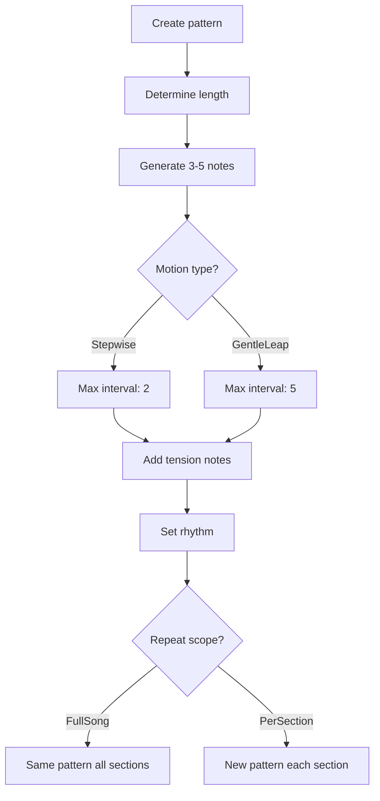
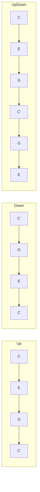

# Track Generators

This document details each track generator in [MIDI Sketch](https://github.com/libraz/midi-sketch).

## Track Overview

MIDI Sketch generates 8 tracks across different MIDI channels:



### Channel Assignment

| Track | Channel | Program | Role |
|-------|---------|---------|------|
| Vocal | 0 | Piano (0) | Main melody |
| Aux | 5 | Pad (89) | Sub-melody support |
| Chord | 2 | E.Piano (4) | Harmonic backing |
| Bass | 3 | E.Bass (33) | Harmonic foundation |
| Motif | 4 | Synth (81) | BackgroundMotif style |
| Arpeggio | 5 | Synth (81) | SynthDriven style |
| Drums | 9 | GM Drums | Rhythm |
| SE | 15 | - | Section markers |

## Vocal Track

**Source:** `src/track/vocal.cpp` (~960 lines), `src/track/melody_designer.cpp` (~1280 lines)

The vocal system uses a **template-driven melody designer** for predictable, stylistically-accurate melody generation.

### Architecture

The vocal generation is split into two components:

1. **MelodyDesigner** (`melody_designer.cpp`) - Template-driven pitch selection
2. **Vocal Generator** (`vocal.cpp`) - Section structure and coordination

### Melody Templates

7 melody templates define melodic characteristics:

| ID | Name | Plateau | Max Step | Use Case |
|----|------|---------|----------|----------|
| 0 | Auto | - | - | VocalStyle-based selection |
| 1 | PlateauTalk | 0.65 | 2 | NewJeans, Billie Eilish style |
| 2 | RunUpTarget | 0.20 | 4 | YOASOBI, Ado style |
| 3 | DownResolve | 0.30 | 3 | B-section, pre-chorus |
| 4 | HookRepeat | 0.40 | 3 | TikTok, K-POP hooks |
| 5 | SparseAnchor | 0.50 | 2 | Official髭男dism, ballad |
| 6 | CallResponse | - | - | Duet patterns |
| 7 | JumpAccent | - | - | Emotional peaks |

- **Plateau ratio**: Probability of staying on the same pitch (higher = more repetitive)
- **Max step**: Maximum interval in semitones (lower = smoother)

### Generation Flow



### Pitch Selection (4 Choices Only)

The MelodyDesigner limits pitch selection to 4 options:

```cpp
enum class PitchChoice {
    Same,       // Stay on current pitch (plateau_ratio)
    StepUp,     // +1 semitone
    StepDown,   // -1 semitone
    TargetStep  // ±2 toward target (if template has target)
};
```

This constrained approach produces more natural, singable melodies.

### Vocal Attitudes

| Attitude | Description | Implementation |
|----------|-------------|----------------|
| **Clean** | Conservative, singable | Chord tones only, on-beat |
| **Expressive** | Emotional, dynamic | Tensions allowed, timing variance |
| **Raw** | Edgy, unconventional | Non-chord tones, boundary breaking |

### Phrase Caching

Phrases are cached by section type to ensure musical coherence:

```cpp
std::map<SectionType, std::vector<Phrase>> phraseCache_;

// A section uses same/similar phrases when repeated
// Chorus maintains its melodic identity
```

### Range Constraints

```cpp
struct VocalRange {
    uint8_t low = 60;   // C4
    uint8_t high = 79;  // G5
};
```

### Melodic Embellishment

The vocal track uses a melodic embellishment system that adds musical "play" to chord-tone melodies:

| NCT Type | Description | Placement |
|----------|-------------|-----------|
| **ChordTone** | Harmonic tone (baseline) | Strong beats |
| **PassingTone** | Stepwise motion between chord tones | Weak beats |
| **NeighborTone** | Step away and return to same chord tone | Weak beats |
| **Appoggiatura** | Accented dissonance resolving by step | Strong beats |
| **Anticipation** | Early arrival of next chord's tone | Before chord change |
| **Tension** | 9th, 11th, 13th from chord extensions | Based on style |

Configuration varies by mood:
- **Bright**: More chord tones, less dissonance
- **Jazzy**: More tensions, syncopation
- **Ballad**: Balanced with expressive appoggiaturas
- **J-POP**: Prefers pentatonic scale (yonanuki) intervals

---

## Aux Track

**Source:** `src/track/aux_track.cpp` (~1170 lines)

The Aux (auxiliary) track provides **sub-melody support** for the main vocal. It's not a counter-melody, but a "perceptual control layer" that enhances the main melody.

### Purpose

| Role | Description |
|------|-------------|
| Addictiveness | Pulse loops create repetitive, catchy patterns |
| Physicality | Groove accents add body movement feel |
| Stability | Phrase tails provide resolution |
| Structure | Helps listeners perceive section boundaries |

### Aux Functions

5 auxiliary functions are available:

| ID | Function | Description |
|----|----------|-------------|
| A | PulseLoop | Repetitive same-pitch or fixed-interval patterns |
| B | TargetHint | Hints at vocal target with chord tones |
| C | GrooveAccent | Rhythmic accents with staccato |
| D | PhraseTail | End-of-phrase descending resolution |
| E | EmotionalPad | Long sustained chord tones |

### Template → Aux Mapping

Each melody template automatically selects appropriate aux functions:

| Template | Aux Functions | Reason |
|----------|---------------|--------|
| PlateauTalk | A (PulseLoop) | Ice Cream / minimal style |
| RunUpTarget | B + D | YOASOBI ascending then resolving |
| HookRepeat | A + C | TikTok repetitive hooks |
| SparseAnchor | E + D | Ballad emotional support |

### Generation Constraints

- Always generated **after** vocal (to avoid collisions)
- Narrower range than vocal (50-70% of vocal range)
- Lower velocity (0.5-0.8× vocal velocity)
- Uses HarmonyContext to avoid dissonance with vocal

### Chorus Behavior

In chorus sections, Aux track adapts its behavior:

- **Reduced density**: Aux takes a backseat to let vocal shine
- **Lower register**: Moves to lower range to avoid vocal collision
- **Simplified patterns**: Uses more sustained notes, less busy patterns
- **Phrase endings**: Respects phrase boundaries with proper resolution

---

## Chord Track

**Source:** `src/track/chord_track.cpp` (~2000 lines)

Generates harmonic voicings with voice leading optimization.

### Voicing Types



### Voice Leading Algorithm

```cpp
int voiceLeadingDistance(Voicing& prev, Voicing& next) {
    int distance = 0;
    for (int i = 0; i < 4; i++) {
        distance += abs(prev.notes[i] - next.notes[i]);
    }
    return distance;
}

// Select voicing that minimizes distance
Voicing selectBestVoicing(Voicing& prev, vector<Voicing>& candidates) {
    return min_element(candidates, [&](auto& a, auto& b) {
        return voiceLeadingDistance(prev, a) < voiceLeadingDistance(prev, b);
    });
}
```

### Bass Coordination

Uses `BassAnalysis` to avoid doubling:

```cpp
if (bassAnalysis.hasRootOnBeat1) {
    // Use rootless voicing - bass provides root
    voicing = generateRootlessVoicing(chord);
} else {
    // Include root in chord voicing
    voicing = generateFullVoicing(chord);
}
```

### Register Constraints

```cpp
constexpr uint8_t CHORD_LOW = 48;   // C3
constexpr uint8_t CHORD_HIGH = 84;  // C6
```

---

## Bass Track

**Source:** `src/track/bass.cpp` (~1170 lines)

Generates the harmonic foundation with root-focused patterns.

### Pattern Types

| Pattern | Description | Rhythm |
|---------|-------------|--------|
| Sparse | Minimal, ballad-style | Beat 1 only |
| Standard | Pop/rock baseline | Beats 1, 3 with fills |
| Driving | Energetic, forward | Eighth notes throughout |

### Generation Logic



### Approach Notes

Beat 4 may use chromatic approach to next root:

```cpp
// If next chord root is C
// Beat 4 could be B (half step below) or Db (half step above)
uint8_t approachNote = nextRoot - 1; // chromatic approach
```

---

## Drums Track

**Source:** `src/track/drums.cpp` (~880 lines)

Generates drum patterns with fills and dynamics.

### GM Drum Map

```cpp
constexpr uint8_t KICK = 36;
constexpr uint8_t SNARE = 38;
constexpr uint8_t SIDE_STICK = 37;
constexpr uint8_t CLOSED_HH = 42;
constexpr uint8_t OPEN_HH = 46;
constexpr uint8_t RIDE = 51;
constexpr uint8_t CRASH = 49;
constexpr uint8_t TOM_HIGH = 50;
constexpr uint8_t TOM_MID = 47;
constexpr uint8_t TOM_LOW = 45;
```

### Pattern Styles



### Fill Types

```cpp
enum class FillType {
    TomDescend,    // High → Mid → Low tom
    TomAscend,     // Low → Mid → High tom
    SnareRoll,     // Rapid snare hits
    Combo          // Mixed elements
};
```

Fills are inserted at:
- Section transitions
- Every 4 or 8 bars
- Before chorus

### Ghost Notes

Velocity-reduced snare articulations for groove:

```cpp
// Main snare: velocity 100
// Ghost note: velocity 40-60
```

---

## Motif Track

**Source:** `src/track/motif.cpp` (~630 lines)

For `BackgroundMotif` composition style (BGM-only mode). Creates repeating patterns that serve as the primary melodic element, allowing the vocal to take a background role or be omitted entirely.

### Parameters

```cpp
struct MotifParams {
    MotifLength length;           // TwoBars, FourBars
    RhythmDensity rhythm_density; // Sparse, Medium, Driving
    MotifMotion motion;           // Stepwise, GentleLeap
    RepeatScope repeat_scope;     // FullSong, PerSection
    MotifRegister register_;      // Mid, High
};
```

### Pattern Generation



### Register Ranges

| Register | Range |
|----------|-------|
| Mid | C3 (48) - C5 (72) |
| High | C4 (60) - C6 (84) |

---

## Arpeggio Track

**Source:** `src/track/arpeggio.cpp` (~275 lines)

For `SynthDriven` composition style (BGM-only mode). Creates arpeggiated patterns that serve as the primary harmonic/melodic element in electronic-style tracks.

### Parameters

```cpp
struct ArpeggioParams {
    ArpeggioPattern pattern;  // Up, Down, UpDown, Random
    ArpeggioSpeed speed;      // Eighth, Sixteenth, Triplet
    uint8_t octave_range;     // 1-3 octaves
    float gate;               // Note length ratio (0.0-1.0)
    bool sync_chord;          // Follow chord changes
};
```

### Pattern Types



### Speed Conversion

```cpp
Tick getNoteDuration(ArpeggioSpeed speed) {
    switch (speed) {
        case Eighth:    return TICKS_PER_BEAT / 2;    // 240
        case Sixteenth: return TICKS_PER_BEAT / 4;    // 120
        case Triplet:   return TICKS_PER_BEAT / 3;    // 160
    }
}
```

---

## SE Track

**Source:** `src/track/se.cpp` (~15 lines)

Minimal track for section markers (text events only).

```cpp
void generateSE(Song& song) {
    for (auto& section : song.arrangement.sections) {
        MidiEvent marker;
        marker.tick = section.start_tick;
        marker.type = MidiEventType::Text;
        marker.text = section.name;
        song.se.addEvent(marker);
    end
}
```

---

## Velocity Calculation

Common velocity formula across tracks:

```cpp
uint8_t calculateVelocity(
    uint8_t baseVelocity,
    int beat,
    SectionType section,
    float trackBalance
) {
    float beatAdjust = getBeatAccent(beat);      // Strong beats: +10
    float sectionMult = getSectionEnergy(section); // Chorus: 1.2

    return clamp(
        baseVelocity * beatAdjust * sectionMult * trackBalance,
        1, 127
    );
}
```

### Track Balance

| Track | Balance | Notes |
|-------|---------|-------|
| Vocal | 1.00 | Lead instrument |
| Aux | 0.50-0.80 | Sub-melody support |
| Chord | 0.75 | Supporting |
| Bass | 0.85 | Foundation |
| Drums | 0.90 | Timing driver |
| Motif | 0.70 | Background |
| Arpeggio | 0.85 | Mid-level |
