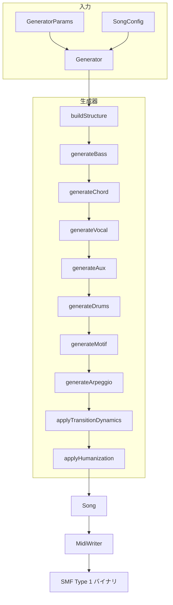
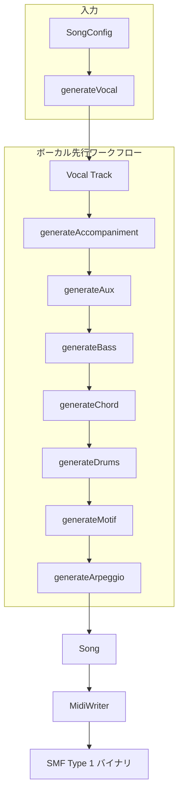

# アーキテクチャ概要

[MIDI Sketch](https://github.com/libraz/midi-sketch)の内部アーキテクチャを解説します。

## プロジェクト構造

```text
midi-sketch/
├── src/
│   ├── core/              # コア生成エンジン（約4500行）
│   │   ├── pitch_utils.h/cpp      # ピッチ操作（テッシトゥーラ、音程）
│   │   ├── chord_utils.h/cpp      # コード操作（コードトーン）
│   │   ├── melody_templates.h/cpp # 7つのメロディテンプレート定義
│   │   ├── melody_embellishment.h/cpp # NCT挿入システム
│   │   ├── harmony_context.h/cpp  # トラック間衝突検出
│   │   ├── piano_roll_safety.h/cpp # ピアノロール可視化API
│   │   ├── generator.h/cpp        # 中央オーケストレーター
│   │   └── basic_types.h          # コア型定義
│   ├── midi/              # MIDI出力（SMF Type 1, MIDI 2.0）
│   ├── track/             # トラック生成器
│   │   ├── vocal.cpp              # ボーカル調整（約314行）
│   │   ├── melody_designer.cpp    # テンプレート駆動メロディ（約2048行）
│   │   ├── aux_track.cpp          # Aux副旋律（約1600行）
│   │   ├── chord_track.cpp        # コードボイシング（約2050行）
│   │   ├── bass.cpp               # ベースパターン（約1420行）
│   │   └── ...                    # その他のトラック生成器
│   ├── analysis/          # 不協和音分析
│   ├── preset/            # プリセット定義
│   ├── midisketch.h       # 公開C++ API
│   └── midisketch_c.h     # C API（WASMインターフェース、約650行）
├── tests/                 # Google Testスイート（770+テスト）
├── dist/                  # WASM配布物
└── demo/                  # ブラウザデモ
```

## コアコンポーネント

### MidiSketchクラス

高レベルAPIを提供するメインエントリーポイント：

::: tip 2つの生成ワークフロー
- **ボーカル先行**: `generateVocal()` → `regenerateVocal()`で反復 → `generateAccompaniment()`で完成
- **標準**: `generate()` または `generateFromConfig()` でワンショット生成
:::

```cpp
class MidiSketch {
  void generate(const GeneratorParams& params);
  void generateFromConfig(const SongConfig& config);
  void regenerateVocal(const VocalConfig& config);
  void generateVocal(const SongConfig& config);
  void generateAccompaniment(const AccompanimentConfig& config);
  void regenerateAccompaniment(uint32_t seed);
  void setVocalNotes(const SongConfig& config, const NoteInput* notes, size_t count);

  std::vector<uint8_t> getMidi() const;
  std::string getEventsJson() const;
  const Song& getSong() const;
};
```

### Generator

全トラック生成を統括する中央オーケストレーター（`src/core/generator.h`）：

```cpp
class Generator {
  Song generate(const GeneratorParams& params);
private:
  void buildStructure();
  void generateBass();
  void generateChord();
  void generateVocal();
  void generateAux();         // NEW: Aux副旋律生成
  void generateDrums();
  void generateMotif();
  void generateArpeggio();
  void applyTransitionDynamics();
  void applyHumanization();
};
```

### Songコンテナ

生成された全データを保持（8トラック）：

```cpp
struct Song {
  Arrangement arrangement;     // セクション配置
  MidiTrack vocal;            // チャンネル 0 - 主旋律
  MidiTrack aux;              // チャンネル 5 - 副旋律（NEW）
  MidiTrack chord;            // チャンネル 2 - 和声
  MidiTrack bass;             // チャンネル 3 - ベース
  MidiTrack motif;            // チャンネル 4 - BackgroundMotifスタイル
  MidiTrack arpeggio;         // チャンネル 5 - SynthDrivenスタイル
  MidiTrack drums;            // チャンネル 9 - リズム
  MidiTrack se;               // チャンネル 15（マーカー）
};
```

::: info チャンネル共有
AuxとArpeggioはMIDIチャンネル5を共有しています。MelodyLeadスタイルではAuxが生成され、SynthDrivenスタイルではArpeggioが生成されます。両者が同時に有効になることはありません。
:::

## データフロー

### 標準生成（BGM先行）



### ボーカル先行生成



## 時間表現

MIDI Sketchは全体でティックベースのタイミングを使用：

```cpp
using Tick = uint32_t;
constexpr Tick TICKS_PER_BEAT = 480;    // 標準MIDI解像度
constexpr Tick TICKS_PER_BAR = 1920;    // 4/4拍子
constexpr uint8_t BEATS_PER_BAR = 4;
```

::: tip ティック計算
- 4分音符 = 480 ticks
- 8分音符 = 240 ticks
- 16分音符 = 120 ticks
- 1小節（4/4拍子）= 1920 ticks
:::

## ノート表現

2層のノート表現：

```cpp
// 中間的な音楽表現（内部用）
struct NoteEvent {
  Tick startTick;      // 絶対開始時間
  Tick duration;       // ティック単位の長さ
  uint8_t note;        // MIDIノート（0-127）
  uint8_t velocity;    // MIDIベロシティ（0-127）
};

// 低レベルMIDIバイト（出力専用）
struct MidiEvent {
  Tick tick;           // 絶対時間
  uint8_t status;      // MIDIステータスバイト
  uint8_t data1;       // 第1データバイト
  uint8_t data2;       // 第2データバイト
};
```

## セクション定義

楽曲はセクションに分割：

```cpp
struct Section {
  SectionType type;              // Intro, A, B, Chorus, Bridge, Interlude, Outro
  std::string name;              // 表示名
  uint8_t bars;                  // 小節数
  Tick startBar;                 // 開始位置（小節）
  Tick start_tick;               // 開始位置（ティック）
  VocalDensity vocal_density;    // Full, Sparse, None
  BackingDensity backing_density; // Normal, Thin, Thick
};
```

## コンポジションスタイル

3つのコンポジションスタイルが生成アプローチに影響：

| スタイル | 説明 |
|----------|------|
| **MelodyLead** | ボーカルメロディが主役の伝統的なアレンジ |
| **BackgroundMotif** | 繰り返しモチーフが主役、ボーカルは控えめ |
| **SynthDriven** | シンセ/アルペジオ主体のエレクトロニックスタイル |

::: warning BGM専用モード
BackgroundMotifとSynthDrivenは**BGM専用モード**です。ボーカルトラックは生成されません。ボーカル付きの楽曲にはMelodyLeadを使用してください。
:::

## 乱数生成

メルセンヌ・ツイスターによる決定論的生成：

```cpp
std::mt19937 rng(seed);  // 同じシード = 同じ出力
```

::: info 再現性
- **seed > 0**: 完全決定論的 - 同じシードと同じパラメータで常に同一の出力
- **seed = 0**: ランダム - 現在時刻を使用、実行ごとに異なる結果
:::

シードが0の場合、現在時刻がランダム化に使用されます。

## WASMコンパイル

Emscripten経由でWebAssemblyにコンパイル：

- **出力**: 約155KB WASM + 約37KB JS（ラッパー + グルー）
- **外部依存なし**: 純粋なC++17
- **ES6モジュール**: モジュラーJavaScriptラッパー

```bash
# ビルドフラグ
-sWASM=1 -sMODULARIZE=1 -sEXPORT_ES6=1
-sALLOW_MEMORY_GROWTH=1 -sSTACK_SIZE=1048576
```

## C APIレイヤー

WASM相互運用のため、C APIがC++クラスをラップ：

```c
// ライフサイクル
MidiSketchHandle handle = midisketch_create();
midisketch_generate(handle, params);
MidiSketchMidiData* midi = midisketch_get_midi(handle);
midisketch_free_midi(midi);
midisketch_destroy(handle);
```

主要関数：

- `midisketch_generate()` - コア生成
- `midisketch_regenerate_melody()` - メロディバリエーション
- `midisketch_get_midi()` - MIDIバイナリ出力
- `midisketch_get_events()` - JSONイベントデータ
- `midisketch_get_info()` - メタデータ（小節数、ティック、BPM）
