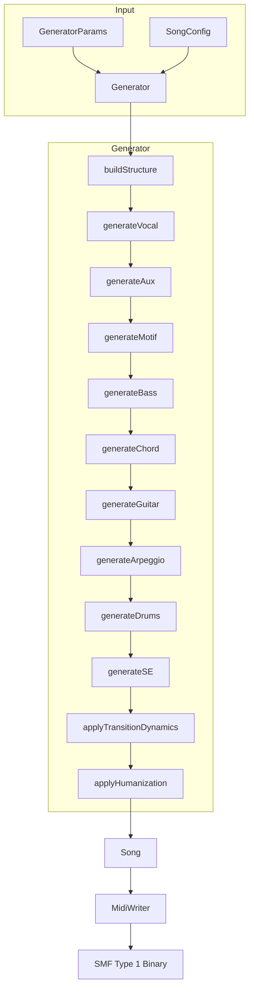
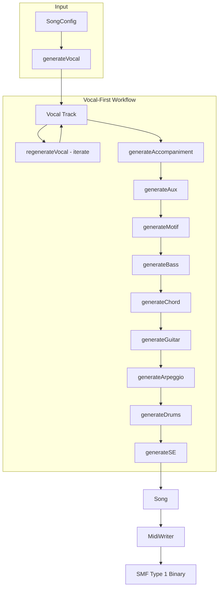

# アーキテクチャ概要

[MIDI Sketch](https://github.com/libraz/midi-sketch)の内部アーキテクチャを解説します。

## プロジェクト構造

```
midi-sketch/
├── src/
│   ├── core/              # コアエンジン（約16000行、46ヘッダー）
│   │   ├── generator.h/cpp        # 中央オーケストレーター
│   │   ├── harmony_context.h      # トラック間衝突検出ファサード
│   │   ├── chord_progression_tracker.h/cpp
│   │   ├── track_collision_detector.h/cpp
│   │   ├── safe_pitch_resolver.h/cpp
│   │   ├── melody_evaluator.h/cpp # 候補スコアリングシステム
│   │   ├── melody_templates.h/cpp # 7つのメロディテンプレート定義
│   │   ├── melody_embellishment.h/cpp # NCT挿入システム
│   │   ├── pitch_utils.h/cpp      # ピッチ操作
│   │   ├── chord_utils.h/cpp      # コード操作
│   │   ├── piano_roll_safety.h/cpp
│   │   ├── modulation_calculator.h/cpp
│   │   ├── preset_data.h/cpp      # スタイルプリセット
│   │   └── ...                    # 型、ユーティリティ等
│   ├── track/             # トラック生成器（約13000行、14ヘッダー）
│   │   ├── melody_designer.h/cpp  # テンプレート駆動メロディ
│   │   ├── vocal.h/cpp            # ボーカル調整
│   │   ├── aux_track.h/cpp        # Aux副旋律
│   │   ├── chord_track.h/cpp      # コードボイシング
│   │   ├── bass.h/cpp             # ベースパターン
│   │   ├── drums.h/cpp            # ドラムパターン
│   │   ├── motif.h/cpp            # バックグラウンドモチーフ
│   │   ├── guitar.h/cpp           # 伴奏ギター
│   │   ├── arpeggio.h/cpp         # アルペジオパターン
│   │   └── se.h/cpp               # セクションマーカー
│   ├── midi/              # MIDI出力（8ヘッダー）
│   ├── analysis/          # 不協和音分析
│   ├── midisketch.h       # 公開C++ API
│   └── midisketch_c.h     # C API（WASMインターフェース）
├── tests/                 # Google Testスイート（63テストファイル）
├── dist/                  # WASM配布物
└── demo/                  # ブラウザデモ
```

## コアコンポーネント

### MidiSketchクラス

高レベルAPIを提供するメインエントリーポイント：

::: tip 2つの生成ワークフロー
- **ボーカル先行**: `generateVocal()` → `regenerateVocal()`で反復 → `generateAccompaniment()`で完成
- **標準**: `generate()` または `generateFromConfig()` でワンショット生成

設定は**SongConfigBuilder**を使って構築できます。カスケード変更検出付きの流暢なAPIで、上流の値が変更されると依存パラメータが自動的に再計算されます。
:::

```cpp
class MidiSketch {
  void generate(const GeneratorParams& params);
  void generateFromConfig(const SongConfig& config);
  void generateWithVocal(const SongConfig& config);   // Vocal-priority full generation
  void generateVocal(const SongConfig& config);
  void regenerateVocal(const VocalConfig& config);
  void generateAccompaniment(const AccompanimentConfig& config);
  void regenerateAccompaniment(uint32_t seed);
  void setVocalNotes(const SongConfig& config, const NoteInput* notes, size_t count);

  std::vector<uint8_t> getMidi() const;
  std::string getEventsJson() const;
  std::string getChordTimeline() const;               // Chord progression timeline
  const Song& getSong() const;
};
```

### Generator

全トラック生成を統括する中央オーケストレーター（`src/core/generator.h`）：

```cpp
class Generator {
  Song generate(const GeneratorParams& params);
private:
  void buildStructure();
  void generateVocal();
  void generateAux();
  void generateMotif();
  void generateBass();
  void generateChord();
  void generateGuitar();      // Accompaniment guitar generation
  void generateArpeggio();
  void generateDrums();
  void generateSE();          // Section markers / sound effects
  void applyTransitionDynamics();
  void applyHumanization();
};
```

### Songコンテナ

生成された全データを保持（9トラック）：

```cpp
struct Song {
  Arrangement arrangement;     // セクション配置
  MidiTrack vocal;            // Channel 0 - Main melody
  MidiTrack chord;            // Channel 1 - Harmony
  MidiTrack bass;             // Channel 2 - Foundation
  MidiTrack motif;            // Channel 3 - BackgroundMotif style
  MidiTrack arpeggio;         // Channel 4 - SynthDriven style
  MidiTrack aux;              // Channel 5 - Sub-melody
  MidiTrack guitar;           // Channel 6 - Accompaniment guitar
  MidiTrack drums;            // Channel 9 - Rhythm
  MidiTrack se;               // Channel 15 (markers)
};
```

::: info 専用チャンネル
すべてのトラックは専用のMIDIチャンネルを持ちます（`src/midi/track_config.h`）。Aux（Ch 5）とArpeggio（Ch 4）は別チャンネルなので、コンポジションスタイルや設定によっては同じ曲に両方が現れることがあります。
:::

## データフロー

### 標準生成（Traditionalパラダイム）



::: details パラダイム別の生成順序
トラック生成順序はBlueprintのパラダイムによって異なります：
- **Traditional / MelodyDriven**: Vocal -> Aux -> Motif -> Bass -> Chord -> Guitar -> Arpeggio -> Drums -> SE
- **RhythmSync**: Motif -> Vocal -> Aux -> Bass -> Chord -> Guitar -> Arpeggio -> Drums -> SE
:::

### ボーカル先行生成



## 時間表現

MIDI Sketchは全体でティックベースのタイミングを使用：

```cpp
using Tick = uint32_t;
constexpr Tick TICKS_PER_BEAT = 480;    // Standard MIDI resolution
constexpr Tick TICKS_PER_BAR = 1920;    // 4/4 time signature
constexpr uint8_t BEATS_PER_BAR = 4;
```

::: tip ティック計算
- 4分音符 = 480 ticks
- 8分音符 = 240 ticks
- 16分音符 = 120 ticks
- 1小節（4/4拍子）= 1920 ticks
:::

## ノート表現

2層のノート表現：

```cpp
// Intermediate musical representation (internal)
struct NoteEvent {
  Tick startTick;      // Absolute start time
  Tick duration;       // Duration in ticks
  uint8_t note;        // MIDI note (0-127)
  uint8_t velocity;    // MIDI velocity (0-127)
};

// Low-level MIDI bytes (output only)
struct MidiEvent {
  Tick tick;           // Absolute time
  uint8_t status;      // MIDI status byte
  uint8_t data1;       // First data byte
  uint8_t data2;       // Second data byte
};
```

## セクション定義

楽曲はセクションに分割：

```cpp
struct Section {
  SectionType type;              // Intro, A, B, Chorus, Bridge, Interlude, Outro
  std::string name;              // Display name
  uint8_t bars;                  // Bar count
  Tick startBar;                 // Start position (bars)
  Tick start_tick;               // Start position (ticks)
  VocalDensity vocal_density;    // Full, Sparse, None
  BackingDensity backing_density; // Normal, Thin, Thick
};
```

## コンポジションスタイル

3つのコンポジションスタイルが生成アプローチに影響：

| スタイル | Vocal | Aux | Motif | Arpeggio | 説明 |
|----------|:-----:|:---:|:-----:|:--------:|------|
| **MelodyLead (0)** | Yes | Yes | Blueprint依存 | Optional | ボーカルメロディが主役の伝統的なアレンジ |
| **BackgroundMotif (1)** | No | Yes | Yes | Optional | Vocal無効、Aux有効、Motifが主要フォーカス |
| **SynthDriven (2)** | No | No | Blueprint依存 | Optional（手動有効化） | Vocal/Aux無効、シンセ/アルペジオ主体のエレクトロニックスタイル |

::: warning BGM専用モード
BackgroundMotifはVocalを無効にしますが、Auxは有効のままでMotif生成を強制します。SynthDrivenはVocalとAuxの両方を無効にし、Arpeggioは`arpeggioEnabled=true`で手動で有効にする必要があります。ボーカル付きの楽曲にはMelodyLeadを使用してください。
:::

## プロダクションブループリント

ブループリントはトラック生成順序、モチーフの振る舞い、暗黙的なオーバーライドを制御する高レベルのプロダクションテンプレートです。10個のブループリント（ID 0-9）があり、ID 255でランダム選択が可能です。

| ID | Name | Paradigm | RiffPolicy | Drums Required | Weight |
|----|------|----------|------------|:--------------:|--------|
| 0 | Traditional | Traditional | Free | - | 42% |
| 1 | RhythmLock | RhythmSync | Locked | **Yes** | 14% |
| 2 | StoryPop | MelodyDriven | Evolving | - | 10% |
| 3 | Ballad | MelodyDriven | Free | - | 4% |
| 4 | IdolStandard | MelodyDriven | Evolving | - | 10% |
| 5 | IdolHyper | RhythmSync | Locked | **Yes** | 6% |
| 6 | IdolKawaii | MelodyDriven | Locked | **Yes** | 5% |
| 7 | IdolCoolPop | RhythmSync | Locked | **Yes** | 5% |
| 8 | IdolEmo | MelodyDriven | Locked | - | 4% |
| 9 | BehavioralLoop | Traditional | LockedPitch | - | 0%* |

\* BehavioralLoop（ID 9）はweight 0%で、明示的に選択する必要があります（ランダム選択されません）。`addictive_mode=true`、`RiffPolicy::LockedPitch`、`HookIntensity::Maximum`を強制します。

::: details パラダイム
- **Traditional**: Vocal -> Aux -> Motif -> Bass -> Chord -> Guitar -> Arpeggio -> Drums -> SE
- **RhythmSync**: Motif -> Vocal -> Aux -> Bass -> Chord -> Guitar -> Arpeggio -> Drums -> SE（Motifを座標軸として使用）
- **MelodyDriven**: Vocal -> Aux -> Motif -> Bass -> Chord -> Guitar -> Arpeggio -> Drums -> SE（Traditionalと同じ順序だがMotifはメロディに追従）
:::

::: details RiffPolicy
APIは3つのRiffPolicy値を公開：
- **Free (0)**: セクションごとにMotifが変化（MotifRepeatScopeがセクション間の振る舞いを制御）
- **Locked (1)**: ピッチ輪郭は固定、表現は変化（内部的にはLockedContour）
- **Evolving (2)**: 2セクションごとに30%の確率で変化

内部的にはブループリントはより細かい粒度のセットを使用：Free(0)、LockedContour(1)、LockedPitch(2)、LockedAll(3)、Evolving(4)。
:::

::: details ブループリントオーバーライド
ブループリントはSongConfigの複数のパラメータをオーバーライドできます：
- `section_flow`が`formId`をオーバーライド（存在し、かつ`formExplicit=false`の場合）
- `riff_policy`が`motifRepeatScope`をオーバーライド（Freeの場合のみ）
- `drums_required`が`drums_enabled=true`を強制（`drumsEnabledExplicit=true`かつ`drumsEnabled=false`の場合を除く）
- `drums_sync_vocal`がSongConfigの設定をオーバーライド
- `mood_mask`が互換性のあるムードを制限（`isMoodCompatible()`で確認）
:::

## パラメータ適用順序

パラメータは特定のカスケード順序で適用され、後の段階が前の段階をオーバーライドできます：

```
StylePreset → VocalStylePreset → MelodicComplexity → SongConfig Overrides → Master Switch
```

1. **StylePreset**: メロディ設定を含む基本パラメータを設定
2. **VocalStylePreset**: max_leap、syncopation、density、その他のボーカル特性を調整
3. **MelodicComplexity**: density/leap乗数を適用（Simpleは減少、Complexは増幅）
4. **SongConfig Overrides**: ユーザー指定のメロディ/モチーフオーバーライドパラメータが最高優先度
5. **Master Switch**: `enableSyncopation=false`でsyncopation_prob=0.0とallow_bar_crossing=falseを強制

## 乱数生成

メルセンヌ・ツイスターによる決定論的生成：

```cpp
std::mt19937 rng(seed);  // Same seed = same output
```

::: info 再現性
- **seed > 0**: 完全決定論的 - 同じシードと同じパラメータで常に同一の出力
- **seed = 0**: ランダム - 現在時刻を使用、実行ごとに異なる結果
:::

シードが0の場合、現在時刻がランダム化に使用されます。

## WASMコンパイル

Emscripten経由でWebAssemblyにコンパイル：

- **出力**: 約<WasmStat type="size" /> WASM（gzip: 約<WasmStat type="gzip" />）+ 約<WasmStat type="js" /> JS（ラッパー + グルー）
- **外部依存なし**: 純粋なC++17
- **ES6モジュール**: モジュラーJavaScriptラッパー

```bash
# Build flags
-sWASM=1 -sMODULARIZE=1 -sEXPORT_ES6=1
-sALLOW_MEMORY_GROWTH=1 -sSTACK_SIZE=1048576
```

## C APIレイヤー

WASM相互運用のため、C APIがC++クラスをラップ：

```c
// Lifecycle
MidiSketchHandle handle = midisketch_create();
midisketch_generate(handle, params);
MidiSketchMidiData* midi = midisketch_get_midi(handle);
midisketch_free_midi(midi);
midisketch_destroy(handle);
```

主要関数：
- `midisketch_generate()` - コア生成
- `midisketch_generate_vocal_from_json()` - ボーカルのみの生成
- `midisketch_regenerate_vocal_from_json()` - ボーカル再生成
- `midisketch_generate_accompaniment_from_json()` - 伴奏生成
- `midisketch_regenerate_accompaniment_from_json()` - 伴奏再生成
- `midisketch_generate_with_vocal_from_json()` - ボーカル優先フル生成
- `midisketch_set_vocal_notes_from_json()` - カスタムボーカル注入
- `midisketch_get_piano_roll_safety()` - ピアノロール安全性分析
- `midisketch_get_chord_timeline()` - コードタイムライン取得
- `midisketch_get_midi()` - MIDIバイナリ出力
- `midisketch_get_events()` - JSONイベントデータ
- `midisketch_get_info()` - メタデータ（小節数、ティック、BPM）
- `midisketch_blueprint_count()` / `midisketch_blueprint_name()` - ブループリント情報
