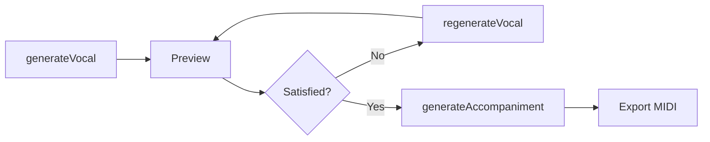

# 特徴

MIDI Sketch は音楽理論に基づいたMIDI生成ツールで、完全なポップスアレンジメントを作成します。

## オーディオではなくMIDI出力

AI音声生成ツール（Suno、Udio など）と異なり、MIDI Sketch は**編集可能なMIDIデータ**を出力します。

| | AI音声生成 | MIDI Sketch |
|---|---|---|
| 出力 | 完成オーディオ (MP3/WAV) | MIDIファイル |
| 編集 | 制限あり or 不可 | DAWで完全にコントロール |
| 音色 | 固定 | 自由に選択 |
| ミックス | 焼き込み済み | 自分で決定 |
| 再現性 | しばしば不安定 | 決定的（シードベース） |

::: tip 得られるもの
- 9つの分離トラック（vocal, aux, chord, bass, motif, guitar, arpeggio, drums, SE）
- 各トラックは個別のMIDIチャンネル
- 任意のDAWに直接インポート
- 自分の音源とエフェクトを使用
:::

## 音楽理論基盤

MIDI Sketch は機械学習やニューラルネットワークを使用しません。古典的な和声理論と現代ポップス分析を組み合わせて実装しています。

### メロディ生成

::: details テンプレート駆動アーキテクチャ
7つのメロディテンプレートが特定のボーカルスタイルをモデル化：
- **PlateauTalk**: NewJeans/Billie Eilish スタイル - 高音域プラトーとトークシング
- **RunUpTarget**: YOASOBI/Ado スタイル - ターゲット音への上昇ラン
- **HookRepeat**: TikTok/K-POP スタイル - 短い反復フック
- **SparseAnchor**: Official髭男dism スタイル - スパースなアンカー音
- その他 (DownResolve, CallResponse, JumpAccent)
:::

::: details 歌いやすさの制約
- **方向慣性**: 蓄積されたモメンタム追跡で急激な方向変化を防止
- **テッシトゥーラ適用**: 快適な歌唱音域のためのリアルタイムピッチ調整
- **跳躍補償**: 大きな音程の後に自動安定化ステップ
- **母音制約**: 自然なフレージングのため母音セクション内でピッチ移動を制限
:::

### ボイスリーディング＆コードボイシング

::: details 3種類のボイシング
- **クローズボイシング**: 1オクターブ内の音（暖かみ、Aメロ向き）
- **オープンボイシング**: Drop2, Drop3, Spread変形（パワフル、サビ向き）
- **ルートレスボイシング**: ベースがルートを担当時にルート省略（ジャズ的）
:::

::: details ボイスリーディング最適化
- 重み付き距離計算（バスとソプラノは2倍の優先度）
- 連続するコード間の共通音最大化
- 並行5度/8度検出とコンテキスト依存の適用
- 回避音検出（コードトーンとの短2度、ルートとのトライトーン）
:::

### 非和声音（NCT）による装飾

Kostka & Payne の *Tonal Harmony* フレームワークに基づく：

::: info 強拍と弱拍
4/4拍子では、**強拍**（1拍目と3拍目）はアクセントがあり安定感があります。**弱拍**（2拍目と4拍目）は軽い印象です。メロディは通常、和声的な明確さのために強拍にコードトーンを置きます。
:::

::: details NCTタイプ
| タイプ | 配置 | 説明 |
|--------|------|------|
| 経過音 | 弱拍 | コードトーン間を順次進行でつなぐ |
| 刺繍音 | 弱拍 | コードトーンから離れて戻る |
| 倚音 | 強拍 | 順次解決するアクセント付き不協和 |
| 先取音 | 拍前 | 次のコードトーンの早期到着 |
| テンション | 文脈依存 | 9th, 11th, 13th エクステンション |
:::

::: details ムード依存の設定
- **Bright/Upbeat**: 75%コードトーン、ペンタトニック重視
- **CityPop**: 50%コードトーン、ジャズテンション有効
- **Ballad**: 65%コードトーン、表現力豊かな倚音
- **Dark/Dramatic**: クロマチックアプローチ音有効
:::

### ハーモニーコンテキスト＆衝突回避

::: details マルチトラック協調
- **トラック衝突検出**: vocal, bass, chord, aux 全トラックの音を登録
- **低音域の厳格さ**: C4以下で3半音の閾値（濁り防止）
- **安全ピッチ解決**: マルチ戦略フォールバック（コードトーン → 協和音程 → 範囲探索）
:::

### エモーションカーブシステム

::: details 楽曲の感情的アーク
エモーションカーブシステムは楽曲の感情的な旅路を計画し、各セクションに特定の特性を割り当てます：
- **イントロ**: 期待感（低い緊張、エネルギーの蓄積）
- **Aメロ**: 予感（中程度の緊張）
- **Bメロ**: 緊張の構築（高い緊張、上昇するピッチ傾向）
- **サビ**: 解放/解決（ピークエネルギー、最大密度）
- **ブリッジ**: 振り返り（低いエネルギー、コントラスト）
- **アウトロ**: 終結（緊張の減少）

各セクションは感情パラメータ（緊張、エネルギー、解決欲求、ピッチ傾向、密度）を受け取り、全トラックの生成をガイドします。
:::

### ユークリディアンリズム

::: details 数学的リズムパターン
ドラムパターンはBjorklundのアルゴリズムを使用してヒットをステップ全体に均等に分散し、多くの音楽的伝統で見られる自然なリズムを生成します：

| パターン | ヒット/ステップ | 伝統的な名称 |
|---------|---------------|------------|
| E(3,8) | [x..x..x.] | キューバン・トレシージョ |
| E(5,8) | [x.xx.xx.] | キューバン・シンキージョ |
| E(5,16) | ボサノヴァ感 | - |
| E(4,16) | フォーオンザフロア | - |

これらの数学的に配置されたパターンは、確率ベースのランダム配置よりも自然に聞こえます。
:::

### セカンダリードミナント

::: details 和声的な豊かさ
セカンダリードミナント（V/V、V/vi など）は自動的に挿入され、ターゲットコードへのより強い和声的引力を生み出します。手動設定なしでコード進行を豊かにします。
:::

### ギタートラック

::: details 伴奏ギター生成
専用のギタートラックがBlueprintの制約（ギタースキルレベル、ギターをボーカルの下に配置するフラグなど）に基づいて伴奏パターンを生成します。ギターは独自のMIDIチャンネルに出力され、個別に有効/無効を切り替えられます。
:::

### エナジーカーブ

::: details 楽曲エネルギーの進行
エナジーカーブシステムは、セクションごとの設定を超えて、楽曲全体のエネルギー進行を高レベルで制御します：
- **GradualBuild**: 最初から最後まで徐々にエネルギーが増加
- **FrontLoaded**: 冒頭でハイエナジー、終盤に向けて減衰
- **WavePattern**: セクション間でハイとローを交互に繰り返す
- **SteadyState**: 楽曲全体で一定のエネルギーレベル
:::

### メロディ＆モチーフオーバーライド

::: details きめ細かいパラメータ制御
**メロディオーバーライド**はメロディ生成パラメータのきめ細かい制御を提供：
- 最大跳躍幅、シンコペーション確率、フレーズ長
- 長音符比率、サビの音域シフト
- フック繰り返し、リーディングトーンの振る舞い

**モチーフオーバーライド**はモチーフ生成パラメータのきめ細かい制御を提供：
- モチーフ長、音数、モーション（0-4）
- レジスター（高/中）、リズム密度
:::

### 拡張アルペジオパターン

::: details 8種類のアルペジオパターン
基本のUp、Down、UpDown、Randomパターンに加え、以下のパターンが追加：
- **Pinwheel**: 方向が交互に変わるパターン
- **PedalRoot**: 各音の間にルートに戻る
- **Alberti**: クラシック的な分散和音パターン（低-高-中-高）
- **BrokenChord**: 不規則なコードトーン配列
:::

### パフォーマンスコントロール

::: details DriveFeel、シンコペーション＆モーラリズム
- **DriveFeel**: レイドバック（0）からアグレッシブ（100）まで演奏の強度を制御。タイミングのタイトさやベロシティ強調に影響
- **シンコペーション**: `enableSyncopation`トグルでノートをグリッドからずらしてグルーブ効果を付加
- **MoraRhythmMode**: 日本語のモーラ（拍）に合わせたリズムモードをサポート。音符の長さを音節タイミングパターンに揃える
:::

### ピアノロールセーフティAPI

::: details ノートの安全性分析
ピアノロールセーフティAPIは、生成された楽曲の任意の位置でピッチの安全性を分析します。各MIDIピッチ（0-127）について以下を報告：
- **安全レベル**: Safe（コードトーン）、Warning（テンション/低音域/経過音）、またはDissonant（非スケール/衝突）
- **理由フラグ**: そのレベルに判定された詳細なビットフラグ（例：ChordTone、Tension、LargeLeap、Minor2nd衝突）
- **衝突検出**: 指定ピッチと衝突するトラックを特定
- **推奨ピッチ**: 現在の和声コンテキストに基づく最大8つの推奨ピッチ

任意の生成呼び出し（`generateVocal`、`generateFromConfig`等）の後に使用し、ピアノロールエディタでリアルタイムのピッチガイダンスを提供します。
:::

### カスタムボーカルAPI

::: details ユーザー定義メロディ入力
`setVocalNotes` APIを使用すると、内蔵メロディ生成器の代わりにカスタムメロディ（ノートイベントの配列）を注入できます。伴奏はユーザー提供のボーカルに基づいて生成され、コード認識、衝突回避、Auxトラック生成を含む完全なハーモニーコンテキスト協調が行われます。
:::

### コードタイムラインAPI

::: details 和声コンテキストの取得
`getChordTimeline` APIは、生成された楽曲のコード進行タイムラインを返します。ティック位置、コードディグリー、セカンダリードミナント情報が含まれます。再生同期や和声分析に使用します。
:::

### SongConfigBuilder

::: details 流暢な設定API
`SongConfigBuilder`はカスケード変更検出付きの流暢なAPIで楽曲設定を構築します。パラメータが変更されると依存パラメータが自動的に再計算され、手動調整なしで一貫した設定が保証されます。
:::

::: info 学術的基盤
実装の参考文献：
- [Kostka & Payne: *Tonal Harmony*](https://www.mheducation.com/highered/product/tonal-harmony-kostka.html) - NCT分類とボイスリーディング
- [Huron: *Sweet Anticipation*](https://mitpress.mit.edu/9780262582780/sweet-anticipation/) - 音楽的期待の心理学
- [de Clercq & Temperley: *A Corpus Analysis of Rock Harmony*](http://davidtemperley.com/wp-content/uploads/2015/11/declercq-temperley-pm11.pdf) - ポップ/ロックのコード進行パターン
- J-POP ヨナ抜き音階分析
:::

## 決定的な生成

同じシード + 同じパラメータ = 同じ出力。毎回。

```bash
# これらは常に同一のMIDIファイルを生成
./midisketch_cli --seed 12345 --style jpop
./midisketch_cli --seed 12345 --style jpop
```

::: tip 再現性のメリット
- 反復的なワークフローで再現可能な結果
- コラボレーターとシードを共有
- MIDIファイルに埋め込まれたメタデータで再生成可能
:::

## 候補選択システム

メロディ生成では、最初の結果をそのまま出力しません。セクションごとに **20〜100個の候補** を生成し、評価を通じて最良のものを選択します：

1. **カリング**：問題のあるメロディを除外（高音域の負担、単調さ、散らばった音）
2. **スコアリング**：歌いやすさ、コードトーン整合性、輪郭形状で順位付け
3. **選択**：最高スコアの候補を選択

::: details セクション別候補数
| セクション | 候補数 |
|-----------|--------|
| サビ | 100 |
| Bメロ | 50 |
| ブリッジ / チャント | 30 |
| Aメロ / イントロ / アウトロ | 20 |

重要なセクションにはより多くの候補を生成。
:::

## スタイルプリセット

17のスタイルプリセット（stylePresetId 0-16）が全体的な楽曲の性格を決定し、それぞれが24の内部ムードのいずれかにマッピングされます。ムード（0-23）は `moodExplicit` で直接設定することも可能で、以下をカバー：

- J-Pop / K-Pop / シティポップ
- EDM / エレクトロポップ / シンセウェイブ / フューチャーベース
- バラード / R&B / R&Bネオソウル / チル / Lofi
- ロック / ライトロック
- アニメ / ボカロ
- ラテンポップ / トラップ
- その他

::: details 各プリセットが設定するもの
- BPM範囲
- ドラムパターン
- コードボイシングスタイル
- メロディテンプレートの傾向
- 評価の重み
- ムード依存のコードエクステンション確率
:::

14のボーカルスタイルプリセット（Auto、Standard、Vocaloid、UltraVocaloid、Idol、Ballad、Rock、CityPop、Anime、BrightKira、CoolSynth、CuteAffected、PowerfulShout、KPop）が利用可能で、ムードとは独立してメロディ生成特性を微調整できます。

## 複数の作曲スタイル

3つの作曲パラダイム：

| スタイル | Vocal | Aux | Motif | Arpeggio | 用途 |
|---------|:-----:|:---:|:-----:|:--------:|------|
| **MelodyLead (0)** | Yes | Yes | Blueprint依存 | Optional | 歌ありの曲 |
| **BackgroundMotif (1)** | No | Yes | Yes | Optional | BGM、Lo-Fi |
| **SynthDriven (2)** | No | No | Blueprint依存 | Optional（手動有効化） | エレクトロニック、EDM |

::: warning BGM専用モード
BackgroundMotifはVocalを無効にしますが、Auxは有効のままでMotif生成を強制します。SynthDrivenはVocalとAuxの両方を無効にし、Arpeggioは`arpeggioEnabled=true`で手動で有効にする必要があります。
:::

## ボーカルファーストワークフロー

MelodyLead スタイルでは、伴奏を生成する前にメロディを反復できます：



::: tip 納得するまで反復
`generateVocal()`で初期メロディを作成し、`regenerateVocal()`で新しいシードやVocalConfigを使ってバリエーションを試します。納得したら`generateAccompaniment()`でバッキングトラックを追加します。または、`generateWithVocal()`を使ってボーカル優先のワンショット生成も可能です。
:::

## 軽量＆ポータブル

- **約555KB WASM**（gzip: 約225KB）+ 約80KB JS
- **外部依存なし**（純粋なC++17）
- ブラウザ、Node.js、ネイティブCLIで動作
- API呼び出し不要、インターネット不要

## オープンソース

::: info ライセンス
Apache 2.0 ライセンス - 生成したMIDIを商用利用可能、改変・再配布自由。
:::

---

## ユースケース

::: details デモ制作
本格的な制作に時間を投資する前に、アイデアをテストするための曲スケッチを素早く生成。
:::

::: details 学習ツール
出力を調べることで、コード進行、ボイスリーディング、アレンジメントの仕組みを学習。
:::

::: details DAWテンプレート
トラックの出発点を生成し、自分の音色とミックスでカスタマイズ。
:::

::: details ゲーム/動画BGM
決定的なシードで再現可能なバックグラウンドミュージックを作成。
:::

::: details 作曲支援
メロディのアイデアとコード進行を得て、それを基に発展させる。
:::

---

## MIDI Sketch でできないこと

::: warning 重要な区別
- **AI音声生成ではない** - オーディオではなくMIDIを出力
- **作曲家の代替ではない** - 出発点を生成するツール
- **機械学習ではない** - 明示的な音楽理論ルールを使用
- **クラウドベースではない** - すべてローカルで実行
:::
