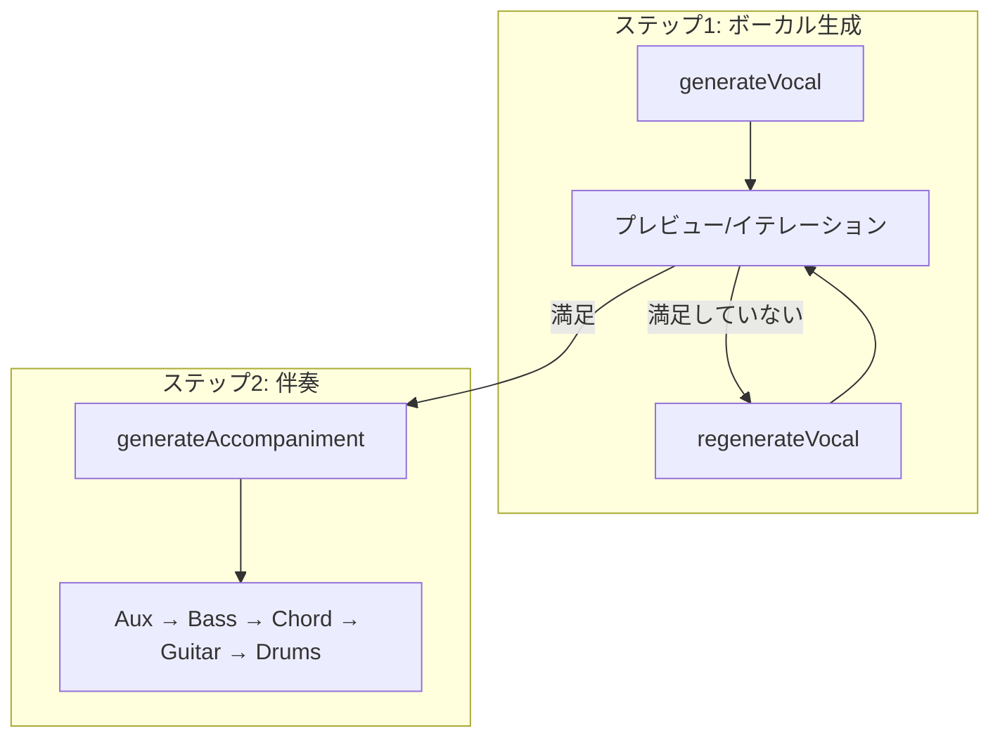
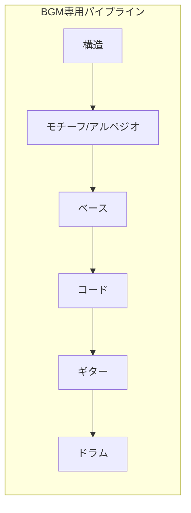
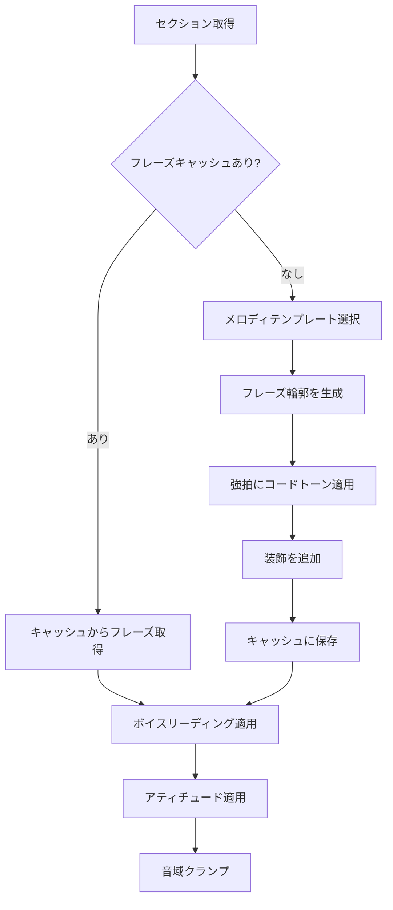
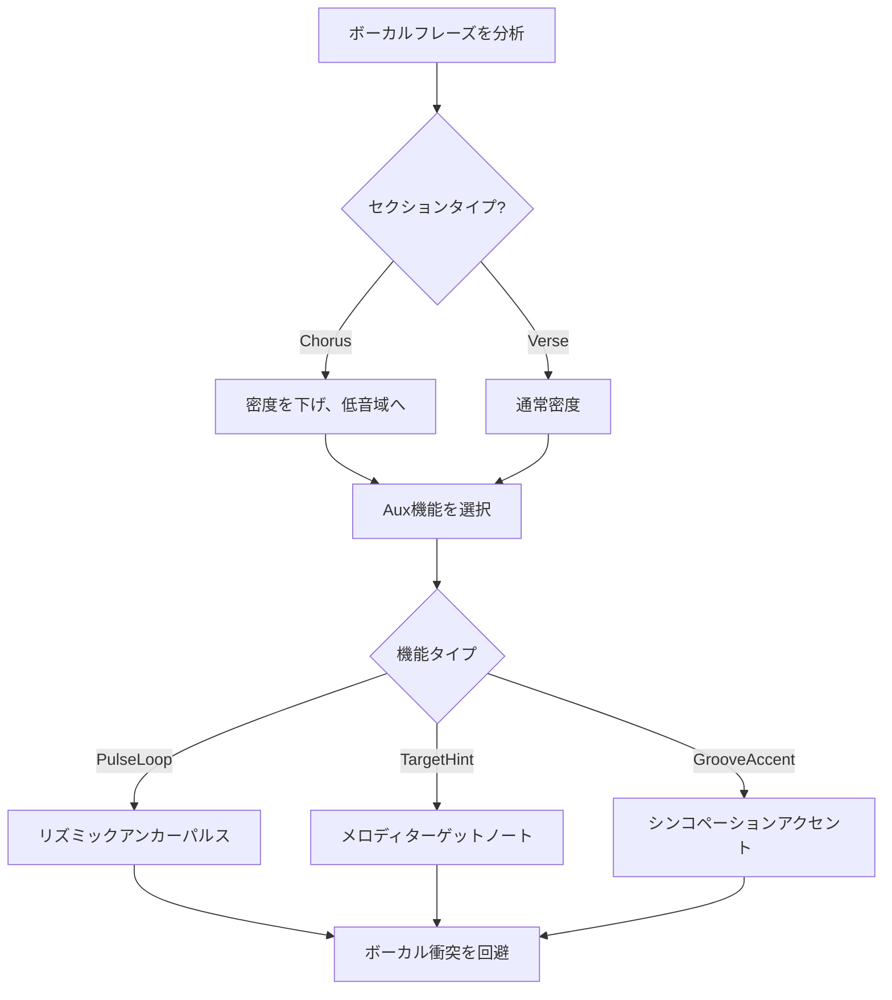
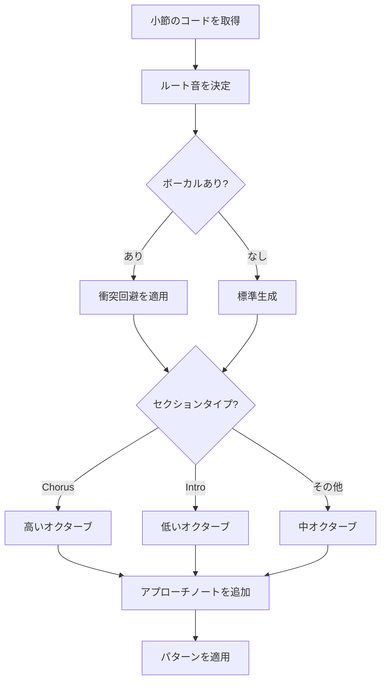
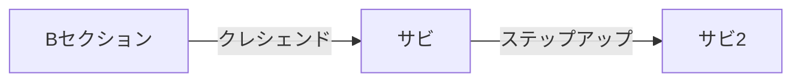
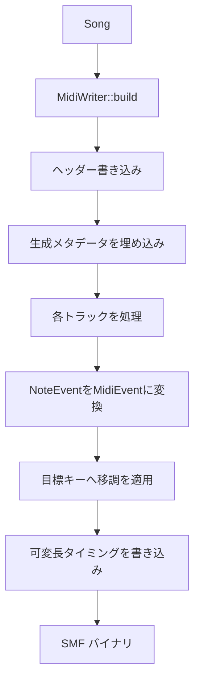

# 生成パイプライン

[MIDI Sketch](https://github.com/libraz/midi-sketch)のステップバイステップの音楽生成プロセスを解説します。

## パイプライン概要

MIDI Sketchはコンポジションスタイルとユースケースに応じて複数の生成ワークフローをサポートしています。

### ボーカル先行ワークフロー

反復的なボーカル調整用：

::: tip ボーカル先行を使うタイミング
メロディの品質が重要な場合にこのワークフローを使用します。`regenerateVocal()`で満足するまで何度でもボーカルを反復し、その後に伴奏を確定できます。
:::



### BGM専用モード

`BackgroundMotif`と`SynthDriven`コンポジションスタイルでは、ボーカル生成がスキップされます：



## CompositionStyleによる分岐

| スタイル | 主要トラック | ボーカル | Aux | 生成順序 |
|----------|--------------|----------|-----|----------|
| **MelodyLead** | ボーカル | あり | あり | Vocal → Aux → Motif (Blueprint) → Bass → Chord → Guitar → Arpeggio → Drums → SE |
| **BackgroundMotif** | モチーフ | なし | あり | Aux → Motif → Bass → Chord → Guitar → Arpeggio → Drums → SE |
| **SynthDriven** | アルペジオ | なし | なし | Motif (Blueprint) → Bass → Chord → Guitar → Arpeggio (手動) → Drums → SE |

::: info 生成パラダイム
3つのパラダイムがトラック生成の正確な順序に影響します：
- **Traditional**: Vocal → Aux → Motif → Bass → Chord → Guitar → Arpeggio → Drums → SE
- **RhythmSync**: Motif → Vocal → Aux → Bass → Chord → Guitar → Arpeggio → Drums → SE
- **MelodyDriven**: Vocal → Aux → Motif → Bass → Chord → Guitar → Arpeggio → Drums → SE
:::

## フェーズ1: 構造構築

`StructurePattern`に基づいて楽曲構造を作成。**エナジーカーブ**が指定されている場合（GradualBuild、FrontLoaded、WavePattern、SteadyState）、構造構築時にセクションのエネルギーレベルを調整し、楽曲全体のダイナミクスアークを形作ります。

```cpp
void Generator::buildStructure() {
    arrangement_ = StructureBuilder::build(params_.structure);
}
```

### 構造パターン

| パターン | 小節数 | セクション |
|----------|--------|------------|
| StandardPop | 24 | A(8)-B(8)-Chorus(8) |
| BuildUp | 28 | Intro(4)-A(8)-B(8)-Chorus(8) |
| DirectChorus | 16 | A(8)-Chorus(8) |
| RepeatChorus | 32 | A(8)-B(8)-Chorus(8)-Chorus(8) |
| FullPop | 56 | Intro-A-B-Chorus-A-B-Chorus-Outro |
| FullWithBridge | 52 | Intro-A-B-Chorus-Bridge-Chorus-Outro |
| Ballad | 56 | Intro(8)-A-B-Chorus-Interlude-B-Chorus-Outro |
| ExtendedFull | 90 | 拡張セクション付きフル形式 |

### セクションタイプ

各セクションは生成に影響するプロパティを持つ：

```cpp
struct Section {
    SectionType type;         // Intro, A, B, Chorus, Bridge, Interlude, Outro
    uint8_t bars;             // 小節数
    VocalDensity vocal_density;    // Full, Sparse, None
    BackingDensity backing_density; // Normal, Thin, Thick
};
```

## フェーズ2: トラック生成

### ボーカルトラック（MelodyLeadのみ）

フレーズキャッシュとテンプレート駆動設計を持つ最も複雑な生成器。**メロディオーバーライド**が指定されている場合、最大跳躍幅、シンコペーション確率、フレーズ長、長音符比率、サビの音域シフト、フック繰り返し、リーディングトーンの振る舞いなどのパラメータがテンプレートのデフォルトより優先されます：



**メロディテンプレート:**

| テンプレート | 特徴 |
|--------------|------|
| Auto | スタイルとセクションに基づいて自動選択 |
| PlateauTalk | NewJeans/Billie風：高音域プラトー、トークシング |
| RunUpTarget | YOASOBI/Ado風：ターゲットノートへ駆け上がる |
| DownResolve | Bメロ：下降解決 |
| HookRepeat | TikTok/K-POP風：短い繰り返しフック |
| SparseAnchor | 髭男風：まばらなアンカーノート |
| CallResponse | デュエット：コール＆レスポンス |
| JumpAccent | エモーショナル：ジャンプアクセント |

::: info 自動テンプレート選択
`melodyTemplate=Auto`の場合、vocalStyleとセクションタイプに基づいて自動選択されます。例えば、Animeスタイルのサビセクションでは、HookRepeatやJumpAccentが選ばれやすくなります。
:::

**ボーカルアティチュード:**

| アティチュード | 特徴 |
|----------------|------|
| Clean | コードトーンのみ、オンビートリズム |
| Expressive | 遅延解決のテンション、微妙なタイミング変動 |
| Raw | 非コードトーン、フレーズ境界の破壊 |

::: warning アティチュード制限
全てのアティチュードが全てのスタイルプリセットで使用できるわけではありません。`midisketch_style_preset_allowed_attitudes()`で許可されているアティチュードを確認してください。サポートされていないアティチュードを指定するとバリデーションエラーになります。
:::

### Auxトラック

ボーカルに適応する副旋律サポートを生成：



**Aux機能:**

| 機能 | 目的 | 使用タイミング |
|------|------|----------------|
| PulseLoop | 中毒性のある反復パターン | ストレートリズム |
| TargetHint | メロディの目標地点を示唆 | 複雑なメロディ |
| GrooveAccent | フィジカルグルーブアクセント | シンコペーショングルーブ |
| PhraseTail | フレーズ終端フィル | フレーズ遷移 |
| EmotionalPad | エモーショナルパッド/フロア | バラード、感情的セクション |
| Unison | ボーカルユニゾンダブリング | サビ強調 |
| MelodicHook | メロディックフックリフ | フック重視セクション |
| MotifCounter | カウンターメロディ（反進行） | ポリフォニックテクスチャ |
| SustainPad | 全音符コードトーンパッド | 持続的な和声サポート |

### ベース生成

ベースは和声の基礎を提供し、ボーカルがある場合は適応：



**ベースパターン:**

ベースシステムは17以上のパターンタイプ（BassPattern）をサポートしており、Sparse、Standard、Driving、ジャンル固有のバリエーションを含みます。使用するパターンはムードとセクションに基づいて自動選択されるか、BlueprintのSectionSlot設定で`bass_style_hint`（0=自動、1-17はBassPattern+1にマッピング）を指定してセクションごとに影響を与えることができます。

一般的なパターンカテゴリ：
- **Sparse**: 1拍目と3拍目に4分音符（バラード、チル）
- **Standard**: 時々8分音符を含む4分音符リズム
- **Driving**: アプローチノート付き8分音符パターン

### コード生成

コードボイシングはベースとボーカルと協調：

```cpp
void Generator::generateChord() {
    BassAnalysis bassAnalysis = analyzeBass(song_.bass);
    VocalAnalysis vocalAnalysis = analyzeVocal(song_.vocal);

    // ベースがルートを持つ場合はルートレスボイシング
    if (bassAnalysis.hasRootOnBeat1) {
        useRootlessVoicing();
    }

    // ボーカルとの衝突を回避
    if (vocalAnalysis.hasNoteAt(tick)) {
        adjustVoicing(vocalAnalysis.pitchAt(tick));
    }
}
```

**ボイスリーディングアルゴリズム:**

1. 連続するボイシング間の距離を計算
2. 動きを最小化（半音距離の合計）
3. 共通音を最大限保持
4. 遷移を最適化するために転回形を適用

::: info ルートレスボイシング
ベースが1拍目にルート音を弾いている場合、コードボイシングは自動的にルートを省略して濁りを避けます。これにより、よりクリーンで整理されたアレンジが生まれます。
:::

### ギタートラック

専用のMIDIチャンネルに伴奏ギターパターンを生成します。`guitarEnabled`で制御（JSデフォルト：`false`、C++デフォルト：`true`）。ギタートラックはBlueprintの制約に影響を受けます。`guitar_skill`（スキルレベル：パターンの複雑さに影響）や`guitar_below_vocal`（ボーカル音域の下にギターボイシングを配置してマスキングを回避）などが含まれます。コード生成の後に行われ、既存の和声ボイシングを補完します。

セクションごとのギタースタイルは、BlueprintのSectionSlot設定で`guitar_style_hint`（0-7）を指定して影響を与えることができます。0はムードとエネルギーに基づいて自動選択されます。

### ドラム生成

ドラムパターンはムードに基づいて選択：

| スタイル | 特徴 | 使用ムード |
|----------|------|-----------|
| Sparse | ハーフタイム、ミニマル | Ballad, Chill |
| Standard | 8分ハイハット、2&4スネア | StraightPop |
| FourOnFloor | 4つ打ちキック | ElectroPop, IdolPop |
| Upbeat | シンコペーション、16分ハイハット | BrightUpbeat |
| Rock | ライドシンバル、クラッシュアクセント | LightRock |
| Synth | タイトな16分ハイハット | Yoasobi, Synthwave |

Blueprintで`euclidean_drums_percent`を指定することで、ユークリッドリズムパターンの使用確率を制御できます。また、セクションごとの`drum_role`（Full、Ambient、Minimal、FXOnly）で、アレンジメント全体のドラム挙動を調整できます。

**フィル生成:**

- タムの下降/上昇パターン
- スネアロール
- セクション遷移でのコンビネーションフィル

### モチーフトラック（BackgroundMotifスタイル）

主要なメロディ要素として繰り返しパターンを生成。**モチーフオーバーライド**が指定されている場合、モチーフ長（0=自動、1/2/4拍）、音数（0=自動、3-8）、モーション（APIでは0-4、内部的に5=OstinatoはBlueprint専用）、レジスター（0=自動、1=低、2=高）、リズム密度（0=Sparse、1=Medium、2=Driving）などのパラメータがスタイルのデフォルトより優先されます：

```cpp
MotifParams params {
    .length = MotifLength::TwoBars,    // 2または4小節
    .rhythm_density = RhythmDensity::Medium,
    .motion = MotifMotion::Stepwise,   // 0=Stepwise, 1=GentleLeap, 2=WideLeap, 3=NarrowStep, 4=Disjunct
    .repeat_scope = RepeatScope::FullSong
};
```

### アルペジオトラック（SynthDrivenスタイル）

主要なハーモニック要素としてアルペジオパターンを生成：

```cpp
ArpeggioParams params {
    .pattern = ArpeggioPattern::UpDown,
    .speed = ArpeggioSpeed::Sixteenth,
    .octave_range = 2,
    .gate = 0.5f  // ノート長比率
};
```

### SEトラック

セクションマーカーとサウンドエフェクトキューを生成：
- セクション境界マーカー（テキストイベント）
- コールタイミングヒント（callEnabled時）
- イントロチャントマーカー

## フェーズ3: 仕上げ

### トランジション・ダイナミクス

エネルギー遷移を自動適用：



**セクションエネルギー倍率:**

| セクション | 倍率 |
|------------|------|
| Intro | 0.75 |
| A | 0.85 |
| B | 1.00 |
| Chorus | 1.20 |
| Bridge | 0.90 |
| Outro | 0.80 |

### ヒューマナイズ

タイミングとベロシティに自然な揺らぎを追加：

```cpp
void applyHumanization(Song& song, float intensity) {
    // タイミング: ランダムオフセット ±ms
    // ベロシティ: ランダム ±値
    // ドラムには適用しない
}
```

::: tip ドラムは例外
タイトなリズム感を維持するため、ドラムには意図的にヒューマナイズが**適用されません**。メロディックトラックとハーモニックトラックにはヒューマナイズが適用されますが、ドラムはクオンタイズされたままです。
:::

## MIDI出力

最後に、SongをSMF Type 1または Type 2に変換：



**トラックマッピング:**

| トラック | チャンネル | プログラム |
|----------|------------|------------|
| Vocal | 0 | 0（ピアノ） |
| Aux | 1 | 4（エレピ） |
| Chord | 2 | 4（エレピ） |
| Bass | 3 | 33（エレベ） |
| Motif | 4 | 81（シンセリード） |
| Arpeggio | 5 | 81（ソウリード） |
| Guitar | 6 | 25（アコギ） |
| Drums | 9 | GMドラム |
| SE | 15 | テキストイベント |

## キー移調

全ての生成はCメジャーで行われ、出力時に移調が適用：

```cpp
uint8_t MidiWriter::transposePitch(uint8_t pitch, Key key) {
    return pitch + static_cast<uint8_t>(key);
}
```

::: info 内部的にCメジャー
全てのメロディロジックはシンプルさのためにCメジャーで動作します。`key`パラメータ（0-11）が最終的な移調を決定します：0=C, 1=C#, 2=D など。これにより、コード進行分析やスケール度数ロジックがキー固有の処理を必要としません。
:::

## メタデータ埋め込み

生成されたMIDIファイルには再生成用のメタデータが含まれます：

```cpp
struct MidiMetadata {
    uint32_t seed;
    uint8_t style_preset_id;
    uint8_t chord_progression_id;
    uint8_t form_id;
    uint8_t composition_style;
    uint8_t vocal_attitude;
    uint8_t vocal_style;
    uint8_t melody_template;
    // ... 追加パラメータ
};
```

これにより、CLIで正確な再現が可能：`./midisketch_cli --regenerate song.mid`

::: tip MIDIからの再生成
MIDI Sketchで生成されたMIDIファイルは、全く同じ出力を再現するために使用できます。埋め込まれたメタデータには全てのパラメータが保存されているため、数週間や数ヶ月後でも簡単に楽曲の作業を再開できます。
:::
