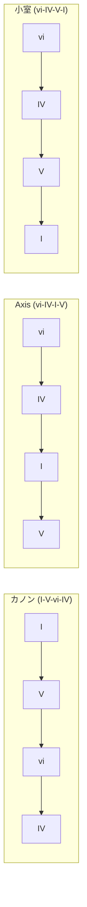
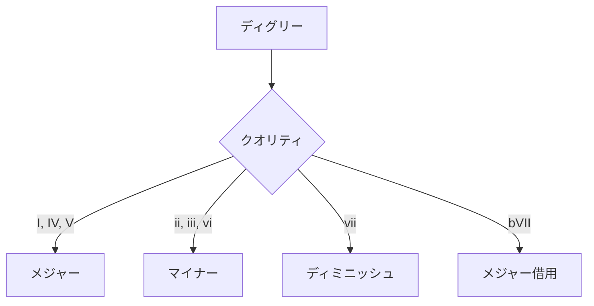
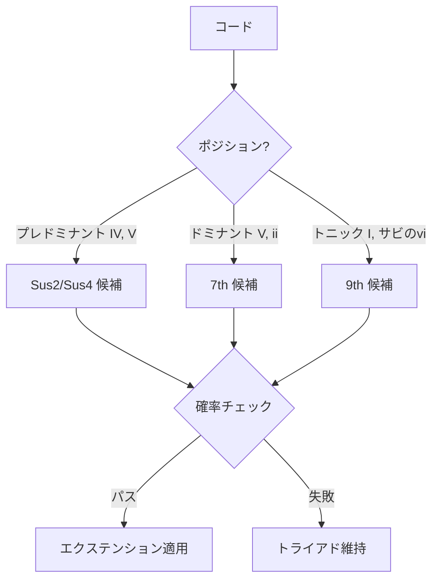
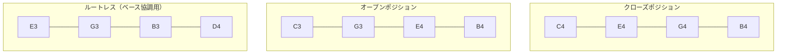
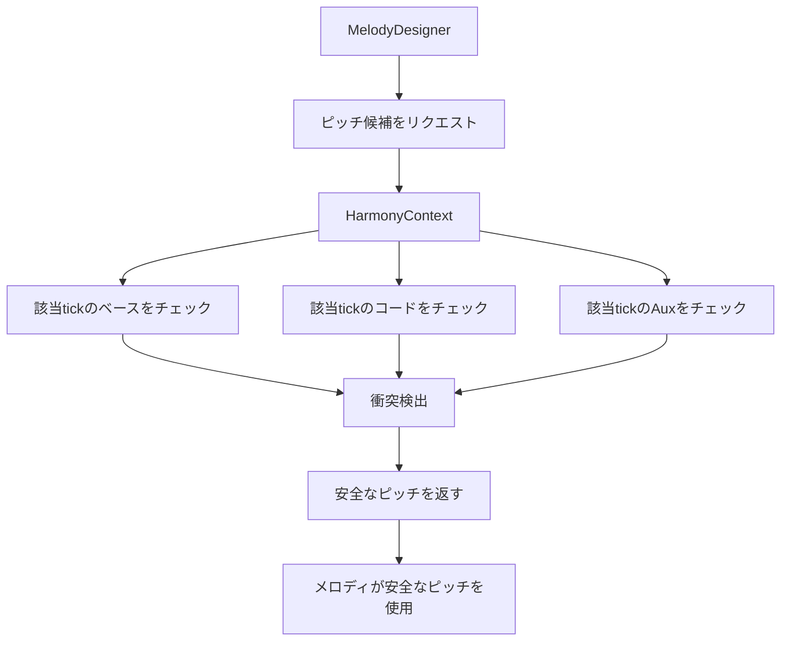
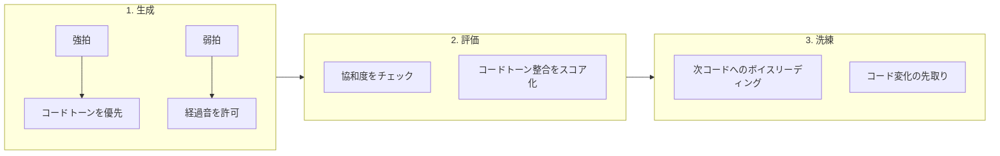

# ハーモニーとコード進行

[MIDI Sketch](https://github.com/libraz/midi-sketch)の和声システムを解説します。

::: info 注記
このページでは音楽理論の専門用語を使用しています。これらの概念はシステムが自動的に処理しますが、理解することでより適切なパラメータ選択が可能になります。
:::

## コード進行

MIDI Sketchには一般的なポップミュージックパターンをカバーする22の内蔵コード進行があります。

::: tip コード進行とは？
コード進行とは、楽曲の和声的な骨格を形成するコードの連続です。音楽に動きと感情を与えるものです。同じメロディでも、異なるコード進行の上では全く違う印象になります。
:::

### 4コード進行



| ID | 名前 | ディグリー | 特徴 |
|----|------|------------|------|
| 0 | Pop4 | I-V-vi-IV | 定番ポップ |
| 1 | Axis | vi-IV-I-V | メランコリック |
| 2 | Komuro | vi-IV-V-I | 明るいJ-pop |
| 3 | Canon | I-V-vi-iii-IV | クラシック |
| 4 | Emotional4 | vi-V-IV-V | エモーショナルビルド |
| 5 | Minimal | I-IV | シンプルな2コード |
| 6 | AltMinimal | I-V | パワーポップ |
| 7 | Progression3 | I-vi-IV | 3コード |
| 8 | Rock4 | I-bVII-IV-I | ロック感 |

::: details これらの進行を理解する
- **Pop4 (I-V-vi-IV)**: 現代音楽で最も人気のある進行。数千のヒット曲で使用。満足感のある馴染みやすいサウンド。
- **Axis (vi-IV-I-V)**: マイナーコードから始まり、即座に切なさを演出。多くのエモーショナルバラードで使用。
- **Komuro (vi-IV-V-I)**: 日本のプロデューサー小室哲哉にちなんで命名。最後のV→I解決が明るく前向きな印象を生み出す。
- **Canon (I-V-vi-iii-IV)**: パッヘルベルのカノンに基づく。時代を超えたエレガントさ。
- **Rock4 (I-bVII-IV-I)**: bVII（フラットセブン）コードがロック/ブルース的な風味を加える。
:::

### 5コード進行

| ID | 名前 | ディグリー | 特徴 |
|----|------|------------|------|
| 9 | Extended5 | I-V-vi-iii-IV | 拡張カノン |
| 10 | Emotional5 | vi-IV-I-V-ii | 複雑なエモーショナル |

### 全進行リスト

合計22の進行：

- ポップバリアント（ブライト、ダーク）
- エモーショナルバリアント
- ミニマル（2-3コード）パターン
- ロック影響
- ii-Vを含むジャズ影響

## ディグリーシステム

::: info ディグリー（度数）とは？
コードディグリー（I, ii, iii, IV, V, vi, vii）は、キー内でのコードの位置を示します。大文字 = メジャーコード、小文字 = マイナーコード。例：Cメジャーでは I = Cメジャー、ii = Dマイナー、V = Gメジャー。
:::

コードディグリーは整数で表現：

```cpp
enum Degree {
    I   = 0,   // トニック
    ii  = 1,   // サブドミナント
    iii = 2,   // メディアント
    IV  = 3,   // サブドミナント
    V   = 4,   // ドミナント
    vi  = 5,   // サブメディアント
    vii = 6,   // リーディングトーン
    bVII = 10  // フラットセブン（借用）
};
```

## コードクオリティ

::: info メジャーとマイナー
- **メジャーコード**は明るく、ハッピーで安定した響き（C, F, G）
- **マイナーコード**は暗く、切なく、感情的な響き（Dm, Em, Am）
- **ディミニッシュコード**は緊張感があり不安定（ポップでは稀に使用）
:::

メジャーキーのディグリーによってクオリティが決定：



```cpp
ChordQuality getQuality(Degree degree) {
    switch (degree) {
        case I: case IV: case V: case bVII:
            return Major;
        case ii: case iii: case vi:
            return Minor;
        case vii:
            return Diminished;
    }
}
```

## コードエクステンション

エクステンションは基本トライアドに彩りを加える：

::: tip エクステンションの使いどころ
- **Susコード**: 解決前の緊張感を生み出す。期待感を演出する場面に最適。
- **7thコード**: 洗練さとジャズ感を加える。シティポップやR&Bで一般的。
- **9thコード**: 豊かで複雑なサウンド。最大限の効果のために控えめに使用。

エクステンション確率を高くすると、シティポップ、ジャズ、R&Bスタイルに適しています。シンプルなポップやロックには低めに設定しましょう。
:::

### エクステンションタイプ

| タイプ | 追加音 | 例（C） |
|--------|--------|---------|
| Triad | ルート、3度、5度 | C-E-G |
| Sus2 | ルート、2度、5度 | C-D-G |
| Sus4 | ルート、4度、5度 | C-F-G |
| 7th | + 7度 | C-E-G-B/Bb |
| 9th | + 7度 + 9度 | C-E-G-B-D |

### エクステンション適用ルール



### 設定

```cpp
struct ChordExtensionParams {
    bool enabled = true;
    float sus_probability = 0.3f;     // 30%確率
    float seventh_probability = 0.4f;  // 40%確率
    float ninth_probability = 0.2f;    // 20%確率
};
```

## ボイスリーディング

::: info ボイスリーディングとは？
ボイスリーディングとは、個々の音が一つのコードから次のコードへどのように動くかということです。良いボイスリーディングは滑らかで繋がりのあるコード遷移を生み出します。悪いボイスリーディングはぎこちなく不自然に聞こえます。MIDI Sketchは生成される全てのコード進行に最適化されたボイスリーディングを自動適用します。
:::

### 原則

1. **動きを最小化**: 各声部は最小の音程で移動
2. **共通音**: コード間で共有される音を保持
3. **平行5度/8度を避ける**: クラシック的制約
4. **滑らかなベース**: 順次進行または小さな跳躍を優先

### アルゴリズム

```cpp
Voicing optimizeVoicing(Voicing prev, Chord next) {
    vector<Voicing> candidates = generateAllVoicings(next);

    return min_element(candidates, [&](auto& a, auto& b) {
        int distA = totalVoiceDistance(prev, a);
        int distB = totalVoiceDistance(prev, b);

        // 大きな跳躍にもペナルティ
        int leapA = maxSingleVoiceDistance(prev, a);
        int leapB = maxSingleVoiceDistance(prev, b);

        return (distA + leapA * 2) < (distB + leapB * 2);
    });
}
```

### ボイシングタイプ



::: details ボイシングの解説
- **クローズポジション**: 全ての音が1オクターブ内。コンパクトで直接的なサウンド。ポップで一般的。
- **オープンポジション**: 音が複数オクターブに広がる。広がりのあるフルなサウンド。バラードに最適。
- **ルートレス**: ルート音を省略（ベースが弾く）。クリアで濁りのないサウンドを生む。一般的なアレンジテクニック。
:::

## ベース-コード協調

コードトラックはベース分析を使用して重複を回避：

```cpp
struct BassAnalysis {
    bool hasRootOnBeat1;   // ダウンビートでルート
    bool hasRootOnBeat3;   // 3拍目でルート
    bool hasFifth;         // 5度あり
    Tick accentTicks[];    // 強拍位置
};

// ベースがルートを持つ場合、コードはルートレスボイシングを使用
if (bassAnalysis.hasRootOnBeat1) {
    voicing = generateRootlessVoicing(chord);
}
```

## セカンダリードミナント

セカンダリードミナントは、トニック以外のダイアトニックコードに解決するドミナントコード（V7）です。より強い和声的引力を生み出し、和声的な多様性を加えます。

::: tip セカンダリードミナントとは？
IVからVに直接進む代わりに、V/V（Vに解決するドミナントコード）を挿入するとより強い動きの感覚が生まれます。例えばCメジャーでは、F → D7 → G は F → G より説得力があります。D7（V/V）がGに「解決したがっている」からです。
:::

### 一般的なセカンダリードミナント

| 記号 | 解決先 | Cでの例 |
|------|-------|---------|
| V/V | V（ドミナント） | D7 → G |
| V/vi | vi（平行短調） | E7 → Am |
| V/ii | ii（上主音） | A7 → Dm |
| V/IV | IV（下属音） | C7 → F |

### 自動挿入

MIDI Sketchは以下の条件に基づいてセカンダリードミナントを自動挿入します：
- **コードの長さ**: 長いコードは準備の候補
- **セクションタイプ**: Bメロセクションはセカンダリードミナントを好む
- **スタイル**: ジャズやシティポップはより多くのセカンダリードミナントを使用

```cpp
// 例: V前にV/Vを挿入
// オリジナル: IV → V → I
// 強化後: IV → V/V → V → I
```

## キー転調

::: tip なぜ転調するのか？
キー転調（曲の途中でキーを変える）は、興奮と感情的な高揚を加える強力なテクニックです。最後のサビで1-2半音上げる転調は「次のレベルに引き上げる」感覚を生み出します。これは数え切れないほどのヒット曲で使われる定番テクニックです。
:::

### 転調ポイント

| 構造 | 転調ポイント | 量 |
|------|-------------|-----|
| StandardPop | B → Chorus | +1半音 |
| RepeatChorus | Chorus 1 → 2 | +1半音 |
| Ballad | B → Chorus | +2半音 |
| Full patterns | 様々 | +1 ～ +2 |

### 実装

```cpp
struct Modulation {
    Tick tick;           // 転調タイミング
    int8_t semitones;    // 量（+1, +2）
};

// MIDI出力時に適用
void MidiWriter::writeTrack(MidiTrack& track, Modulation mod) {
    for (auto& note : track.notes) {
        if (note.tick >= mod.tick) {
            note.pitch += mod.semitones;
        }
    }
}
```

## コードトーン分析

メロディ生成で音の協和度を判定するために使用：

```cpp
bool isChordTone(uint8_t pitch, Chord chord) {
    uint8_t pitchClass = pitch % 12;

    // コードのピッチクラスと照合
    for (auto& chordPitch : chord.pitchClasses()) {
        if (pitchClass == chordPitch) return true;
    }
    return false;
}

uint8_t nearestChordTone(uint8_t pitch, Chord chord) {
    // 半音距離で最寄りのコードトーンを検索
    int minDist = 12;
    uint8_t nearest = pitch;

    for (auto& target : chord.pitches()) {
        int dist = abs(pitch - target);
        if (dist < minDist) {
            minDist = dist;
            nearest = target;
        }
    }
    return nearest;
}
```

## テンションノート

::: info テンションノートとは？
テンションノートは現在のコードに属さないが、意図的に音楽的興味を生み出すために使用される音です。「解決したい」という感覚を生み出します。答えを待つ音楽的な問いかけのようなものです。上手く使うと、メロディはより表現力豊かで感情的に魅力的になります。
:::

メロディに興味を加える非コードトーン：

| テンション | 音程 | 解決 |
|------------|------|------|
| 9th | 長2度 | ルートへ下降 |
| 11th | 完全4度 | 3度へ下降 |
| 13th | 長6度 | 5度へ下降 |
| b9 | 短2度 | ルートへ下降 |
| #11 | 増4度 | 5度へ |

### ボーカルアティチュードによる使用

::: info 拍の配置
**弱拍**（4/4拍子の2拍目と4拍目）はテンションノートを置くのに安全な場所です。強拍（1拍目と3拍目）で確立された和声的基盤を崩さないためです。
:::

| アティチュード | 許可されるテンション | 音楽的効果 |
|----------------|---------------------|-----------|
| Clean | なし（コードトーンのみ） | 安全、協和、歌いやすい |
| Expressive | 弱拍で9th、13th | カラフル、感情的、表現力豊か |
| Raw | 全テンション、任意の拍 | エッジー、予測不能、強烈 |

::: tip ボーカルアティチュードの選び方
- **Clean**: シンプルなポップ、子供向け、歌いやすさが重要な場合に最適
- **Expressive**: バラード、R&B、シティポップに最適 - 感情的な深みを加える
- **Raw**: ロック、オルタナティブ、実験的に最適 - 緊張感とエッジを生み出す
:::

---

## ハーモニーとメロディの統合

ボーカル生成システムは、音楽的に整合性のあるメロディを作成するためにハーモニー情報を広範に活用しています。

### HarmonyContext

`HarmonyContext`システムは生成された全トラックを追跡し、衝突のないピッチ候補を提供します：



::: info HarmonyContextが重要な理由
HarmonyContextがなければ、メロディが伴奏と衝突する可能性があります。例えば、ベースがEを弾いているときにメロディがFを同時に鳴らすと、厳しい短2度の不協和音になります。HarmonyContextはメロディピッチを提案する前に全てのアクティブなノートをチェックすることでこれを防ぎます。
:::

### 衝突タイプ

| 音程 | 衝突タイプ | 結果 |
|------|-----------|------|
| 短2度（1半音） | **重大** | 常に回避 |
| 長7度（11半音） | **重大** | 常に回避 |
| トライトーン（6半音） | **軽度** | コンテキスト依存 |
| 完全5度、オクターブ | **なし** | 和声的に安定 |

### コード認識メロディ生成

MelodyDesignerは複数の段階でコード情報を使用します：



**強拍ルール**: 1拍目と3拍目では、メロディは強くコードトーンを優先します。これにより、メロディが強拍間で自由に動いても和声的な安定感が生まれます。

### VocalStyleProfileとハーモニー

各`VocalStyleProfile`は、メロディがハーモニーとどう相互作用するかを設定します：

| プロファイル | コードトーン優先度 | テンション使用 | アプローチ |
|-------------|-------------------|---------------|-----------|
| **Standard** | 強拍で高い | 時々9th | 安全、歌いやすい |
| **Idol** | 非常に高い | 最小限 | キャッチー、シンプル |
| **CityPop** | 中程度 | 頻繁な9th、13th | 洗練 |
| **Vocaloid** | 低い | アグレッシブ | 意外性 |
| **Ballad** | 高い | 表現力豊かな倚音 | エモーショナル |

::: tip スタイルとハーモニーのマッチング
最良の結果を得るには、コードエクステンションをボーカルスタイルに合わせましょう：
- **Idol/Standard**: エクステンションを低めに（sus、時々7th）
- **CityPop/Jazz**: 高いエクステンション確率（7th、9th）
- **Vocaloid**: エクステンションはあまり重要でない（メロディがより自由）
:::

### メロディ評価：ハーモニー要素

メロディ評価システムにはハーモニースコアリングが含まれます：

```cpp
float evaluateHarmonyFit(const MelodyCandidate& melody, const Chord& chord) {
    float score = 0.0f;

    for (auto& note : melody.notes) {
        if (isStrongBeat(note.tick)) {
            // 強拍: コードトーン = +1.0, テンション = +0.3, その他 = -0.5
            if (isChordTone(note.pitch, chord)) score += 1.0f;
            else if (isTension(note.pitch, chord)) score += 0.3f;
            else score -= 0.5f;
        } else {
            // 弱拍: より寛容
            if (isChordTone(note.pitch, chord)) score += 0.5f;
            else if (isScaleTone(note.pitch)) score += 0.2f;
        }
    }

    return score / melody.notes.size();
}
```

### フックシステムとハーモニー

フックシステム（サビセクションで使用）は、記憶に残るパターンを作成しながらハーモニーを尊重します：

| フックスケルトン | 和声的振る舞い |
|-----------------|---------------|
| **Repeat** | 単一のコードトーンに留まる |
| **Ascending** | コードアルペジオを上昇 |
| **AscendDrop** | アルペジオ上昇後、下降解決 |
| **LeapReturn** | テンションへジャンプ、コードトーンへ戻る |

::: info フック + コード同期
フックはコード変化と整合するときに最も効果的です。`hookIntensity`パラメータは、フックがコードトーンを強調するか、テンションでメロディの興味を生み出すかを制御します。
:::

### ピアノロールセーフティAPI

外部ツール（ピアノロールエディタなど）向けに、`PianoRollSafety` APIはハーモニー認識のピッチ提案を提供します：

```cpp
// 特定のtickで安全なピッチを取得
vector<SafePitch> getSafePitches(Tick tick) {
    Chord currentChord = getChordAt(tick);
    vector<uint8_t> activePitches = getActiveNotesAt(tick);

    vector<SafePitch> result;
    for (uint8_t pitch = vocalLow; pitch <= vocalHigh; pitch++) {
        CollisionType collision = checkCollision(pitch, activePitches);
        bool isChordTone = currentChord.contains(pitch % 12);

        result.push_back({
            pitch,
            collision,
            isChordTone ? PitchSafety::Recommended : PitchSafety::Acceptable
        });
    }
    return result;
}
```

これにより、視覚的なフィードバックを表示できます：
- **緑**: コードトーン（推奨）
- **黄**: スケールトーン（許容）
- **赤**: 衝突ピッチ（回避）

---

## 実践ガイド

### 推奨の組み合わせ

| スタイル | 進行 | エクステンション | アティチュード |
|----------|------|-----------------|----------------|
| シンプルポップ | Pop4 (0) | 低 (10-20%) | Clean |
| エモーショナルバラード | Axis (1) | 中 (30%) | Expressive |
| J-Pop | Komuro (2) | 中 (30%) | Expressive |
| シティポップ | Extended5 (9) | 高 (50%+) | Expressive |
| ロック | Rock4 (8) | 低 (10%) | Raw |

### クイックスタート推奨設定

::: tip 初心者向け
以下の安全なデフォルト設定から始めましょう：
- **進行**: Pop4 (ID 0) - ほぼ何にでも合う
- **エクステンション**: 全確率を30%以下に
- **アティチュード**: Clean - 最も作業しやすいメロディ
- **転調**: なし、またはLastChorusで+1半音

慣れてきたら、より複雑な進行や高いエクステンション確率を試してみましょう。
:::
