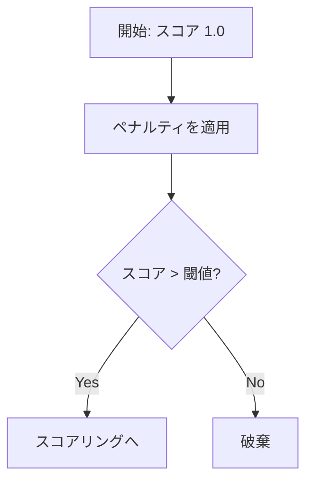
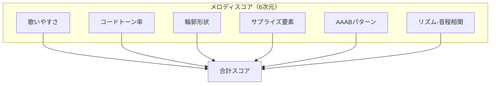
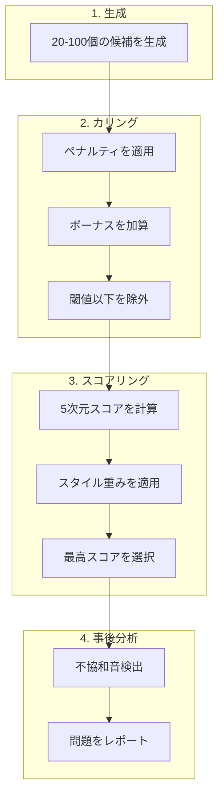

# メロディ評価システム

このドキュメントでは、メロディ生成における候補選択と評価の仕組みを説明します。

## 概要

MIDI Sketch は複数のメロディ候補を生成し、評価システムを通じて1つを選択します。


## 候補生成

### セクション別の候補数

セクションごとに異なる候補数を使用します：

| セクション | 候補数 | 備考 |
|-----------|--------|------|
| **サビ (Chorus)** | 100 | フックセクション |
| **Bメロ (Pre-chorus)** | 50 | トランジションセクション |
| **ブリッジ / チャント** | 30 | コントラストセクション |
| **Aメロ / イントロ / アウトロ** | 20 | 安定セクション |

### 生成プロセス

各候補について：

1. **リズムパターン** - 音符の位置と長さを生成
2. **ピッチ選択** - メロディテンプレート (PlateauTalk, RunUpTarget 等) を適用
3. **制約適用** - 歌いやすさと音域制限を適用
4. **装飾** - 経過音、刺繍音を追加

## 2段階評価

評価は2段階で行われます：**カリング**（候補のフィルタリング）と**スコアリング**（候補のランク付け）。

### ステージ1: カリング

ペナルティベースの評価で候補をフィルタリングします：



#### ペナルティ

| ペナルティ | 範囲 | 検出対象 |
|-----------|------|----------|
| **高音域** | 0.0-1.0 | 連続した高い音（D5以上） |
| **高音後の跳躍** | 0.0-1.0 | 大きなジャンプの後に高音 |
| **急激な方向転換** | 0.0-1.0 | ジグザグパターン |
| **単調さ** | 0.0-1.0 | 変化のない同じ音の繰り返し |
| **息継ぎなし** | 0.0-0.3 | 休符なしで短い音が連続 |
| **ギャップ率** | 0.0-1.0 | 無音を挟んだ散らばった音 |

::: info ギャップ率
ギャップ率ペナルティは、散らばった不連続な音符パターンを対象とします。高いギャップ率は音符間の無音が多いことを示します。
:::

#### ボーナス

| ボーナス | 範囲 | 検出対象 |
|---------|------|----------|
| **明確なピーク** | 0.0-0.2 | フレーズ内の単一の最高点 |
| **モチーフ反復** | 0.0-0.2 | AAAB反復パターン |
| **フレーズ結束** | 0.0-1.0 | まとまったグループを形成する音 |

::: details フレーズ結束の基準
- 順次進行のラン（連続した接続音）
- 一貫したリズムパターン
- 3音セルの反復（音程 + 長さのモチーフ）
:::

### ステージ2: スコアリング

カリングを通過した候補は6つの次元でスコアリングされます：



#### 歌いやすさスコア

音程分布を測定：

| 音程タイプ | 目標範囲 |
|-----------|---------|
| ステップ（1-2半音） | 40-50% |
| 同音 | 20-30% |
| 小跳躍（3-4半音） | 15-25% |
| 大跳躍（5+半音） | 5-10% |

#### コードトーン率

強拍でのコードトーン頻度を測定：

- **強拍**: 4/4拍子の1拍目と3拍目（2拍ごと、tick % 960 == 0）
- 高い率は和声的により安定したメロディを示す

#### 輪郭形状

メロディの形状を検出：
- **アーチ**: 上昇して下降
- **ウェーブ**: 振動パターン
- **下行**: 徐々に下降

#### サプライズ要素

フレーズあたりの大跳躍（5+半音）を測定。目標: 1-2回。

#### AAABパターン

変化を伴う反復を検出 - 同じフレーズが3回繰り返された後に変化。

#### リズム-音程相関

音符の長さと音程幅の適合度を測定：

| 組み合わせ | スコア | 理由 |
|-----------|-------|------|
| 長い音符 + 大きな跳躍 | 高い | 歌手は大きな跳躍に時間が必要 |
| 短い音符 + ステップ | 高い | 速いパッセージは順次進行が最適 |
| 短い音符 + 大きな跳躍 | 低い | 歌うのが困難 |

ポップボーカル理論に基づく：歌手は大きなピッチ変化に準備時間が必要です。このスコアリングは自然に歌いやすいメロディを評価します。

## スタイル別の重み

ボーカルスタイルごとに異なる評価重みを使用：

| スタイル | 歌いやすさ | サプライズ | プラトーバイアス | 高音域 |
|---------|-----------|----------|----------------|--------|
| **Standard** | 0.25 | 0.15 | 1.0 | 1.0 |
| **Idol** | 0.30 | 0.12 | 1.2 | 1.0 |
| **Rock** | 0.20 | 0.20 | 0.8 | 1.2 |
| **Ballad** | 0.40 | 0.10 | 1.1 | 0.9 |
| **Anime** | 0.25 | 0.25 | 0.9 | 1.3 |
| **Vocaloid** | 0.10 | 0.25 | 0.6 | 1.1 |

::: details パラメータ定義
- **歌いやすさ**: 音程ベースのスコアリング重み
- **サプライズ**: 大跳躍検出の重み
- **プラトーバイアス**: 同音継続の傾向
- **高音域**: 高い音への傾向
:::

### スタイル別コヒージョン閾値

スタイルによって必要なメロディのまとまり度合いが異なります：

| スタイル | コヒージョン閾値 | 備考 |
|---------|----------------|------|
| バラード | 高い | 滑らかで繋がったラインが必要 |
| シティポップ | 高い | レガートフレーズを好む |
| ボカロ | 低い | 角張ったメロディを許容 |
| ロック | 低い | 分断されたパターンを受容 |

コヒージョン閾値を下回るメロディはカリング時にペナルティを受けます。

### スタイル別ギャップ閾値

| スタイル | ギャップ閾値 | 備考 |
|---------|------------|------|
| バラード | 高い | より多くの無音を許容 |
| アイドル/ロック | 低い | 高い音符密度を期待 |

## 生成後の分析

不協和音アナライザーは生成後のハーモニー問題をチェックします。

### 問題タイプ

| タイプ | 説明 | 例 |
|-------|------|-----|
| **同時衝突** | 2つの音が不協和音程 | ベース E + メロディ F = 短2度 |
| **非コードトーン** | 現在のコードにない音 | Cメジャーコード上のD |
| **コード変化後の持続** | コード変化後に非コードトーンに | Fコード上で持続するC |
| **非ダイアトニック音** | キーのスケールにない音 | Cメジャーの F# |

### 深刻度レベル

| 深刻度 | 音程 | 備考 |
|-------|------|------|
| **High** | 短2度 (1)、長7度 (11) | 強い不協和 |
| **Medium** | トライトーン (6)、強拍非コードトーン | 文脈依存 |
| **Low** | 弱拍非コードトーン（経過音） | 多くの場合許容 |

### CLI 使用方法

```bash
# 生成して分析
./midisketch_cli --seed 42 --analyze

# 既存のMIDIを分析
./midisketch_cli --input song.mid --analyze
```

出力例：
```
=== Dissonance Analysis ===
Total issues: 3
  Simultaneous clashes: 1 (high: 1, medium: 0)
  Non-chord tones: 2 (medium: 1, low: 1)
```

## パイプラインまとめ



## まとめ

- セクションごとに複数の候補を生成（20-100）
- 2段階評価：カリング後にスコアリング
- スタイル別の重みで評価基準を調整
- 生成後の不協和音分析が利用可能
