# オプション関係性

このドキュメントでは、MIDI Sketchの`SongConfig`オプション間の関係性を説明します。

## 関係性の種類

オプションには以下の関係性があります：

- **依存**: 親オプションが有効でないと子オプションは無視される
- **優先**: 特殊な値（0など）が他の設定をオーバーライド
- **干渉**: 特定の組み合わせでバリデーションエラー
- **暗黙**: あるオプションを設定すると内部パラメータが自動設定される

::: info なぜこれが重要か
これらの関係性を理解することで、予期しない動作を回避できます。例えば、`arpeggioEnabled=false`の場合、`arpeggioPattern=2`を設定しても効果がありません。
:::

---

## 1. 依存関係

### 1.1 Call System

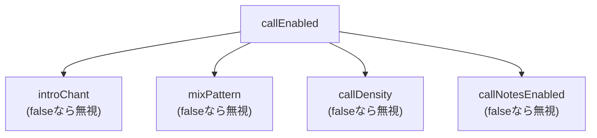

| 親オプション | 子オプション | 説明 |
|--------------|--------------|------|
| `callEnabled=true` | `introChant` | イントロチャントの種類 |
| `callEnabled=true` | `mixPattern` | MIXセクションの種類 |
| `callEnabled=true` | `callDensity` | コーラスでのコール密度 |
| `callEnabled=true` | `callNotesEnabled` | コールをMIDIノートとして出力 |

### 1.2 Arpeggio

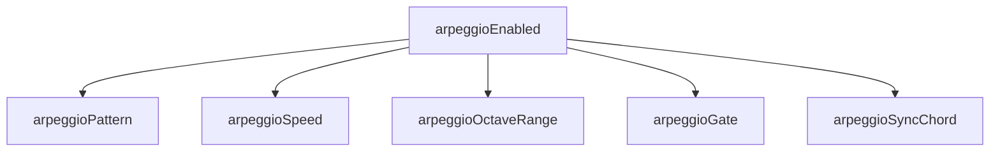

| 親オプション | 子オプション | 説明 |
|--------------|--------------|------|
| `arpeggioEnabled=true` | `arpeggioPattern` | Up/Down/UpDown/Random |
| `arpeggioEnabled=true` | `arpeggioSpeed` | 8分/16分/3連符 |
| `arpeggioEnabled=true` | `arpeggioOctaveRange` | 1-3オクターブ |
| `arpeggioEnabled=true` | `arpeggioGate` | ゲート長(0-100) |
| `arpeggioEnabled=true` | `arpeggioSyncChord` | コード変更と同期 |

### 1.3 Humanization

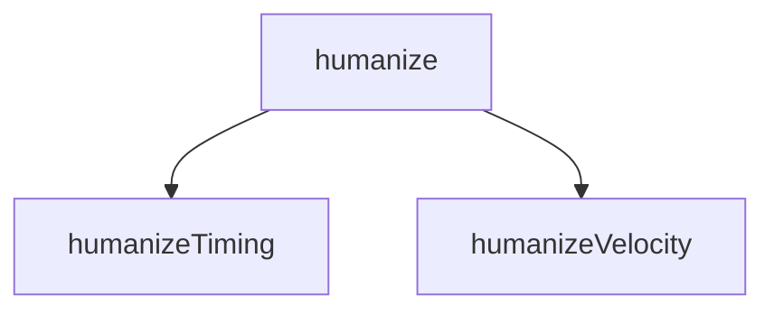

| 親オプション | 子オプション | 説明 |
|--------------|--------------|------|
| `humanize=true` | `humanizeTiming` | タイミング揺れ(0-100) |
| `humanize=true` | `humanizeVelocity` | ベロシティ揺れ(0-100) |

### 1.4 Chord Extensions

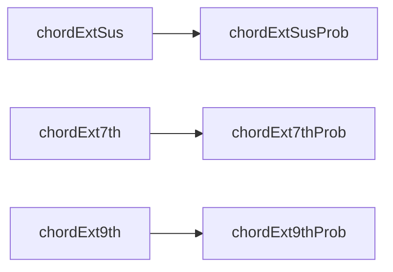

| 親オプション | 子オプション | 説明 |
|--------------|--------------|------|
| `chordExtSus=true` | `chordExtSusProb` | Sus確率(0-100) |
| `chordExt7th=true` | `chordExt7thProb` | 7th確率(0-100) |
| `chordExt9th=true` | `chordExt9thProb` | 9th確率(0-100) |

### 1.5 Modulation

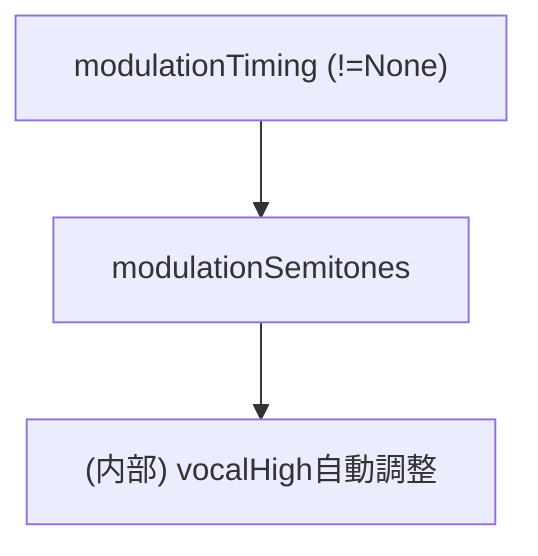

| 親オプション | 子オプション | 説明 |
|--------------|--------------|------|
| `modulationTiming != None` | `modulationSemitones` | 転調量（1-4半音） |
| `modulationSemitones > 0` | (内部) `effective_vocal_high` | 転調後も音域内に収まるよう自動調整 |

**注意**:
- `modulationTiming=None`の場合、`modulationSemitones`はバリデーションされない
- **ボーカル音域の自動調整**: 転調が有効な場合、`effective_vocal_high = vocal_high - modulation_semitones`で計算され、転調後もボーカルが音域内に収まる
- **全CompositionStyleで有効**: BGMモード（BackgroundMotif, SynthDriven）でも転調が機能する

### 1.6 Vocal (skipVocalによる排他)

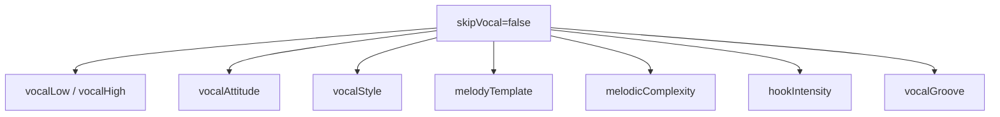

| 条件 | 有効なオプション | 用途 |
|------|------------------|------|
| `skipVocal=false` | すべてのvocal関連オプション | 通常の楽曲生成 |
| `skipVocal=true` | vocal関連オプションは全て無視 | **BGMのみ生成（Vocalなし）** |

::: danger ボーカルの復元不可
BGM専用生成後にボーカルを追加するAPIは存在しません。ボーカルが必要な場合は、`compositionStyle=MelodyLead`または**Vocal-Firstワークフロー**を使用してください（[JavaScript API](/ja/docs/api-js)参照）。
:::

---

## 2. CompositionStyleによる分岐

`compositionStyle`の値によって、生成されるトラックと有効なオプションが変わります：

### 2.1 MelodyLead (0) - デフォルト

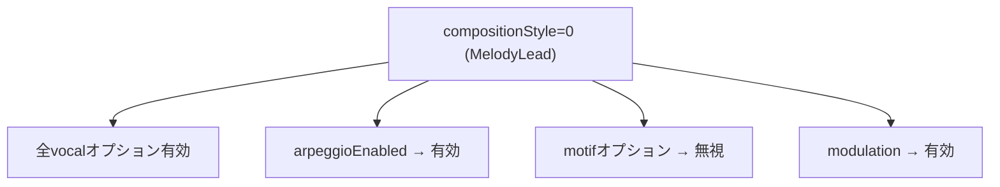

**生成トラック**: Vocal → Aux → Bass → Chord → Drums（+ Arpeggio有効時）

### 2.2 BackgroundMotif (1) - BGM専用モード

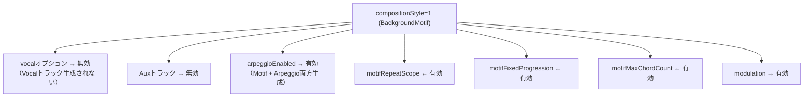

**生成トラック構成**:
| arpeggioEnabled | 生成されるトラック |
|-----------------|-------------------|
| `false` | Motif + Bass + Chord + Drums |
| `true` | Motif + Bass + Chord + Drums + **Arpeggio** |

### 2.3 SynthDriven (2) - BGM専用モード

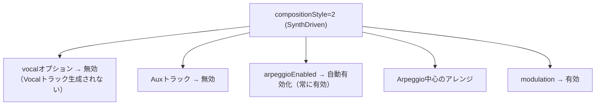

**生成トラック**: Bass + Chord + Drums + Arpeggio（Motifなし）

::: tip CompositionStyleの選び方
- **MelodyLead**: ボーカル付きの楽曲（ポップ、ロック、バラード）
- **BackgroundMotif**: 繰り返しメロディパターンのインストBGM（ゲーム音楽、アンビエント）
- **SynthDriven**: エレクトロニック/シンセ主体のインストトラック
:::

---

## 3. 優先順位（特殊値によるオーバーライド）

| オプション | 特殊値 | 動作 |
|------------|--------|------|
| `bpm` | `0` | スタイルプリセットのデフォルトBPMを使用 |
| `seed` | `0` | ランダムシードを自動生成 |
| `targetDurationSeconds` | `0` | `formId`で指定した構造パターンを使用 |
| `vocalStyle` | `0` (Auto) | スタイルに応じたランダム選択 |
| `melodyTemplate` | `0` (Auto) | スタイルに応じたデフォルト選択 |

::: info ゼロ値の活用
ゼロは「自動」または「デフォルトを使用」を意味することが多いです。正確な値を指定せずにスタイルに適したデフォルトを使いたい場合に便利です。
:::

### フローチャート

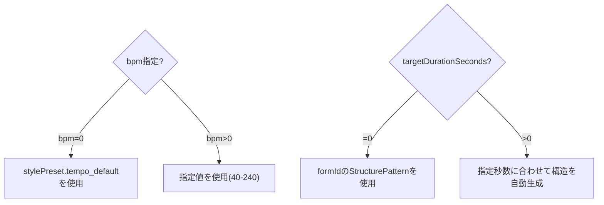

---

## 4. バリデーション干渉

### 4.1 パラメータ有効範囲一覧

| パラメータ | 有効範囲 | エラーコード |
|-----------|---------|--------------|
| `stylePresetId` | 0-16 | `INVALID_STYLE` |
| `key` | 0-11 | `INVALID_KEY` |
| `bpm` | 0, 40-240 | `INVALID_BPM` |
| `chordProgressionId` | 0-21 | `INVALID_CHORD` |
| `formId` | 0-17 | `INVALID_FORM` |
| `vocalLow`, `vocalHigh` | 36-96, low ≤ high | `INVALID_VOCAL_RANGE` |
| `compositionStyle` | 0-2 | `INVALID_COMPOSITION_STYLE` |
| `vocalStyle` | 0-12 | `INVALID_VOCAL_STYLE` |
| `melodyTemplate` | 0-7 | `INVALID_MELODY_TEMPLATE` |
| `melodicComplexity` | 0-2 | `INVALID_MELODIC_COMPLEXITY` |
| `hookIntensity` | 0-3 | `INVALID_HOOK_INTENSITY` |
| `vocalGroove` | 0-5 | `INVALID_VOCAL_GROOVE` |
| `modulationTiming` | 0-4 | `INVALID_MODULATION_TIMING` |
| `modulationSemitones` | 1-4 (timing≠0時) | `INVALID_MODULATION` |
| `arpeggioPattern` | 0-3 | `INVALID_ARPEGGIO_PATTERN` |
| `arpeggioSpeed` | 0-2 | `INVALID_ARPEGGIO_SPEED` |
| `callDensity` | 0-3 | `INVALID_CALL_DENSITY` |
| `introChant` | 0-2 | `INVALID_INTRO_CHANT` |
| `mixPattern` | 0-2 | `INVALID_MIX_PATTERN` |
| `blueprintId` | 0-8, 255 | (255=自動ランダム) |

### 4.2 スタイル × vocalAttitude の組み合わせ

各スタイルプリセットには`allowedAttitudes`ビットフラグがあり、許可されていないAttitudeを指定するとエラー：

```typescript
// 例: スタイルがCleanとExpressiveのみ許可
allowedAttitudes = ATTITUDE_CLEAN | ATTITUDE_EXPRESSIVE  // 0b011 = 3

vocalAttitude = 2 (Raw) → INVALID_ATTITUDE エラー
```

許可Attitudeは `midisketch_style_preset_allowed_attitudes(styleId)` で取得可能。

### 4.3 modulationTiming × modulationSemitones の依存関係

| modulationTiming | modulationSemitones | 結果 |
|------------------|---------------------|------|
| 0 (None) | 任意（無視される） | OK |
| 1-4 | 0 | `INVALID_MODULATION` |
| 1-4 | 1-4 | OK |
| 1-4 | 5以上 | `INVALID_MODULATION` |

### 4.4 callEnabled × targetDurationSeconds × bpm の干渉

```
IF callEnabled == true AND targetDurationSeconds > 0
THEN targetDurationSeconds >= getMinimumSecondsForCall(introChant, mixPattern, bpm)
```

最小時間の計算式:
```
min_bars = 24 + introChant_bars + mixPattern_bars
min_seconds = min_bars * 240 / bpm
```

| bpm | 基本最小秒数（call有効時） | introChant/mixPattern追加時 |
|-----|---------------------------|---------------------------|
| 40 | **144秒** | さらに増加 |
| 60 | **96秒** | さらに増加 |
| 120 | **48秒** | さらに増加 |
| 240 | **24秒** | さらに増加 |

**対処法**: `targetDurationSeconds=0`（自動）を使用してシステムに適切な長さを決定させる。

### 4.5 クラッシュを引き起こす可能性のある組み合わせ

::: danger これらの組み合わせは避けてください
以下の組み合わせはバリデーションエラーを引き起こします。生成前にパラメータを確認してください。
:::

| パターン | 原因 | 対処法 |
|----------|------|--------|
| `modulationTiming≠0` + `modulationSemitones=0` | 転調有効だが量が無効 | `modulationSemitones=2`に設定 |
| `callEnabled=true` + `targetDurationSeconds=30` + `bpm=40` | 時間不足 | `targetDurationSeconds=0`に設定 |
| `vocalLow=80` + `vocalHigh=60` | 範囲反転 | low ≤ highにする |
| `vocalLow=30` または `vocalHigh=100` | 範囲外 | 36-96の範囲内にする |
| `bpm=300` | BPM範囲外 | 40-240の範囲内にする |

---

## 5. 推奨組み合わせパターン

### 5.1 シンプルなポップ（デフォルト）

```javascript
{
  stylePresetId: 0,
  compositionStyle: 0,  // MelodyLead
  drumsEnabled: true,
  arpeggioEnabled: false,
  callEnabled: false
}
```

### 5.2 ボーカロイド風

```javascript
{
  stylePresetId: 14,  // Anime Opening
  compositionStyle: 0,
  vocalStyle: 2,      // Vocaloid - 高密度・広跳躍
  arpeggioEnabled: true,
  arpeggioSpeed: 1    // 16分
}
```

### 5.3 アイドル曲（コールあり）

```javascript
{
  stylePresetId: 3,   // Idol Standard
  vocalStyle: 4,      // Idol
  callEnabled: true,
  introChant: 1,      // ガチ恋
  mixPattern: 2,      // 虎火
  callDensity: 2,     // Standard
  callNotesEnabled: true,
  targetDurationSeconds: 180  // 3分以上必要
}
```

### 5.4 BGMモード（Motif + Arpeggio）

```javascript
{
  compositionStyle: 1,  // BackgroundMotif (BGM専用)
  // skipVocalの指定は不要（BackgroundMotifでは自動的にVocal無効）

  // Motif設定
  motifFixedProgression: true,
  motifMaxChordCount: 4,

  // Arpeggio設定（BackgroundMotifでも使用可能）
  arpeggioEnabled: true,      // → Motif + Arpeggio 両方生成
  arpeggioPattern: 2,         // UpDown
  arpeggioSpeed: 1,           // 16分
  arpeggioOctaveRange: 2,
  arpeggioGate: 80,

  // 転調設定（BGMモードでも有効）
  modulationTiming: 1,        // LastChorus
  modulationSemitones: 2      // +2半音
}
// 出力: Motif + Bass + Chord + Drums + Arpeggio（最後のサビで+2半音転調）
```

### 5.5 BGMモード（Arpeggio中心）

```javascript
{
  compositionStyle: 2,  // SynthDriven (BGM専用)
  // arpeggioEnabledは不要（SynthDrivenでは自動有効）
  arpeggioPattern: 0,         // Up
  arpeggioSpeed: 2,           // 3連符
  arpeggioOctaveRange: 3,

  // 転調設定（BGMモードでも有効）
  modulationTiming: 2,        // AfterBridge
  modulationSemitones: 3      // +3半音
}
// 出力: Bass + Chord + Drums + Arpeggio (Motifなし、ブリッジ後に+3半音転調)
```

---

## 6. 暗黙的な内部設定

特定のパラメータを設定すると、内部で他のパラメータが自動的に設定されます。

### 6.1 VocalStylePreset → メロディパラメータ

`vocalStyle`を設定すると、内部のメロディ生成パラメータが自動設定されます：

| パラメータ | 説明 |
|-----------|------|
| `max_leap_interval` | 最大跳躍幅（半音数） |
| `syncopation_prob` | シンコペーション確率 |
| `verse/chorus_density_modifier` | セクション別密度係数 |
| `hook_repetition` | フック反復の有無 |
| `chorus_long_tones` | コーラスでの長音符 |
| `tension_usage` | テンション使用率 |

**VocalStylePreset一覧** (0-12):

| ID | 名前 | 特徴 |
|----|------|------|
| 0 | Auto | スタイルに応じてランダム選択 |
| 1 | Standard | 標準的なポップス |
| 2 | Vocaloid | 高密度・広跳躍・シンコペーション（歌唱可能） |
| 3 | UltraVocaloid | 超高速・極端な跳躍（機械向け） |
| 4 | Idol | キャッチー・フック重視 |
| 5 | Ballad | ゆったり・長音符重視 |
| 6 | Rock | パワフル・コーラス強調 |
| 7 | CityPop | おしゃれ・テンション使用 |
| 8 | Anime | ドラマチック・フック強め |
| 9 | BrightKira | 明るい・キラキラ |
| 10 | CoolSynth | クール・16分音符多め |
| 11 | CuteAffected | かわいい・控えめシンコペ |
| 12 | PowerfulShout | 力強い・長音符＋密度上昇 |

### 6.2 MelodicComplexity → 複数パラメータ

| melodicComplexity | 自動設定 |
|-------------------|----------|
| `Simple (0)` | `note_density *= 0.7`, `max_leap_interval ≤ 5`, `hook_repetition=true`, `tension_usage *= 0.5`, `sixteenth_note_ratio *= 0.5`, `syncopation_prob *= 0.5` |
| `Standard (1)` | 変更なし（デフォルト） |
| `Complex (2)` | `note_density *= 1.3`, `max_leap_interval *= 1.5` (max 12), `tension_usage *= 1.5`, `sixteenth_note_ratio *= 1.5` (max 0.5), `syncopation_prob *= 1.5` (max 0.5) |

### 6.3 VocalAttitude → ピッチ選択

| vocalAttitude | ピッチ候補 | 音楽的特徴 |
|---------------|-----------|-----------|
| `Clean (0)` | コードトーン（1, 3, 5）のみ | 安全・協和的・安定 |
| `Expressive (1)` | コードトーン + テンション（7th, 9th） | カラフル・遅延解決 |
| `Raw (2)` | 全スケールトーン | エッジー・ノンコードトーン着地 |

### 6.4 CompositionStyle → 暗黙的動作

| compositionStyle | 暗黙的に発生する動作 |
|------------------|---------------------|
| `BackgroundMotif (1)` | **Vocal/Aux完全無効化**（生成されない）, Motifトラック生成, **modulation有効** |
| `SynthDriven (2)` | **arpeggio自動有効化**（arpeggioEnabled=falseでも有効）, **Vocal/Aux完全無効化**, **modulation有効** |

```javascript
// 例: arpeggioEnabledを設定していなくてもアルペジオが生成される
{
  compositionStyle: 2,  // SynthDriven (BGM専用)
  arpeggioEnabled: false,  // ← 無視される！アルペジオは自動で有効
  modulationTiming: 1,     // BGMモードでも有効
  modulationSemitones: 2
  // 注意: このモードではVocalトラックは生成されない
}
```

### 6.5 VocalGrooveFeel → タイミング調整

| vocalGroove | 効果 |
|-------------|------|
| `Straight (0)` | 変更なし |
| `OffBeat (1)` | オンビートを遅らせる（+30 ticks） |
| `Swing (2)` | 8分音符の2拍目を遅らせる |
| `Syncopated (3)` | ビート2,4を先取り（-30 ticks） |
| `Driving16th (4)` | 16分音符を強調 |
| `Bouncy8th (5)` | 8分音符にバウンス感 |

### 6.6 hookIntensity → フレーズ生成変更

| hookIntensity | duration乗数 | velocity加算 | 対象セクション |
|---------------|-------------|-------------|----------------|
| `Off (0)` | - | - | なし |
| `Light (1)` | ×1.3 | +5 | Chorus, B |
| `Normal (2)` | ×1.5 | +10 | Chorus, B |
| `Strong (3)` | ×2.0 | +15 | **全セクション** |

---

## 7. オプション依存関係ツリー

```
SongConfig
├── Basic Settings
│   ├── stylePresetId     ─────┐
│   ├── key                    │ スタイルが他オプションの
│   ├── bpm (0=default)        │ デフォルト値を決定
│   └── seed (0=random)        │
│                              ▼
├── Structure ◄────────────────┤
│   ├── formId                 │
│   └── targetDurationSeconds ─┴─▶ formIdと排他(0以外なら自動生成)
│
├── Vocal (skipVocal=falseの場合のみ)
│   ├── vocalAttitude  ◄────────── styleで制限あり
│   ├── vocalStyle     ◄────────── 0=Auto, 1-12=明示的プリセット
│   ├── vocalLow/High
│   ├── melodicComplexity
│   ├── hookIntensity
│   └── vocalGroove
│
├── Arpeggio (arpeggioEnabled=trueの場合のみ)
│   ├── arpeggioPattern
│   ├── arpeggioSpeed
│   ├── arpeggioOctaveRange
│   ├── arpeggioGate
│   └── arpeggioSyncChord
│
├── Call System (callEnabled=trueの場合のみ)
│   ├── introChant
│   ├── mixPattern  ─────────────▶ targetDurationSecondsと干渉
│   ├── callDensity
│   └── callNotesEnabled
│
├── Chord Extensions (各enabledがtrueの場合のみprob有効)
│   ├── chordExtSus  → chordExtSusProb
│   ├── chordExt7th  → chordExt7thProb
│   └── chordExt9th  → chordExt9thProb
│
├── Modulation (modulationTiming!=Noneの場合のみ)
│   └── modulationSemitones
│
├── Humanize (humanize=trueの場合のみ)
│   ├── humanizeTiming
│   └── humanizeVelocity
│
└── CompositionStyle依存
    ├── compositionStyle=0 (MelodyLead): Vocal/Aux有効・標準
    ├── compositionStyle=1 (BackgroundMotif): BGM専用(Vocal/Aux無効)
    │   ├── motifRepeatScope
    │   ├── motifFixedProgression
    │   └── motifMaxChordCount
    └── compositionStyle=2 (SynthDriven): BGM専用, arpeggio自動有効
```

---

## 8. ワークフロー別のオプション使用

### 8.1 generateVocal(config) で使用されるパラメータ

| カテゴリ | パラメータ | 使用 | 説明 |
|----------|-----------|:----:|------|
| **基本** | `stylePresetId` | ✅ | スタイル決定 |
| | `key` | ✅ | キー（内部はCメジャー、出力時に移調） |
| | `bpm` | ✅ | テンポ（0=スタイルデフォルト） |
| | `seed` | ✅ | ランダムシード |
| | `chordProgressionId` | ✅ | コード進行（メロディ生成の参照） |
| | `formId` | ✅ | 構造パターン |
| **ボーカル** | `vocalLow` | ✅ | 音域下限 |
| | `vocalHigh` | ✅ | 音域上限 |
| | `vocalAttitude` | ✅ | 表現スタイル |
| | `vocalStyle` | ✅ | ボーカルスタイルプリセット |
| | `melodicComplexity` | ✅ | メロディの複雑さ |
| | `hookIntensity` | ✅ | フック強度 |
| | `vocalGroove` | ✅ | グルーブ感 |
| **無視** | `drumsEnabled` | ❌ | Vocalのみ生成 |
| | `arpeggioEnabled` | ❌ | Vocalのみ生成 |
| | `humanize` | ❌ | 伴奏追加時に適用 |

### 8.2 generateAccompaniment(config?) で使用されるパラメータ

| カテゴリ | パラメータ | 使用 | 説明 |
|----------|-----------|:----:|------|
| **トラック** | `drumsEnabled` | ✅ | ドラム生成 |
| | `arpeggioEnabled` | ✅ | アルペジオ生成 |
| | `arpeggio.*` | ✅ | アルペジオ設定 |
| | `chordExt*` | ✅ | コード拡張設定 |
| **後処理** | `humanize` | ✅ | ヒューマナイズ適用 |
| | `humanizeTiming` | ✅ | タイミング変動 |
| | `humanizeVelocity` | ✅ | ベロシティ変動 |
| **SE/Call** | `seEnabled` | ✅ | SEトラック生成 |
| | `callEnabled` | ✅ | コール機能 |
| | `callDensity` | ✅ | コール密度 |

### 8.3 regenerateVocal(configOrSeed) で使用されるパラメータ

**シード指定の場合** (`regenerateVocal(12345)`):
- `seed`のみ変更、他のパラメータは前回の`generateVocal`設定を継続

**VocalConfig指定の場合** (`regenerateVocal({...})`):
| パラメータ | 使用 | 説明 |
|-----------|:----:|------|
| `seed` | ✅ | 新しいランダムシード |
| `vocalLow` | ✅ | 音域下限を変更 |
| `vocalHigh` | ✅ | 音域上限を変更 |
| `vocalAttitude` | ✅ | 表現スタイルを変更 |
| `vocalStyle` | ✅ | ボーカルスタイルプリセットを変更 |
| `melodicComplexity` | ✅ | 複雑さを変更 |
| `hookIntensity` | ✅ | フック強度を変更 |
| `vocalGroove` | ✅ | グルーブを変更 |

**注意**: コード進行と構造は変更されません（generateVocal時の設定を継続）。

---

## 9. パラメータ適用フロー

```
SongConfig
    │
    ├── stylePresetId ──→ mood, compositionStyle, bpm(default), melody_params
    │                           │
    │                           ▼ (明示設定で上書き可)
    ├── compositionStyle ──────────────→ 最終compositionStyle
    ├── bpm ───────────────────────────→ 最終BPM
    │
    ├── vocalStyle ─────────→ melody_params上書き ─────→ │
    │       │                                            │
    │       └── (Auto) ────→ ランダム選択               │
    │                                                    ▼
    ├── melodicComplexity ─→ melody_params乗算調整 ────→ 最終melody_params
    │
    ├── hookIntensity ─────→ Chorus/Bセクションのノート調整
    │
    ├── vocalGroove ───────→ 全ノートのタイミング調整
    │
    └── callEnabled ──────→ (false=Auto時) vocalStyleで判定 → call_enabled
```

**適用順序**: `StylePreset` → `VocalStylePreset` → `MelodicComplexity`

---

## 10. Production Blueprint によるオーバーライド

Production Blueprintは、スタイル/ムード設定とは独立して、音楽の**生成方法**を制御します。

### 10.1 Blueprint 一覧

| ID | 名前 | パラダイム | RiffPolicy | ドラム必須 | フォーム上書き |
|----|------|-----------|------------|:----------:|:-------------:|
| 0 | 定番ポップ | Traditional | Free | - | - |
| 1 | リズムで刻む | RhythmSync | Locked | **必須** | **有** |
| 2 | 物語のように展開 | MelodyDriven | Evolving | - | **有** |
| 3 | 静かに始まる | MelodyDriven | Free | - | **有** |
| 4 | アイドル王道 | MelodyDriven | Evolving | - | **有** |
| 5 | サビから攻める | RhythmSync | Locked | **必須** | **有** |
| 6 | かわいく弾む | MelodyDriven | Locked | **必須** | **有** |
| 7 | 踊れるビート | RhythmSync | Locked | **必須** | **有** |
| 8 | 静→爆発 | MelodyDriven | Locked | - | **有** |
| 255 | おまかせ | - | - | - | - |

### 10.2 パラダイムの種類

| パラダイム | 説明 | 生成順序 |
|-----------|------|---------|
| Traditional | クラシックなポップ生成 | Bass → Chord → Vocal（デフォルト） |
| RhythmSync | ドラム＆ベースがメロディに同期 | ドラム先行、ボーカル同期 |
| MelodyDriven | メロディ中心のアレンジ | メロディ先行、伴奏追従 |

### 10.3 RiffPolicy の種類

| ポリシー | 説明 | motifRepeatScope への影響 |
|---------|------|--------------------------|
| Free | セクションごとに変化 | `motifRepeatScope` 設定を使用 |
| Locked | 曲全体で同一パターン | `motifRepeatScope` を**無視** |
| Evolving | 2セクションごとに30%確率で変化 | `motifRepeatScope` を**無視** |

### 10.4 Blueprint によるオーバーライドルール

Blueprint が選択されると（Traditional/ID 0 以外）、いくつかの設定が自動的にオーバーライドされます：

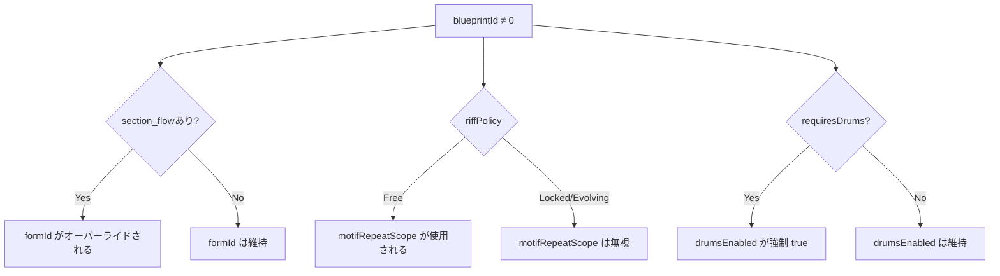

| Blueprint 設定 | オーバーライド対象 | 条件 |
|----------------|-------------------|------|
| `section_flow` | `formId` | Traditional (ID 0) 以外で全て |
| `riff_policy` | `motifRepeatScope` | Free=設定使用、Locked/Evolving=無視 |
| `drums_sync_vocal` | 内部同期設定 | Blueprint 定義が優先 |
| `drums_required` | `drumsEnabled` | true の場合、`drumsEnabled=true` を強制 |
| `TrackMask::Motif` | モチーフ生成 | セクションごとに制御 |

### 10.5 モチーフ生成フロー

```
CompositionStyle == BackgroundMotif? → Yes: モチーフ生成
└─ No → Blueprint に section_flow がある? → No: モチーフなし
        └─ Yes → セクションに TrackMask::Motif がある? → Yes: モチーフ生成
```

::: warning ドラム必須
`requiresDrums=true` の Blueprint（ID: 1, 5, 6, 7）は自動的にドラムを有効化します。これらの Blueprint では UI 上のドラム切り替えは非表示になります。
:::

### 10.6 例：Blueprint のオーバーライド動作

```javascript
// リズムで刻む Blueprint を使用
{
  blueprintId: 1,        // リズムで刻む
  formId: 5,             // ← 無視！Blueprint の section_flow が使用される
  motifRepeatScope: 1,   // ← 無視！Locked ポリシーで同一パターン強制
  drumsEnabled: false,   // ← 無視！drums_required=true で強制有効
}
```

```javascript
// 定番ポップ Blueprint を使用（Traditional）
{
  blueprintId: 0,        // 定番ポップ
  formId: 5,             // ← 指定通り使用
  motifRepeatScope: 1,   // ← 指定通り使用
  drumsEnabled: false,   // ← 指定通り使用
}
```
