# オプション関係性

このドキュメントでは、MIDI Sketchの`SongConfig`オプション間の関係性を説明します。

::: tip これらの設定が初めての方へ
ここで関係づけられるフィールド — `key`・`mood`・`formId`・`chordExt*` 系 — は、コースで章ごとに順を追って紹介されます。総仕上げの[概念と設定の対応](/ja/docs/course/config-mapping)が、それらを1つのルックアップ表にまとめています。
:::

## 関係性の種類

オプションには以下の関係性があります：

- **依存**: 親オプションが有効でないと子オプションは無視される
- **優先**: 特殊な値（0など）が他の設定をオーバーライド
- **干渉**: 特定の組み合わせでバリデーションエラー
- **暗黙**: あるオプションを設定すると内部パラメータが自動設定される

::: info なぜこれが重要か
これらの関係性を理解することで、予期しない動作を回避できます。例えば、`arpeggioEnabled=false`の場合、`arpeggioPattern=2`を設定しても効果がありません。
:::

---

## 1. 依存関係

### 1.1 Call System

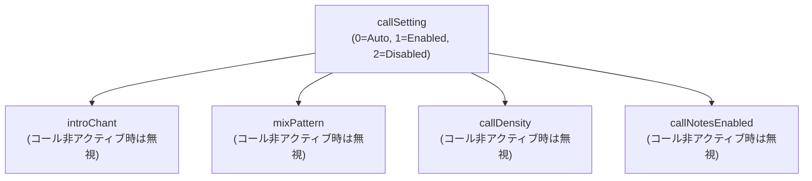

| 親オプション | 子オプション | 説明 |
|--------------|--------------|------|
| コールがアクティブ（`callSetting=1`、または `0` がオンに解決） | `introChant` | イントロチャントの種類 |
| コールがアクティブ | `mixPattern` | MIXセクションの種類 |
| コールがアクティブ | `callDensity` | コーラスでのコール密度 |
| コールがアクティブ | `callNotesEnabled` | コールをMIDIノートとして出力 |

::: warning callEnabled はレガシー
`SongConfig` では boolean の `callEnabled` に代わって `callSetting`（0=Auto, 1=Enabled, 2=Disabled）が正となりました。`0`（Auto）の場合はスタイル/ボーカルスタイルがコール生成を決定します。`callEnabled` は後方互換のために引き続き受理されます（`true`→1、`false`→2）が、新規コードでは使用しないでください。`AccompanimentConfig` は引き続き単純な `callEnabled` boolean を使います。
:::

### 1.2 Arpeggio

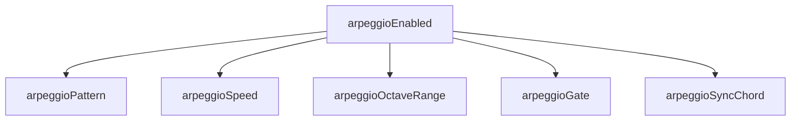

| 親オプション | 子オプション | 説明 |
|--------------|--------------|------|
| `arpeggioEnabled=true` | `arpeggioPattern` | Up/Down/UpDown/Random/Pinwheel/PedalRoot/Alberti/BrokenChord (0-7) |
| `arpeggioEnabled=true` | `arpeggioSpeed` | 8分/16分/3連符 |
| `arpeggioEnabled=true` | `arpeggioOctaveRange` | 1-3オクターブ |
| `arpeggioEnabled=true` | `arpeggioGate` | ゲート長(0.0-1.0、デフォルト 0.8。AccompanimentConfigは0-100) |
| `arpeggioEnabled=true` | `arpeggioSyncChord` | コード変更と同期 |
| `arpeggioEnabled=true` | `arpeggioBaseVelocity` | アルペジオノートの基準ベロシティ(0-127、デフォルト 90) |

### 1.3 Humanization

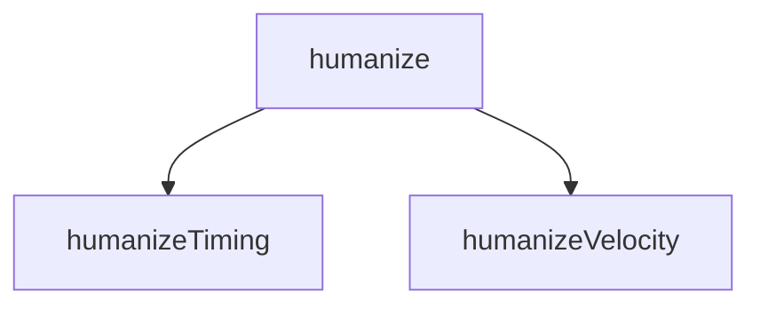

| 親オプション | 子オプション | 説明 |
|--------------|--------------|------|
| `humanize=true` | `humanizeTiming` | タイミング揺れ(0.0-1.0、デフォルト 0.4。AccompanimentConfigは0-100) |
| `humanize=true` | `humanizeVelocity` | ベロシティ揺れ(0.0-1.0、デフォルト 0.3。AccompanimentConfigは0-100) |

### 1.4 Chord Extensions

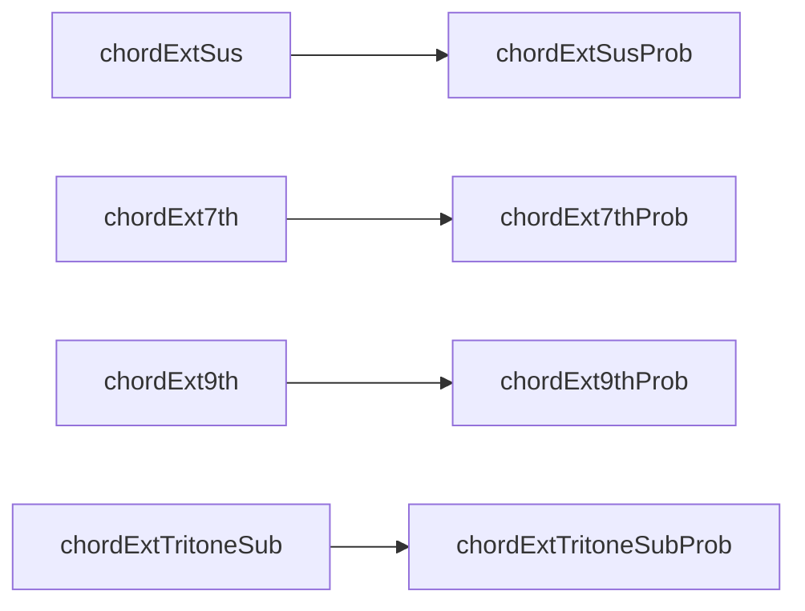

| 親オプション | 子オプション | 説明 |
|--------------|--------------|------|
| `chordExtSus=true` | `chordExtSusProb` | Sus確率(0.0-1.0、デフォルト 0.2) |
| `chordExt7th=true` | `chordExt7thProb` | 7th確率(0.0-1.0、デフォルト 0.15) |
| `chordExt9th=true` | `chordExt9thProb` | 9th確率(0.0-1.0、デフォルト 0.25) |
| `chordExtTritoneSub=true` | `chordExtTritoneSubProb` | トライトーン代理確率(0.0-1.0、デフォルト 0.5) |

::: info AccompanimentConfig は 0-100
上記の確率は `SongConfig` の値（0.0-1.0）です。再生成用の `AccompanimentConfig` では同じフィールドが整数 0-100 のレンジを維持しています（sus 20、7th 30、9th 25、tritone 50）。
:::

### 1.5 Modulation

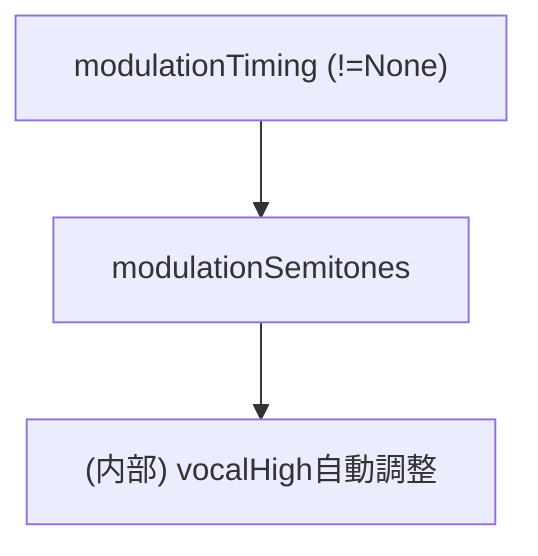

| 親オプション | 子オプション | 説明 |
|--------------|--------------|------|
| `modulationTiming != None` | `modulationSemitones` | 転調量（1-4半音） |
| `modulationSemitones > 0` | (内部) `effective_vocal_high` | 転調後も音域内に収まるよう自動調整 |

**注意**:
- `modulationTiming=None`の場合、`modulationSemitones`はバリデーションされない
- **ボーカル音域の自動調整**: 転調が有効な場合、`effective_vocal_high = vocal_high - modulation_semitones`で計算され、転調後もボーカルが音域内に収まる
- **全CompositionStyleで有効**: BGMモード（BackgroundMotif, SynthDriven）でも転調が機能する

### 1.6 Vocal (skipVocalによる排他)

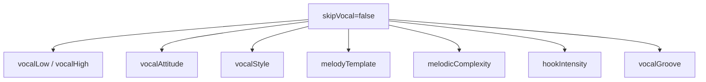

| 条件 | 有効なオプション | 用途 |
|------|------------------|------|
| `skipVocal=false` | すべてのvocal関連オプション | 通常の楽曲生成 |
| `skipVocal=true` | vocal関連オプションは全て無視 | **BGMのみ生成（Vocalなし）** |

::: danger ボーカルの復元不可
BGM専用生成後にボーカルを追加するAPIは存在しません。ボーカルが必要な場合は、`compositionStyle=MelodyLead`または**Vocal-Firstワークフロー**を使用してください（[JavaScript API](/ja/docs/api-js)参照）。
:::

### 1.7 シンコペーション

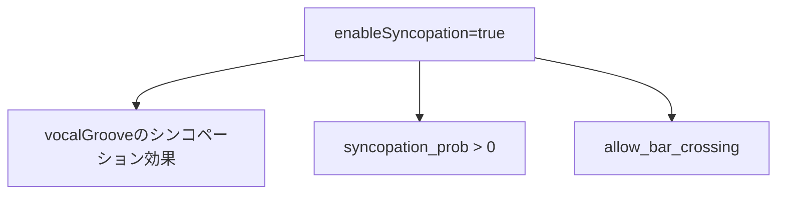

| 親オプション | 子オプション | 説明 |
|--------------|--------------|------|
| `enableSyncopation=true` | `vocalGroove`のシンコペーション効果 | falseの場合、Syncopatedグルーブでもシンコペーション重み0.0 |
| `enableSyncopation=false` | `syncopation_prob=0.0` | シンコペーション確率がゼロに強制 |
| `enableSyncopation=false` | `allow_bar_crossing=false` | 小節線跨ぎが強制無効 |

**注意**: タイミングオフセット（OffBeatの+30 ticks等）は`enableSyncopation`に関係なく適用されます。シンコペーション固有の重み付けのみが影響を受けます。

### 1.8 明示フラグ

| 親オプション | 子オプション | 説明 |
|--------------|--------------|------|
| `moodExplicit=true` | `mood` (0-23) | moodフィールドが直接使用される。falseの場合はstylePresetIdから自動導出 |
| `formExplicit=true` | `formId` | formIdが指定通りに使用される。falseの場合はBlueprint/ランダム化により上書きされる可能性あり |
| `chordExtProbExplicit=true` | コード拡張確率 | Moodに基づくコード拡張確率の自動調整が抑制される |
| `drumsEnabledExplicit=true` | `drumsEnabled` | 明示的なドラム制御。drums_required Blueprintでドラムを無効化するために必要 |

### 1.9 Blueprint ID 9 (BehavioralLoop)

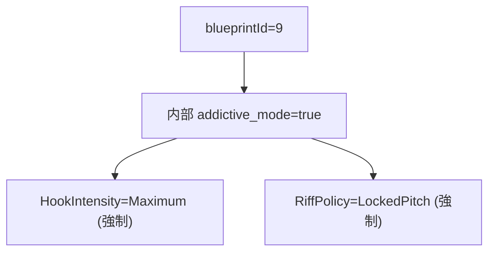

| 親オプション | 子オプション | 説明 |
|--------------|--------------|------|
| `blueprintId=9` | `addictive_mode=true` | 内部の中毒性モードが有効化 |
| `addictive_mode=true` | `HookIntensity=Maximum` | フック強度が最大（内部レベル4）に強制 |
| `addictive_mode=true` | `RiffPolicy=LockedPitch` | リフポリシーがLockedPitchに強制 |

---

## 2. CompositionStyleによる分岐

`compositionStyle`の値によって、生成されるトラックと有効なオプションが変わります：

### 2.1 MelodyLead (0) - デフォルト

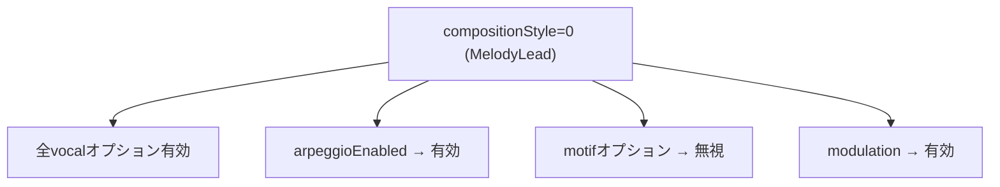

**生成トラック**: Vocal → Aux → Motif (Blueprint依存) → Bass → Chord → Guitar → Arpeggio (有効時) → Drums → SE

### 2.2 BackgroundMotif (1) - BGM専用モード

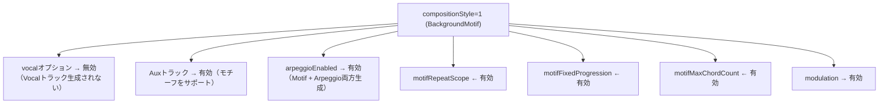

**生成トラック構成**:
| arpeggioEnabled | 生成されるトラック |
|-----------------|-------------------|
| `false` | Aux + Motif + Bass + Chord + Guitar + Drums |
| `true` | Aux + Motif + Bass + Chord + Guitar + Drums + **Arpeggio** |

### 2.3 SynthDriven (2) - BGM専用モード

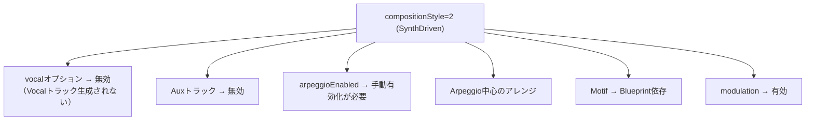

**生成トラック**: Motif (Blueprint依存) + Bass + Chord + Guitar + Arpeggio (有効時) + Drums

::: tip CompositionStyleの選び方
- **MelodyLead**: ボーカル付きの楽曲（ポップ、ロック、バラード）
- **BackgroundMotif**: 繰り返しメロディパターンのインストBGM（ゲーム音楽、アンビエント）
- **SynthDriven**: エレクトロニック/シンセ主体のインストトラック
:::

---

## 3. 優先順位（特殊値によるオーバーライド）

| オプション | 特殊値 | 動作 |
|------------|--------|------|
| `bpm` | `0` | スタイルプリセットのデフォルトBPMを使用 |
| `seed` | `0` | ランダムシードを自動生成 |
| `targetDurationSeconds` | `0` | `formId`で指定した構造パターンを使用 |
| `vocalStyle` | `0` (Auto) | スタイルに応じたランダム選択 |
| `melodyTemplate` | `0` (Auto) | スタイルに応じたデフォルト選択 |
| `driveFeel` | `50` | ニュートラル（0=レイドバック、100=アグレッシブ） |
| `moraRhythmMode` | `2` (Auto) | VocalStylePresetから自動選択 |

### driveFeelの詳細

| 値 | 効果 |
|----|------|
| `0` | レイドバック：タイミング遅延、ベロシティ低下 |
| `50` | ニュートラル：標準的なタイミング（デフォルト） |
| `100` | アグレッシブ：タイミング先行、ベロシティ上昇、シンコペーション強化（`enableSyncopation=true`時のみ） |

### energyCurveの値

| 値 | 名前 | 効果 |
|----|------|------|
| `0` | GradualBuild | 徐々に盛り上がる（デフォルト） |
| `1` | FrontLoaded | 冒頭からエネルギー高、後半は落ち着く |
| `2` | WavePattern | 波状のエネルギー推移 |
| `3` | SteadyState | 一定のエネルギーを維持 |

::: info ゼロ値の活用
ゼロは「自動」または「デフォルトを使用」を意味することが多いです。正確な値を指定せずにスタイルに適したデフォルトを使いたい場合に便利です。
:::

### フローチャート

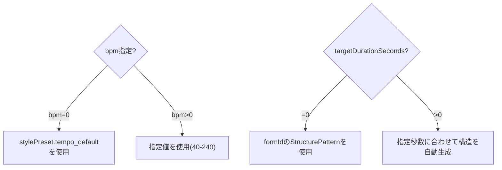

---

## 4. メロディオーバーライド

メロディオーバーライドは、VocalStylePresetとMelodicComplexityの処理**後**に適用されます。センチネル値（パラメータに応じて0、0xFF、-128）は「プリセットデフォルトを使用」を意味します。

### 4.1 メロディオーバーライドパラメータ

| パラメータ | 範囲 | デフォルト | 説明 |
|-----------|------|----------|------|
| `melodyMaxLeap` | 0=preset, 1-12 | 0 | 最大音程跳躍（半音数） |
| `melodySyncopationProb` | 0-100, 0xFF=preset | 0xFF | シンコペーション確率（%） |
| `melodyPhraseLength` | 0=preset, 1-8 | 0 | フレーズ長（小節数） |
| `melodyLongNoteRatio` | 0-100, 0xFF=preset | 0xFF | ロングノート比率（%） |
| `melodyChorusRegisterShift` | -12〜+12, -128=preset | -128 | コーラスのレジスタシフト（半音） |
| `melodyHookRepetition` | 0=preset, 1=off, 2=on | 0 | フックの反復パターン |
| `melodyUseLeadingTone` | 0=preset, 1=off, 2=on | 0 | セクション境界での導音挿入 |

### 4.2 三値パラメータ

`melodyHookRepetition`と`melodyUseLeadingTone`は三値設計です：

| 値 | 意味 |
|----|------|
| `0` | プリセット/VocalStylePresetの値を使用（デフォルト） |
| `1` | 明示的にOFF |
| `2` | 明示的にON |

### 4.3 プリセット制御のみのパラメータ（オーバーライドなし）

以下はVocalStylePresetのみで制御され、SongConfigオーバーライドは提供されません：
- `chorus_long_tones`: サビでの音符延長（Idol/Rock/Anime等で有効）
- `allow_bar_crossing`: 小節線を跨ぐ音符の許可（Vocaloid/Rock/Anime等で有効）
- `allow_unison_repeat`: 連続同音の許可（デフォルトtrue）

---

## 5. モチーフオーバーライド

モチーフオーバーライドは、BackgroundMotifモードおよびBlueprintベースのモチーフセクションでのメロディモチーフ生成パラメータを制御します。

### 5.1 モチーフオーバーライドパラメータ

| パラメータ | 範囲 | デフォルト | 説明 |
|-----------|------|----------|------|
| `motifLength` | 0=auto, 1/2/4 | 0 | モチーフ長（拍数） |
| `motifNoteCount` | 0=auto, 3-8 | 0 | モチーフ内の音数 |
| `motifMotion` | 0xFF=preset, 0-4 | 0xFF | 音の動き |
| `motifRegisterHigh` | 0=auto, 1=low, 2=high | 0 | 音域（0=中音域） |
| `motifRhythmDensity` | 0xFF=preset, 0-2 | 0xFF | リズム密度 |

### 5.2 MotifMotionの値

| 値 | 名前 | 説明 |
|----|------|------|
| 0 | Stepwise | スケールステップのみ（2度） |
| 1 | GentleLeap | 3度まで |
| 2 | WideLeap | 5度まで |
| 3 | NarrowStep | 狭いスケール度（ジャジー） |
| 4 | Disjunct | 不規則な跳躍（実験的） |
| 5 | Ostinato | 同一ピッチクラス反復（**内部Blueprint用のみ**、APIでは使用不可） |

::: warning Ostinatoモーション
`motifMotion=5`（Ostinato）は内部Blueprint定義専用です。APIでは値0-4のみ公開されています。4を超える値は`min(val, 4)`でクランプされます。
:::

### 5.3 MotifRhythmDensityの値

| 値 | 名前 | 説明 |
|----|------|------|
| 0 | Sparse | 低密度パターン |
| 1 | Medium | 標準密度 |
| 2 | Driving | 高密度パターン |

---

## 6. バリデーション干渉

### 6.1 パラメータ有効範囲一覧

| パラメータ | 有効範囲 | エラーコード |
|-----------|---------|--------------|
| `stylePresetId` | 0-16 | `INVALID_STYLE` |
| `key` | 0-11 | `INVALID_KEY` |
| `bpm` | 0, 40-240 | `INVALID_BPM` |
| `chordProgressionId` | 0-21 | `INVALID_CHORD` |
| `formId` | 0-17 | `INVALID_FORM` |
| `vocalAttitude` | スタイル依存（allowedAttitudesビットマスク） | `INVALID_ATTITUDE` |
| `vocalLow`, `vocalHigh` | 36-96, low ≤ high | `INVALID_VOCAL_RANGE` |
| `compositionStyle` | 0-2 | `INVALID_COMPOSITION_STYLE` |
| `vocalStyle` | 0-13 | `INVALID_VOCAL_STYLE` |
| `melodyTemplate` | 0-7 | `INVALID_MELODY_TEMPLATE` |
| `melodicComplexity` | 0-2 | `INVALID_MELODIC_COMPLEXITY` |
| `hookIntensity` | 0-4 | `INVALID_HOOK_INTENSITY` |
| `vocalGroove` | 0-5 | `INVALID_VOCAL_GROOVE` |
| `modulationTiming` | 0-4 | `INVALID_MODULATION_TIMING` |
| `modulationSemitones` | 1-4 (timing≠0時) | `INVALID_MODULATION` |
| `arpeggioPattern` | 0-7 | `INVALID_ARPEGGIO_PATTERN` |
| `arpeggioSpeed` | 0-2 | `INVALID_ARPEGGIO_SPEED` |
| `callDensity` | 0-3 | `INVALID_CALL_DENSITY` |
| `introChant` | 0-2 | `INVALID_INTRO_CHANT` |
| `mixPattern` | 0-2 | `INVALID_MIX_PATTERN` |
| `motifRepeatScope` | 0-1 | `INVALID_MOTIF_REPEAT_SCOPE` |
| `arrangementGrowth` | 0-1 | `INVALID_ARRANGEMENT_GROWTH` |
| `blueprintId` | 0-9, 255 | (255=自動ランダム) |

### 6.2 validateSongConfigでバリデーションされないパラメータ

以下のパラメータは`validateSongConfig()`でチェック**されません**。不正な値はconfig converter内部でクランプまたは無視されます：

| パラメータ | 有効範囲 | 備考 |
|-----------|---------|------|
| `enableSyncopation` | boolean | バリデーション不要 |
| `energyCurve` | 0-3 | enum範囲内で使用 |
| `driveFeel` | 0-100 | 0=レイドバック、50=ニュートラル、100=アグレッシブ |
| `moraRhythmMode` | 0-2 | 0=Standard, 1=MoraTimed, 2=Auto |
| `melodyMaxLeap` | 0=preset, 1-12 | そのまま使用 |
| `melodySyncopationProb` | 0-100, 0xFF=preset | 0-1.0fに変換 |
| `melodyPhraseLength` | 0=preset, 1-8 | そのまま使用 |
| `melodyLongNoteRatio` | 0-100, 0xFF=preset | 0-1.0fに変換 |
| `melodyChorusRegisterShift` | -128=preset, -12〜+12 | そのまま使用 |
| `melodyHookRepetition` | 0-2 | 三値 |
| `melodyUseLeadingTone` | 0-2 | 三値 |
| `motifLength` | 0=auto, 1/2/4 | switch文で処理、不正値は無視 |
| `motifNoteCount` | 0=auto, 3-8 | clampで3-8に制限 |
| `motifMotion` | 0xFF=preset, 0-4 | min(val, 4)でクランプ。Ostinato(5)は内部のみ |
| `motifRegisterHigh` | 0=auto, 1=low, 2=high | そのまま使用 |
| `motifRhythmDensity` | 0xFF=preset, 0-2 | min(val, 2)でクランプ |

### 6.3 スタイル x vocalAttitude の組み合わせ

各スタイルプリセットには`allowedAttitudes`ビットフラグがあり、許可されていないAttitudeを指定するとエラー：

```typescript
// 例: スタイルがCleanとExpressiveのみ許可
allowedAttitudes = ATTITUDE_CLEAN | ATTITUDE_EXPRESSIVE  // 0b011 = 3

vocalAttitude = 2 (Raw) → INVALID_ATTITUDE エラー
```

許可Attitudeは `midisketch_style_preset_allowed_attitudes(styleId)` で取得可能。

### 6.4 modulationTiming x modulationSemitones の依存関係

| modulationTiming | modulationSemitones | 結果 |
|------------------|---------------------|------|
| 0 (None) | 任意（無視される） | OK |
| 1-4 | 0 | `INVALID_MODULATION` |
| 1-4 | 1-4 | OK |
| 1-4 | 5以上 | `INVALID_MODULATION` |

### 6.5 コール x targetDurationSeconds x bpm の干渉

```
IF コールがアクティブ (callSetting=1、または0がオンに解決) AND targetDurationSeconds > 0
THEN targetDurationSeconds >= getMinimumSecondsForCall(introChant, mixPattern, bpm)
```

最小時間の計算式:
```
min_bars = 24 + introChant_bars + mixPattern_bars
min_seconds = min_bars * 240 / bpm
```

| bpm | 基本最小秒数（call有効時） | introChant/mixPattern追加時 |
|-----|---------------------------|---------------------------|
| 40 | **144秒** | さらに増加 |
| 60 | **96秒** | さらに増加 |
| 120 | **48秒** | さらに増加 |
| 240 | **24秒** | さらに増加 |

**対処法**: `targetDurationSeconds=0`（自動）を使用してシステムに適切な長さを決定させる。

### 6.6 危険な組み合わせ

::: danger これらの組み合わせは避けてください
以下の組み合わせはバリデーションエラーまたは予期しない動作を引き起こします。生成前にパラメータを確認してください。
:::

| パターン | 原因 | 対処法 |
|----------|------|--------|
| `modulationTiming≠0` + `modulationSemitones=0` | 転調有効だが量が無効 | `modulationSemitones=2`に設定 |
| `callSetting=1` + `targetDurationSeconds=30` + `bpm=40` | 時間不足 | `targetDurationSeconds=0`に設定 |
| `vocalLow=80` + `vocalHigh=60` | 範囲反転 | low ≤ highにする |
| `vocalLow=30` または `vocalHigh=100` | 範囲外 | 36-96の範囲内にする |
| `bpm=300` | BPM範囲外 | 40-240の範囲内にする |
| `blueprintId=1,5,7` + `drumsEnabled=false`（`drumsEnabledExplicit=true`なし） | drums_required Blueprintがドラムを強制有効化 | `drumsEnabledExplicit: true`を設定して明示的に無効化 |
| `enableSyncopation=false` + 高い`vocalGroove`値 | シンコペーション効果がサイレントに無効化 | `enableSyncopation: true`を設定 |
| Blueprint `mood_mask`の不一致 | MoodがBlueprintと非互換 | `isMoodCompatible(blueprintId, mood)`で互換性を確認 |

---

## 7. ギタートラック

`guitarEnabled`はギタートラックの生成を制御します。

| プロパティ | 値 |
|----------|------|
| デフォルト（`SongConfig`、JS/C++共通） | `true` |
| デフォルト（`AccompanimentConfig`） | `true` |

::: tip ギターはデフォルトで有効
ギタートラックはデフォルトで生成されます。無効にするには `guitarEnabled: false` を設定してください。Blueprintがギターをボーカル音域より下に保つかどうかは、Blueprintの `guitar_below_vocal` 制約で制御されます。
:::

---

## 8. トライトーン代理

`chordExtTritoneSub`と`chordExtTritoneSubProb`は、V7からbII7へのトライトーン代理を有効化します。

| プロパティ | 説明 |
|----------|------|
| `chordExtTritoneSub` | トライトーン代理の有効/無効（デフォルト `false`） |
| `chordExtTritoneSubProb` | トライトーン代理の確率（`SongConfig`: 0.0-1.0、デフォルト 0.5 / `AccompanimentConfig`: 0-100、デフォルト 50） |

::: info 利用可能範囲
トライトーン代理は JS `SongConfig`（全曲生成）と `AccompanimentConfig`（伴奏再生成）の両方、および C++ の `chord_extension` 構造体で利用できます。音楽的な背景は[ハーモニー](/ja/docs/harmony#トライトーン代理)を参照してください。
:::

---

## 9. Mood依存のコード拡張確率

`chordExtProbExplicit=false`（デフォルト）の場合、Moodに応じてコード拡張確率が自動調整されます：

| Mood | 7th確率 | 9th確率 | sus確率 |
|------|---------|---------|---------|
| CityPop | 0.40 | 0.25 | - |
| RnBNeoSoul | 0.50 | 0.35 | - |
| Ballad/Sentimental | 0.30 | - | 0.25 |
| Nostalgic/Chill | 0.25 | - | - |
| Lofi | 0.40 | 0.30 | - |

`chordExtProbExplicit=true`を設定すると、この自動調整が抑制され、明示的に指定した確率値が使用されます。

---

## 10. drumsEnabledExplicitの動作

`drumsEnabledExplicit`フラグは、drums_required Blueprintに対して`drumsEnabled`設定を尊重するかどうかを制御します。

| drumsEnabledExplicit | drumsEnabled | Blueprint drums_required | 結果 |
|---------------------|-------------|------------------------|------|
| `false`（デフォルト） | `false` | `true`（ID 1,5,7） | **ドラム強制有効** |
| `false`（デフォルト） | `true` | 任意 | ドラム有効 |
| `true` | `false` | `true`（ID 1,5,7） | **ドラム無効**（明示的オーバーライドが尊重） |
| `true` | `false` | `false` | ドラム無効 |

::: warning ドラム必須Blueprint
`drumsEnabledExplicit=true`なしでは、`drums_required=true`のBlueprint（ID 1, 5, 7）は`drumsEnabled`設定に関係なくドラムを強制有効化します。実行時の確認には `getBlueprintDrumsRequired(id)` を使用してください。
:::

---

## 11. 推奨組み合わせパターン

### 11.1 シンプルなポップ（デフォルト）

```javascript
{
  stylePresetId: 0,
  compositionStyle: 0,  // MelodyLead
  drumsEnabled: true,
  arpeggioEnabled: false,
  callSetting: 2        // Disabled
}
```

### 11.2 ボーカロイド風

```javascript
{
  stylePresetId: 14,  // Anime Opening
  compositionStyle: 0,
  vocalStyle: 2,      // Vocaloid - 高密度・広跳躍
  arpeggioEnabled: true,
  arpeggioSpeed: 1    // 16分
}
```

### 11.3 アイドル曲（コールあり）

```javascript
{
  stylePresetId: 3,   // Idol Standard
  vocalStyle: 4,      // Idol
  callSetting: 1,     // Enabled
  introChant: 1,      // ガチ恋
  mixPattern: 2,      // 虎火
  callDensity: 2,     // Standard
  callNotesEnabled: true,
  targetDurationSeconds: 180  // 3分以上必要
}
```

### 11.4 BGMモード（Motif + Arpeggio）

```javascript
{
  compositionStyle: 1,  // BackgroundMotif (BGM専用)
  // skipVocalの指定は不要（BackgroundMotifでは自動的にVocal無効）

  // Motif設定
  motifFixedProgression: true,
  motifMaxChordCount: 4,

  // Arpeggio設定（BackgroundMotifでも使用可能）
  arpeggioEnabled: true,      // → Motif + Arpeggio 両方生成
  arpeggioPattern: 2,         // UpDown
  arpeggioSpeed: 1,           // 16分
  arpeggioOctaveRange: 2,
  arpeggioGate: 80,

  // 転調設定（BGMモードでも有効）
  modulationTiming: 1,        // LastChorus
  modulationSemitones: 2      // +2半音
}
// 出力: Motif + Bass + Chord + Drums + Arpeggio（最後のサビで+2半音転調）
```

### 11.5 BGMモード（Arpeggio中心）

```javascript
{
  compositionStyle: 2,  // SynthDriven (BGM専用)
  arpeggioEnabled: true,      // 手動で有効化が必要（自動有効ではない）
  arpeggioPattern: 0,         // Up
  arpeggioSpeed: 2,           // 3連符
  arpeggioOctaveRange: 3,

  // 転調設定（BGMモードでも有効）
  modulationTiming: 2,        // AfterBridge
  modulationSemitones: 3      // +3半音
}
// 出力: Bass + Chord + Drums + Arpeggio (Motifなし、ブリッジ後に+3半音転調)
```

### 11.6 シンコペーテッドフィール

```javascript
{
  enableSyncopation: true,
  vocalGroove: 3  // Syncopated
}
// vocalGroove=3のシンコペーション効果がenableSyncopation=trueで有効になる
```

### 11.7 ドライビング16th

```javascript
{
  enableSyncopation: true,
  vocalGroove: 4,   // Driving16th
  driveFeel: 80     // アグレッシブなドライブ
}
// 16分音符強調 + 高driveFeelでアグレッシブなシンコペーション
```

### 11.8 メロディ制御

```javascript
{
  melodyMaxLeap: 5,
  melodyPhraseLength: 4,
  melodyLongNoteRatio: 60,
  melodyHookRepetition: 2  // 明示的にON
}
// 跳躍小さめ、4小節フレーズ、ロングノート60%、フック反復ON
```

### 11.9 R&Bスタイル

```javascript
{
  moodExplicit: true,
  mood: 20,           // RnBNeoSoul
  chordExt7th: true,
  chordExt9th: true
}
// 強スウィング、拡張コード、85-100 BPM
```

### 11.10 ギター + ローファイ

```javascript
{
  guitarEnabled: true,
  moodExplicit: true,
  mood: 23,            // Lofi
  compositionStyle: 1  // BackgroundMotif
}
// 80 BPM、強スウィング、ベロシティ上限90、ギタートラック有効
```

---

## 12. 暗黙的な内部設定

特定のパラメータを設定すると、内部で他のパラメータが自動的に設定されます。

### 12.1 VocalStylePreset → メロディパラメータ

`vocalStyle`を設定すると、内部のメロディ生成パラメータが自動設定されます：

| パラメータ | 説明 |
|-----------|------|
| `max_leap_interval` | 最大跳躍幅（半音数） |
| `syncopation_prob` | シンコペーション確率 |
| `verse/chorus_density_modifier` | セクション別密度係数 |
| `hook_repetition` | フック反復の有無 |
| `chorus_long_tones` | コーラスでの長音符 |
| `tension_usage` | テンション使用率 |

**VocalStylePreset一覧** (0-13):

| ID | 名前 | 特徴 |
|----|------|------|
| 0 | Auto | スタイルに応じてランダム選択 |
| 1 | Standard | 標準的なポップス |
| 2 | Vocaloid | 高密度・広跳躍・シンコペーション（歌唱可能） |
| 3 | UltraVocaloid | 超高速・極端な跳躍（機械向け） |
| 4 | Idol | キャッチー・フック重視 |
| 5 | Ballad | ゆったり・長音符重視 |
| 6 | Rock | パワフル・コーラス強調 |
| 7 | CityPop | おしゃれ・テンション使用 |
| 8 | Anime | ドラマチック・フック強め |
| 9 | BrightKira | 明るい・キラキラ |
| 10 | CoolSynth | クール・16分音符多め |
| 11 | CuteAffected | かわいい・控えめシンコペ |
| 12 | PowerfulShout | 力強い・長音符＋密度上昇 |
| 13 | KPop | K-POP スタイル、シンコペーション重視、フック駆動 |

### 12.2 MelodicComplexity → 複数パラメータ

| melodicComplexity | 自動設定 |
|-------------------|----------|
| `Simple (0)` | `note_density *= 0.7`, `max_leap_interval ≤ 5`, `hook_repetition=true`, `tension_usage *= 0.5`, `sixteenth_note_ratio *= 0.5`, `syncopation_prob *= 0.5` |
| `Standard (1)` | 変更なし（デフォルト） |
| `Complex (2)` | `note_density *= 1.3`, `max_leap_interval *= 1.5` (max 12), `tension_usage *= 1.5`, `sixteenth_note_ratio *= 1.5` (max 0.5), `syncopation_prob *= 1.5` (max 0.5) |

### 12.3 VocalAttitude → ピッチ選択

| vocalAttitude | ピッチ候補 | 音楽的特徴 |
|---------------|-----------|-----------|
| `Clean (0)` | コードトーン（1, 3, 5）のみ | 安全・協和的・安定 |
| `Expressive (1)` | コードトーン + テンション（7th, 9th） | カラフル・遅延解決 |
| `Raw (2)` | 全スケールトーン | エッジー・ノンコードトーン着地 |

### 12.4 CompositionStyle → 暗黙的動作

| compositionStyle | 暗黙的に発生する動作 |
|------------------|---------------------|
| `BackgroundMotif (1)` | **Vocal無効化**（生成されない）、**Aux有効**（モチーフをサポート）、Motifトラック生成、**modulation有効** |
| `SynthDriven (2)` | **Vocal/Aux完全無効化**、Motif Blueprint依存、**arpeggioは手動で`arpeggioEnabled=true`が必要**、**modulation有効** |

### 12.5 自動Call有効化

`callSetting=0`（Auto）の場合、特定のボーカルスタイルで自動的にコールが有効化されます：

| vocalStyle | 名前 | 自動Call |
|------------|------|:--------:|
| 4 | Idol | あり |
| 9 | BrightKira | あり |
| 11 | CuteAffected | あり |

他のボーカルスタイルでは自動Call有効化は行われません。

```javascript
// 例: SynthDrivenではアルペジオの手動有効化が必要
{
  compositionStyle: 2,  // SynthDriven (BGM専用)
  arpeggioEnabled: true,   // 手動で有効化が必要
  modulationTiming: 1,     // BGMモードでも有効
  modulationSemitones: 2
  // 注: Vocal/Auxトラックはこのモードでは生成されない
}
```

### 12.6 VocalGrooveFeel → タイミング調整

| vocalGroove | 効果 |
|-------------|------|
| `Straight (0)` | 変更なし |
| `OffBeat (1)` | オンビートを遅らせる（+30 ticks） |
| `Swing (2)` | 8分音符の2拍目を遅らせる |
| `Syncopated (3)` | ビート2,4を先取り（-30 ticks） |
| `Driving16th (4)` | 16分音符を強調 |
| `Bouncy8th (5)` | 8分音符にバウンス感 |

**シンコペーション依存**: `enableSyncopation=false`の場合、全グルーブフィールでシンコペーション重みは0.0、さらに`syncopation_prob=0.0` / `allow_bar_crossing=false`が強制されます。タイミングオフセット（+30 ticks等）は`enableSyncopation`に関係なく適用されます。

### 12.7 hookIntensity → フレーズ生成変更

| hookIntensity | duration乗数 | velocity加算 | 対象セクション |
|---------------|-------------|-------------|----------------|
| `Off (0)` | - | - | なし |
| `Light (1)` | ×1.3 | +5 | Chorus, B |
| `Normal (2)` | ×1.5 | +10 | Chorus, B |
| `Strong (3)` | ×2.0 | +15 | **全セクション** |

::: warning Maximum (4) は Behavioral Loop 用
`hookIntensity=4`（Maximum）はBehavioralLoopモード向けで、`blueprintId=9`または`addictiveMode=true`の場合に自動設定されます。明示的に指定してもバリデーションは通りますが、シンプルなパターンの最大反復が強制されるため、通常の楽曲では0-3を使用してください。
:::

---

## 13. パラメータ適用順序

パラメータは以下の順序で適用されます。後のステージが前のステージをオーバーライドします：

```
1. StylePreset          → 基本パラメータ（melody_params、mood、bpmデフォルト）
2. VocalStylePreset     → max_leap、syncopation、densityのプリセット調整
3. MelodicComplexity    → 密度倍率、跳躍倍率、hook_repetition
4. SongConfig Overrides → melody/motifオーバーライドパラメータ（ユーザー指定値が最優先）
5. Master Switch        → enableSyncopation=falseでsyncopation_prob=0.0を強制
```

### 構造構築の優先順位

構造は最初にマッチするルールで決定されます：

```
1. targetDurationSeconds > 0  → 時間ベースの自動構築
2. formExplicit = true        → formId厳密使用（Blueprint section_flow無視）
3. Blueprint section_flow存在 → Blueprint定義のセクション構成
4. デフォルト                  → StructurePatternから構築
```

---

## 14. オプション依存関係ツリー

```
SongConfig
├── Basic Settings
│   ├── stylePresetId     ─────┐
│   ├── key                    │ スタイルが他オプションの
│   ├── bpm (0=default)        │ デフォルト値を決定
│   └── seed (0=random)        │
│                              ▼
├── Structure ◄────────────────┤
│   ├── formId                 │
│   ├── formExplicit ──────────┴─▶ true=formIdを厳密に使用
│   └── targetDurationSeconds ───▶ formIdと排他(0以外なら自動生成)
│
├── Mood
│   ├── moodExplicit ─────────────▶ true=moodフィールドを使用
│   └── mood (0-23) ─────────────▶ moodExplicit=falseなら無視
│
├── Vocal (skipVocal=falseの場合のみ)
│   ├── vocalAttitude  ◄────────── styleで制限あり
│   ├── vocalStyle     ◄────────── 0=Auto, 1-13=明示的プリセット
│   ├── vocalLow/High
│   ├── melodicComplexity
│   ├── hookIntensity
│   ├── vocalGroove    ◄────────── シンコペーション効果にはenableSyncopation=trueが必要
│   └── メロディオーバーライド
│       ├── melodyMaxLeap
│       ├── melodySyncopationProb
│       ├── melodyPhraseLength
│       ├── melodyLongNoteRatio
│       ├── melodyChorusRegisterShift
│       ├── melodyHookRepetition
│       └── melodyUseLeadingTone
│
├── Arpeggio (arpeggioEnabled=trueの場合のみ)
│   ├── arpeggioPattern
│   ├── arpeggioSpeed
│   ├── arpeggioOctaveRange
│   ├── arpeggioGate
│   └── arpeggioSyncChord
│
├── Call System (コールがアクティブな場合のみ: callSetting=1、または0がオンに解決)
│   ├── introChant
│   ├── mixPattern  ─────────────▶ targetDurationSecondsと干渉
│   ├── callDensity
│   └── callNotesEnabled
│
├── Chord Extensions (各enabledがtrueの場合のみprob有効)
│   ├── chordExtSus  → chordExtSusProb
│   ├── chordExt7th  → chordExt7thProb
│   ├── chordExt9th  → chordExt9thProb
│   └── chordExtProbExplicit ────▶ true=Mood基づく自動調整を抑制
│
├── Modulation (modulationTiming!=Noneの場合のみ)
│   └── modulationSemitones
│
├── Humanize (humanize=trueの場合のみ)
│   ├── humanizeTiming
│   └── humanizeVelocity
│
├── トラック切り替え
│   ├── drumsEnabled
│   ├── drumsEnabledExplicit ────▶ true=drums_required BlueprintでもdrumsEnabled設定を尊重
│   └── guitarEnabled ───────────▶ デフォルト=true（無効化はfalseを指定）
│
├── マスタースイッチ
│   ├── enableSyncopation ───────▶ false=シンコペーション重み0.0
│   ├── energyCurve ─────────────▶ 0-3 エネルギー推移
│   └── driveFeel ───────────────▶ 0-100 タイミング/ベロシティフィール
│
├── モチーフオーバーライド (BackgroundMotif / Blueprintモチーフセクション)
│   ├── motifLength
│   ├── motifNoteCount
│   ├── motifMotion
│   ├── motifRegisterHigh
│   └── motifRhythmDensity
│
└── CompositionStyle依存
    ├── compositionStyle=0 (MelodyLead): Vocal/Aux有効・標準
    ├── compositionStyle=1 (BackgroundMotif): BGM専用(Vocal無効、Aux有効)
    │   ├── motifRepeatScope
    │   ├── motifFixedProgression
    │   └── motifMaxChordCount
    └── compositionStyle=2 (SynthDriven): BGM専用(Vocal/Aux無効、arpeggioは手動有効化が必要)
```

---

## 15. ワークフロー別のオプション使用

### 15.1 generateVocal(config) で使用されるパラメータ

| カテゴリ | パラメータ | 使用 | 説明 |
|----------|-----------|:----:|------|
| **基本** | `stylePresetId` | はい | スタイル決定 |
| | `key` | はい | キー（内部はCメジャー、出力時に移調） |
| | `bpm` | はい | テンポ（0=スタイルデフォルト） |
| | `seed` | はい | ランダムシード |
| | `chordProgressionId` | はい | コード進行（メロディ生成の参照） |
| | `formId` | はい | 構造パターン |
| **ボーカル** | `vocalLow` | はい | 音域下限 |
| | `vocalHigh` | はい | 音域上限 |
| | `vocalAttitude` | はい | 表現スタイル |
| | `vocalStyle` | はい | ボーカルスタイルプリセット |
| | `melodicComplexity` | はい | メロディの複雑さ |
| | `hookIntensity` | はい | フック強度 |
| | `vocalGroove` | はい | グルーブ感 |
| **無視** | `drumsEnabled` | いいえ | Vocalのみ生成 |
| | `arpeggioEnabled` | いいえ | Vocalのみ生成 |
| | `humanize` | いいえ | 伴奏追加時に適用 |

### 15.2 generateAccompaniment(config?) で使用されるパラメータ

| カテゴリ | パラメータ | 使用 | 説明 |
|----------|-----------|:----:|------|
| **トラック** | `drumsEnabled` | はい | ドラム生成 |
| | `arpeggioEnabled` | はい | アルペジオ生成 |
| | `guitarEnabled` | はい | ギター生成 |
| | `arpeggio.*` | はい | アルペジオ設定 |
| | `chordExt*` | はい | コード拡張設定 |
| | `chordExtTritoneSub` | はい | トライトーン代理 |
| **後処理** | `humanize` | はい | ヒューマナイズ適用 |
| | `humanizeTiming` | はい | タイミング変動 |
| | `humanizeVelocity` | はい | ベロシティ変動 |
| **SE/Call** | `seEnabled` | はい | SEトラック生成 |
| | `callEnabled` | はい | コール機能（AccompanimentConfigではboolean） |
| | `callDensity` | はい | コール密度 |

### 15.3 regenerateVocal(configOrSeed) で使用されるパラメータ

**シード指定の場合** (`regenerateVocal(12345)`):
- `seed`のみ変更、他のパラメータは前回の`generateVocal`設定を継続

**VocalConfig指定の場合** (`regenerateVocal({...})`):
| パラメータ | 使用 | 説明 |
|-----------|:----:|------|
| `seed` | はい | 新しいランダムシード |
| `vocalLow` | はい | 音域下限を変更 |
| `vocalHigh` | はい | 音域上限を変更 |
| `vocalAttitude` | はい | 表現スタイルを変更 |
| `vocalStyle` | はい | ボーカルスタイルプリセットを変更 |
| `melodicComplexity` | はい | 複雑さを変更 |
| `hookIntensity` | はい | フック強度を変更 |
| `vocalGroove` | はい | グルーブを変更 |
| `keepMotif` | はい | RhythmSync限定: 既存のMotifをリズムの軸として保持（デフォルト `false` = 両方再生成） |

**注意**: コード進行と構造は変更されません（generateVocal時の設定を継続）。

---

## 16. パラメータ適用フロー

```
SongConfig
    │
    ├── stylePresetId ──→ mood, compositionStyle, bpm(default), melody_params
    │                           │
    │                           ▼ (明示設定で上書き可)
    ├── compositionStyle ──────────────→ 最終compositionStyle
    ├── bpm ───────────────────────────→ 最終BPM
    │
    ├── vocalStyle ─────────→ melody_params上書き ─────→ │
    │       │                                            │
    │       └── (Auto) ────→ ランダム選択               │
    │                                                    ▼
    ├── melodicComplexity ─→ melody_params乗算調整 ────→ │
    │                                                    ▼
    ├── メロディオーバーライド → 個別パラメータ上書き ──→ 最終melody_params
    │
    ├── hookIntensity ─────→ Chorus/Bセクションのノート調整
    │
    ├── vocalGroove ───────→ 全ノートのタイミング調整
    │
    ├── enableSyncopation ─→ マスターシンコペーションスイッチ（false=重み0.0）
    │
    └── callSetting ──────→ (0=Auto時) vocalStyleで判定 → コール有効化
```

**適用順序**: `StylePreset` → `VocalStylePreset` → `MelodicComplexity` → `SongConfig Overrides (melody/motif)` → `Master Switch (enableSyncopation)`

---

## 17. Production Blueprint によるオーバーライド

Production Blueprintは、スタイル/ムード設定とは独立して、音楽の**生成方法**を制御します。

### 17.1 Blueprint 一覧

| ID | 名前 | パラダイム | RiffPolicy | ドラム必須 | ウェイト |
|----|------|-----------|------------|:----------:|:------:|
| 0 | Traditional | Traditional | Free | - | 42% |
| 1 | RhythmLock | RhythmSync | Locked | **必須** | 14% |
| 2 | StoryPop | MelodyDriven | Evolving | - | 10% |
| 3 | Ballad | MelodyDriven | Free | - | 4% |
| 4 | IdolStandard | MelodyDriven | Evolving | - | 10% |
| 5 | IdolHyper | RhythmSync | Locked | **必須** | 6% |
| 6 | IdolKawaii | MelodyDriven | Locked | **必須** | 5% |
| 7 | IdolCoolPop | RhythmSync | Locked | **必須** | 5% |
| 8 | IdolEmo | MelodyDriven | Locked | - | 4% |
| 9 | BehavioralLoop | Traditional | LockedPitch | - | 0%* |
| 255 | (Random) | - | - | - | - |

\* BehavioralLoopはウェイト0%のため、ランダム選択では選ばれません。明示的に選択する必要があります。選択すると`addictive_mode=true`、`HookIntensity=Maximum`、`RiffPolicy=LockedPitch`が強制されます。

### 17.2 パラダイムの種類

| パラダイム | 説明 | 生成順序 |
|-----------|------|---------|
| Traditional | クラシックなポップ生成 | Vocal → Aux → Motif → Bass → Chord → Guitar → Arpeggio → Drums → SE |
| RhythmSync | リズム同期型生成 | Motif → Vocal → Aux → Bass → Chord → Guitar → Arpeggio → Drums → SE |
| MelodyDriven | メロディ中心のアレンジ | Vocal → Aux → Motif → Bass → Chord → Guitar → Arpeggio → Drums → SE |

### 17.3 RiffPolicy の種類

| ポリシー | 説明 | motifRepeatScope への影響 |
|---------|------|--------------------------|
| Free | セクションごとに変化 | `motifRepeatScope` 設定を使用 |
| Locked | ピッチ輪郭は固定、表現は変化 | `motifRepeatScope` を**無視** |
| Evolving | 2セクションごとに30%確率で変化 | `motifRepeatScope` を**無視** |

### 17.4 Blueprint によるオーバーライドルール

Blueprint が選択されると（Traditional/ID 0 以外）、いくつかの設定が自動的にオーバーライドされます：

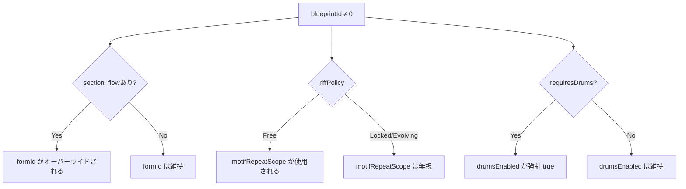

| Blueprint 設定 | オーバーライド対象 | 条件 |
|----------------|-------------------|------|
| `section_flow` | `formId` | section_flowが存在し`formExplicit=false`の場合。`formExplicit=true`が優先 |
| `riff_policy` | `motifRepeatScope` | Free=設定使用、Locked/Evolving=無視 |
| `drums_sync_vocal` | 内部同期設定 | Blueprint 定義が優先 |
| `drums_required` | `drumsEnabled` | trueの場合、`drumsEnabled=true`を強制（`drumsEnabledExplicit=true` + `drumsEnabled=false`の場合は尊重） |
| `TrackMask::Motif` | モチーフ生成 | セクションごとに制御 |

### 17.5 モチーフ生成フロー

```
CompositionStyle == BackgroundMotif? → Yes: モチーフ生成
└─ No → MelodyLead?
        ├─ RhythmSync パラダイム? → Yes: モチーフ生成（リズム軸）
        └─ section_flow 存在 & TrackMask::Motif? → Yes: モチーフ生成
           └─ No: モチーフなし
```

::: warning ドラム必須
`requiresDrums=true` の Blueprint（ID: 1, 5, 7）は自動的にドラムを有効化します。この動作を明示的にオーバーライドするには、`drumsEnabledExplicit: true`と`drumsEnabled: false`を同時に設定してください。
:::

### 17.6 例：Blueprint のオーバーライド動作

```javascript
// RhythmLock Blueprint を使用
{
  blueprintId: 1,        // RhythmLock
  formId: 5,             // ← 無視！Blueprint の section_flow が使用される
  motifRepeatScope: 1,   // ← 無視！Locked ポリシーで同一パターン強制
  drumsEnabled: false,   // ← 無視！drums_required=true で強制有効
}
```

```javascript
// Traditional Blueprint を使用
{
  blueprintId: 0,        // Traditional
  formId: 5,             // ← 指定通り使用
  motifRepeatScope: 1,   // ← 指定通り使用
  drumsEnabled: false,   // ← 指定通り使用
}
```

```javascript
// drums_required Blueprintでドラムを明示的に無効化
{
  blueprintId: 1,              // RhythmLock（drums_required）
  drumsEnabled: false,         // ドラムをオフにしたい
  drumsEnabledExplicit: true,  // 明示フラグ → オーバーライドが尊重される
}
```
