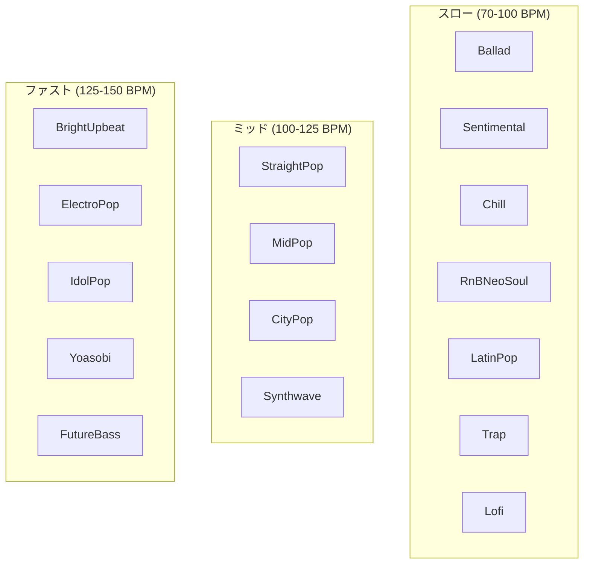
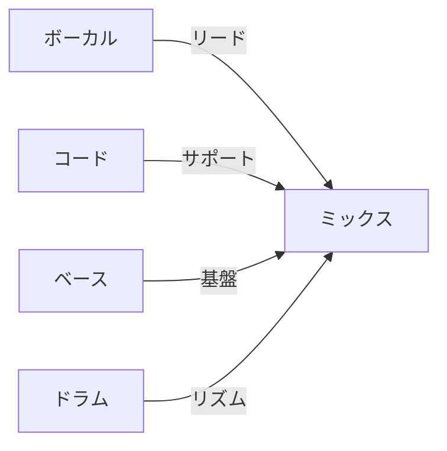
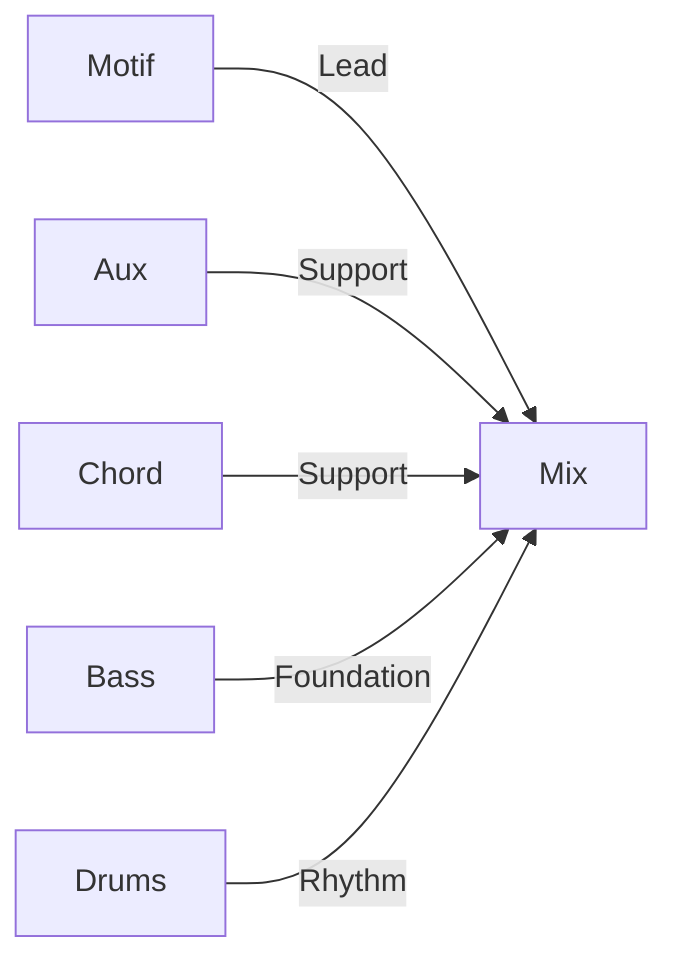
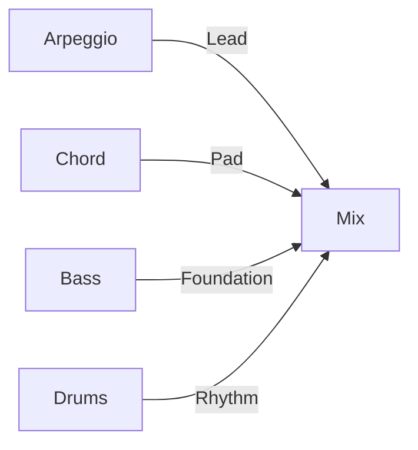
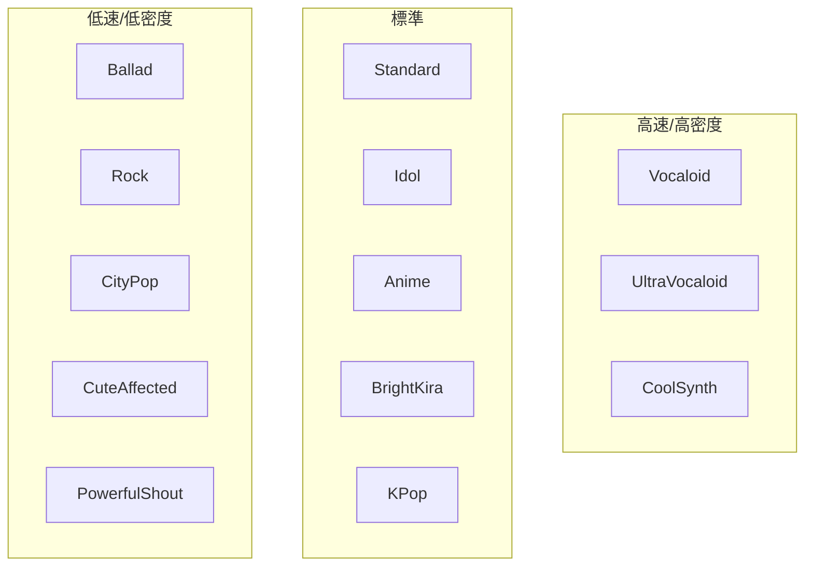

# プリセットリファレンス

[MIDI Sketch](https://github.com/libraz/midi-sketch)で利用可能な全プリセットを紹介します。

## 構造パターン

18の楽曲構造パターン：

| ID | 名前 | 小節 | 再生時間 @120 BPM | セクション |
|----|------|------|-------------------|------------|
| 0 | StandardPop | 24 | 2:00 | A(8)-B(8)-Chorus(8) |
| 1 | BuildUp | 28 | 2:20 | Intro(4)-A(8)-B(8)-Chorus(8) |
| 2 | DirectChorus | 16 | 1:20 | A(8)-Chorus(8) |
| 3 | RepeatChorus | 32 | 2:40 | A(8)-B(8)-Chorus(8)-Chorus(8) |
| 4 | ShortForm | 12 | 1:00 | Intro(4)-Chorus(8) |
| 5 | FullPop | 56 | 4:40 | Intro-A-B-Chorus-A-B-Chorus-Outro |
| 6 | FullWithBridge | 52 | 4:20 | Intro-A-B-Chorus-Bridge-Chorus-Outro |
| 7 | DriveUpbeat | 52 | 4:20 | Intro-Chorus-A-B-Chorus-Chorus-Outro |
| 8 | Ballad | 56 | 4:40 | Intro(8)-A-B-Chorus-Interlude-B-Chorus-Outro |
| 9 | AnthemStyle | 52 | 4:20 | Intro-A-Chorus-A-B-Chorus-Chorus-Outro |
| 10 | ExtendedFull | 90 | 7:30 | 拡張セクション付きフル形式 |
| 11 | ChorusFirst | 32 | 2:40 | Chorus(8)-A(8)-B(8)-Chorus(8) |
| 12 | ChorusFirstShort | 24 | 2:00 | Chorus(8)-A(8)-Chorus(8) |
| 13 | ChorusFirstFull | 56 | 4:40 | Chorus-A-B-Chorus-A-B-Chorus |
| 14 | ImmediateVocal | 24 | 2:00 | A(8)-B(8)-Chorus(8) (イントロなし) |
| 15 | ImmediateVocalFull | 48 | 4:00 | A-B-Chorus-A-B-Chorus (イントロなし) |
| 16 | AChorusB | 32 | 2:40 | A(8)-Chorus(8)-B(8)-Chorus(8) |
| 17 | DoubleVerse | 32 | 2:40 | A(8)-A(8)-B(8)-Chorus(8) |

### セクションタイプ


| タイプ | ボーカル密度 | エネルギー | 目的 |
|--------|-------------|----------|------|
| Intro | None/Sparse | 低 | ムード確立 |
| A | Full | 中低 | バース、物語 |
| B | Full | 中 | プリコーラス、テンション |
| Chorus | Full | 高 | フック、クライマックス |
| Bridge | Sparse | 中 | コントラスト |
| Interlude | None | 中低 | インスト休憩 |
| Outro | Sparse | 中低 | 解決 |

::: tip 長さの計算
120 BPMの場合: 1小節 ≈ 2秒。`targetDurationSeconds=0`で正確なパターンの長さを使用するか、目標秒数を指定して自動生成された構造を使用します。
:::

## ムードプリセット

24のムードプリセットが全体の雰囲気を定義：

| ID | 名前 | BPM | ドラムスタイル | 特徴 |
|----|------|-----|---------------|------|
| 0 | StraightPop | 120 | Standard | クラシックポップグルーヴ |
| 1 | BrightUpbeat | 128 | Upbeat | シンコペーション、エネルギッシュ |
| 2 | EnergeticDance | 130 | FourOnFloor | ダンス向け |
| 3 | LightRock | 125 | Rock | ギター志向 |
| 4 | MidPop | 115 | Standard | バランスの取れたミッドテンポ |
| 5 | EmotionalPop | 110 | Standard | センチメンタル、ソフト |
| 6 | Sentimental | 95 | Sparse | バラード風 |
| 7 | Chill | 100 | Sparse | リラックス、ミニマル |
| 8 | Ballad | 80 | Sparse | スロー、スパースドラム |
| 9 | DarkPop | 118 | Synth | ダーク、ドラマチック |
| 10 | Dramatic | 115 | Standard | 高表現 |
| 11 | Nostalgic | 105 | Standard | レトロ感 |
| 12 | ModernPop | 125 | Synth | コンテンポラリー |
| 13 | ElectroPop | 135 | FourOnFloor | エレクトロニック、ダンス |
| 14 | IdolPop | 138 | FourOnFloor | J-popアイドルスタイル |
| 15 | Anthem | 120 | Standard | 勝利感、壮大 |
| 16 | Yoasobi | 148 | Synth | アニメスタイル、ハイエナジー |
| 17 | Synthwave | 118 | Synth | レトロシンセ、ネオン |
| 18 | FutureBass | 145 | Synth | モダンエレクトロニック |
| 19 | CityPop | 110 | Standard | 80年代シティポップ |
| 20 | RnBNeoSoul | 85-100 | Standard | R&B/ネオソウル、強スウィング、テンションコード |
| 21 | LatinPop | 95 | Standard | ラテンポップ、デンボウリズム、トレシージョベース |
| 22 | Trap | 70 | Synth | トラップ、ハーフタイム、808サブベース、ハイハットロール |
| 23 | Lofi | 80 | Sparse | Lo-fi、強スウィング、最大ベロシティ90 |

### ムードカテゴリ



## コード進行

シンプルから複雑まで22のコード進行：

### ベーシック（2-3コード）

| ID | 名前 | ディグリー | 用途 |
|----|------|------------|------|
| 5 | Minimal | I-IV | シンプル、フォーク |
| 6 | AltMinimal | I-V | パワーポップ |
| 7 | Progression3 | I-vi-IV | 3コードポップ |

### スタンダード（4コード）

| ID | 名前 | ディグリー | 用途 |
|----|------|------------|------|
| 0 | Pop4 | I-V-vi-IV | 万能ポップ |
| 1 | Axis | vi-IV-I-V | メランコリック |
| 2 | Komuro | vi-IV-V-I | ブライトJ-pop |
| 4 | Emotional4 | vi-V-IV-V | テンションビルド |
| 8 | Rock4 | I-bVII-IV-I | ロック感 |

### 拡張（5コード以上）

| ID | 名前 | ディグリー | 用途 |
|----|------|------------|------|
| 3 | Canon | I-V-vi-iii-IV | クラシック |
| 9 | Extended5 | I-V-vi-iii-IV | フル進行 |
| 10 | Emotional5 | vi-IV-I-V-ii | 複雑エモーショナル |

## スタイルプリセット

ムード、構造、コンポジションアプローチを組み合わせた17のスタイルプリセット：

::: tip スタイルプリセットの選び方
スタイルプリセットは、BPM、構造、ボーカルアティチュード、推奨コード進行の適切なデフォルト値を提供します。`createDefaultConfig()` 呼び出し後にこれらの設定を上書きできます。
:::

| ID | 名前 | 説明 | デフォルトBPM |
|----|------|------|--------------|
| 0 | Minimal Groove Pop | 2-4コードループの繰り返し、シンプルなメロディ | 122 |
| 1 | Dance Pop Emotion | クラシック構造、エモーショナルなサビ解放 | 128 |
| 2 | Bright Pop | アップビート、覚えやすいメロディ | 135 |
| 3 | Idol Standard | ユニゾン向き、覚えやすいメロディ | 140 |
| 4 | Idol Emotion | エモーショナルなアイドル曲、盛り上がるBメロ | 130 |
| 5 | Idol Energy | ハイエナジーなアイドル曲、ライブ向け | 150 |
| 6 | Idol Minimal | ショートフォーム向けミニマルアイドル曲 | 135 |
| 7 | Rock Shout | アグレッシブなボーカル、生々しい表現 | 125 |
| 8 | Pop Emotion | 言葉重視のエモーショナルポップ | 108 |
| 9 | Raw Emotional | 激しい感情表現、境界を越えるフレーズ | 102 |
| 10 | Acoustic Pop | クリアなハーモニー、リズム軽め、ボーカル中心 | 95 |
| 11 | Live Call & Response | コンサート向け、コール＆レスポンス構造 | 140 |
| 12 | Background Motif | モチーフ駆動、控えめなボーカル、アンビエント | 120 |
| 13 | City Pop | グルーヴィーな80年代シティポップ、ジャジーなコード | 105 |
| 14 | Anime Opening | エピック、ドラマチックなアニメOP風 | 142 |
| 15 | EDM Synth Pop | モダンEDM、シンセリード | 138 |
| 16 | Emotional Ballad | スローエモーショナルバラード | 78 |

### スタイルカテゴリ

| カテゴリ | ID | 説明 |
|----------|-----|------|
| Pop/Dance | 0-2 | 一般的なポップ・ダンススタイル |
| Idol | 3-6 | J-popアイドル系スタイル |
| Rock/Emo | 7-9 | ロック・エモーショナル系、生々しい表現 |
| Special/Derived | 10-12 | アコースティック、ライブ、アンビエント系 |
| Genre-Specific | 13-16 | シティポップ、アニメ、EDM、バラード系 |

## コンポジションスタイル

3つのコンポジションアプローチ：

| スタイル | フォーカス | ボーカル | Aux | 主な特徴 |
|----------|-----------|---------|-----|----------|
| MelodyLead (0) | ボーカルメロディ | あり | あり | フルメロディ表現 |
| BackgroundMotif (1) | 繰り返しパターン | なし | あり | モチーフがメイン要素、Auxは有効のまま |
| SynthDriven (2) | シンセ/アルペジオ | なし | なし | エレクトロニック、アルペジオは手動で`arpeggioEnabled=true`が必要 |

::: warning BGM専用モード
BackgroundMotifとSynthDrivenはボーカルトラックを生成しません。BackgroundMotifではAuxが副旋律サポートのために有効のまま残ります。SynthDrivenではボーカルとAuxの両方が無効になります。ボーカル付きの楽曲にはMelodyLeadを使用してください。
:::

## Production Blueprint

10種類の Production Blueprint が、スタイル/ムードとは独立して音楽の**生成方法**（アレンジスタイル）を制御します：

| ID | 名前 | パラダイム | RiffPolicy | ドラム必須 | 重み |
|----|------|-----------|------------|:----------:|:----:|
| 0 | Traditional (定番ポップ) | Traditional | Free | - | 42% |
| 1 | RhythmLock (リズムで刻む) | RhythmSync | Locked | **必須** | 14% |
| 2 | StoryPop (物語のように展開) | MelodyDriven | Evolving | - | 10% |
| 3 | Ballad (静かに始まる) | MelodyDriven | Free | - | 4% |
| 4 | IdolStandard (アイドル王道) | MelodyDriven | Evolving | - | 10% |
| 5 | IdolHyper (サビから攻める) | RhythmSync | Locked | **必須** | 6% |
| 6 | IdolKawaii (かわいく弾む) | MelodyDriven | Locked | **必須** | 5% |
| 7 | IdolCoolPop (踊れるビート) | RhythmSync | Locked | **必須** | 5% |
| 8 | IdolEmo (静→爆発) | MelodyDriven | Locked | - | 4% |
| 9 | BehavioralLoop (中毒ループ) | Traditional | LockedPitch | - | 0%* |
| 255 | (ランダム) | - | - | - | - |

\*BehavioralLoop: 明示的な選択のみ（重み0%、ランダム選択されません）。`addictive_mode=true`、`HookIntensity=Maximum`、`RiffPolicy=LockedPitch` を強制します。

`blueprintId: 255` で重み付き自動選択

### 生成パラダイム

| パラダイム | トラック順序 | 説明 |
|-----------|-------------|------|
| Traditional | Vocal → Aux → Motif → Bass → Chord → Guitar → Arpeggio → Drums → SE | クラシックなポップ生成 |
| RhythmSync | Motif → Vocal → Aux → Bass → Chord → Guitar → Arpeggio → Drums → SE | モチーフ先行、リズムロックグルーヴ |
| MelodyDriven | Vocal → Aux → Motif → Bass → Chord → Guitar → Arpeggio → Drums → SE | メロディ中心、伴奏が追従 |

### RiffPolicy

| ポリシー | 値 | 説明 |
|---------|:--:|------|
| Free | 0 | セクションごとに独立して変化 |
| LockedContour | 1 | 輪郭固定、リズムは変化 |
| LockedPitch | 2 | ピッチ完全固定、ベロシティは変化 |
| LockedAll | 3 | 全要素固定 |
| Evolving | 4 | 徐々に変化（2セクションごとに30%確率） |

※ `Locked` は `LockedContour` (1) のエイリアス

::: tip Blueprint のオーバーライド
Traditional 以外の Blueprint（ID 1-9）を使用すると、`formId` 設定は Blueprint の section_flow でオーバーライドされます。フォーム構造を完全に制御したい場合は ID 0（Traditional）を使用してください。
:::

### MelodyLead



### BackgroundMotif



::: info BackgroundMotifではボーカルなし
BackgroundMotifではボーカルトラックが無効になります。Auxトラックは有効なままで、モチーフと共に副旋律サポートを提供します。
:::

### SynthDriven



::: info SynthDrivenではボーカル/Auxなし
SynthDrivenではボーカルトラックとAuxトラックの両方が無効になります。アルペジオは手動で有効化が必要です（`arpeggioEnabled=true`）。自動有効化はされません。
:::

## アルペジオパターン

SynthDrivenコンポジションスタイル用の8つのアルペジオパターン：

| ID | 名前 | 説明 |
|----|------|------|
| 0 | Up | 上昇パターン |
| 1 | Down | 下降パターン |
| 2 | UpDown | 上昇→下降パターン |
| 3 | Random | ランダム音順 |
| 4 | Pinwheel | 回転パターン |
| 5 | PedalRoot | ルートペダルトーン＋上声部移動 |
| 6 | Alberti | クラシカルなアルベルティバスパターン |
| 7 | BrokenChord | 分散和音パターン |

## ボーカルアティチュード

3つのメロディ表現レベル：

| アティチュード | 特徴 | 最適な用途 |
|----------------|------|-----------|
| Clean | コードトーンのみ、オンビート | ポップ、バラード |
| Expressive | テンション、タイミング変動 | エモーショナル、ダイナミック |
| Raw | 非コードトーン、境界破壊 | エッジー、モダン |

## メロディテンプレート

**テンプレート駆動**アプローチでコアメロディ動作を定義する7つのメロディテンプレート：

| ID | 名前 | Plateau | 最大ステップ | 用途 |
|----|------|---------|----------|----------|
| 0 | Auto | - | - | VocalStylePreset基準で選択 |
| 1 | PlateauTalk | 0.65 | 2 | NewJeans、Billie Eilish（トークシング） |
| 2 | RunUpTarget | 0.20 | 4 | YOASOBI、Ado（上昇ラン） |
| 3 | DownResolve | 0.30 | 3 | Bセクション、プリコーラス |
| 4 | HookRepeat | 0.40 | 3 | TikTok、K-POPフック |
| 5 | SparseAnchor | 0.50 | 2 | バラード、Official髭男dism |
| 6 | CallResponse | - | - | デュエットパターン |
| 7 | JumpAccent | - | - | 感情的ピーク |

- **Plateau ratio**: 同じピッチに留まる確率（0.0-1.0）
- **Max step**: 半音単位の最大メロディ音程

## ボーカルスタイルプリセット

メロディテンプレートを自動選択する14のボーカルスタイルプリセット：

| ID | 名前 | テンプレート | 特徴 |
|----|------|----------|-----------|
| 0 | Auto | セクション依存 | Verse=PlateauTalk、Chorus=RunUpTarget |
| 1 | Standard | PlateauTalk | バランスの取れたポップボーカル |
| 2 | Vocaloid | RunUpTarget | 高速、広い跳躍 |
| 3 | UltraVocaloid | RunUpTarget | 超高速（32分音符） |
| 4 | Idol | PlateauTalk | キャッチーなフック、高16分率 |
| 5 | Ballad | SparseAnchor | スロー、持続音 |
| 6 | Rock | RunUpTarget | パワフル、音域シフト |
| 7 | CityPop | PlateauTalk | ジャジー、グルービー |
| 8 | Anime | HookRepeat | フック重視 |
| 9 | BrightKira | HookRepeat | 高音域 |
| 10 | CoolSynth | PlateauTalk | エレクトロニック |
| 11 | CuteAffected | HookRepeat | プレイフル、キュート |
| 12 | PowerfulShout | RunUpTarget | 激しい、シャウト系 |
| 13 | KPop | HookRepeat | K-POPスタイル、シンコペーション重視、フック駆動メロディ |

### ボーカルスタイルカテゴリ



## メロディック複雑さ

メロディ生成に影響する3つの複雑さレベル：

| レベル | 効果 | 用途 |
|--------|------|------|
| Simple (0) | 密度低下、跳躍小、フック多め | キャッチー、覚えやすい |
| Standard (1) | デフォルト動作 | 一般用途 |
| Complex (2) | 密度増加、跳躍大、バリエーション多 | 洗練された |

## フック強度

4つのフック反復レベル：

| レベル | 効果 | 用途 |
|--------|------|------|
| Off (0) | フック反復なし | プログレッシブ、多様性重視 |
| Light (1) | 控えめなフック | 繊細なコールバック |
| Normal (2) | 標準的な反復 | バランス重視ポップ（デフォルト） |
| Strong (3) | 強いフック強調 | キャッチー、商業的 |

## ボーカルグルーブ感

6つのリズム感オプション：

| グルーブ | 効果 | 最適な用途 |
|----------|------|-----------|
| Straight (0) | オンビート、スウィングなし | ポップ、ロック |
| OffBeat (1) | オフビート強調 | レゲエ影響 |
| Swing (2) | スウィングタイミング | ジャズ、R&B |
| Syncopated (3) | シンコペーションリズム | ラテン、ファンク |
| Driving16th (4) | 16分音符ドライブ | エレクトロニック、高速ポップ |
| Bouncy8th (5) | バウンス8分音符 | アップビートポップ |

::: warning シンコペーション依存
VocalGrooveのシンコペーション効果（OffBeat、Swing、Syncopated、Driving16th、Bouncy8th）は`enableSyncopation=true`の場合のみ有効です。`enableSyncopation=false`の場合、シンコペーションウェイトは0.0に強制され、`syncopation_prob`は0.0に設定され、`allow_bar_crossing`は`false`に設定されます。タイミングオフセット（例：OffBeatの+30ティック）は`enableSyncopation`設定に関係なく適用されます。
:::

## エネルギーカーブ

楽曲全体のエネルギー推移を制御する4つのオプション：

| 値 | 名前 | 説明 |
|----|------|------|
| 0 | GradualBuild | 徐々にエネルギーが上昇（デフォルト） |
| 1 | FrontLoaded | 最初からハイエナジー、後半は落ち着く |
| 2 | WavePattern | 波のようなエネルギー推移 |
| 3 | SteadyState | 一定のエネルギーレベルを維持 |

## モーラリズムモード

音節タイミングの3つのリズムモード：

| 値 | 名前 | 説明 |
|----|------|------|
| 0 | Standard | 英語のストレスタイムドリズム |
| 1 | MoraTimed | 日本語のモーラ拍（等間隔音節グループ） |
| 2 | Auto | VocalStylePresetから自動選択（デフォルト） |

## メロディオーバーライド

VocalStylePresetとMelodicComplexityのデフォルトを上書きする細かいメロディパラメータ。センチネル値（0、0xFF、-128）はプリセットのデフォルトを維持します。

| パラメータ | 範囲 | デフォルト | 説明 |
|-----------|------|-----------|------|
| `melodyMaxLeap` | 0=preset, 1-12 | 0 | 最大メロディ跳躍（半音単位） |
| `melodySyncopationProb` | 0-100, 0xFF=preset | 0xFF | シンコペーション確率（%） |
| `melodyPhraseLength` | 0=preset, 1-8 | 0 | フレーズ長（小節単位） |
| `melodyLongNoteRatio` | 0-100, 0xFF=preset | 0xFF | 長音符比率（%） |
| `melodyChorusRegisterShift` | -12 to +12, -128=preset | -128 | サビの音域シフト（半音単位） |
| `melodyHookRepetition` | 0=preset, 1=off, 2=on | 0 | フック反復（トライステート） |
| `melodyUseLeadingTone` | 0=preset, 1=off, 2=on | 0 | セクション境界でのリーディングトーン挿入（トライステート） |

::: tip パラメータ適用順序
メロディオーバーライドはStylePreset、VocalStylePreset、MelodicComplexityの後に適用されます。ユーザー指定の値は常に最高優先度を持ちます。
:::

## モチーフオーバーライド

スタイルのデフォルトを上書きする細かいモチーフパラメータ：

| パラメータ | 範囲 | デフォルト | 説明 |
|-----------|------|-----------|------|
| `motifLength` | 0=auto, 1/2/4 | 0 | モチーフ長（拍単位） |
| `motifNoteCount` | 0=auto, 3-8 | 0 | モチーフ内の音数 |
| `motifMotion` | 0xFF=preset, 0-4 | 0xFF | モーションタイプ（0=Stepwise, 1=GentleLeap, 2=WideLeap, 3=NarrowStep, 4=Disjunct; 内部5=Ostinato） |
| `motifRegisterHigh` | 0=auto, 1=low, 2=high | 0 | レジスター範囲 |
| `motifRhythmDensity` | 0xFF=preset, 0-2 | 0xFF | リズム密度（0=Sparse, 1=Medium, 2=Driving） |

## ドライブ感

パフォーマンスの強度を制御する0-100の連続値：

- **0** = レイドバック（リラックスしたタイミング、低ベロシティ）
- **50** = ニュートラル（デフォルト）
- **100** = アグレッシブ（前のめりタイミング、高ベロシティ、`enableSyncopation=true`でシンコペーション強化）

## キーオプション

12のキー（0-11）：

| ID | キー | 備考 |
|----|------|------|
| 0 | C | ナチュラル、#♭なし |
| 1 | C# / Db | 5# / 7♭ |
| 2 | D | 2# |
| 3 | D# / Eb | 3♭ |
| 4 | E | 4# |
| 5 | F | 1♭ |
| 6 | F# / Gb | 6# / 6♭ |
| 7 | G | 1# |
| 8 | G# / Ab | 4♭ |
| 9 | A | 3# |
| 10 | A# / Bb | 2♭ |
| 11 | B | 5# |

## BPMレンジ

有効テンポ範囲: **40-240 BPM**

::: info BPM設定について
- `0` に設定するとスタイルプリセットのデフォルトBPMを使用
- 各スタイルプリセットには最適なデフォルトBPM設定あり
- 40-240の範囲外のBPMはバリデーションエラーになります
:::

## 設定例

### シンプルなポップソング

```javascript
import { createDefaultConfig } from 'midi-sketch'

// MinimalGroovePopプリセットを使用
const config = createDefaultConfig(0)
config.key = 0                  // Cメジャー
config.chordProgressionId = 0   // Pop4 (I-V-vi-IV)
config.formId = 0               // StandardPop
config.bpm = 0                  // デフォルト使用 (120)
config.drumsEnabled = true
```

### エモーショナルバラード

```javascript
// Emotional Balladプリセットを使用
const config = createDefaultConfig(16) // Emotional Ballad
config.key = 7                         // Gメジャー
config.chordProgressionId = 4          // Emotional4
config.formId = 8                      // Ballad構造
config.bpm = 0                         // デフォルト使用 (78)
config.drumsEnabled = true
```

::: warning バラードのテンポ
バラードプリセットは通常スローテンポ（78-95 BPM）がデフォルトです。より速いバラードが必要な場合は、`config.bpm` を明示的に設定してください。
:::

### アニメOP風スタイル

```javascript
// Anime Openingプリセットを使用
const config = createDefaultConfig(14) // Anime Opening
config.key = 2                         // Dメジャー
config.chordProgressionId = 2          // Komuro
config.bpm = 0                         // デフォルト使用 (142)
config.drumsEnabled = true
config.vocalStyle = 2                  // Vocaloidスタイル
config.melodicComplexity = 2           // 複雑なメロディ
config.hookIntensity = 3               // 強いフック
```

::: tip ボカロ風メロディ
YOASOBI/Ado風の高密度メロディ（広い音程跳躍）を作るには：
- `vocalStyle: 2` (Vocaloid) または `vocalStyle: 3` (UltraVocaloid)
- `melodicComplexity: 2` (Complex)
- `melodyTemplate: 2` (RunUpTarget)
:::

### チルバックグラウンド

```javascript
// Background Motifプリセットを使用
const config = createDefaultConfig(12)  // Background Motif
config.key = 5                          // Fメジャー
config.chordProgressionId = 5           // Minimal
config.formId = 4                       // ShortForm
config.bpm = 95
config.drumsEnabled = false             // アンビエント用ドラムなし
```

::: info Background Motifスタイル
Background Motifプリセット (ID 12) は、控えめなボーカルと繰り返しパターンを持つアンビエント/BGMスタイルのトラックに最適です。
:::

### アイドルポップ（コール付き）

```javascript
// Idol Standardプリセットを使用
const config = createDefaultConfig(3)  // Idol Standard
config.key = 0                         // Cメジャー
config.callEnabled = true              // コールトラック有効化
config.introChant = 1                  // ガチ恋イントロ
config.mixPattern = 1                  // スタンダードミックス
config.callDensity = 2                 // 標準密度
config.modulationTiming = 1            // ラスサビで転調
config.modulationSemitones = 2         // 2半音上げ
```

### シンコペーション＆グルーヴ

```javascript
const config = createDefaultConfig(0)
config.enableSyncopation = true        // シンコペーション有効化
config.vocalGroove = 3                 // シンコペーションリズム
```

### エネルギーカーブ

```javascript
const config = createDefaultConfig(0)
config.energyCurve = 1                 // FrontLoadedエネルギー
```

### メロディ詳細制御

```javascript
const config = createDefaultConfig(0)
config.melodyMaxLeap = 5              // 最大メロディ跳躍（半音単位）
config.melodyPhraseLength = 4         // フレーズ長（小節単位）
config.melodyHookRepetition = 2       // フック反復ON（トライステート: 0=preset, 1=off, 2=on）
```

### モチーフ詳細制御

```javascript
const config = createDefaultConfig(12) // Background Motif
config.motifLength = 4                 // モチーフ長（拍単位）
config.motifNoteCount = 5             // モチーフ内音数
config.motifMotion = 1                // モチーフの動きタイプ
config.motifRhythmDensity = 2         // リズム密度レベル
```

### ギタートラック

```javascript
const config = createDefaultConfig(0)
config.guitarEnabled = true            // ギタートラック有効化
```

### R&B / ネオソウル

```javascript
const config = createDefaultConfig(0)
config.stylePresetId = 20             // RnBNeoSoulムード
config.chordExt7th = true             // 7thエクステンション有効化
config.chordExt9th = true             // 9thエクステンション有効化
```

### Lo-fi BGM

```javascript
const config = createDefaultConfig(12) // Background Motif
config.stylePresetId = 23             // Lofiムード
config.compositionStyle = 1           // BackgroundMotif
```

### モーラタイミング

```javascript
const config = createDefaultConfig(0)
config.moraRhythmMode = 1             // MoraTimed（日本語モーラ拍）
```

### BehavioralLoop

```javascript
const config = createDefaultConfig(0)
config.blueprintId = 9                // BehavioralLoop（中毒ループ）
```
