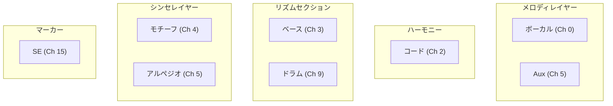
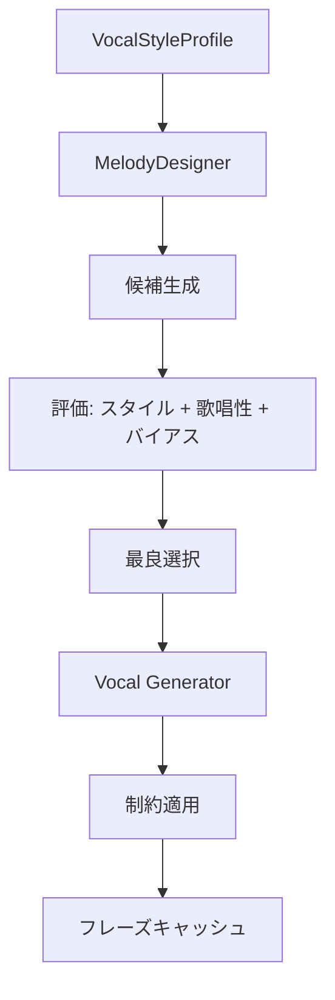
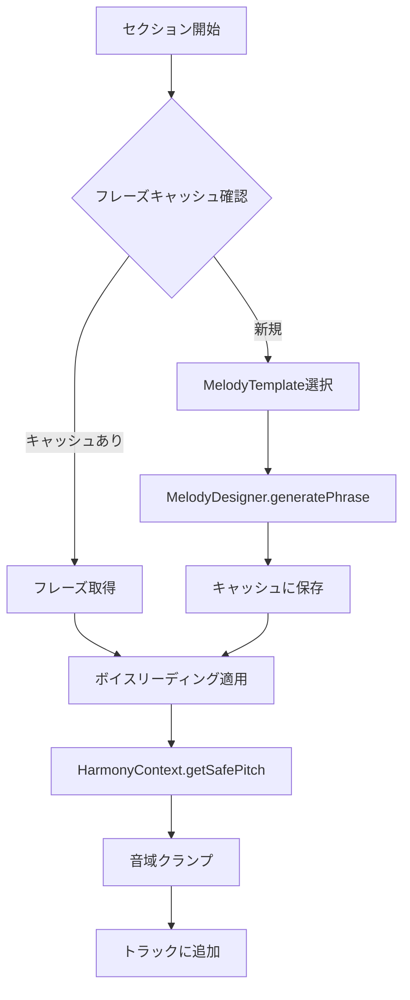
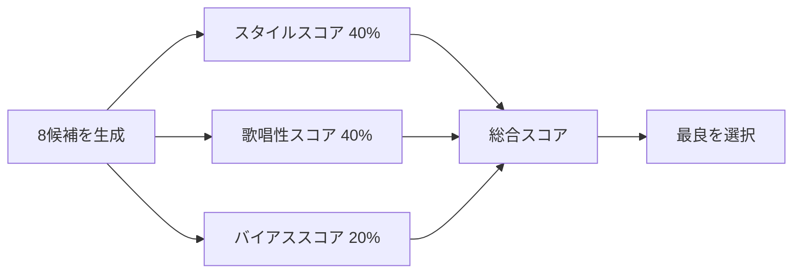
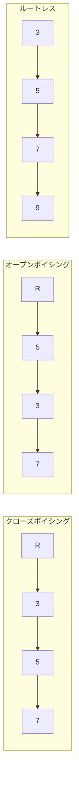
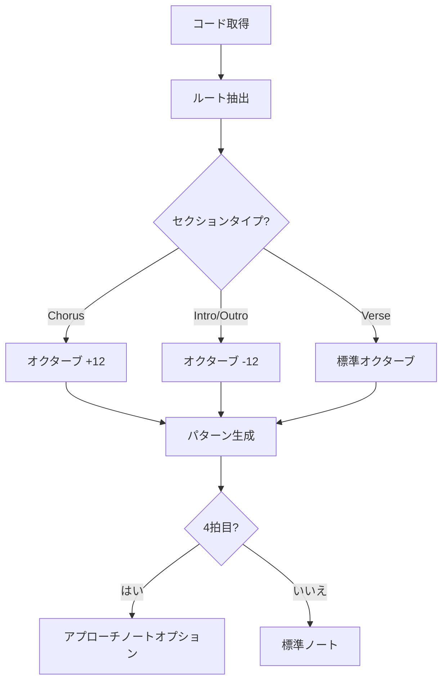
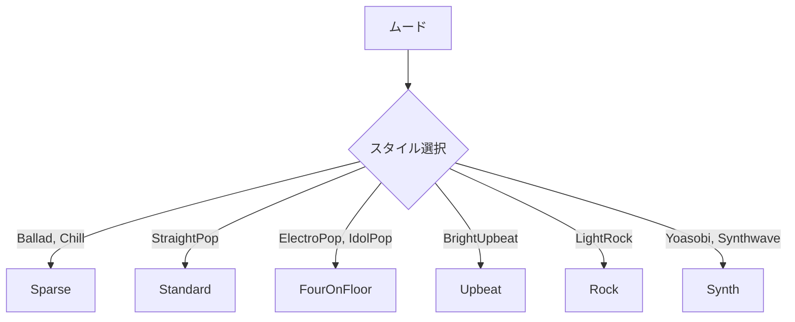
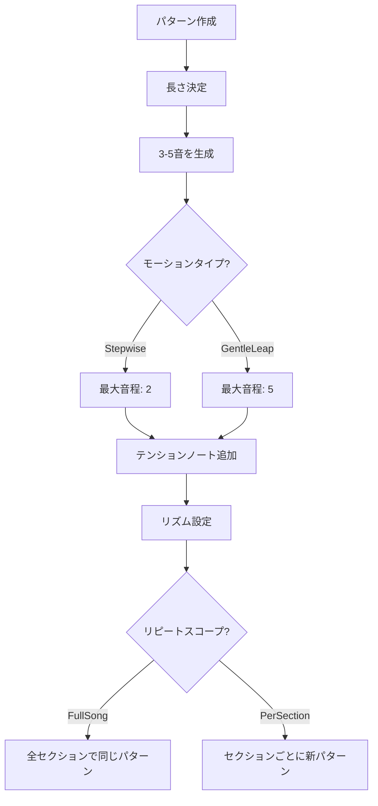
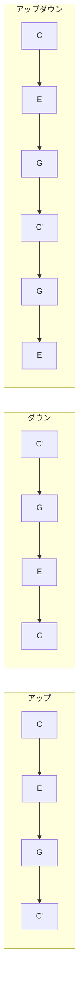

# トラック生成

[MIDI Sketch](https://github.com/libraz/midi-sketch)の各トラック生成器を詳しく解説します。

## トラック概要

MIDI Sketchは8つのトラックを異なるMIDIチャンネルに生成します：



### チャンネル割り当て

| トラック | チャンネル | プログラム | 役割 |
|----------|---------|---------|------|
| Vocal | 0 | Piano (0) | 主旋律 |
| Aux | 5 | Pad (89) | 副旋律サポート |
| Chord | 2 | E.Piano (4) | 和声バッキング |
| Bass | 3 | E.Bass (33) | ベース |
| Motif | 4 | Synth (81) | BackgroundMotifスタイル |
| Arpeggio | 5 | Synth (81) | SynthDrivenスタイル |
| Drums | 9 | GMドラム | リズム |
| SE | 15 | - | セクションマーカー |

## ボーカルトラック

**ソース:** `src/track/vocal.cpp`（約314行）、`src/track/melody_designer.cpp`（約2048行）

ボーカルシステムは**テンプレート駆動型メロディデザイナー**と**スタイル認識評価**を使用し、予測可能でスタイルに正確なメロディを生成します。

::: tip なぜ「ボーカル」トラック？
ボーカルトラックはメインメロディを生成します。歌ったりリードパートとして演奏されることを想定しているため「ボーカル」と呼ばれています。DAWではMIDIチャンネル0（ピアノ）でプレビューするか、お好みの音源を割り当ててください。
:::

### アーキテクチャ

ボーカル生成は3つの主要コンポーネントで構成されています：

1. **MelodyDesigner**（`melody_designer.cpp`）- 評価付きテンプレート駆動のピッチ選択
2. **Vocal Generator**（`vocal.cpp`）- セクション構造、キャッシング、調整
3. **VocalStyleProfile** - スタイル別の統一されたバイアス・評価設定



### メロディテンプレート

7つのメロディテンプレートがメロディ特性を定義：

| ID | 名前 | Plateau | 最大ステップ | 用途 |
|----|------|---------|----------|----------|
| 0 | Auto | - | - | VocalStyle基準で選択 |
| 1 | PlateauTalk | 0.65 | 2 | NewJeans、Billie Eilishスタイル |
| 2 | RunUpTarget | 0.20 | 4 | YOASOBI、Adoスタイル |
| 3 | DownResolve | 0.30 | 3 | Bセクション、プリコーラス |
| 4 | HookRepeat | 0.40 | 3 | TikTok、K-POPフック |
| 5 | SparseAnchor | 0.50 | 2 | Official髭男dism、バラード |
| 6 | CallResponse | - | - | デュエットパターン |
| 7 | JumpAccent | - | - | 感情的ピーク |

- **Plateau ratio**: 同じピッチに留まる確率（高いほど繰り返しが多い）
- **Max step**: 半音単位の最大音程（低いほど滑らか）

### 生成フロー



### ピッチ選択（4択のみ）

MelodyDesignerはピッチ選択を4つのオプションに制限：

```cpp
enum class PitchChoice {
    Same,       // 現在のピッチに留まる（plateau_ratio）
    StepUp,     // +1半音
    StepDown,   // -1半音
    TargetStep  // ターゲット方向へ±2（テンプレートにターゲットがある場合）
};
```

この制約されたアプローチにより、より自然で歌いやすいメロディが生成されます。

### ボーカルアティチュード

| アティチュード | 説明 | 実装 |
|----------------|------|------|
| **Clean** | 保守的、歌いやすい | コードトーンのみ、オンビート |
| **Expressive** | 感情的、ダイナミック | テンション許可、タイミング変動 |
| **Raw** | エッジー、型破り | 非コードトーン、境界破壊 |

### フレーズキャッシュ

音楽的な一貫性のため、複合キー（V2キャッシュ）でフレーズをキャッシュ：

```cpp
struct PhraseCacheKey {
    SectionType type;      // Verse、Chorus等
    uint8_t bars;          // セクション長
    uint8_t chord_degree;  // 開始コード度数
};

// キャッシュ動作:
// - 80% 正確な再利用: 同じフレーズを再現
// - 20% バリエーション: 変換を適用（オクターブシフト、リズム変動）
```

::: info フレーズバリエーション
キャッシュされたフレーズを再利用する際、システムはバリエーションを適用することがあります：
- **オクターブシフト**: フレーズを1オクターブ上下に移動
- **リズムバリエーション**: わずかなタイミング調整
- **輪郭反転**: 上昇/下降パターンを反転
:::

### 音域制約

```cpp
struct VocalRange {
    uint8_t low = 60;   // C4
    uint8_t high = 79;  // G5
};
```

### 非和声音による装飾

ボーカルトラックは非和声音（NCT: Non-Chord Tone）を使用して、単純なコードトーンメロディに動きを加えます：

::: info 強拍と弱拍
4/4拍子では、**強拍**は1拍目と3拍目（自然に足でリズムを取る位置）、**弱拍**は2拍目と4拍目です。強拍にコードトーンを置くと安定感が生まれ、弱拍に非和声音を置くと和声を崩さずに動きを加えられます。
:::

| NCTタイプ | 説明 | 配置 |
|----------|------|------|
| **ChordTone** | 現在のコードに含まれる音（基準） | 強拍 |
| **PassingTone** | 2つのコードトーン間を順次進行でつなぐ | 弱拍 |
| **NeighborTone** | コードトーンから離れて戻る | 弱拍 |
| **Appoggiatura** | 強調された不協和音が順次解決 | 強拍 |
| **Anticipation** | 次のコードトーンを先取り | コードチェンジ前 |
| **Tension** | コードの拡張音（9度、11度、13度） | スタイルに依存 |

設定はムードにより変化：
- **Bright**: より多くのコードトーン、少ない不協和音
- **Jazzy**: より多くのテンション、シンコペーション
- **Ballad**: 表現豊かなアポジャトゥーラとのバランス
- **J-POP**: ペンタトニックスケール（ヨナ抜き）音程を好む

### VocalStyleProfile

各ボーカルスタイルには**生成バイアス**と**評価重み**の両方を制御する統一プロファイルがあります：

| プロファイル | Plateauバイアス | 高音域 | 歌唱性 | サプライズ |
|--------------|-----------------|--------|--------|------------|
| **Standard** | 1.0 | 1.0 | 0.25 | 0.15 |
| **Idol** | 1.2 | 1.0 | 0.30 | 0.12 |
| **Rock** | 0.8 | 1.2 | 0.20 | 0.20 |
| **Ballad** | 1.1 | 0.9 | 0.40 | 0.10 |
| **Anime** | 0.9 | 1.3 | 0.25 | 0.25 |
| **Vocaloid** | 0.6 | 1.1 | 0.10 | 0.25 |

### UltraVocaloidモード

ボカロスタイル生成の強化機能：
- **マシンガンリズム**: ボカロ曲に特徴的な連射的16分音符シーケンス
- **ブレスポイント**: 密度の高いパッセージでもフレージング用のマイクロポーズを自動挿入
- **セクション別リズムロック**: 各セクションが一貫したリズムアイデンティティを維持

::: details プロファイルパラメータ
- **Plateauバイアス**: 同じピッチに留まる好み（高いほど繰り返しが多い）
- **高音域**: 高い音への好み（高いほど明るい）
- **歌唱性**: 人間が歌いやすいメロディの重み（高いほど歌いやすい）
- **サプライズ**: 予想外のメロディ展開の重み（高いほどダイナミック）
:::

### メロディ評価システム

MelodyDesignerは複数の候補メロディを生成し、評価します：



**評価コンポーネント:**

| コンポーネント | 重み | 基準 |
|----------------|------|------|
| スタイルスコア | 40% | 輪郭一致、パターン一貫性、サプライズバランス |
| 歌唱性スコア | 40% | 順次進行、ブレス位置、単調さ回避 |
| バイアススコア | 20% | スタイル好みに合った音程分布 |

### フックシステム

サビセクションでは**6つのリズムパターン**を持つ専用フック生成システムを使用：

| パターン | リズム | 特徴 |
|----------|--------|------|
| **Buildup** | 8-8-4 | クラシックな段階的解決 |
| **Syncopated** | 4-8-8 | シンコペーション開始 |
| **FourNote** | 8-8-8-4 | ハイエナジー |
| **Powerful** | 4-4 | シンプルで強力 |
| **Dotted** | 8-4-8 | 付点リズム |
| **CallResponse** | 4-8-8-8 | コール&レスポンス |

**フックスケルトン:**

| スケルトン | 説明 |
|------------|------|
| Repeat | 同じピッチを繰り返す |
| Ascending | 上昇する輪郭 |
| AscendDrop | 上昇してから下降 |
| LeapReturn | ジャンプして戻る |
| RhythmRepeat | ピッチは変わりリズムは一定 |

**フック強度**はフックの目立ち方を制御：
- **Off (0)**: フック繰り返しなし
- **Light (1)**: 控えめなフック
- **Normal (2)**: 標準ポップフック
- **Strong (3)**: 強いフック強調（TikTokスタイル）

### グローバルモチーフシステム

ボーカルトラックは最初に生成されたフレーズから**グローバルモチーフ**を抽出し、音楽的な一貫性を維持します：

```cpp
struct GlobalMotif {
    vector<int8_t> interval_signature;  // 相対的ピッチ変化（最大8音）
    vector<float> rhythm_signature;     // 相対的デュレーション比率
    ContourType contour_type;           // Ascending, Descending, Peak, Valley, Plateau
};
```

**評価ボーナス:**
- 輪郭タイプ一致: +5%スコア
- 類似した音程パターン: +5%スコア（3つ以上一致）
- これにより後のセクションがオープニングと関連付けられます

### ピアノロールセーフティAPI

**ソース:** `src/core/piano_roll_safety.cpp`

ピアノロールセーフティAPIは、外部ツール（ピアノロールエディタなど）が安全なピッチ配置を判断するのに役立ちます：

```cpp
enum class CollisionType : uint8_t {
    None,    // 衝突なし - 配置安全
    Mild,    // トライトーン（文脈依存）
    Severe   // 短2度 / 長7度（常に不協和）
};
```

**衝突検出:**

| 音程 | タイプ | リスク |
|------|--------|--------|
| 短2度（1半音） | Severe | 常に回避 |
| 長7度（11半音） | Severe | 常に回避 |
| トライトーン（6半音） | Mild | 文脈依存 |
| その他 | None | 一般的に安全 |

::: warning 転調対応
APIは転調を考慮します。転調が有効な場合、`effective_vocal_high` が減少し、最終サビが転調後に音域を超えないようにします。
:::

---

## Auxトラック

**ソース:** `src/track/aux_track.cpp`（約1170行）

Aux（補助）トラックは主旋律に対する**副旋律サポート**を提供します。対旋律ではなく、主旋律を強化する「知覚制御レイヤー」です。

### 目的

| 役割 | 説明 |
|------|------|
| 中毒性 | パルスループで繰り返しのキャッチーなパターンを生成 |
| 身体性 | グルーブアクセントで体が動く感覚を追加 |
| 安定感 | フレーズ終端で解決感を提供 |
| 構造認識 | セクション境界の認識を支援 |

### Aux機能

5つの補助機能が利用可能：

| ID | 機能 | 説明 |
|----|----------|------|
| A | PulseLoop | 同音または固定音程の繰り返しパターン |
| B | TargetHint | コードトーンで主旋律のターゲットを暗示 |
| C | GrooveAccent | スタッカートでリズミックなアクセント |
| D | PhraseTail | フレーズ終端の下降解決 |
| E | EmotionalPad | 長い持続音のコードトーン |

### テンプレート → Auxマッピング

各メロディテンプレートは適切なaux機能を自動選択：

| テンプレート | Aux機能 | 理由 |
|----------|---------------|--------|
| PlateauTalk | A（PulseLoop） | Ice Cream/ミニマルスタイル |
| RunUpTarget | B + D | YOASOBI上昇→解決 |
| HookRepeat | A + C | TikTok繰り返しフック |
| SparseAnchor | E + D | バラードの感情サポート |

### 生成制約

- 常にボーカルの**後**に生成（衝突回避）
- ボーカルより狭い音域（50-70%）
- 低いベロシティ（0.5-0.8×ボーカル）
- HarmonyContextでボーカルとの不協和音を回避

---

## コードトラック

**ソース:** `src/track/chord_track.cpp`（約2000行）

ボイスリーディング最適化を伴う和声ボイシングを生成。

### ボイシングタイプ



### ボイスリーディングアルゴリズム

```cpp
int voiceLeadingDistance(Voicing& prev, Voicing& next) {
    int distance = 0;
    for (int i = 0; i < 4; i++) {
        distance += abs(prev.notes[i] - next.notes[i]);
    }
    return distance;
}

// 距離を最小化するボイシングを選択
Voicing selectBestVoicing(Voicing& prev, vector<Voicing>& candidates) {
    return min_element(candidates, [&](auto& a, auto& b) {
        return voiceLeadingDistance(prev, a) < voiceLeadingDistance(prev, b);
    });
}
```

### ベースとの協調

`BassAnalysis`を使用して音の重複を回避：

```cpp
if (bassAnalysis.hasRootOnBeat1) {
    // ルートレスボイシングを使用 - ベースがルートを担当
    voicing = generateRootlessVoicing(chord);
} else {
    // コードボイシングにルートを含める
    voicing = generateFullVoicing(chord);
}
```

### 音域制約

```cpp
constexpr uint8_t CHORD_LOW = 48;   // C3
constexpr uint8_t CHORD_HIGH = 84;  // C6
```

---

## ベーストラック

**ソース:** `src/track/bass.cpp`（約1170行）

ルート重視のパターンで和声的基盤を生成。

### パターンタイプ

| パターン | 説明 | リズム |
|----------|------|--------|
| Sparse | ミニマル、バラードスタイル | 1拍目のみ |
| Standard | ポップ/ロックベースライン | 1、3拍目にフィル |
| Driving | エネルギッシュ、前進的 | 全体で8分音符 |

### 生成ロジック



### アプローチノート

4拍目は次のルートへの半音アプローチを使用可能：

```cpp
// 次のコードルートがCの場合
// 4拍目はB（半音下）またはDb（半音上）
uint8_t approachNote = nextRoot - 1; // 半音アプローチ
```

---

## ドラムトラック

**ソース:** `src/track/drums.cpp`（約880行）

フィルとダイナミクスを含むドラムパターンを生成。

### GMドラムマップ

```cpp
constexpr uint8_t KICK = 36;
constexpr uint8_t SNARE = 38;
constexpr uint8_t SIDE_STICK = 37;
constexpr uint8_t CLOSED_HH = 42;
constexpr uint8_t OPEN_HH = 46;
constexpr uint8_t RIDE = 51;
constexpr uint8_t CRASH = 49;
constexpr uint8_t TOM_HIGH = 50;
constexpr uint8_t TOM_MID = 47;
constexpr uint8_t TOM_LOW = 45;
```

### パターンスタイル



### フィルタイプ

```cpp
enum class FillType {
    TomDescend,    // ハイ → ミッド → ロータム
    TomAscend,     // ロー → ミッド → ハイタム
    SnareRoll,     // 連続スネアヒット
    Combo          // 混合要素
};
```

フィルの挿入位置：

- セクション遷移
- 4または8小節ごと
- サビ前

### ゴーストノート

グルーブのためのベロシティ軽減スネアアーティキュレーション：

```cpp
// メインスネア: ベロシティ 100
// ゴーストノート: ベロシティ 40-60
```

ゴーストノートの密度はムードに応じて適応：
- **エネルギッシュなムード** (BrightUpbeat, IdolPop): より活発な感触のために高密度
- **穏やかなムード** (Ballad, Chill): 控えめなゴーストノート

### スウィングタイミング

セクションタイプと進行に応じて変化する連続的なスウィング制御：

```cpp
float calculateSwingAmount(SectionType section, int bar_in_section, int total_bars);
// 0.0（ストレート）から0.7（ヘビースウィング）を返す
```

| セクション | 基本スウィング | 挙動 |
|-----------|--------------|------|
| Verse | 低い | 徐々にビルドアップ |
| Chorus | 中程度 | 一貫したグルーブ |
| Bridge | 可変 | コンテキスト依存 |

スウィングはオフビートノート（8分音符・16分音符）に適用されます。

### 三連符グリッド

ドラムパターンはシャッフルやスウィングフィール用の三連符サブディビジョンをサポート：
- **ストレート**: 標準的な8分/16分音符グリッド
- **三連符**: 1拍あたり12/24分割
- **ハイブリッド**: ストレートと三連符パターンの混合

### ヒューマナイゼーション

微妙なタイミングとベロシティの変化でパターンの機械的さを軽減：
- **タイミングジッター**: グリッドから±5-15ティック
- **ベロシティ変動**: 基本ベロシティから±5-10
- **ハイハットアクセントパターン**: ダウンビートへの自然な強調

### ボーカル同期

`drums_sync_vocal`が有効な場合、キックドラムはボーカルのオンセット位置に揃います：

```cpp
void generateDrumsTrackWithVocal(
    MidiTrack& track,
    const Song& song,
    const GeneratorParams& params,
    std::mt19937& rng,
    const VocalAnalysis& vocal_analysis  // 事前分析されたボーカルデータ
);
```

この「リズムロック」効果により、グルーブがメロディに追従します。現代のポップ制作で一般的な手法です。

---

## モチーフトラック

**ソース:** `src/track/motif.cpp`（約630行）

`BackgroundMotif`コンポジションスタイル（BGM専用モード）用。主旋律要素として機能する繰り返しパターンを生成し、ボーカルをバックグラウンドに回すか省略することを可能にします。

### パラメータ

```cpp
struct MotifParams {
    MotifLength length;           // TwoBars, FourBars
    RhythmDensity rhythm_density; // Sparse, Medium, Driving
    MotifMotion motion;           // Stepwise, GentleLeap
    RepeatScope repeat_scope;     // FullSong, PerSection
    MotifRegister register_;      // Mid, High
};
```

### パターン生成



### 音域レンジ

| レジスター | 範囲 |
|------------|------|
| Mid | C3 (48) - C5 (72) |
| High | C4 (60) - C6 (84) |

---

## アルペジオトラック

**ソース:** `src/track/arpeggio.cpp`（約275行）

`SynthDriven`コンポジションスタイル（BGM専用モード）用。エレクトロニックスタイルのトラックで主要なハーモニック/メロディック要素として機能するアルペジオパターンを生成します。

### パラメータ

```cpp
struct ArpeggioParams {
    ArpeggioPattern pattern;  // Up, Down, UpDown, Random
    ArpeggioSpeed speed;      // Eighth, Sixteenth, Triplet
    uint8_t octave_range;     // 1-3オクターブ
    float gate;               // ノート長比率 (0.0-1.0)
    bool sync_chord;          // コードチェンジに追従
};
```

### パターンタイプ



### スピード変換

```cpp
Tick getNoteDuration(ArpeggioSpeed speed) {
    switch (speed) {
        case Eighth:    return TICKS_PER_BEAT / 2;    // 240
        case Sixteenth: return TICKS_PER_BEAT / 4;    // 120
        case Triplet:   return TICKS_PER_BEAT / 3;    // 160
    }
}
```

---

## SEトラック

**ソース:** `src/track/se.cpp`（約15行）

セクションマーカー用の最小トラック（テキストイベントのみ）。

```cpp
void generateSE(Song& song) {
    for (auto& section : song.arrangement.sections) {
        MidiEvent marker;
        marker.tick = section.start_tick;
        marker.type = MidiEventType::Text;
        marker.text = section.name;
        song.se.addEvent(marker);
    }
}
```

---

## ベロシティ計算

全トラック共通のベロシティ計算式：

```cpp
uint8_t calculateVelocity(
    uint8_t baseVelocity,
    int beat,
    SectionType section,
    float trackBalance
) {
    float beatAdjust = getBeatAccent(beat);      // 強拍: +10
    float sectionMult = getSectionEnergy(section); // Chorus: 1.2

    return clamp(
        baseVelocity * beatAdjust * sectionMult * trackBalance,
        1, 127
    );
}
```

### トラックバランス

| トラック | バランス | 備考 |
|----------|----------|------|
| Vocal | 1.00 | リード楽器 |
| Aux | 0.50-0.80 | 副旋律サポート |
| Chord | 0.75 | サポート |
| Bass | 0.85 | ベース |
| Drums | 0.90 | タイミングドライバー |
| Motif | 0.70 | バックグラウンド |
| Arpeggio | 0.85 | 中レベル |
